[//]: # (NOTE: I have explicitly requested permission from lego11 to use his guides as a refernece, he said he's cool with it. I owe that man half the shit I know)

# Temporary notice
**--- As of 18/3/2024, Meteor-M N°2-4 is currently cleaning its MSU-MR instrument by heating it up. Its broadcasts are disabled until further notice from Roscosmos. ---**

# Preamble

Before anything, I have to give credit and extreme kudos to the **SDR++, SigIdWiki and Dereksgc Discords**. Everyone there has been incredible and has helped me learn basically everything that you'll be able to read here. 

**A lot of the information you will be able to find here is from [lego11s articles](https://a-centauri.com/articoli/), check them out if you want more very well written and detailed guides.**

The purpose of this article is to guide complete radio beginners as well as more experienced folk looking to learn something about getting pretty images from weather satellites. A lot of guides out there are severely outdated, focus on specific things while omitting important details or provide simply false information, PLEASE make sure the sources you use are valid.


# Glossary

### Hardware terms
- **SDR** - Software Defined Radio → A device used to translate radio waves into digital data
- **LNA** - Low Noise Amplifier → A tool used to amplify radio signals
- **Bias-t**/**Bias tee** → A device used to inject DC power into the RF line (To power devices such as LNAs). **DO NOT PLUG IT IN AIMING AT YOUR SDR, IT WILL KILL IT!**

<break>

- **SMA** → Type of connector used by most SDRs
- **Balun** → Converts a **Bal**anced signal to an **Un**balanced one and vice versa


### Abstract terms

- **Pass** → Refers to the time when you can see a satellite passing overhead, used with orbiting satellites
- **Elevation** → Height of a satellite above the horizon
- **AOS** - Acquisition Of Signal → The moment when you start geting a signal from a satellite
- **LOS** - Line Of Sight / Loss Of Signal → Depending on the context this abbreviation is used in either describes your ability to see the satellite, or the moment when you stop getting a signal from a satellite.

###  Software terms
- **AGC** - Automatic Gain Control → Automatically sets the gain based on the signal strength
- **SNR** - Signal to Noise Ratio → The difference in dB between the noise floor and the signal peak, ergo how strong the signal is
- **FFT Spectrum** - Fast Fourier Transform Spectrum → The slice of the radio spectrum being sampled by your SDR
- **FFT Waterfall** - Fast Fourier Transform Waterfall → A visual representation of the spectrum throughout time, almost always found right below the FFT Spectrum
- **FEC** - Forward Error Correction → Error correcting code, most often Reed-Solomon
- **Interference** → Commonly referred to as RFI (Radio Frequency Interference), is an umbrella term for unwanted signals produced by erroneous sources such as cheap power supplies, HDMI cables and devices such as laptops (USB RFI @ 480 MHz)
- **Overloading** → Occurs when your gain is set too high and/or you are near a very strong broadcast. Presents as your noise floor jumping/being unstable or spurs of interference throughout your spectrum.
- **TLE** - Two Line Element set → A format used to list the location of objects orbiting the earth

## Data transmission formats
Don't worry if you don't understand these yet, they will be explained in more detail later and are here just so you have an idea of what is meant if they are mentioned prior to their full explanation.

- **APT** - Automatic Picture Transmission → VHF Image broadcast currently used on NOAA satellites
- **LRPT** - Low Rate Picture Transmission → VHF Image broadcast currently used on Meteor-M satellites
- **HRPT** - High Rate Picture Transmission → L-band high quality image and telemetry broadcast format
- **LRIT** - Low Rate Information Transmission → L-band information and telemetry broadcast format


## Examples of interference and overloading:

### Interference

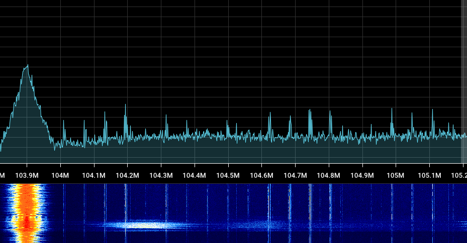

*Pictured is an SDR being overloaded with interference caused by a very strong cell tower broadcast. On the left is an FM station, the rest of the lines are erroneous.*

### Overloading

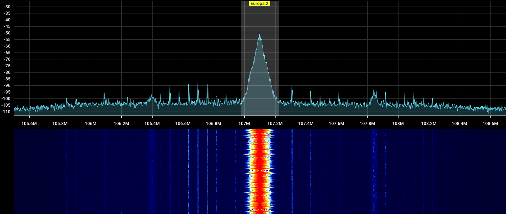
*Pictured is a relatively normal FFT, excluding the lines*


*After upping the gain, you can see the significant amount of FM overloading present throughout the whole FFT.*


# Mistakes and pitfalls
This is a list of mistakes I made that ended up in wasted time, avoid them for the sake of saving you a headache or two

- **Using old, outdated guides and software** → Radio is very niche, almost all guides you can find online are heavily outdated giving you bad advice and suggesting deprecated software, leading to confusion and subpar results. Please make sure that any sources you use are up to date.

- **Compass tracking with directional antennas** → Go by signal strength, NOT by elevation and azimuth. Use apps to find the time and general direction of the satellite, don't go measuring exact compass readings. Find the signal when it is weak, move slow and with purpose to get it and remain to be as strong as possible.

- **Doppler tracking when it is not needed** → Signals covered here such as APT and HRPT were designed to be thin enough to not need doppler tracking, **DON'T BOTHER DOING IT, IT IS NOT NEEDED.**

- **Blindly maxxing the gain setting** → Upping the gain only makes the signal louder up to a certain point, after which it starts amplifying the noise floor much more than actual signals. This leads to them being drowned out. Turn it up only until you see, that the signal isn't getting any stronger (Use SNR, NOT its height on the fft).

- **Turning on automatic gain control (AGC)** → AGC was designed for much wider broadcasts such as DVB-T (Terrestrial TV) than the signals described in this page. It *won't* recognize the signals and end up cranking the gain up much higher than needed which ends up drowning the signal out.

- **Using an LNA with direct sampling** → Direct sampling is just piping the whole target frequency range to the SDR at once, meaning that weaker signals will get drowned out by stronger ones incredibly easily. Using an LNA makes strong signals stronger, drowning weak ones out completely.

- **Not using actual connectors and cables** → While sticking a wire into your SMA port works in theory - an antenna is just anything conductive after all - it is extremely dangerous since it can damage your sma port, electrocute you if you have a bias-t, introduce major signal loss, or just end up not working correctly.

- **Using a cheap LNA with higher frequencies (L-band and above)** → Cheap LNAs often have a very high gain which also makes them very prone to overloading. Because of this, higher bands exclusively use **filtered** LNAs (Low gain LNA > Filter > High gain LNA). The filter makes sure, that the LNA only amplifies the target signals and nothing else outside of the target range.


# RTL-SDR specific things
These apply to SDRs using RTL chipsets (RTLSDR blog, Nooelec SMART...)

- The maximum stable sampling rate is **2.56 Msps!** Using anything higher can lead to sample drops if you don't have one of the few incredibly specific usb controllers with which the RTL chipset can pull 3.2 Msps without dropping samples. You can test if higher sampling rates such as 2.88 Msps work on your setup by running `rtl_test -s 2.88e6` and seeing if any data is lost after a few minutes.
- When direct sampling for HF, use the Q branch
- RTL-SDR Blog V4 needs specific drivers to work with most software, the installation steps are described on their [quick start page](https://www.rtl-sdr.com/rtl-sdr-quick-start-guide/)


# Preferred software
Arguably the by far best program for **pulling data** off of satellites is [SatDump](https://github.com/SatDump/SatDump/releases)

You can also use SDR++ for recording and then process the recordings using SatDump, but that is often just unnecessary extra effort. The only exception to this is troubleshooting your setup - having an audio recording is always helpful.

> Always download the nightly builds of SDR** and SatDump, update them frequently. These programs are relatively new and are being actively developed and have new additions on a daily basis. There are other programs you can use but I won't focus on them for the sake of keeping this guide concise.

---
 To **track satellites** and figure out their future passes (Most are orbiting the Earth after all), you can use these:

Cross-Platform:
- [SatDump](https://github.com/SatDump/SatDump/releases) - Windows, Linux, MacOS, Android - SatDump has an inbuilt module you can use for tracking. **It can only track one satellite at a time, doesn't do predictions.**
- [N2YO](https://n2yo.com/) - Web - Does the job, however lacks the polish of other apps

PC:
- [Gpredict](https://oz9aec.dk/gpredict/) - Windows, Linux, MacOS - A relatively young tool, arguably the best choice for tracking on your computer
- [Orbitron](http://www.stoff.pl/) - Windows, Linux (wine) - Quite dated but functionally sound

Mobile:
- [Look4Sat](https://play.google.com/store/apps/details?id=com.rtbishop.look4sat&hl=en&gl=US) - Android - Provides everything essential in a simple UI.


There are a few apps for IOS but they have severe limitations, using any of the above is heavily encouraged.

> **Make sure you update your TLEs**, not doing so might make the satellite locations be outdated or just outright incorrect.

I personally use Gpredict for long term and Look4Sat for short term predictions, the SatDump tracking module during passes.


# VHF APT/LRPT reception guide (137MHz)
- Receiving VHF broadcasts is **incredibly easy** → all that you need is just some wire, an SDR and some patience
- As of writing this article there are currently **5** weather satellites that broadcast in this band
- While easy to receive, they have a **relatively low quality** (4 km/px on APT and 1 km/px with jpeg compression on LRPT) and transmit only 2-3 channels (Images) while broadcasts in higher frequencies usually transmit 5+ raw, 1 km/px channels 

## Detailed satellite information

**NOAA**

- These are the last **3** remaining members of the **POES** (Polar Orbiting Environmental Satellites) constellation, consisting of **NOAA 15, 18 and 19** being launched in 1998, 2005 and 2009 respectively.
- These satellites broadcasts an *analogue*  **[APT (Automatic picture transmission)](https://www.sigidwiki.com/wiki/Automatic_Picture_Transmission_(APT))** signal that has two channels at a 4km/px quality. Its analogue nature means, that if the signal has even just a bit of noise, you will get static grain on output images.

<break>

- New satellite launches are a part of the JPSS constellation, which only includes an incomparably harder to receive X-band signal that requires much more expensive hardware. No future satellite launches from NOAA are planned to include a VHF antenna.

---
**METEOR-M**

- As for their Russian counterpart, **2** satellites are currently broadcasting in VHF: **Meteor-M N°2-3** and ~~**Meteor-M N°2-4**~~ *(Refer to temporary notice on top of page)* (Meteor M2-x for short), a part of the **Meteor-M** constellation. They were launched very recently - in June of 2023 and February of 2024 respectively. 
- These satellites broadcasts a *digital* **[LRPT (Low rate picture transmission)](https://www.sigidwiki.com/wiki/Low_Rate_Picture_Transmission_(LRPT))** signal that includes 3 channels at a JPEG-compressed 1 km/px quality. It includes **FEC** to make sure the picture doesn't come out grainy as well as allowing you to decode the signal properly even if the signal is fairly weak.

<break>

- This satellite series has been plagued with accidents, faults, and delays. Meteor M1 and M2 lost altitude control, M2-1 exploded on launch and M2-2 got hit by a micrometeor making it unable to broadcast LRPT. M2-3 is sadly no exception: its LRPT antenna didn't fully extend, leaving it in a tilted angle making the signal improperly polarized, experience random drops as well as making it generally weaker than it is suppoed to be. M2-4 has succesfully launched on leap day in 2024, ~~is broadcasting LRPT at a full strength. No issues have been detected with the satellite so far.~~ *(Refer to temporary notice on top of page)*


## Broadcast issues

- NOAA 15 has had several major hiccups with its scan motor current spiking due to it grinding through debris, causing a loss of synchronization between the scan motor and the processor presenting as major glitches appearing in place of actual imagery. A major spike could lead to a complete motor stall, from which recovery is highly unlikely. As of writing this article (03/2024) the satellite has completely recovered and is broadcasting fine.
- NOAA 18 has had a configuration error present ever since management was transferred to Parons tech, making it broadcast a visible channel during the night instead of an infrared one. This presents itself as half of the image being black.
- Meteor-M N°2-3 has an incorrectly deployed VHF antenna, meaning the signal is weaker than intended and might unexpectedly drop from time to time.


## Example processed APT and LRPT images
> Note: The images don't have maps on them, they were added in post processing.


*NOAA 18 APT received on 02/01/2024 using a 5 element yagi-uda antenna. Processed using SatDump with the `HVC` RGB composite. Equalized, median blur applied.*


*Meteor M2-3 LRPT received on 02-01-2024 using a 5 element yagi-uda antenna. Processed using SatDump with the `221` RGB composite. Equalized.*


## Hardware needed to receive these satellites

You will need an SDR and an antenna, **no other special equipment is required for VHF**.

> NOTE: You also need the appropriate cables and adapters to connect antennas to your SDR, make sure to order these in advance. An example is a coaxial cable and an F female to SMA male adapter.

The SDR should be a **reputable brand** if you want optimal performance (E.g. AirSpy, RTLSDR Blog, Nooelec...). 
> In simpler terms; avoid the blue chinesium sdrs. They CAN work, but expect worse results.

As for the **antenna**, you have the choice between:
- Directional antennas
- Omnidirectional antennas

The difference between these is, that omnidirectional antennas don't need any tracking to be done (remain stationary throughout the pass) while directional antennas require hand tracking and **can only do one satellite at a time**

Popular antenna types for receiving in this frequency include:
### 1. V dipole antenna
- Omnidirectional
- Very easy to make, very portable
- Fair results, has some nulls due to its inconsistent radiation pattern
- Arguably the best for beginners
- When using, point directly north/south & move about 50 cm from the ground (Personal tip: Play around with it and figure out when the signal is the strongest, stick with what works!)
  
To build it: 
1. Get a chock block (electrical terminal), a coaxial cable and two preferably copper, unshielded wires that are ~54.5 cm long (This is because the v dipole elements have to be a fourth the wavelength, which in this case is `299,792,458 ms⁻¹/137,500,000 hz = ~2.18 m; 2,18/4 = ~0.545 m = ~54.5 cm`. Why? [It's how a v dipole works.](https://upload.wikimedia.org/wikipedia/commons/d/d8/Dipole_antenna_standing_waves_animation_6_-_10fps.gif))
2. Stick the shielding of the coaxial cable in one hole and the copper core into the other (keep it as short as possible)
3. Put the two wires into the holes and spread them 120° apart making a V shape.
That's it. Really.

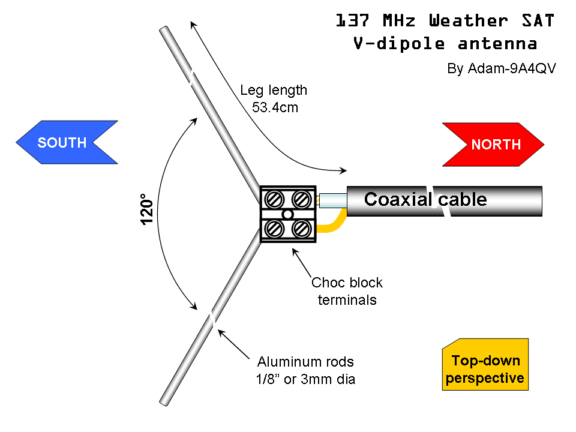 <br>
*This image suggests a wire length of 53.4 cm, while that would work the actual length should be approximately 54.5cm. It also suggests using aluminum rods, while that'd work, copper is about twice as conductive (will lead to better results).*

### 2. Quadrifilar helical antenna (QFH)
- Omnidirectional
- Fairly difficult to build
- Very good results thanks to its true circular polarization and consistent radiation pattern
- Best choice for permanent fixtures
  
I will not be describing how to build it, since the building process is quite involved. There are plenty of guides out there, if I ever get around to building one I will link it here.

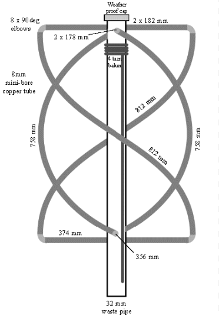 <br>
*[Source](https://okelectronic.wordpress.com/2014/08/20/rtl-sdr-second-attempt/)*

### 3. Yagi-Uda antenna
- Directional
- Fairly easy to make
- Very good results thanks to its high gain
- Requires manual tracking
  
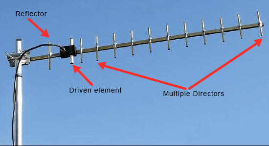 <br>
*[Source](https://www.everythingrf.com/community/what-is-a-yagi-antenna)*

I personally use this type of antenna for VHF passes, since it constantly gets a great SNR (~45-50 with APT) and is quite easy to build albeit requiring a bit more wire. 

To make it:
1. Get a Boom (Anything long and nonconductive, just consider, that you will HAVE to manhandle it later while tracking sats - don't get a tungsten rod or something) and find out how many elements fit on it
> More elements = More directional (Harder to track), higher gain (Better signal strength), longer boom length (Bulkier)
2. Shove appropriate numbers into [this calculator](https://www.steeman.org/Antenna/Yagi-Antenna-Calculator) (For frequency choose 137.5 MHz)
3. Cut copper wires to length, place them onto the boom according to to the values from the calculator
4. For the driven element (dipole), cut it in half and put one side in a terminal with the shielding of a coaxial wire and the other with the core of the same wire\
**Make sure the cables don't touch or are short together in any way, this will make the antenna not work**
5. Coil the coaxial cable up a few times right after the feed point in order to convert the **unbalanced** signal to a **balanced** one (In essence creating a HF choke)

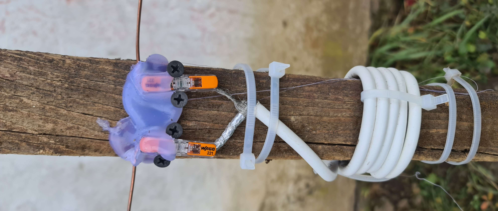
*The choked balun and dipole feed I use on my yagi*


## Frequency reference

As of 03/2024, the frequencies these satellites broadcast in are as follows:

|Satellite|Frequency|
|---|---|
|NOAA 15|137.62 MHz|
|NOAA 18|137.9125 MHz|
|NOAA 19|137.1 MHz|
|Meteor M2-3|137.9 MHz|
|Meteor M2-4|~~137.1 MHz~~ *(Refer to temporary notice on top of page)*|

## Actually receiving the satellites!
1. Get to a place with a good view of the sky - The more you can see, the longer you can receive the satellite for and the longer the resulting image will be
2. Open SatDump and navigate to the `Recorder` tab, select your SDR, set the sampling rate to `2.4 Msps` (Or whatever your SDR supports) and hit `Start`

- Rise the gain until your noise floor starts to rise more than the target signal, or until your SDR overloads, whichever comes first. Try not to move it around during the pass, it will lead to the image having sections with a different brightness.

3. In the side panel, open the `Processing` menu and do the following:

### FOR NOAA APT
- Select the `NOAA APT` pipeline
- Enable `DC Blocking` and `SDR++ Noise Reduction`
- Select the proper NOAA satellite
- Open the frequency menu, select the correct satellite

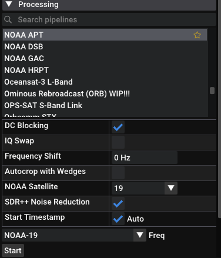

### FOR METEOR-M LRPT
- Select the `METEOR M2-x LRPT 72k` pipeline
- Enable `DC Blocking`
- For the frequency choose `Primary` for 137.9 MHz and `Backup` for 137.1 MHz
> The frequency can change when the satellite conflict switches (Tries to avoid using the same frequency as other satellites in the same band)

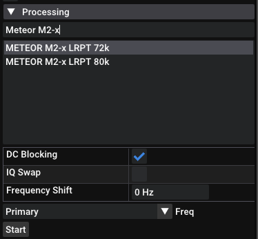

4. When the satellite comes into view, press `Start` on the processing window

> When using a directional antenna, move slowly and try keeping the signal as strong as possible using the SNR with LRPT and the FFT along with the sound (Try to avoid crackling) with APT. You might not get the hang of it on your first try, tracking is a skill you have to learn!

If everything is right, you are now receiving a beeping APT signal or you see four dots on the demodulator in case of LRPT!

5. Once you see the signal has completely disappeared and isn't coming back, press `Stop` on the pipeline

6. SatDump will now begin autoprocessing the results, you can see the progress on the bottom (You can disable the autoprocessing in the settings if you want to tinker with the images yourself and don't want SatDump creating automatic images)

7. Once it finishes processing, head to the `Viewer` tab and select the pass you decoded on the top left

You are done! Feel free to play around with the image settings and enhancements, you can figure it out :)

## Common issues
- The image is solid black!\
If the image is from LRPT on an evening pass, you need to select Channel 4 (IR) to see anything - Channels 1 and 2 are visible, during night it is solid black.

- There is grain all over the image!\
Some grain is expected on APT images, you can get rid of it by ticking `Median blur`. If it is present after, you either didn't enable the noise reduction when recording or the signal was just too weak. The latter is most common, grain appears whenever there is crackling during recording.


# L-band HRPT reception guide (1.7 GHz)
- L-band reception is the next logical step after VHF, it is **harder to receive** requiring more **expensive equipment** and more effort making the antenna as well as a **dish** paired with some half decent tracking skills.
- While requiring more dedication, it offers much more interesting things than VHF: for example being able to receive 5+ channels of pure and uncompressed 1km/px images as well as full disc Earth images using geostationary satellites broadcasting HRIT/LRIT (or other alternatives)

<break>

- The are far more satellites you can receive, they divide into:
    - Geostationary satellites (9):
        - GOES in the US (One additional limited GOES in Europe and Asia)
        - Elektro-L in Europe, Asia and Oceania
        - Fengyun in Asia and Oceania
        - Geo-Kompsat in Asia and Oceania

    - Orbiting satellites (9):
        - 3x NOAA POES
        - 3x Meteor-M
        - 2x MetOp
        - 1x FengYun (Only broadcasts when in sight of China)

## Exemplary processed HRPT and xRIT images


*NOAA 19 received on 14/1/2024 using a 90 cm dish and a SawBird GOES+. Processed using SatDump with the `NOAA Natural Color` RGB composite. Median blur applied, equalized.*


*Elektro-L N3 LRIT received on 11/2/2024 using a 125 cm dish and a SawBird GOES+. Decoded using SatDump. Pictured is the autogenerated `NC` (Natural Color) composite.*

## Detailed satellite information

This section will describe the satellites that you can receive as well as their respective signals.

---

**NOAA POES**

- These are the same as VHF: **NOAA 15, 18 and 19**.
- Have a [POES HRPT](https://www.sigidwiki.com/wiki/NOAA_POES_High_Resolution_Picture_Transmission_(HRPT)) (High Rate Picture Transmission) broadcast which transmits 5 AVHRR channels as well as some more data (Refer to the link)
- The broadcast features a very strong carrier wave making it quite easy to track.

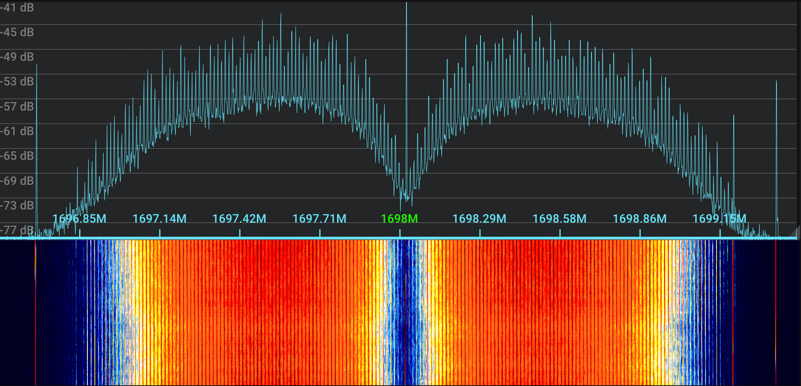
*NOAA 19 HRPT*

> Fun fact: Since 2021, **NOAA 2** (ITOS-D) - A 50 year old satellite! - has recently gone back to life transmitting a legacy [ITOS HRPT](https://www.sigidwiki.com/wiki/NOAA_ITOS_High_Resolution_Picture_Transmission_(HRPT)) broadcast. **It includes no actual imagery** since the VHRR sensor has died ages ago, however it still matches the modulation and spec - if decoded properly you can still see the familliar sync lines from APT broadcasts.

---
**METEOR-M**

- 3 satellites currently broadcast in L-band: **Meteor M2-2, Meteor M2-3,** and ~~**Meteor M2-4**~~ *(Refer to temporary notice on top of page)*
- Have a [**Meteor HRPT**](https://www.sigidwiki.com/wiki/METEOR-M_High_Resolution_Picture_Transmission_(HRPT)) broadcast containing 6 MSU-MR channels in addition to 30 MTVZA channels.
- The broadcast, much like POES HRPT, has a very strong carrier wave making it very easy to track.


*Meteor-M N°2-2 HRPT*

> You might notice that Meteor M2-2 is here even though it doesn't broadcast LRPT in the VHF band. This is because of a micrometeor strike causing a leak of thermal transfer gas, leaving LRPT unpoperable due to inadequate cooling ([Source](https://www.rtl-sdr.com/meteor-m-n2-2-has-failed-but-recovery-may-be-possible/)). HRPT has recovered, and has been working without any issues since.

---
**MetOp**
- There are two functional satellites: **MetOp-B** and **MetOp-C** operated by EumetSat, launched in 2013 and 2019 respectively.
- Have a [MetOp AHRPT](https://www.sigidwiki.com/wiki/METOP_Advanced_High_Resolution_Picture_Transmission_(AHRPT)) (Advanced High Rate Picture Transmission) broadcast which - unlike NOAA POES and METEOR-M HRPT - includes Reed-Solomon FEC to make sure your picture doesn't come out with grain. The broadcast also contains several more instruments and much more data, including 5 AVHRR channels.
- The signal does not have a carrier wave or easily decernible bumps making it a bit harder to track, you will have to go by the SNR meter.

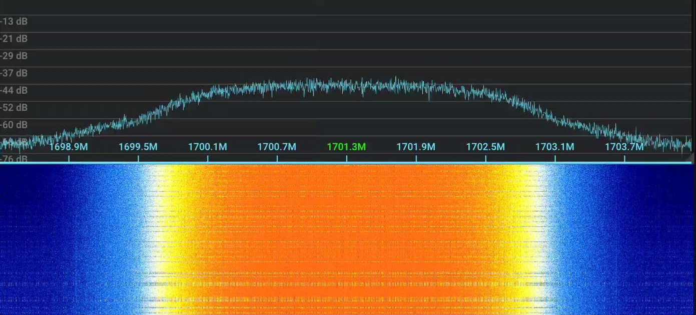
*MetOp B AHRPT*

---
**FengYun**

- The only satellite broadcasting in the L-band is **Fengyun 3C**. It is the last surviving member of the FengYun 3 constellation to have an L-band antenna, but due to a severe power supply failure **it only broadcasts when in sight of China** (When its footprint is anywhere within the chinese border). 
- It broadcasts a FengYun AHRPT signal containing 10 VIRR channels in addition to some other instruuments. Much like MetOp AHRPT, it has Reed-Solomon FEC, but unlike any other satellite in L-band **it broadcasts true color** (The rest can only do false color RGB composites) - exactly what you would see with your eyes if you stood right next to the satellite. 
- The signal has a higher symbol rate in comparison to the rest of the satellites mentioned here, meaning you can not use a standard RTL-SDR dongle to receive it.

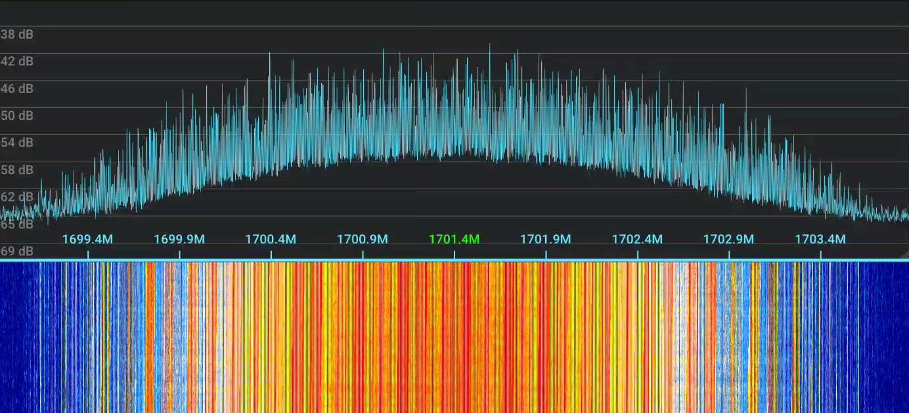
*FengYun 3C AHRPT*

---


## Hardware requirements

### SDR

- Any SDR able to sample 1650-1710 MHz will work, just make sure its sampling rate is good enough to receive these satellites.

### LNA

- L-band radio waves are very weak and disspiate too quickly to be usable with just your SDR - an LNA connected directly to the feed is imperative.
- The only viable option that doesn't cost a liver is the [Sawbird+ GOES](https://www.nooelec.com/store/sawbird-plus-goes-302.html) from Nooelec. It is a filtered LNA providing very good performance for L-band satellite reception. 

> Do not waste your money on cheap wideband LNAs, **they will NOT work.**

### Dish

- You can use either a prime focus or an offset dish, the former just requiring less turns on the helix or a [patch feed](http://sat.cc.ua/page3.html) for better performance alltogether.
- The bigger the dish, the harder it is to track but the higher gain you have - the stronger the signals will be. 

An 80 cm offset is a great starter dish, given its lightness and wide availability - people give these away all the time after switching to terrestrial television.

### Feed

- The dish is only a half of the story though, you will need to DIY the feed yourself - it isn't difficult but requires a bit of effort.
- The preferred and most forgiving feed you can make is a **Helical antenna**, a simple wire spun into a helical shape placed on a 13x13 cm plate.


## Build and reception

For these, there is no point in me writing it out: Lego has these covered in his incredible [HRPT guide](https://www.a-centauri.com/articoli/easy-hrpt-guide), a much more solid and complete source for HRPT reception. Anything further will just be expanding upon his article.

## Signal information

|Signal|Minimum dish size|Symbol rate (Per second)|FEC|Notes|
|---|---|---|---|---|
|NOAA POES HRPT|60|665.6 KSym|No|
|Meteor HRPT|60|665.6 KSym|No|
|MetOp AHRPT|60|2.33 Msym|Yes|Just barely receivable with an RTLSDR, might cause issues
|FengYun AHRPT|80|2.80 MSym|Yes|Not receivable by an RTLSDR, needs at least 4 Msps

You can only receive signals with an SDR that has a sampling rate equal to or greater than the symbol rate. Not having enough overhead will make the signal weaker as well as causing issues such as a donut constellation (Described in the `Common issues` section). The ideal sampling rate is at least twice the symbol rate, anything less than that will result in lower and lower SNR and anything higher has basically no benefit.

## Frequency reference
|Satellite|Frequency|Notes|
|---|---|---|
|NOAA 15|1702.5 MHz|Very weak, don't bother|
|NOAA 18|1707 MHz||
|NOAA 19|1698 MHz||
|Meteor M2-2, M2-3, ~~M2-4~~|1700 MHz|Refer to temporary notice on top of page|
|Metop B, C|1701.3 MHz||
|FengYun 3C|1701.4 MHz||


# L-band geostationary satellite reception guide
- Receiving these is extremely simple, the hardest part is arguably just getting a suitable dish and LOS
- Doesn't require tracking, since the satellites don't move (It's on the tin - geo**stationary**)
- Provides full disc images of the earth and/or regional crops

## Transmission types
Unlike orbiting satellites which use (A)HRPT, geostationary ones use different formats able to carry more than just images - the most common type that we are interested in this band being **LRIT** (Low Rate Information Transmission). You can also find other types such as:

- **HRIT** - High Rate Information Transmission → A faster broadcast of data which usually has a higher quality than LRIT, is often harder to receive
- **S-VISSR** - Stretched Visible and Infrared Spin Scan Radiometer → A fairly outdated broadcast of images from FengYun satellites
- **GVAR** - Goes Variable → Only broadcasts a set amount of data
- **GRB** - Goes ReBroadcast → A very high quality broadcast from american GOES satellites 
- **GGAK**/**CDA** → Broadcasts space weather information, these have been decoded but the information they hold is pretty much useless

## Detailed satellite information

**Elektro-L**
- These are **Elektro-L N3** and **Elektro-L N4** (Elektro-L# for short). Due to a fairly recent power supply failure, Elektro-L2 only broadcasts a beamed X-band transmission to Moscow.
- They broadcast a **Low Rate Information Transmission (LRIT)** as well as a **High Rate Information Transmission (HRIT)** signal containing full disc images of the earth. LRIT broadcasts all (3) visible channels as well as two infrared channels. HRIT broadcasts 5 additional channels. It includes Reed-Solomon FEC, meaning you can get just a few dBs of the signal and still get a proper decode without any grain.

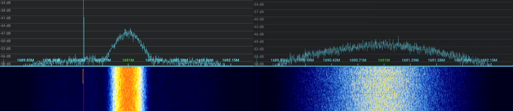
*Elektro LRIT on left, Elektro HRIT on right*

---

**GOES**

*American*
- **GOES 16** and **GOES 18**, satellites from the `GOES-R` series, are the two currently operational satellites broadcasting three signals: 
    - **CDA** - Space weather, can be used to check your setup. Decoded but doesn't hold anything interesting.
    - **GRB** - A fairly weak rebroadcast sending incredibly high quality data, has a massive 7.8 Msym/s.
    - **HRIT** - A stronger and much easier to receive signal transmitting reduced resolution imagery.

All of these include FEC, meaning you should be able to properly decode them even when the signal is quite weak.

> GOES 14, 17 are currently in on-orbit storage and are not broadcasting anything useful.

> TODO: FFT for these signals

*European*
- **EWS-G2 (GOES 15)**, a retired GOES satellite part of the `GOES-N` series, was transferred to USSF and moved to Europe to replace EWS-G1 (GOES 13) and now only broadcasts a **linearly polarized** GVAR signal. It lacks FEC, meaning you have to get it at a fairly decent strength for a decode witout any grain. A full disc image is transmitted every 3 hours.

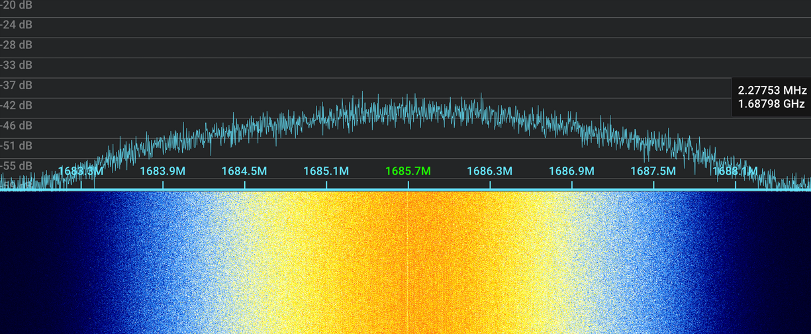
*GOES 15 GVAR*

---

**FengYun**

*FengYun 2 series*
- **FengYun 2H**, and **2G** broadcast a **linearly polarized S-VISSR** signal containing 5 channels (1 visible, 4 infrared) at a fairly high quality - 1.25 km/px for VIS channels and 5 km/px for the IR channels. 
- This signal is very prone to transport packet corruption because of lacking FEC, resulting images are likely to have grain as well as missing lines on it. These can be addressed by applying median blur via 3rd party tools and using [HRPTEgors S-VISSR corrector](https://github.com/Foxiks/fengyun2-svissr-corrector) instead of the defeault `FengYun 2 S-VISSR` pipeline respectively.

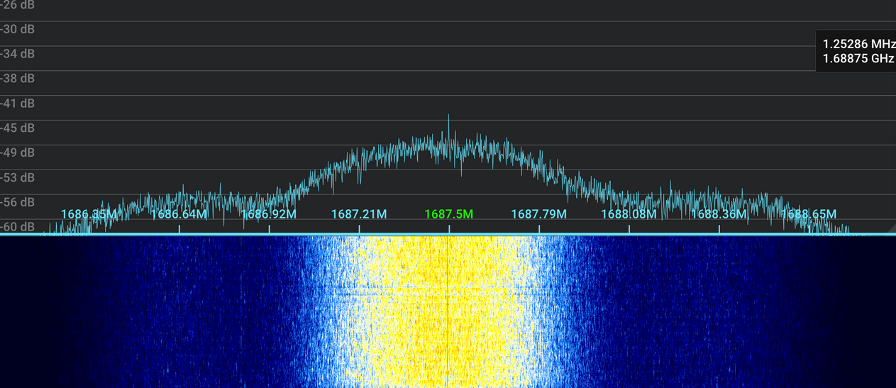
*FengYun 2H S-VISSR*

*FengYun 4 series*
- **Fengyun 4A** currently broadcasts a **linearly polarized LRIT** and **HRIT** signal. The LRIT signal is a fairly poor quality (Have to confirm, but less than 4 km/px), HRIT only transmits a single unencrypted infrared channel.

> As of 03/2024, FengYun 4B is currently commisioning and hasn't started broadcasting LRIT and HRIT yet. 

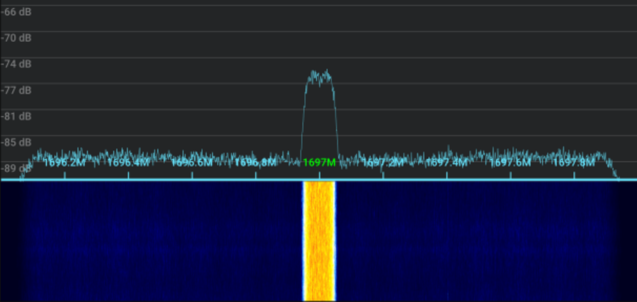 <br>
*FengYun 4A LRIT, CC: drew0781 on Discord*

> TODO: HRIT FFT

---

**GEO-KOMPSAT**
- **GEO-KOMPSAT-2A** currently broadcasts **LRIT** and **HRIT** at a 0.5-2 km/px quality. The broadcasts are encrypted, but the decryption key has been shared by the operators.

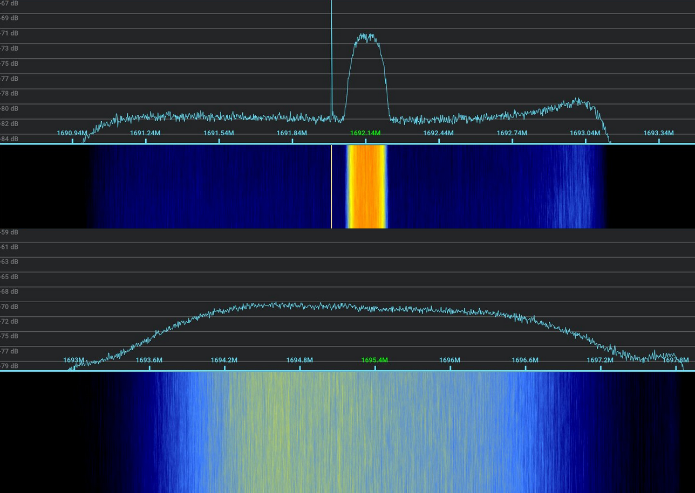
*GEO-KOMPSAT-2A LRIT on top, HRIT on bottom. CC: drew0781 on Discord*


## Signal information

The minimum dish size heavily depends on the satellites elevation! You might be able to get it with a smaller dish if the satellite is high up, or need a bigger dish if it's low in the sky

|Satellite series|Signal type|Frequency|Symbol rate|Polarization|Minimum dish size|FEC|Transmits...
|---|---|---|---|---|---|---|---|
|Elektro-L|LRIT|1691.5 MHz|294 KSym/s|RHCP|90 cm|Yes|Every 3 hours from midnight UTC at XX:42 ecluding 06:42
|Elektro-L|HRIT|1691.5 MHz|1.15 Msym/s|RHCP|125 cm|Yes|Every 3 hours from midnight UTC at XX:12 excluding 06:12
|Elektro-L|GGAK|1693 MHz|5 Ksym/s|RHCP|N/A|N/A|Constantly, can be used to verify your setup is functional
|GOES|CDA|1693 MHz|40 Ksym/s|Linear|N/A|Yes|Constantly, can be used to verify your setup is functional
|GOES|GVAR|1685.7 MHz|2.11 Msym/s|Linear|125 cm|No|Constantly
|GOES|GRB|1681.6 MHz|8.67 Msym/s|Circular\*|180 cm|Yes|Constantly
|GOES|HRIT|1694.1 MHz|927 KSym/s|Linear|80 cm|Yes|Constantly
|Fengyun 2|S-VISSR|1687.5 MHz|660 Ksym/s|Linear|100 cm|No|XX:00 - XX:28 and XX:30-XX:48\*\*
|FengYun 4|LRIT|1697 MHz|90 Ksym/s|Linear|TODO|Yes|TODO
|FengYun 4|HRIT|1681 MHz|1 Msym/s|Linear|TODO|Yes|XX:30
|GEO-KOMPSAT|LRIT|1692.14 MHz|128 Ksym/s|Linear|60 cm|Yes|Every 10 minutes
|GEO-KOMPSAT|HRIT|1695.4 MHz|3 Msym/s|Linear|175 cm|Yes|Every 10 minutes

\* RHCP+LHCP <br>
\*\* During XX:28 - XX:30 the sensor rolls back, this presents itself as a very strong carrier wave in place of S-VISSR. During XX:48-XX:00 the satellite broadcasts dead (filler) LRIT on 1690.5 MHz, causing the second image to be cut in half at about 57%.

You might have noticed, that some signals are **linearly polarized** instead of our familliar **RHCP** (Right Hand Circular Polarization). You **can** receive these signals with a differently polarized feed **at the cost of 3 dB**. 


## Actually receiving the satellites!

1. Aim your dish using whatever broadcast the satellite has for alignment, or using a dish tracking app (Less accurate). Alternatively, locate the rough area of where the satellite should be in the sky, start the correct pipeline and when the broadcast starts quickly try to find where the signal is the strongest. You usually have a few seconds to find it, which is more than enough in most cases.

2. Open SatDump, move to the `Recording tab` following the same setup as for HRPT

3. Start the appropriate pipeline:

|Signal|Pipeline|
|---|---|
|Elektro LRIT|Elektro-L LRIT|
|Elektro HRIT|Elektro-L HRIT|
|GOES GVAR|GOES GVAR|
|GOES GRB|GOES-R GRB|
|GOES HRIT|GOES-R HRIT|
|FengYun 2 S-VISSR|FengYun-2 S-VISSR|
|FengYun 4 LRIT|FengYun-4[A/B] LRIT|
|FengYun 4 HRIT|FengYun-4A HRIT -II/III|
|GEO-KOMPSAT LRIT|GK-2A LRIT|
|GEO-KOMPSAT HRIT|GK-2A HRIT|

4. The broadcast will show up as a bump that occasionally jumps up and down, you should be seeing a few decibels of signal, `SYNCED` and green Reed-Solomon numbers when applicable.

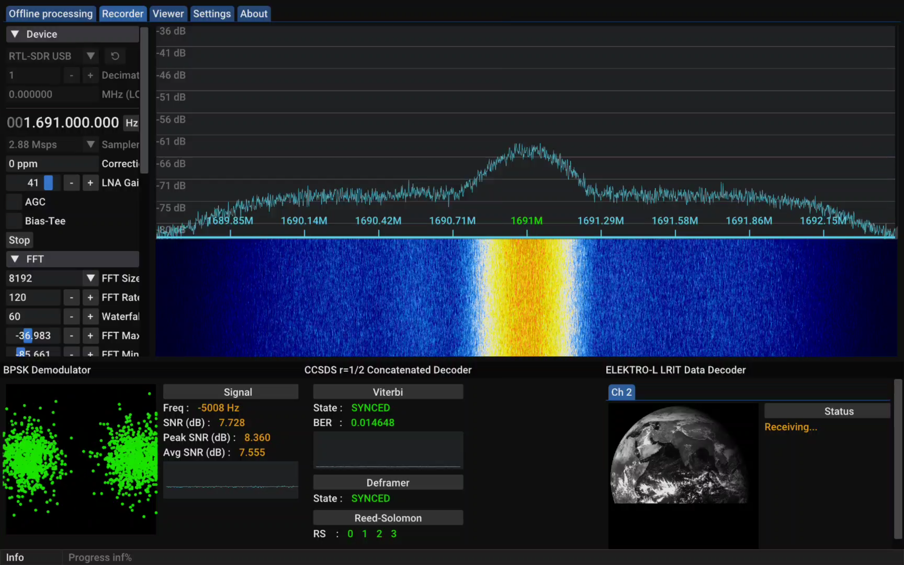

5. After the transmission stops or you are satisfied with the results, hit `Stop` on the pipeline

6. As of writing this article, SatDump does **NOT** support processing of images received from geostationary satellites, so **they will not show up in the `Viewer` tab.** To access them, navigate to your live output directory, open the folder for the latest live recording. The images will be in the `IMAGES` folder.

7. You are now done! Feel free to play aroud with the results using 3rd party tools.

# Common issues

## MetOp donut shaped constellation

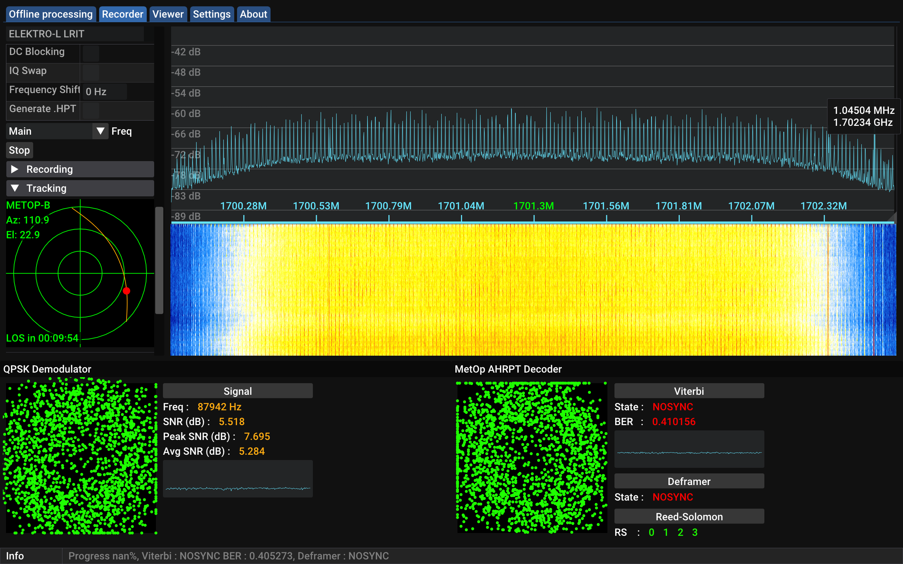
*Both demodulators are not showing the correct constellation of four dots in each corner, instead showing a donut shape*

When decoding MetOp AHRPT on RTL-SDRs, you might notice that even while threre is a decent signal (Several dB), you still have `NOSYNC` indicated on the Vitterbi and have a donut shaped constellation. This happens, when the MetOp pipeline doens't see enough of the broadcast for a decode. To fix this, you have a few options:
- Make sure you are using 2.56 Msps (2.88 if it's stable)
- Move the frequency around by a few kHz
- Lower the MetOp pipeline bandwidth:
1. Open the SatDump folder (On android you need to download a debuggable APK, then run `adb run-as org.SatDump.SatDump`)
2. Open `Pipelines/MetOp.json`
3. Locate the `ppl_bw` option and set it to 0.002

```jsonc
{
    "metop_ahrpt": {
        ...
        "work": {
            "baseband": {},
            "soft": {
                "psk_demod": {
                    "constellation": "qpsk",
                    "symbolrate": 2333333,
                    "rrc_alpha": 0.5,
                    "pll_bw": 0.003 // Set this to 0.002
                }
            },
        ...
```
4. Receive MetOp satellites as usual

If you continue to get a donut shaped constellation even after making the adjustments, you'll likely just need a bettter SDR or a machine that supports the 2.88/3.2 Msps sampling rate.

## SPS is invalid error when starting pipelines

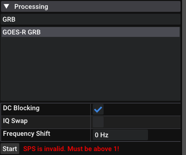

This error appears when your sampling rate is lower, than the signals symbol rate. Set your sampling rate to **at least** equal the symbol rate, preferebly more than that to get overhead. If not possible, get an SDR capable of sampling at higher rates or don't receive this signal at all.

## No/cut up image output with severe vitterbi spikes when decoding signals with FEC

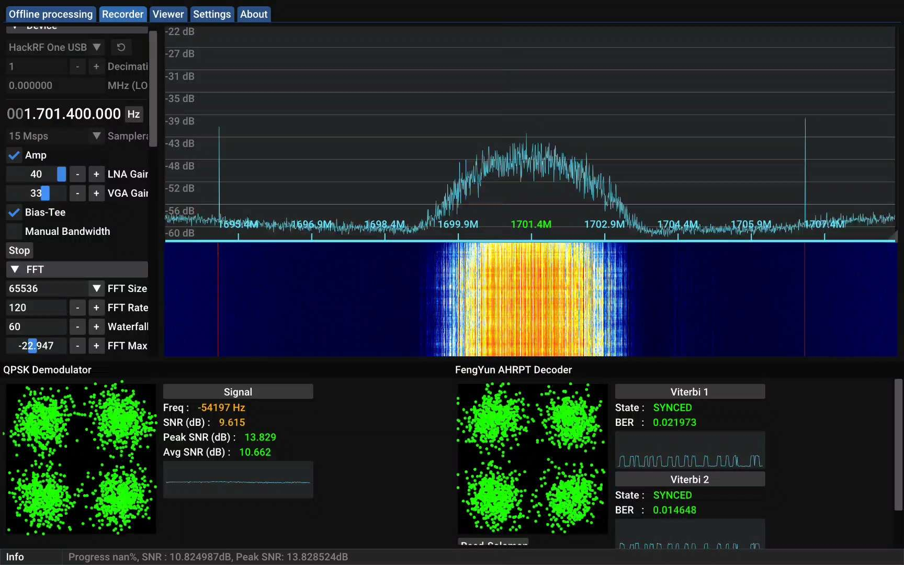
*You can see the spikes on the vitterbi, on a video you'd see `NOSYNC` constantly popping up*

Two things can cause this issue:
- **The signal is too weak** → Make sure your gain is set properly or get a bigger dish.
- **You are dropping samples** → Disable battery optimization, enable the `High power` power plan, close other apps/programs, lower the sampling rate. 

# Reception tips and notes

### Minimum SNR for a good decode
If the signal lacks FEC, you can expect grain when near the minimum SNR.

|Signal|Minimum SNR|FEC|
|---|---|---|
|NOAA APT|20 dB|No|
|Meteor LRPT|2.5 dB|
|NOAA HRPT|0 dB\*|No|
|Meteor-M HRPT|0 dB\*|No|
|MetOp AHRPT|4 dB|Yes|
|FengYun AHRPT|7 dB|Yes|
|Elektro-L xRIT|3dB|Yes|
|Goes GVAR|8 dB|No|
|GOES GRB|TODO|Yes|
|GOES HRIT|4 dB|Yes|
|FengYun 2 S-VISSR|6 dB\*\*|No|
|FengYun 4 LRIT|TODO|Yes|
|FengYun 4 HRIT|TODO|Yes|
|GEO-KOMPSAT LRIT|TODO|Yes|
|GEO-KOMPSAT HRIT|TODO|Yes|


\* You read that right, you can get these even at 0 dB! As long as you see the signal and there are frames being decoded or the deframer is synced, you are getting an image! It will have a lot of grain, but that is manageable by using the `Median blur` option when viewing the resulting image

\*\* You will likely still get missing lines, make sure to use HRPTEgors corrector when near the minimum SNR.

### Pass rating scale
This scale is not official or mentioned anywhere, I just created it to be able to gauge how good each **HRPT** satellite pass was. Some people use SNR to gauge the pass quality, but I personally prefer using AVHRR frames. These dictate how long the received image is, is fairly consistent thanks to 8/9 orbitting L-band satellites using the AVHRR/3 instrument for imaging (Except FengYun 3C, which uses VIRR).

You can see the frame count in SatDump after hitting `Stop` on the pipeline and going to the `Offline processing` tab while it's still decoding, or by reprocessing the cadu at a later date in the same tab. Alternatively, you can view the dimensions of the raw AVHRR image, the height will be the amount of frames (lines) you received.

|AVHRR frame count|Pass quality|
|---|---|
|<250|Very poor|
|250-1000|Poor|
|1000-2000|Okay|
|2000-3000|Good|
|3000-4000|Very good|
|4000-5000|Excellent|
|5000-5500|Almost perfect|
|>5500|Perfect|

The theoretical limit for these is about 6000, I have managed to get a 5650 frames from a 0° - 2.5° pass.


### Correctly adjusting your gain

Correctly adjusting your gain is **extremely important**, as setting it incorrectly can severely hurt your reception capabilities by making the signal weaker than it should be. To correctly adjust it, use the "Magic eye" found in the `Debug` menu in the `Recording` tab and refer to the folllowing examples:

1) **A lot of dots are hitting the edge** → Gain too high

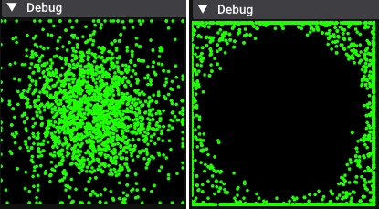 <br>

- On the left is what you might see if the gain is set slightly too high, lower it by a few dB to get the full signal strength.
- On the right is a more extreme example, where the gain is set much higher than needed resulting in the SDR severely overloading. If you see anything like this, your signal signal strength is being hurt by too high gain. You needto lower it by a lot.

2) **There's only a small dot or circle in the middle** → Gain too low

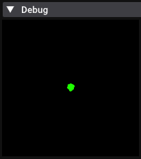 <br>
A small dot means that you should up the gain, if you are already maxxed out you might need to purchase an LNA.

3) **A circle is present, the dots aren't hitting the edges** → Gain just right

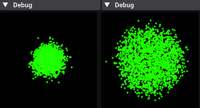 <br>

- What you see on the left is ideal gain with no signals on the FFT
- What you see on the right is ideal gain with signals on the FFT


---

Have fun and go get some pretty pictures!
