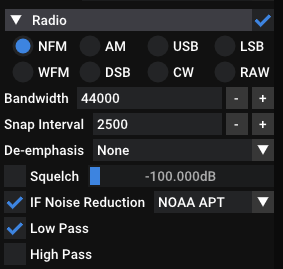

[//]: # (NOTE: I have explicitly requested permission from lego11 to use his guides as a refernece, he said he's cool with it. I owe that man half the shit I know)

# Preamble

Before anything, I have to give credit and extreme kudos to the **SDR++ and SigIdWiki Discords**. Everyone there has been incredible and has helped me learn basically everything that you'll be able to read here. 

**A lot of the information you will be able to find here is from [lego11s articles](https://a-centauri.com/articoli/), check them out if you want more awesome and detailed guides.**

The purpose of this page is to write up everything I have learned so far in a beginner friendly way including guides with old wives tales and advice sprinkled on top. More importantly, what you can read hereis **up to date**. There are several WAY out of date guides and pages out there instructing you to use outdated software, abandonware, offering jank solutions to simple problems.

> As of writing this, by far the best source are the aforementioned Lego11s articles, they are updated in a timely manner and contain up to date information.

# Glossary
### Hardware terms
- **SDR** - Software Defined Radio -> A device used to translate radio waves into digital info
- **LNA** - Low Noise Amplifier -> A tool used to amplify radio signals
- **Bias-t**/**Bias tee** -> A device used to inject DC power into the rf line. **DO NOT PLUG IT IN AIMING AT YOUR SDR, IT WILL KILL IT**

<break>

- **Sma** -> Type of connector used by most SDRs
- **Balun** -> Converts an **Un**balanced signal to a **Bal**anced one and vice versa

<break>

- **Pass** -> Refers to the time when you can see a satellite passing overhead, used with orbiting satellites
- **Elevation** -> Height of a satellite above the horizon

### Software terms
- **AGC** - Automatic Gain Control -> Automatically sets the gain based on the signal strength
- **SNR** - Signal to Noise Ratio -> The difference in dB between the noise floor and the signal peak, ergo how strong the signal is
- **FFT Spectrum** - Fast Fourier Transform Spectrum -> The slice of the radio spectrum being sampled by your SDR
- **FFT Waterfall** - Fast Fourier Transform Waterfall -> A visual representation of the spectrum throughout time, almost always found right below the fft Spectrum
- **Interference** -> Commonly referred to as RFI (Radio Frequency Interference), is an umbrella term for unwanted signals produced by erroneous sources such as cheap power supplies, HDMI cables and devices such as laptops (USB RFI @ 480 MHz)
- **Overloading** -> Occurs when your gain is set too high andor you are near a very strong broadcast. Presents as your noise floor jumping/being unstable or spurs of interference throughout your spectrum.
- **TLE** - Two Line Element set -> A format used to list the location of objects orbitting the earth

### Data transmission formats
Don't worry if you don't understand these yet, they will be explained in more detail later and are here just so you have an idea of what is meant if they are mentioned prior to their full explanation.

- **APT** - Automatic Picture Transmission -> VHF Image broadcast currently used on NOAA satellites
- **LRPT** - Low Rate Picture Transmission -> VHF Image broadcast currently used on Meteor-M satellites
- **HRPT** - High Rate Picture Transmission -> L-band high quality image and telemetry broadcast format
- **LRIT** - Low Rate Information Transmission -> L-band information and telemetry broadcast format

## Examples of interference and overloading:

### Interference

*Pictured is an SDR being overloaded with interference caused by a very strong cell tower broadcast. On the left is an FM station, the rest of the lines are erroneous.*

### Overloading

*Pictured is a relatively normal FFT, excluding the lines*

*After upping the gain, you can see the significant amount of FM overloading present throughout the whole FFT.*

# Mistakes and pitfalls
This is a list of mistakes I made that ended up in wasted time, avoid them for the sake of saving you a headache or two

- **Using old, outdated guides and software** -> Radio is very niche, almost all guides you can find online are heavily outdated giving you bad advice and suggesting deprecated software, leading to confusion and subpar results. Please make sure that any sources you use are up to date.

- **Compass tracking with directional antennas** -> Go by signal strength, NOT by elevation and azimuth. Use apps to find the time and general direction of the satellite, don't go measuring exact compass readings. Find the signal when it is weak, move slow and with purpose to get it to be as strong as possible.

- **Doppler tracking when it is not needed** -> Signals covered here such as APT and HRPT were designed to be thin enough to not need doppler tracking, **DON'T BOTHER DOING IT, IT IS NOT NEEDED.**

- **Blindly maxxing the gain setting** -> Upping the gain only makes the signal louder up to a certain point, after which it starts amplifying the noise floor much more than actual signals. This leads to them being drowned out. Turn it up only until you see, that the signal isn't getting any stronger (Use SNR, NOT its position on the fft).

- **Turning on automatic gain control (AGC)** -> AGC was designed for much wider broadcasts such as DVB-T (Terrestrial TV) than the signals described in this page. It *won't* recognize the signals and end up cranking the gain up way higher than needed which ends up drowning the signal out.

- **Using an LNA with direct sampling** -> Direct sampling is just piping the whole target frequency range to the SDR at once, meaning that weaker signals will get drowned out by stronger ones incredibly easily. Using an LNA makes strong signals stronger, drowning weak ones out completely.

- **Not using actual connectors and cables** -> In my first few days with an SDR, lacking an actual sma cable, I went by the definition of an antenna - "An antenna is just a piece of wire" - and stuck a wire straight into the sma port. While yes, it works, it is extremely dangerous since it can damage your sma port, electrocute you if you have a bias-t, introduce major signal loss, or just end up not working correctly. Just get proper cables, man

- **Using a cheap LNA with higher frequencies (L-band and above)** -> Cheap LNAs do work, but very poorly and are very often not worth the money spent. Check out the HRPT section for more info.

# Preferred software

Arguably the by far best choice for **pulling data** off of satellites is:
- [Sdr++](https://github.com/AlexandreRouma/SDRPlusPlus/releases) for recording
- [SatDump](https://github.com/SatDump/SatDump/releases) for decoding recordings, or doing both (Covered in L-Band guide)

> Always download the nightly builds for both of these, since the tools are relatively new and are being actively developed with new additions basically daily. There are other programs you can use but I won't focus on them for the sake of keeping this simple.
---
 To **track satellites** and figure out their future passes (Most are orbiting the Earth after all), you can use these:

PC:
- [Gpredict](https://oz9aec.dk/gpredict/) - Windows, Linux, MacOS - A relatively young tool, arguably the best choice for tracking on your computer
- [Orbitron](http://www.stoff.pl/) - Windows, Linux (wine) - Quite dated but functionally sound

Mobile:
- [Look4Sat](https://play.google.com/store/apps/details?id=com.rtbishop.look4sat&hl=en&gl=US) - Android - Provides everything essential in a simple UI.

Web:
- [N2YO](https://n2yo.com/) - Web - Does the job, however lacks the polish of other apps

For IOS there are a few apps but they have severe limitations, using any of the above is heavily encouraged.

> **Make sure you update your TLEs**, not doing so might make your data be outdated or just outright incorrect.

I personally use Look4Sat when on the go because of its simplicity and Orbitron when at home, since I just got used to its UI.

# VHF APT/LRPT reception guide (137MHz)
- Receiving VHF broadcasts is **incredibly easy** -> all that you need is just some wire, an SDR and some patience
- As of writing this article there are just **4** remaining weather satellites that broadcast in this band
- While easy to receive, they have a **lower quality** (4km/px and 1km/px with jpeg compression) and transmit less channels (2-3) than broadcasts in higher frequencies which usually transmit 10+ channels of raw 1km/px images

## The four weather satellites still broadcasting images on VHF

This is a brief historical overview in case you want to know a bit about the satellites you can receive. Feel free to skip this heading if you are just here to receive stuff.

**NOAA**

- These are the last **3** remaining members of the **POES** (Polar Orbiting Environmental Satellites) constellation, consisting of **NOAA 15, 18 and 19** being launched in 1998, 2005 and 2009 respectively.
- These satellites broadcast an *analogue*  **[APT (Automatic picture transmission)](https://www.sigidwiki.com/wiki/Automatic_Picture_Transmission_(APT))** signal that has two channels and a 4km/px quality. Its analogue nature means, that if the signal has even just a bit of noise, you will get static grain on output images.

<break>

- New satellite launches are of the JPSS constellation, which only have a much harder to receive C-band signal that requires much more specific hardware to receive (Since most SDRs only go up to 1.7 GHz, aka the top of L-band). No future satellite launches from NOAA are planned to include a VHF antenna.

---
**METEOR-M**

- As for their Russian counterpart, the **only** satellite currently broadcasting in VHF is **Meteor-M N2-3** (Meteor M2-3 for short) of the **Meteor-M** constellation. It was launched very recently - just in June of 2023. 
- Meteor-M satellites broadcast a *digital* **[LRPT (Low rate picture transmission)](https://www.sigidwiki.com/wiki/Low_Rate_Picture_Transmission_(LRPT))** signal that has 3 channels and a JPEG-compressed 1km/px quality. It also includes **ECC** to make sure the picture doesn't come out grainy as well as allowing you to decode the signal properly even if it is fairly weak.

<break>

- The satellite series has been plagued with errors, failures and delays. M2-3 is sadly no exception: its LRPT antenna didn't fully extend, leaving it in a tilted angle making the signal not circularily polarized like it is supposed to be as well as making it much weaker than designed. M2-4 is currently set to launch 02-2024.

## Example processed APT and LRPT images
> Note: The images don't have maps on them, it was added in post processing.

*APT image received using a 5 element yagi on 02-01-2024 from NOAA 18, processed using Satdump with the `WXtoImg HVC N18` RGB composite. Equalized.*

*LRPT image received using a 5 element yagi on 02-01-2024 from Meteor M2-3, processed using Satdump with the `221` RGB composite. Equalized.*

## Hardware needed to receive these satellites

You will need an SDR and an antenna, **no other special equipment is required for VHF**.

The SDR should be a **reputable brand** if you want optimal performance (E.g. AirSpy, RTLSDR Blog, Nooelec...). 
> In simpler terms; avoid aliexpress chinesium sdrs. They CAN work, but expect worse results.

As for the **antenna**, you have the choice between:
- Directional antennas
- Omnidirectional antennas

The difference is, that with directional antennas you need to track the satellite by hand, while an omnidirectional antenna doesn't need any tracking.

*Popular antenna types for receiving in this frequency include:*
### 1. V dipole antenna
- Omnidirectional
- Very easy to make, very portable
- Fair results, has some nulls due to its inconsistent polarization
- Arguably the best for beginners
- When using, point directly north/south & move about 50 cm from the ground (Personal tip: Play around with it and figure out when the signal is the strongest, stick with what works!)
  
To build it: 
1. Get a chock block (electrical terminal), a coaxial cable and two preferably copper, unshielded wires that are ~54.5 cm long (This is because the v dipole elements have to be a fourth the wavelength, which in this case is `299,792,458 ms⁻¹/137,500,000 hz = ~2.18 m; 2,18/4 = ~0.545 m = ~54.5 cm`. Why? [It's how a v dipole works.](https://upload.wikimedia.org/wikipedia/commons/d/d8/Dipole_antenna_standing_waves_animation_6_-_10fps.gif))
2. Stick the shielding of the coaxial cable in one hole and the copper core into the other (keep it as short as possible)
3. Put the two wires into the holes and spread them 120° apart making a V shape.
That's it. Really.

*This image suggests a wire length of 53.4 cm, while that would work the actual length should be approximately 54.5cm. It also suggests using aluminum rods, while that'd work, copper is about twice as conductive (will lead to better results).*

### 2. Quadrifilar helical antenna (QFH)
- Omnidirectional
- Fairly difficult to build
- Very good results thanks to its true circular polarization
- Best choice for permanent fixtures
  
I will not be describing how to build it, since the building process is quite involved. There are plenty of guides out there, if I ever get around to building one I will link it here.

*[Source](https://okelectronic.wordpress.com/2014/08/20/rtl-sdr-second-attempt/)*

### 3. Yagi antenna
- Directional
- Fairly easy to make
- Very good results thanks to its high gain
- Requires manual tracking
- **Can only do one satellite at a time** (unless they are passing very close to each other)
  

*[Source](https://www.everythingrf.com/community/what-is-a-yagi-antenna)*

I personally use this type of antenna for VHF passes, since it constantly gets a great SNR (~45-50 with APT) and is quite easy to build albeit requiring a bit more wire. 

To make it:
1. Get a Boom (Can be anything long and nonconductive, just consider, that you will HAVE to manhandle it later while tracking sats) and find out how many elements fit on it
> More elements = More directional (Harder to track), higher gain (Better signal strength), longer boom length (Bulkier)
2. Shove appropriate numbers into [this calculator](https://www.steeman.org/Antenna/Yagi-Antenna-Calculator) (For frequency choose 137.5 MHz)
3. Cut some copper wires, place them onto the boom according to to the values from the calculator
4. For the driven element (dipole), cut it in half and put one side in a terminal with the shielding of a coaxial wire and the other with the copper core of the same coaxial wire\
**Make sure the cables don't touch or are short together in any way, this will make the antenna not work**
5. Coil the coaxial cable up a few times right after the feed point in order to convert the **unbalanced** signal to a **balanced** one (The goal is to create a choked balun)

*The choked balun and dipole feed I use on my yagi*

## Frequency reference

As of 21.1.2024, the frequencies these satellites broadcast in are as follows:

|Satellite|Frequency|
|---|---|
|NOAA 15|137.62 MHz|
|NOAA 18|137.9125 MHz|
|NOAA 19|137.1 MHz|
|Meteor M2-3|137.9 MHz|

## Actually receiving the satellites!
1. Get to a place with a good view of the sky - The more you can see, the longer you can receive the satellite for and the longer the resulting image will be
2. Configure SDR++ as follows:

- Rise gain until your noise floor starts to rise more than the target signal, or until before your SDR overloads, whichever comes first. Try not to move it around during the pass, it will lead to the image having sections with a different brightness. In my experience it is stable at around 30 dB gain, it depends on receiving conditions though.

### FOR NOAA APT
- Move your radio to the correct frequency (refer to the frequency chart provided above)
- Select NFM with a bandwidth of 44000 Hz
- Tick `IF noise reduction` and select `NOAA APT`
- Turn the low pass filter on, disable the high pass one if it was enabled
- Choose `Audio` as the recording type and once the sat goes into view hit `Record`

### FOR METEOR-M LRPT
- Go to module manager, add a `Meteor demodulator`
- Turn it on, tick `OQPSK`
- Move it to the correct frequency (As of writing this article, just 137.9 MHz)
- Hit `Start` n the demodulator tab

3. Move your antenna into place\
Move slowly and try keeping the signal as loud as possible. You might not get the hang of it on your first try, tracking is a skill you have to learn!

If everything is right, you are now receiving a beeping APT signal or you see four dots on the demodulator if it is LRPT!

>The signals are usable when the SNR is over:
> - ~20 dB for LRPT
> - ~25 dB for APT

4. Once the pass is over, hit `stop` on the recorder or demodulator

## Converting the recording to an image
1. Open SatDump, in the `Offline processing` tab select:
- `NOAA APT` and `audio_wav` as the file type, put the recording in the input
- `Meteor-M2-x 72k LRPT` and `soft` as the file type, put the .s file in the input (NOTE: The symbol rate [72k] might be incorrect depending on the current satellite status, as of 01-01-2024 the correct rate is 72k)
> You don't have to set the timestamp manually, satdump will figure it out from the recording file.

2. Hit `Start`, satdump will now demodulate andor decode the input file
3. Once it finishes processing, head to the `Viewer` tab and select the pass you decoded on the top left.

You are done! Feel free to play around with the image settings and enhancements, you can figure it out :)

## Common issues
- The image is solid black!\
If the image was taken from Meteor M2-3 on an evening pass, you need to select Channel 4 (IR) to see anything - Channels 1 and 2 are visible, during night it is solid black

- There is grain all over the image!\
Some grain is expected on APT images, you can get rid of it by ticking `Median blur`. If it is present after, you either didn't enable the IF noise reduction when recording or the signal was just too weak. The latter is most common.

- I see a map, but no clouds!\
This happens when using an RGB overlay such as `MCIR` on an empty recording. SatDump decodes just noise, overlays a map over it. Verify you chose `audio_wav` as the recording type, make sure the recording actually contains the signal without significant noise.

## My setup
For my SDR I chose the Nooelec Smart SDR v5, solely because someone near me was selling one for fairly cheap and I was not aware of any reputable brands - I thankfully managed to get a genuine one from a reputable brand out of sheer luck.

Initially when starting out with VHF reception, I placed a v dipole in a very high spot (5m) with excellent 360° view, got great recordings with an LNA. After having to tear this setup down because of travelling and placing it back in a month after, I found out my neigbours started using some kind of a device spewing large amounts of RFI throughout the whole spectrum making the LNA unusable and making me only able to set the gain to 15 out of 50 dB. This made all low passes unusable and high passes grainy, so I ended up scrapping the idea alltogether and just made a directional yagi with 5 elements instead. This has proven to be a great decision, I am now able to get 30 dB of SNR just at a mere 2° elevation, the SNR peaks at 50 dB.

The yagi was made with an old piece of wood I found in my barn and 1.5mm copper wires from scrapped power cables. This just proves, that you can make a great antenna out of complete trash!

*The yagi I currently use for receiving VHF broadcasts.*

# L-band HRPT/HRIT/LRIT reception guide (1.7 GHz)
> This section will be comparively limited in terms of HRIT/LRIT reception, given that I only have LOS with three geostationary satellites, only one which I actually attempted to receive information from to date. I will update it once I try the rest.
- L-band reception is **harder when compared to VHF**, requiring more **expensive equipment** and more effort making the antenna as well as requiring a **dish** and some half decent tracking skills.
- While requiring more dedication, it offers much more interesting things than VHF: for example being able to broadcast 5+ channels of pure and uncompressed 1km/px images as wall as full earth images using geostationary satellites broadcasting HRIT/LRIT (or other alternatives)

<break>

- The are severaô more satellites you can receive, they divide into:
    - Geostationary satellites (10+):
        - GOES in the US (Two additional limited GOES in Europe and Asia respectively)
        - Elektro-L in Europe and Oceania
        - Fengyun in Asia and Oceania
        - Himawari in Asia and Oceania
        - Geo-Kompsat in Asia and Oceania
        - Insat in India

    - Orbitting satellites (8):
        - 3x NOAA POES
        - 2x Meteor-M
        - 2x MetOp
        - 1x FengYun (Only broadcasts over China)

## The satellites you can receive

Just like VHF, I will talk a bit about the background of the satellites you can receive. Feel free to skip this heading if you are just here to receive stuff.

### Orbitting
---
**NOAA POES**

- These are the same as VHF: NOAA 15, 18 and 19.
- Have a [POES HRPT](https://www.sigidwiki.com/wiki/NOAA_POES_High_Resolution_Picture_Transmission_(HRPT)) (High Rate Picture Transmission) broadcast which transmits 5 AVHRR channels as well as some more data (Refer to wiki)
- The broadcast features a very strong carrier wave making it quite easy to track.

<break>

- Fun fact: As of 02/2024, NOAA 2 (ITOS-D) - A 50 year old satellite! - has recently gone back to life broadcasting a legacy [ITOS HRPT](https://www.sigidwiki.com/wiki/NOAA_ITOS_High_Resolution_Picture_Transmission_(HRPT)) signal.
- **It includes no actual data** since the VHRR sensor has died ages ago, however it still matches the modulation and spec - if decoded properly you can still see the familliar sync lines from APT broadcasts.

---
**METEOR-M**

- Two Meteor-M satellites broadcast: Meteor M2-2 and Meteor M2-3
- Both of these have a [**Meteor HRPT**](https://www.sigidwiki.com/wiki/METEOR-M_High_Resolution_Picture_Transmission_(HRPT)) broadcast containing 6 MSU-MR channels in addition to 30 MTVZA channels.
- The broadcast, much like POES HRPT, has a very strong carrier wave making it very easy to track.

<break>

> You might notice that Meteor M2-2 is here even though it doesn't broadcast LRPT in the VHF band. This is because of a micrometeor strike causing a leak of thermal transfer gas, leavining LRPT unpoperable due to inadequate cooling ([Source](https://www.rtl-sdr.com/meteor-m-n2-2-has-failed-but-recovery-may-be-possible/)). HRPT has recovered, and has been working without any issues since. The satellite orbits a bit later than the rest, making you able to receive some HRPT on noon, unlike APT & LRPT which only have early morning and late evening passes.

---
**MetOp**
- There are two functional satellites: MetOp-B and MetOp-C operated by EumetSat, launched in 2013 and 2019 respectively.
- They have a [MetOp AHRPT](https://www.sigidwiki.com/wiki/METOP_Advanced_High_Resolution_Picture_Transmission_(AHRPT)) (Advanced High Rate Picture Transmission) broadcast which - unlike NOAA POES and METEOR-M HRPT - includes Reed-Solomon ECC to make sure your picture doesn't come out with grain. The broadcast also contains much more information and instrument data, including 5 AVHRR channels.
- The signal does not have a carrier wave or easily decernable bumps making it bit harder to track, you will have to go by the SNR meter.

---
**FengYun**

- The only satellite broadcasting HRPT is **Fengyun 3C**, it is a fairly special case. It is the last surviving member of the FengYun 3 constellation. Due to a severe power supply failure, **It only broadcasts when it sees China**. 
- It broadcasts a FengYun AHRPT signal, which much like MetOp AHRPT has Reed-Solomon ECC, but unlike any other satellite in L-band **it broadcasts a true color channel** (The rest can only do RGB composites) - exactly what you would see with your eyes if you stoof right next to the satellite. 
- Another simmilarity with MetOp is its lacking carrier wave, the signal is also quite wide with a higher symbol rate, we will unpack that in a bit though.

---

### Geostationary
I will only mention the few relevant to me right now, will add the rest once possible.

**Elektro-L**
- These are Elektro-L N3 and Elektro-L N4 (Elektro-L# for short). Due to a fairly recent power supply failure, Elektro-L2 only broadcasts a beamed X-band transmission to Moscow.
- They broadcast an LRIT (Low Rate Information Transmission) in addition to a HRIT (High Rate Information Transmission) signal containing full disc images of the earth. It includes Reed-Solomon ECC, meaning you can just get a few dBs of the signal and still get a proper decode.

---

**GOES**

> I will only cover the European EWS-G1 (GOES 13) and EWS-G2 (GOES 15), given that I only have access to these.
- These broadcast a fairly weak, **Linearly polarized** GVAR signal. GOES 13 only does black and white full disc images, while GOES 15 does colored ones as well. It lacks ECC, meaning you have to get it at a fairly strong strength for a proper decode.

- US: TODO

---

**FengYun**
> I don't have information about 4A and 4B, **I only have LOS and verified information about FengYun 2H**, will not include anything else to avoid false information.

- The Fengyun 2 and 4 series are the geostationary ones, FengYun 2G, 2H, 4A and 4B transmit an L-band signal.

*FengYun 2H*
- It broadcasts a **Linearly polarized** (Almost everything else is RHCP) **S-VISSR** signal, which - much like GOES GVAR - lacks ECC meaning you have to get it at a fairly high strength for a proper decode.

**

## Signal information
The signals are all different from each other, you can only receive them as long as your SDRs sampling rate is higher than the one for the target satellite

|Signal|Symbol rate|Bandwidth|Minimum viable dish size|ECC|Notes|
|---|---|---|---|---|---|
|NOAA POES|0.665 Mbps|2.5 MHz|60|No|
|Meteor HRPT|0.6 Mbps|2.5 MHz|60|No|
|MetOp AHRPT|3.5 Mbps|4.5 Mbps|XX|Yes|Just barely receivable with an RTLSDR, might cause issues
|FengYun AHRPT|3.9 Mbps|5 Mbps|XX|Yes|Not receivable by an RTLSDR
|Elektro-L LRIT|0.128 Mbps|0.2 MHz|90cm**|Yes|
|Elektro-L HRIT|1 Mbps|2 MHz|150|Yes|
|GOES 15 GVAR|TODO|TODO|TODO|TODO|

\* Unconfirmed: Sources cite 80cm, I got ~15-18 dB on a 90 cm, might be possible with smaller dish\
\*\* Originally supposed to be receivable with an 80 cm, I could just barely get it with a 90 cm dish. Might be because of the low elevation I get it at (15°).
