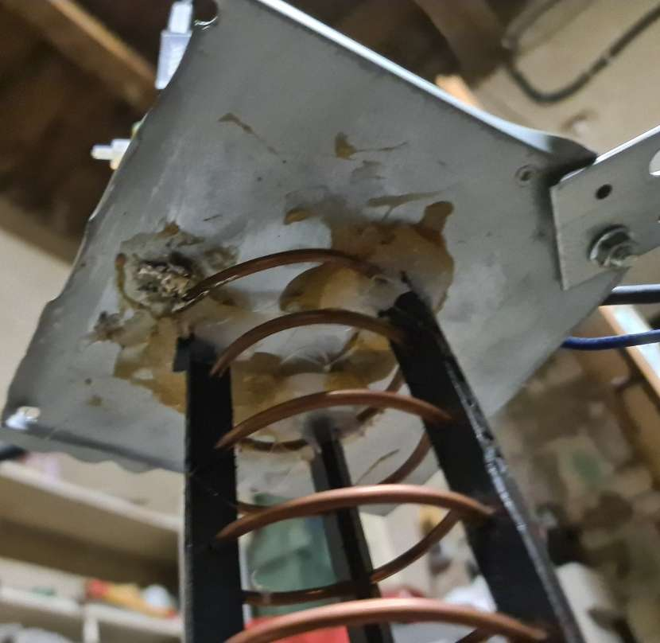
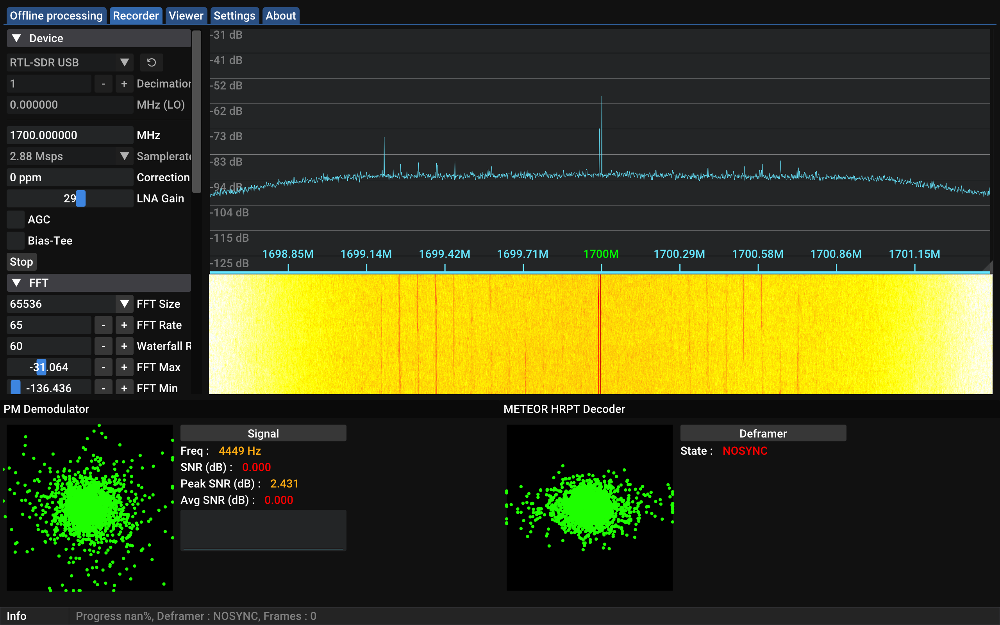
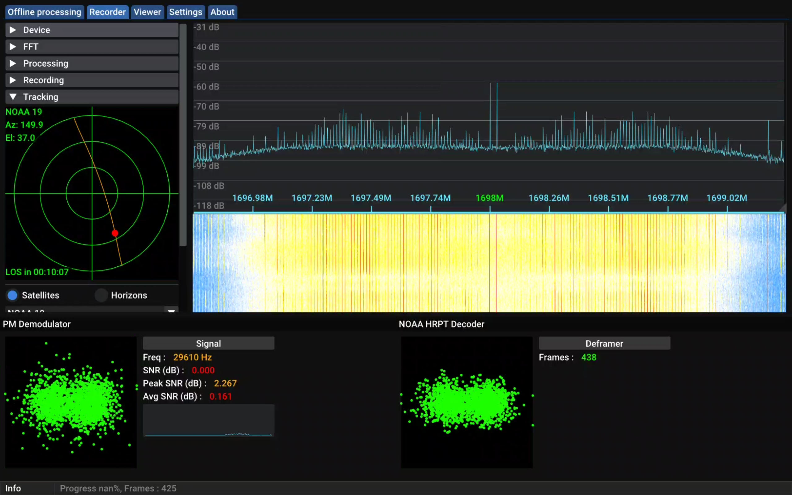
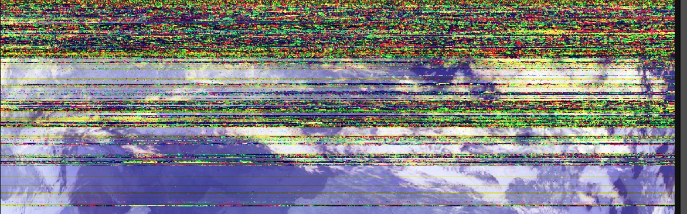
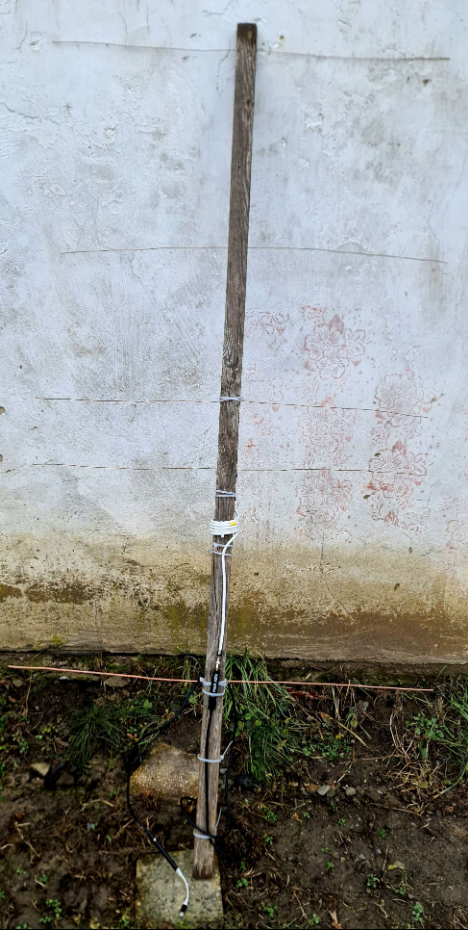
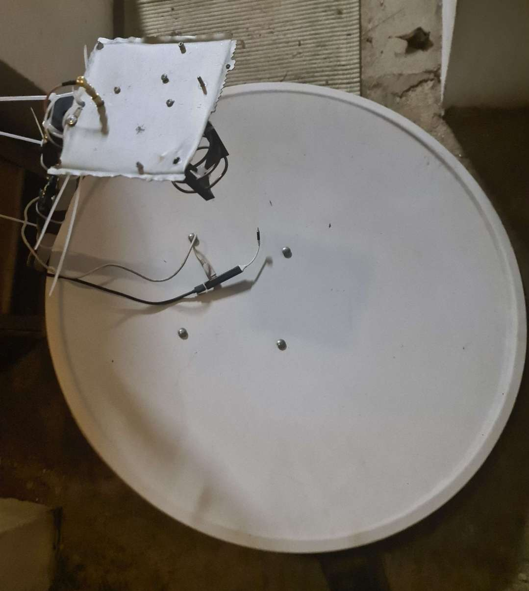
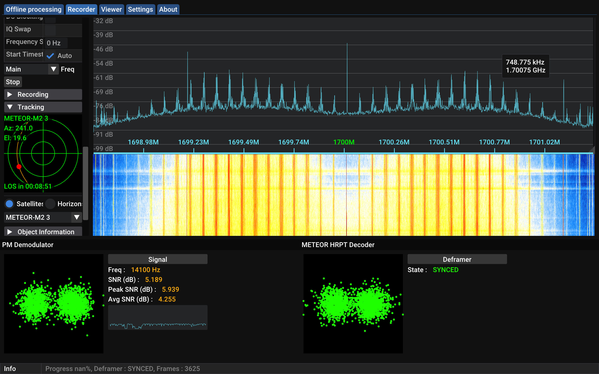
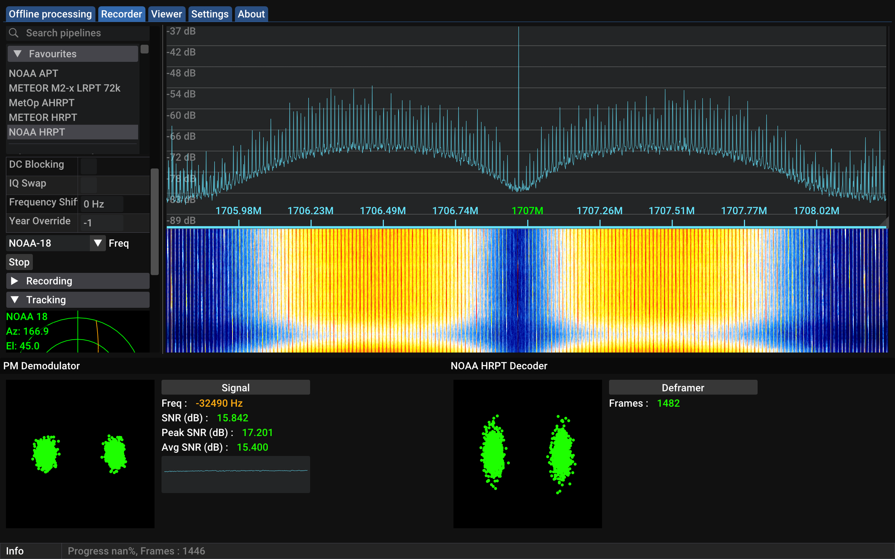
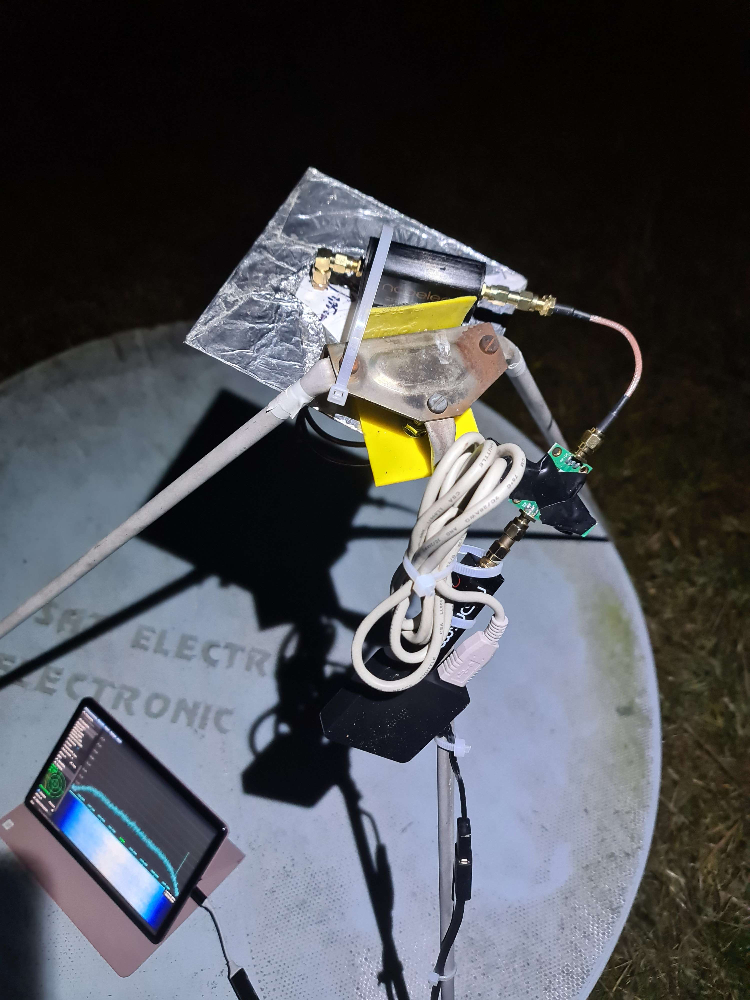

# Preamble
This file will describe the journey I have taken myself on into the radio rabbit hole, the highs and lows and everything inbetween. Why you would want to read this? I got no bloody idea, I definitely will at some later point in life.

# Initial exposure
I initially got introduced to radio as a concept beyond AM/FM with an incredibly interesting [presentation](https://www.youtube.com/watch?v=gMwciWchH3Q) on YouTube back in 06/2023. My interest was immediately piqued, SDR looked like a fun thing to do. I didn't give it much thought, since resources for learning anything are extremely far and apart.

# The start of the tomfuckery that was about to ensue
While just idling on Discord back in 09/2023, I saw someone post a picture of an APT broadcast, which instantly made me rememmber the presentation I watched months ago. I went ahead and messaged them, `somerandomdragon`, in dms with the usual questions hows and whys.

Being able to talk to an actual person about this was a gamechanger, he helped ime with the most basic concepts - what an SDR is, what the received imeages are and how it is possible to receive them in practice etc. This led me to buy a Nooelec Smart SDR V5,the SDR I use to this day. I bought it from a second hand market (I believe the person selling it runs a shop or something of that matter, given that it was packaged professionally), managed to get a reputable brand with a good SDR without much research. It has proven to be reliable and - as will be explained later - maybe even rare.

# Rough beginnings
At first, I went by the definition of what an antenna is - "Any conductive wire" - and stuck a wire right into the SMA port with the second end wrapped around the core of my old DVB-T antennas coaxial cable. I will spare you the images for the sake of keeping your sanity, long story short it didn't work and in retrospect remains to be one of the dumbest things I have done.

I then proceeded to buy a wideband LNA and actual conenctors in hopes of being able to use my DVB-T antenna for this stuff, that went about as well as you can expect.

To sum it up, I was several days and euros down with nothing but static in results. The main reason for this was following old guides with inadequate equipment, which continued for a bit.

# First images
After a bit of time and research, I finally realized, that using a DVB-T antenna for satellites isn't going to work, LNA or not. Instead of chasing rainbows I finally made a V-dipole, except it was on a two metre stick and hanging from my balcony. This resulted in my true first APT, but given that I only barely heard the carrier wave for a few seconds I don't think it should count.

My main issue was LOS - I could see the satellite just for a very short time while it was overhead with the patent pending stick setup. After a bit of thought, I realized, that I could use a pole at my cottage as a stand for a tall V-dipole which would have GREAT LOS with the sky. Some zipties and gluing stuff together later, I got this:

*NOAA 15 received on 13/10/2023 @ 7 PM. Received using a V-dipole. Decoded using SatDump. (Allignment algorhythm couldn't handle the scan motor issues)*

What at a first look is a horrendous image showing no useful information remains one of the best APT transmissions I have gotten **EVER** when considering the length and cleanliness. How a V-Dipole managed to get no nulls is beyond me. 

NOAA 15 was having some *major* scan motor issues at that time, causing the glitching present. I managed to get a few other satellites just after though: most notably Noaa 19 passing right behind NOAA 15:

*NOAA 19 received on 13/10/2023 @ 7 PM using a V-Dipole. Decoded using SatDump.*

After all this time and effort, finally a worthy image. It's at about this time, that I had joined the SDR++ and SigIdWiki Discord servers. They told me how god awful and outdated my software setup was, which they were right for doing so. After downloading SatDump and SDR++, everything instantly became *way more streamlined.*

# First portable images
I spent a lot of time outside in the late evenings during this initial weekend, sitting in a lawn chair with a headlamp like a complete madman trying to pull pictures off of tincans flying 600 km above me. Try explaining THAT to your parents!

After the weekend was over I took the antenna down (So it wouldn't get struck with lightning or something, it was basically a big lightning rod connected to my laptop) and went back home. After some thinking and discussion with the others, I made my first potable V-dipole, two copper wires... nailed to a wooden board *\<facepalms\>*.

The results were filled with static, absolutely useless for any real usage.

After removing the wires from the bloody wooden board and instead just holding the cables using the terminal, I got some half decent albeit not great images.

*NOAA 18 received on 25/10/2023 using a V-Dipole. Processed using SatDump.p*

# What's next?
Having received APT and knowing that LRPT was out of reach due to Meteor-M N2-3 being a bloody cripple (Its VHF antenna hasn't been deployed properly, making the signal much weaker than intended), I felt like I have conquered VHF. I didn't do much for the next two months, boy oh boy did December get busy.

# Growing ambitions
After doing APT, the next logical step was doing HRPT. This seemed like an infeasible goal, given the additional equipment and skills needed... so I went and did it anyways.

Initially, I thought the old Wideband LNA was going to be good enough to get SOMETHING at the very least, given that I had an above average sized dish (90cm). This, as everyone was warning me, turned out to be false.

# First L-band attempts
My setup was nothing short of jank galore. Awful helix, LNA and SDR sticking out the rear like a sore thumb, piss poor soldering job and god awful tracking skills got me what I deserved: disappointment.

It felt like the signal was just out of reach; I could even see the bloody carrier! (Spoiler: It wasn't. It was far, far out of reach.)

*Pictured is SatDump, on the god awfully set up FFT you can see the barely visible carrier and spikes indicative of the BPSK HRPT broadcast I wanted to get.*

I initially believed it was a helix issue, which it partially was - I put glue all over it disregarding the fact **it was the secondary reflector that should be as clear as possible to be as effective as possible**. After putting a lighter to a knife and melting some of the hot glue off, redoing the solder job and mounting the SMA port to the reflector properly using an SMA nut (Thanks for the suggestion, Ryzerth), the signal grew strong enough that I even managed to get a few frames!

This got me my first official HRPT image: Drumroll please...

*NOAA 19 HRPT received on 31/12/2023 using a 90cm dish and a generic wideband LNA. Decoded using SatDump, median blur and equalization applied. No idea which composite.*

A terrible image, go figure! At this point I gave up on trying to get this generic POS to work, instead ordering a SawBird GOES+ off of Amazon.

# VHF part two: The electric boogaloo
Instead of waiting for the LNA to arrive, I decided to fill the time with some good ole VHF! At first I tried to put the old & tall V-dipole fixture back up, but I quickly realized that that ship has sailed - my neighbor had plugged in some goofy chinese power supply that was spewing RFI all over the bloody spectrum, making it impossible to get any usable results. I tore it down, laying down on my bed in defeat.

I wasn't going to spend the whole winter just laying around though, I thought of an old attempt of mine: A Yagi-Uda antenna. I made one back in October using the same big stick, got no results with it and used it a total of two times so I didn't bother mentioning it here. But now, I could make it **much better** with more space to move around than my balcony (The thing is circa two metres long and a metre wide, good luck manouvering that in a small apt. balcony!)

I then created this beauty:

What it doesn't make up in looks it makes up tenfold in performance - I managed to get the **best** APT and even LRPT to date, the antenna providing some stunning results:

*APT image received using a 5 element yagi on 02-01-2024 from NOAA 18, processed using Satdump with the `WXtoImg HVC N18` RGB composite. Equalized.*

*LRPT image received using a 5 element yagi on 02-01-2024 from Meteor M2-3, processed using Satdump with the `221` RGB composite. Equalized.*

# L-band part two: The electric boogaloo
After having my fun with VHF, my Sawbird had arrived: It was time for action. Whipping my old setup out with the remade helix, I connected a short SMA cable wire to the helix and my new SawBird to it, something that at the time seemed sensible (Spoiler alert: It wasn't.)

I initially thought I was about to get the stunning images that HRPT promised, but as it turned out...

*You can see that I was getting a few DBs, MUCH better than before! Something was wrong though..*

*NOAA 19 received on 12/1/2024 using a 90cm dish, a SawBird GOES+. Processed using SatDump with the `543b` RGB composite.*
*The image is not directly related to the Satdump screenshot above, bthe same symptoms presented so the image is still relevant though*

Absolutely terrible. I was supposed to be getting gorgeous high res images, not this cut up junk! What was I doing wrong?! Pass after pass I got the same disappointing results, just as I was losing hope thinking that this was as good as it gets I did the bold thing of **removing the cable and connecting the LNA directly to the helix.**

The first pass after, lo and behold:

*16 dB! This is more than enough for a gorgeous image and decode, an incomparable improvement!*

*NOAA 18 receuved ib 13/1/2024 using a 90 cm dish and a SawBird GOES+. Processed using SatDump with the `221` RGB composite. Equalized.

Gorgeous image after gorgeous image, this is where my HRPT journey truly started.

# Golden times of HRPT

*NOAA 19 received on 14/1/2024 using a 90 cm dish and a SawBird GOES+. Processed using SatDump with the `NOAA Natural Color` RGB composite. Median blur applied, equalized.*

The last thing I intended to try was to get geostationary satellites, this turned out to be fairly difficult on the 90 cm dish, as the signals are very weak and the geostationary satellites are very low over the horizon. The only real satllite I could have tried was Elektro-L3, which I did:

*Elektro-L N3 LRIT received on 14/1/2024 using a 90 cm dish and a SawBird GOES+. Decoded using SatDump. Pictured is the autogenerated `NC` (Natural Color) composite.*

Besides the blue line caused by me moving just the slightest bit, this is by far the coolest thing I have done to date.

# 125 cm dish
After doing all of this, I decided it was time to move on from the 90 cm dish - while it was great for HRPT, it just doesn't cut it for higher bands and geostationary satellites (See the blue line). After looking at second hand markets for weeks I found TWO people selling dishes larger than 100 cm - One guy selling it for ~50€, and one selling it for 5€ with a kjghillion grammar errors in the title. I think you can guess which one I hit up.

After receiving the dish and mounting my hrpt setup to it with a brand new helix, I managed to get a much stronger LRIT broadcast (8 dB compared to just 3 dB prior), HRPT went up to 20 dB from 15 dB. It is definitely needed for what's to come (:

*A picture of te new helical feed, with a much higher production quality*

*My current HRPT setup, all wired up and ready for the next pass*

As for the results:

*Elektro-L N3 LRIT received on 11/2/2024 using a 125 cm dish and a SawBird GOES+. Decoded using SatDump. Pictured is the autogenerated `NC` (Natural Color) composite. Fun fact: This was taken in the middle of a rainstorm with a plastic bag over the SDR and an umbrella over my head. It was just as clunky as you expect.*

# The end

And this is where we are at right now! I intend to try S-band versy soon, have an MMDS ready for a satellite reception mod and am currently waiting for N-connectors to arrive. With some hope, I will be able to get sun images and GAC before the end of February (:

o7
