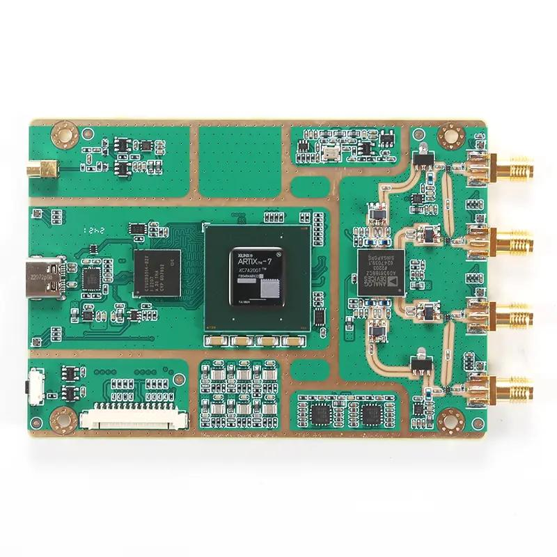
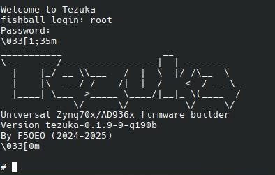

# Preamble

HamGeek has recently begun selling cheap SDRs capable of very respectable sampling rates, however they require some tinkering to get started with. The original line sold by LibreSDR has recently grown in popularity as well, often leads to confusion due to the similar design and naming. 

The goal of this guide is to make clear what the differences between these are, what variants are available, and how to get them to perform the best they can.

> Huge thanks to @mothmaux for helping with the different variants as well as overclocks, this article wouldn't exist without him.

# Variants

These SDRs all come with an AD9363 or AD9361 tuner, which are rated at up to 61.44 Msps with a range of 70 MHz - 6 GHz
 
> Note: AD9363 is officially rated as 325 MHz - 3.8 GHz, but still work at the same range as the AD9361 albeit at a reduced sensitivity.

There are two major manufacturers of the SDRs which are very often confused: 
- The original PCB design - **LibreSDR**
- The newer and cheaper design - **HamGeek**, nicknamed "Fishball"


**HamGeeks** use a more modern design with some cheaper components that reduces the manufacturing cost. This is at the expense of some sensitivity and reliability at high sampling rates, but at the benefit of very competitive pricing. Most notably they use the AD9363 tuner which perform a bit worse than the AD9361 of LibreSDRs.

---

What sets the SDRs apart from one another is the **CPU chipset**, which can bottleneck the maximum stable sampling rate due to limited bandwidth. There are 2 CPU series that the SDRs are sold with:

- B2x0 (B210/B220) - These are more expensive, but can do high sampling rates out of the box without any tinkering.
- Zynq 70x0 (Zynq7010/Zynq7020) - These require overclocking and a few tweaks to perform well, but it's nothing complex! 

> Note that the HamGeeks support significantly higher overclocks than the Zynq70x0-based LibreSDR.

The specific SDRs from both manufacturers are:

## HamGeek (Fishball)

- These can be purchased from both their official [website](https://www.hgeek.com/) in addition to their AliExpress [store](https://www.aliexpress.com/store/1102732208).

<br>
*Zynq7020-based HamGeek*
 
### Zynq 7010

- €99 [Official store](https://www.hgeek.com/products/hamgeek-70mhz-6ghz-zynq7010-ad9363-sdr-software-defined-radio-development-board-for-pluto-sdr-matlab?_pos=3&_sid=4fa857b41&_ss=r)
- €108 [Official store](https://www.hgeek.com/products/hamgeek-70mhz-6ghz-zynq7010-ad9363-sdr-software-defined-radio-development-board-with-shell-for-pluto-sdr-matlab?_pos=2&_sid=ac829a74d&_ss=r) - With case
- €113 [AliExpress](https://www.aliexpress.com/item/1005008303508008.html)

This is the cheapest variant of these SDRs, being available for as little as €99 from the official store. Most people have achieved around 35 Msps stable, though the maximum sampling rates appear to be based on silicon lotteries. Please note that the version with the case is known to have issues with oscillations, purchase some RF-absorbing foam and put it inside if possible.

Some people have suffered from QC issues when buying this particular variant, please bear this in mind before purchasing.

### Zynq 7020

- €115 [Official store](https://www.hgeek.com/products/hamgeek-70mhz-6ghz-zynq7020-ad9363-sdr-software-defined-radio-development-board-for-pluto-sdr-matlab?_pos=1&_psq=zynq7020)
- €150 [AliExpress](https://www.aliexpress.com/item/1005008162884638.html?)

This variant is able to pull around 45 Msps without drops for most people, is able to do it more reliably than the Zynq7010-based variant. Being priced just above the Zynq7010 and being sold with included cooling, it is arguably the recommended option. 

Please note that it has fragile surface-mounted components but is sold without a case - I have designed one for it that can be 3d printed, you can find it [here](https://www.thingiverse.com/thing:7207664)

### "BlackSDR" - B210 mini

- €286 [Official site](https://www.hgeek.com/products/%E6%B5%8B%E8%AF%95-hamgeek-b210-mini-ad9361-software-defined-radio-sdr-replacement-for-hackrf-plutosdr) - BlackSDR

Hamgeek also sells two versions of the B210 mini line of SDRs on its website - a drop-shipped LibreSDR and a "BlackSDR". The former version is just a more expensive LibreSDR, the latter version has an older PCB design and is more expensive than the LibreSDR - there is absolutely no good reason to get it. These are only included here for the sake of making this list exhaustive.

## LibreSDR

- These can be purchased from the OpenSourceSDRLab [website](https://opensourcesdrlab.aliexpress.com/store/4586015) in addition to their AliExpress [store](https://opensourcesdrlab.aliexpress.com/store/4586015).

 <br>
*B210-based LibreSDR without a case*

### Libre (Zynq) 7020

- €135 [Official site](https://opensourcesdrlab.com/products/libresdr-zynqsdr-ad9363-zynq7020)

Functionally identical to the HamGeek Zynq7020, but performs better since it uses higher quality components as well as the slightly more sensitive AD9361 tuner. An AD9363 version is also available, but there's really no good reason to get it.

### Libre B210 mini

- €260 (-Tax, Ali deducts it) [AliExpress](https://www.aliexpress.com/item/1005009175308561.html)
- €207 (+Tax) [Official site](https://opensourcesdrlab.com/products/libresdr-b210-mini-ad9361)

This SDR variant comes with improved USB 3.0 connectivity which allows it to reliably pull a full 61.44 Msps even without overclocks. 

@mothmaux has managed to create an overclock for the device, which allows it to run at higher sampling rates. As of writing this article, the largest reported stable sampling rate is ~100 Msps. Please note that, as the README says, this overclock voids your warranty and can damage your device. It is available [here](https://github.com/MothMaux/uhd-oc)

### Libre B220 mini

- €270 (-Tax, Ali deducts it) [AliExpress](https://www.aliexpress.com/item/1005007542400624.html?)
- €233 (+Tax) [Official site](https://opensourcesdrlab.com/products/libresdr-b220-mini-ad9361)

Effectively the same as the B210. Only real benefit is a more powerful FPGA for development purposes (modding), but you most likely won't need it.


# Accessing the SDRs

> This doesn't apply to B2x0 SDRs!

Since the Zynq70x0-based SDRs are essentially small computers, they have a fully fledged Linux shell inside that you can SSH into. This is usable, for example, to set the Ethernet IP using `ifconfig` commands.

> The user account is `root` and the password is `analog` in all major firmware.

To access this shell you can use:

## Standard Ethernet

If plugged into a DHCP-capable device, the SDR assigns itself an IP that you can use as `ssh root@<ip>` like any other computer.

## Ethernet over USB

When plugging the SDR in using the standard USB port, you should see a new network connection pop up with the IP `192.168.2.1`, said IP is the IP of the SDR. You can log into it using `ssh root@192.168.2.1`.

## Debug USB

If all else fails or you messed some configs up, you can always use the JTAG USB port marked as `Debug`. You can plug into it and use the TTY to log into the shell following onscreen directions. To use the TTY you can use a program like `picocom` as such: `sudo picocom -b 115200 /dev/ttyUSB#` where `#` is the number of the SDR's TTY. 

> It's usually `/dev/TTYUSB1`.


# Getting the high sampling rates

> The B2x0-based SDRs can do high sampling rates out of the box, this heading only applies to the Zynq 70x0-based ones.

When you first unbox the SDR and plug it in, it is likely to not be able to do much more than some 10 Msps. This is, because the stock firmware is quite limiting - the AD936x tuner can do much better. We can push it by doing the following:

## 1. Installing custom firmware

To access to some features, we can first install custom firmware, most notably [Tezuka](https://github.com/F5OEO/tezuka_fw/) which is what this guide will focus on. Most notably it includes

To install it:

#### 1. Head to the [Releases](https://github.com/F5OEO/tezuka_fw/releases/latest/) page and select your SDR accordingly

> Note that `fishball` refers to Zynq 7010-based HamGeek SDRs, `fishball7020` refers to Zynq 7020-based HamGeek SDRs, `libresdr` refers to the Zynq 7020-based LibreSDR

#### 2. Remove the SD card from the SDR

While some guides recommend you flash the SDR, it is a dangerous process that can lead to you bricking it. Using the SD card is 100% safe.

#### 3. Unzip the contents of the file you downloaded onto the SD card

Back the original ones up in case you ever need them.

#### 4. You are done!

Upon restart, the SDR should prompt you with the Tezuka logo on the shell and the website (accessing the IP or `fishball.local`) should show Tezuka firmware.



## 2. Use CS8 streaming

Tezuka exposes the AD936x chipset's ability to stream at a CS8 bit depth, this lowers the dynamic range of the SDR at the benefit of doubling the maximum sampling rate: it normally uses CS16, which streams 16 bits per sample whereas CS8 only steams 8. You won't be able to see a difference in the vast majority of use cases, 

Using this setting effectively doubles the sampling rate, as you only use half the data rate. 

## 3. Use the Ethernet port

The Zynq based SDRs only have a USB 2.0 chipset limiting the throughput at just 480 Mbps, making the maximum theoretical sampling rate just 30 Msps on CS8! You should ALWAYS use the Ethernet connector with a gigabit cable, preferably connected directly to your computer to reduce interference.

When using directly, you must set the IP manually on both the SDR and your computer:

On the SDR:
- Run `ifconfig eth0 192.168.1.10`

On your computer: 
- Gateway: `192.168.1.1`
- IPv4: `192.168.1.99`
- Netmask: `255.255.255.0`

You can make the SDR-side config persistent by following [this article]({{site.baseurl}}/docs/Radio/Persistent hamgeek ethernet IP).


> Warning: Even though apps might mark the SDR as using `IP`, you might be using the Ethernet over USB feature! I personally recommend you always just plug into the JTAG port, since that doesn't create said interface preventing possible confusion.

## 4. Overclocking

Tezuka allows us what every PC enthusiast salivates at the thought of: **overclocking**. It is done by modifying CPU and RAM multipliers, which, when multiplied by 25, give you the target clock speed in MHz. Future numbers will be said multipliers unless stated otherwise.

By default, these SDRs have their CPU run at just 750 MHz (30x) and the memory at 525 MHz (21x), the goal is to push it as high as possible where it still boots but does not kernel panic.

> Please note that you should absolutely use heatsinks with a fan when doing heavy overclocking!

Thanks to @mothmaux managing to reverse engineer how the overclocks are applied, he has created [this repo](https://github.com/ModderMax/O-C-Scripts-for-Tezuka_FW) which contains some premade files for all relevant Tezuka firmware variants, including a script to create your own.

To overclock the SDR:

#### 1. Remove the SD card from the SDR
#### 2. Replace the BOOT.bin file with an overclock file
#### 3. Put the SD card into the SDR, start it up
#### 4. Increment the sampling rate in SatDump until you begin seeing `PlutoSDR underflow!` errors. 

- These occur when you drop a sample. Pick the sampling rate closest to it that doesn't have these periodically appear.

> Make sure your computer is running in high performance mode and is under the lowest load! Use Linux if able.

#### 4. SSH into it and watch the terminal for kernel panics
#### 5. Depending on the result:
- If the SDR remains stable after a few minutes without underflow errors, you can bump the overclock up
- If the SDR underflows, use a lower sampling rate. If it's too low for your liking, increase the overclock or make sure your computer has enough resources for the chosen sampling rate. If possible, use Linux.
- If the SDR suffers a kernel panic and restarts, lower the overclocks


> Please note that the SDR might not boot at all with the blue `DONE` LED never lighting up, this happens when an overclock you selected is too large. Use a lower one until it's happy again.

Repeat this process until you find the 'wall' - place where you can't go higher with overclocks because of kernel panics. If the SDR runs for a few minutes without dropping samples, congrats! You have successfully overclocked the SDR.

# Common issues

## No boot, error over console

> Massive thanks to r1chae for providing this fix!

```
U-Boot 2016.07 (Nov 17 2025 - 14:29:18 +0000)

I2C:   ready
DRAM:  ECC disabled 1 GiB
MMC:   sdhci@e0100000: 0
SF: Detected W25Q128BV with page size 256 Bytes, erase size 4 KiB, total 16 MiB
In:    serial@e0001000
Out:   serial@e0001000
Err:   serial@e0001000
Model: FISH Ball SDR Board (7010-AD9363)
Net:   ZYNQ GEM: e000b000, phyaddr 0, interface rgmii-rxid

Warning: ethernet@e000b000 (eth0) using random MAC address - 46:70:c2:01:b6:ee
eth0: ethernet@e000b000
Hit any key to stop autoboot:  0 
ethernet@e000b000 Waiting for PHY auto negotiation to complete......... TIMEOUT !
Wrong Image Format for bootm command
ERROR: can't get kernel image!
FISHBALL> 
```

This happens when the U-boot environment gets corrupted for whatever reason, will persist through different firmware installs. The issue presents itself as all LEDs having a solid glow, with the SDR never popping up on your computer.

Please note that I only know of this issue happening on Zynq70x0-based boards, have no idea if it is possible to occur on B2x0-based ones. To fix it:

#### 1. Plug a USB cable into the JTAG (Debug) USB-C port

#### 2. Access the debug console

As is described earlier, the JTAG USB port exposes a 115200 baud TTY, access it via a command like `picocom`

> i.e. `sudo picocom -b 115200 /dev/ttyUSB1`

#### 3. Write the following commands:

```
env default -a
saveenv
reset
```

This should reset the environment into a working state, the SDR should reboot normally.

---

You should now be good to use your SDR with the optimal performance. Have fun!

