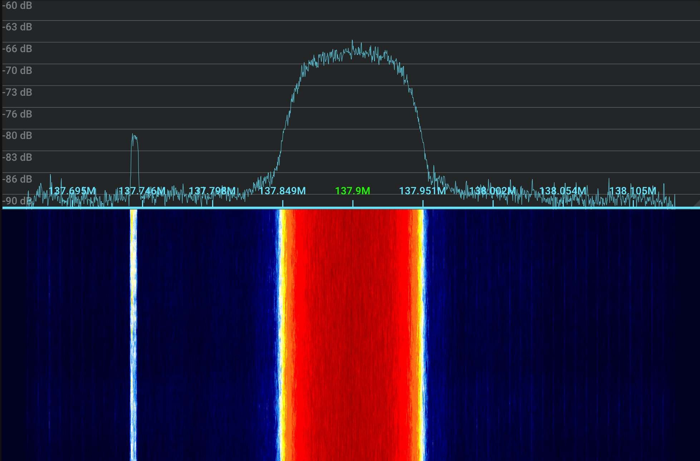
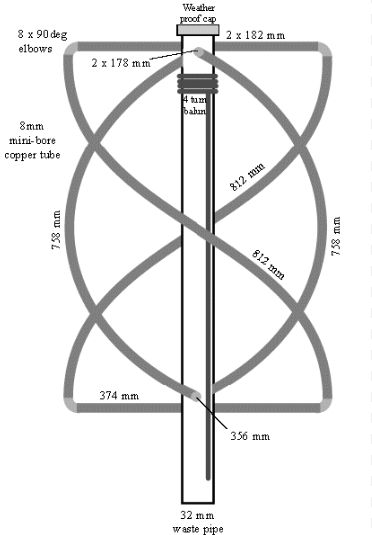

## Table of contents
{: .no_toc .text-delta }

1. TOC
{:toc}

[//]: # (NOTE: I have explicitly requested permission from lego11 to use his guides as a refernece, he said he's cool with it. I owe that man half the shit I know)

# Preamble

> NOTE: NOAA POES has been permanently retired because of political reasons. They will be greatly missed. A historical version of this guide with NOAA APT can be found [here](https://static.cpt-dingus.cc/archived-blog_page/Beginners%20guide%20to%20weather%20satellite%20reception%20_%20Meti%e2%80%99s%20blog.html). This link is permanent.

Before anything, I have to start with some credits:
- ***[Lego11's articles](https://a-centauri.com/articoli/)***
- ***The [Dereksgc](https://discord.gg/b375hYqUxh) Discord***
- ***The [SDR++](https://www.sdrpp.org/) Discord***

I learned almost everything you can read here from the places linked above, I can't express enough gratitude towards everyone who helped me start out with this niche hobby. If you are ever curious about this topic and wish to learn more, be sure to visit these, the people you can meet are incredible.

# Introduction

While you have certainly seen imagery gathered by satellites before, did you know that you can receive it by yourself with very little effort? The purpose of this guide is to show you how the broadcasts work, how you can receive them in practice in an easy-to-understand and approachable way.

## How can I receive data off of computers when they're flying hundreds of kilometers above my head?

Satellites use the same method as your regular old FM station to transmit their data, **radio waves**! Of course, you aren't able to just tune to a frequency on your car radio and start getting images, this is because it lacks the hardware & software needed to decode and process satellite signals.

To receive satellite signals *(among other things, an SDR has a wide range!)*, you can use a **Software Defined Radio** [SDR]. This is a device, that - unlike conventional radios - *uses **software** to perform radio-signal processing*. You usually plug these into a computer and use software like [SDR++](https://www.sdrpp.org/) to operate them.

> If you ever used a DVB-T tuner, it might have even had SDR capability - some RTL chipsets come with an SDR mode!

The actual reception process is also not as daunting as it might seem! In essence doing so is no different from listening to an FM station, it only happens with different hardware and at a different frequency... with the transmitter flying 800 km above your head. The most difficult part is gaining knowledge about this hobby, which is the reason I wrote this guide.

## Why should I do this?

There is no definitive reason for trying this niche hobby out - you can do it for **research** (The satellites send much more data than just imagery after all), to **kill boredom**, or just to **share the images online** - they are quite pretty after all!

## What is covered by this guide?

This guide covers weather satellite reception in the easier to receive **VHF satellite band (~137 MHz)**, which contains imagery at a (JPEG-compressed) 1 km/px quality. 

You can also find a guide on how to receive a more difficult but more interesting **L band satellite band (~1.7 GHz)** [here]({{site.baseurl}}/docs/Radio/L band weather satellite reception guide). Said band contains imagery from not just low-earth-orbiting satellites, but also geostationary satellites providing full disk Earth imagery. The prevailing resolution is roughly 1 km/px but can get as high as 500 m/px with American GOES satellites.

These aren't the only bands that weather satellites broadcast in, but are by far the easiest to receive imagery in both due to physical constraints and commercial availability. Other bands range from requiring a simple LNB (C band) to year long endeavors that require a lot of dedication and individual research. *Looking at you, X band!*

## Sample processed image
> Note: The map was added in post-processing.

*Meteor M2-3 LRPT received on 02/01/2024 using a 5 element yagi-uda antenna. Processed using SatDump with the `221` RGB composite. Equalized. 65% quality lossy JPEG compression with 0.05 gaussian blur applied, click [here]({{site.baseurl}}/assets/images/Radio/LRPT-Sample-image.png) for the full resolution image.*

# Glossary

Understanding the terminology used in satellite reception is essential, especially if you aren't familiar with radio. Below, you can find a list of new terms you are likely to encounter while doing this hobby. Any other unknown terms will have a definition pop up when hovering over them.

### Hardware terms
- **SDR** - Software Defined Radio → A device used to translate radio waves into digital data
- **LNA** - Low Noise Amplifier → A tool used to amplify radio signals

---

- **SMA** → Type of connector used by most SDRs

### Abstract terms

- **Pass** → Refers to the time when you can see a satellite passing overhead, used with orbiting satellites
- **Elevation** → Height of a satellite above the horizon
- **Azimuth** → Compass heading
- **AOS** - Acquisition Of Signal → The moment when you start getting a signal from a satellite
- **LOS** - Line Of Sight / Loss Of Signal → Depending on the context this abbreviation is used in either describes your ability to see the satellite, or the moment when you stop getting a signal from a satellite

---

- **LEO** - Low Earth Orbit → Refers to objects orbiting the earth at an altitude of less than 2000 km

---

- ***RX*** → Shorthand for "Receive"
- ***TX*** → Shorthand for "Transmit"

###  Software terms
You'll likely meet these terms when using SatDump and other SDR programs.

- **SNR** - Signal to Noise Ratio → A calculated value describing how strong a signal is, usually expressed in dB
- **AGC** - Automatic Gain Control → Automatically sets the gain based on your reception conditions
- **FFT Spectrum** → The slice of the radio spectrum being sampled by your SDR
- **FFT Waterfall** → A visual representation of the spectrum throughout time, almost always found right below the FFT Spectrum
- **Noise floor** → The bottom of your FFT Spectrum, excluding any radio signals

---

- **FEC** - Forward Error Correction → Code that tried to fix errors in data, most common type is [Reed-Solomon](https://en.wikipedia.org/wiki/Reed%E2%80%93Solomon_error_correction)
- **BER** - Bit Error Rate → How many bits were incorrect within one frame of data. Usually expressed in a decimal point (i.e. 0.01 = 1% of data has errors).

---

- **Interference** → Commonly referred to as RFI (Radio Frequency Interference), is an umbrella term for unwanted signals produced by erroneous sources such as cheap power supplies, HDMI cables, and devices such as laptops (USB RFI @ 480 MHz)
- **Overloading** → Occurs when your gain is set too high and/or you are near a very strong broadcast. Presents as any of the following:
    - Your noise floor jumping or being unstable
    - Spurs of interference throughout your spectrum
    - Signals that shouldn't be there (i.e. broadcast FM in satellite bands) that don't move consistently with your tuning direction (If you tune right [up], the signal moves left [down])

---

- **TLE** - Two Line Element set → A format used to describe the location of objects in space, is used to calculate the position of satellites

### Data related terms

- **DB** - Direct Broadcast → A signal that is transmitted constantly, directly from the instruments (Without processing from a ground station)
- **Rebroadcast** → A signal that is transmitted down to earth in a different band/time period, processed by a ground station, then uplinked to the satellite to be rebroadcasted. An example is xRIT.
- **Dump** → A signal that is transmitted to a specific ground station at a specific time - has a beginning and an end

# Mistakes and pitfalls
This is a list of mistakes I made that ended up in wasted time, avoid them for the sake of saving you a headache or two

- **Using old, outdated guides and software** → Radio is very niche, the majority of guides you can find online are heavily outdated giving you bad advice and suggesting deprecated software, leading to confusion and subpar results. Please make sure that any sources you use are up-to-date.

- **Compass tracking with directional antennas** → Due to inaccuracies in your phone's compass and differing real world conditions, you should always try to go by signal strength instead of tracking by elevation and azimuth. Use apps to find the general direction of the satellite, move your antenna around until you see the signal. Once you see the signal, move slow and with purpose to have the signal be as strong as possible.

- **Doppler tracking when it is not needed** → Some older guides feature doppler tracking - shifting the frequency throughout the pass to keep the signal centered. All signals described in this guide do NOT require any such tracking to be performed, doing so can only hurt your reception.

> Doing the above is especially hurtful with LRPT, as your machine knows where the signal is by using a costas loop, changing the frequency makes it momentarily lose its lock causing data loss. 

- **Blindly maxing the gain setting** → Upping the gain only makes signals stronger up to a certain point, after which it starts amplifying the noise floor much more than actual signals. This can drown them out due to overloading, as well as damage the signal's quality due to your SDR saturating. Turn it up only until you see, that the signal isn't getting any stronger or no overloading is present, whichever comes sooner.

# SDR specific information

These are things you should know about when using some specific SDRs:

## RTL-SDR
These apply to all SDRs using RTL chipsets (RTLSDR blog, Nooelec SMART...)

- This band does not require anything more than **2.048 Msps**, using a higher setting can lead to sample drops due to instability.

## HackRF One
- ***DO NOT USE THE `Amp` (preamplifier) OPTION!!!*** The preamplifier is flawed, can get killed **very easily**. An exception to this is when you're using **Clifford Heath's [redesign](https://www.aliexpress.com/item/1005005351172184.html)**, which adds several protections making the preamplifier safe to use.
- The HackRF has a fairly outdated design which suffers from heavy phase noise. This means, that you have to receive signals stronger than other SDRs to achieve the same quality.

# Preferred software
The best program for **decoding data** from satellites is arguably [SatDump](https://github.com/SatDump/SatDump/releases). It is an open source project that has everything you will need, and then some.

> Always download the latest nightly build of SatDump, make sure to update it frequently. It's in active development, has new additions on a daily basis.

---
 To **track satellites** and figure out their future passes (Most are orbiting the Earth after all), you can use these:

Cross-Platform:
- [SatDump](https://github.com/SatDump/SatDump/releases) - Windows, Linux, macOS, Android - SatDump has an inbuilt module you can use for tracking found in the `Recording` tab. **It can only track one satellite at a time, doesn't do long term predictions.**
- [N2YO](https://n2yo.com/) - Web - Does the job, however lacks the polish of other apps

PC:
- [Gpredict](https://oz9aec.dk/gpredict/) - Windows, Linux, macOS - A relatively young tool, arguably the best choice for tracking on your computer
- [Orbitron](http://www.stoff.pl/) - Windows, Linux (wine) - Quite dated but functionally sound

Mobile:
- [Look4Sat](https://play.google.com/store/apps/details?id=com.rtbishop.look4sat&hl=en&gl=US) - Android - Provides everything essential in a simple UI.

There are a few apps for IOS, but they have severe limitations. Using any of the above instead is heavily encouraged.

> **Make sure you update your TLEs** every few days/weeks, not doing so can make the satellite locations be outdated or just outright incorrect.

I personally use Orbitron for long term and Look4Sat for short term predictions, the SatDump tracking module while live decoding in case I lose track of the satellite.

# Using SatDump

This guide will focus on using **SatDump** for all recording and decoding purposes. Before we get to actual satellite reception, we have to familiarize ourselves with the SatDump UI. If you already have experience with it, feel free to skip this heading.

## Preparation for the pass

### Configuration

Before anything, we need to configure a few things in the `Settings` tab. Make sure to do the following:

**General SatDump**
- Set your location (QTH Longitude, QTH latitude)
- Hit the `Update` button on the `Update TLEs` line
- (optional) Disable `Automatically process products`

**Output directories**
- Set your live processing directory
- (optional) Set your baseband recorder directory

Once these are set, hit the `Save` button on the bottom of your screen, restart SatDump afterwards to make sure all settings are applied. You shouldn't have to reconfigure these again.

### Offline processing vs Recorder

When you launch SatDump, you initially face the `Offline processing` tab. This is where you can **decode <u>recordings</u>** in addition to semi-processed data (raw frames/binary etc.). We won't be using this tab very often, since we'll be using the **Live processing** feature instead, which decodes signals straight from your SDR eliminating the need to make huge recordings prior to getting data. We can find it in the `Recorder` tab.

> This tab might seem overwhelming at first, but don't worry; we'll cover it one step at a time.

### Selecting source

 Expand the `Devices` dropdown, this is where you will manage your **source** - where you are getting signals from. SatDump supports several inputs such as baseband recordings and various servers, we will be using your SDR. You can select it as such:

1. Reload the source list
2. Click on the dropdown
3. Select your SDR
 
 

> If your SDR isn't showing up, make sure that it is being recognized by your computer and that the drivers are installed properly. If it's visible by other programs but now SatDump, ensure all SatDump dependencies are installed.

Once you have selected your SDR, you can select a sampling rate appropriate for the signal you are about to decode; this depends on the symbol rate of the target signal. Your sampling rate should be **at least** roughly twice the <abbr title="How quickly the signal transmits data, expressed in symbols per second">symbol rate</abbr> of the signal. 2.048 Msps is perfectly adequate for VHF signals described here, while 2.4 Msps is enough for most L band signals. Please note that higher sampling rates don't hurt the signal as long as you don't begin to <abbr title="This is when your computer can't handle all the data coming from your SDR, loses some of it. It shows as spikes on the viterbi graph.">drop samples</abbr>.

> I.e. if a signal has a symbol rate of 1 Msym/s, a sampling rate of **at least** 2 Msps is recommended

You can now press `Start`, you should see a blue waterfall appear on the right-hand side of your screen (see image below). You can configure the gain slider(s) once you are ready to receive a signal.

### UI elements

Now that we have something to look at, we can break the UI down into a few different sections:

1. **FFT spectrum** - This shows the slice of the radio spectrum being sampled by your SDR. The higher a point is, the stronger that part of the spectrum is.
2. **FFT Waterfall** - This shows how the FFT spectrum has changed overtime using a color gradient. By default, blue is the weakest and red is the strongest.
3. **Frequency range** - This gives you a scale of what frequencies you're looking at.
4. **Status bar** - Shows what SatDump is doing right now, clicking it gives you a full log.

### Adjusting FFT

If we don't adjust the FFT settings, we won't see much happening on it; the default FFT range is set up to two extremes: -150 dB and 150 dB. To make sure we can actually see signals on it, connect your SDR to your receiving setup (antenna) and do the following:

1. Open the `FFT` dropdown
2. Select a reasonable FFT size (resolution), 16384 should be more than enough for most use cases 
3. Move the `FFT Min` slider until the *Noise floor* (bottom of the sampled spectrum) is just above the bottom of the window
4. Move the `FFT Max` slider until you have enough of a range from the *Noise floor*, that you will be able to see the signal at its maximum strength with a decent margin on top. You can also simply adjust it when a satellite is in view, since it has no effect on reception. Position it, so it's aesthetically pleasing to look at.
> I.e. if the noise floor is at -65 dB, you expect the signal to reach 20 dB, make the maximum -65 [Noise floor] + 20 [Maximum signal strength] + 5 [Margin] = -40 dB
5. Set the `Avg num` to anywhere between 10-50, it smoothens the FFT to make it more visually pleasing.

Your FFT should be configured properly now, here's an example of the same signal at 1691 MHz as seen above, but with a properly adjusted FFT:

*Everything tinted yellow here is a signal. We can now see the shape and strength of it.*

## Setting up tracking (optional)

If you set your location properly and your TLEs are up-to-date, you can use SatDump's `Tracking` dropdown to see the next satellite pass. It allows you to have the satellite's location in a convenient spot, eliminating the need for a second program running next to SatDump. To use it, choose the `Satellites` option and select the target satellite from the dropdown. You will now see a summary of the next pass.

The 'radar' is like a compass, where every circle is equivalent to 30° of elevation. The closer to the center a satellite is, the higher in the sky it is in the real life, with the center point being 90° - straight up.

  
*SatDump showing the next NOAA 15 pass*

## Using pipelines

Now that we can see what is going on in the spectrum, we can prepare and start a <abbr title="Think of this like a small 'program' - a pipeline is just a collection of steps that SatDump performs in order to get data out of a signal. Every signal has its own pipeline.">**pipeline**</abbr>! Once a pass is incoming, open the `Processing` dropdown and select the entry (pipeline) corresponding to your satellite pass, in this example I will choose `METEOR M2-x LRPT 72k` for Meteor M2-3 LRPT.

Once you configure it and hit start, a lot of things will pop up which will be different based on the satellite you are receiving. Let's break it all down:

On the bottom of your screen you can see the pipeline appear, it separates into two primary sections:
- The left side has information about **the signal itself** - How strong it is, where it is, its constellation 
- The right side has information about the **decoder** - If we are decoding a data, if error correction is working etc.

Now let's look at everything individually:

1. **Constellation** - Without going into much detail about radio theory, **the constellation is a visualization of the signal you are receiving**. It is helpful when determining issues with your reception, is able to tell much more than just by looking at the signal on the spectrum. It should match the modulation found right above it, in this case OQPSK = 4 dots in each corner. The smaller the dots are, the stronger the signal is.
2. **SNR** - How strong the signal is expressed in dB. This is just a calculated value, can be wrong! The constellation and BER are the ultimate judges of signal strength.
3. **Viterbi** - Without going into much radio theory again, the viterbi algorithm shows whether SatDump knows where the error correction bits are. It is useful when figuring out how strong a signal is (Lower BER = Cleaner signal), or if you are <abbr title="Spikes appear on the viterbi during the decode even while the signal strength is good (~ >5 dB).">dropping samples.</abbr>
4. **Deframer** - The deframer shows, whether SatDump knows where individual frames of data start. If it doesn't know (NOSYNC), SatDump isn't decoding any data, because it has no idea what it is looking at.
5. **Reed-Solomon** - This describes the forward error correction bits, where: **Green** = "Bit is OK", **Orange** = "Bit had to be recovered", **Red** = "Bit was lost".

Other things might show up here depending on the satellite you are receiving, such as an image or frame counter. Please note that numbers 3,4, and 5 only show up with signals that have FEC. In this band, that's only LRPT.

---

This should cover everything you might encounter while decoding these satellites.

# VHF LRPT reception guide (137MHz)
Now that we have gone over the terminology behind these satellite and know how to use the necessary software, we can finally move on to the actual reception!

- Receiving VHF broadcasts is **incredibly easy** → all you need is some wire, an SDR, and some patience
- As of writing this article, there are **2** weather satellites currently broadcasting imagery in this band
- The resolution you can find in this band is a JPEG-compressed 1 km/px of 3 selected channels.

## Detailed satellite information

> NOAA POES used to transmit analogue APT at a 4 km/px quality 1978-2025 before being decommissioned. There are no future APT launches planned. A historical version of the guide with APT can be found [here](https://static.cpt-dingus.cc/archived-blog_page/Beginners%20guide%20to%20weather%20satellite%20reception%20_%20Meti%e2%80%99s%20blog.html)

### METEOR-M

- There are **2** satellites currently broadcasting imagery in this band, **Meteor-M N°2-3** and **Meteor-M N°2-4** (colloquially referred to as Meteor M2-x or just M2-x for short), both a part of the **Meteor-M** constellation. They were launched very recently - in June 2023 and February 2024 respectively. 
- These satellites have a *digital* **[LRPT (Low rate picture transmission)](https://www.sigidwiki.com/wiki/Low_Rate_Picture_Transmission_(LRPT))** broadcast that includes 3 channels at a JPEG-compressed 1 km/px quality. It includes **FEC** to make sure the picture doesn't come out grainy as well as allowing you to decode the signal properly even if it's fairly weak.

> Reception note: M2-3 LRPT fades significantly when facing away from you at lower elevations.

 

- These transmit any 3 channels the operators choose, during summer months these are normally channels 1, 2, and 3 for sea ice monitoring in Siberia. During winter, they usually transmit channels 1, 2, and 4 for night imaging. 
- As of the latest commit:

|Satellite|Channel numbers|Channel types|
|---|---|---|
|M2-3|1, 2, 4|2×Visible, 1x IR|
|M2-4|1, 2, 4|2×Visible, 1x IR|

*Meteor M2-4 LRPT. Spike on the left isn't a part of the signal.*

- This satellite series has been plagued with accidents, faults, and delays: Meteor M1 and M2 lost altitude control, M2-1 exploded on launch, M2-2 got hit by a micrometeor making it unable to broadcast LRPT, **M2-3's LRPT antenna didn't fully extend, leaving it in a tilted angle making the signal improperly polarized, experience random drops as well as making it generally weaker than it is supposed to be**.
- As a long awaited change of luck, M2-4 has successfully launched on leap day in 2024, is broadcasting LRPT at a full strength. Its JPEG compressor has had a few hiccups presenting as a lot of artefacting in its imagery, but it has always recovered after the satellite restarted it a few orbits later.

## Hardware needed to receive these satellites

You will need an SDR and an antenna, **no other special equipment is required for VHF reception**.

> NOTE: You also need the appropriate cables and adapters to connect antenna to your SDR, make sure to order these in advance. An example is a coaxial cable and an F female to SMA male adapter.

### SDR

Most SDRs should be able to natively sample this band without any issues, but you should ideally look for reputable brands to avoid poor results or unexpected issues. A great starter stick is the $30 [RTLSDR Blog v3/4](https://www.rtl-sdr.com/buy-rtl-sdr-dvb-t-dongles/).

### Antenna

You have the choice between:
- **Omnidirectional antennas** - Don't need tracking to be performed (remain stationary throughout the pass)
- **Directional antennas** - These need tracking to be performed during the pass, **can only receive one satellite at a time**, generally have a higher gain leading to better signal strength

Popular antenna types for receiving signals in this band include:

### 1. V dipole antenna
- Omnidirectional
- Very easy to make, very portable
- Fair results, has some nulls due to its inconsistent radiation pattern
- Arguably the best for beginners
- When using, point directly north/south & hold it horizontally about 50 cm from the ground (Personal tip: Play around with it and figure out when the signal is the strongest, stick with what works!)
  
To build it: 
1. Get a chock block (electrical terminal), a coaxial cable and two preferably copper, unshielded wires that are ~54.5 cm long
2. Stick the shielding of the coaxial cable in one hole and the copper core into the other (keep the core run as short as possible)
3. Screw the two wires into the holes and spread them 120° apart making a V shape.
That's it. Really.

> Note: This antenna can be used for permanent fixtures, but should have a proper ground plane. A good example is a V shaped reflector about 1/4 wl below the dipole, a bit larger than the V dipole itself.

  
*This image suggests a wire length of 53.4 cm, while that would work the actual length should be approximately 54.5 cm. This is because the v dipole elements be a fourth of the target wavelength, which in this case is `299,792,458 ms⁻¹/137,500,000 hz = ~2.18 m; 2,18/4 = ~0.545 m = ~54.5 cm`. Why? [It's how a v dipole works](https://upload.wikimedia.org/wikipedia/commons/d/d8/Dipole_antenna_standing_waves_animation_6_-_10fps.gif). This image also suggests using aluminum rods, while that'd work, copper is about twice as conductive and will therefore lead to better results.*

### 2. Yagi-Uda antenna
- Directional
- Fairly easy to make, but is rather bulky
- Very good results thanks to its high gain
- Requires manual tracking
  
  
*[Source](https://www.digikey.com.br/pt/blog/the-yagi-antenna)*

To make it:
1. Get something long and non-conductive, this will be the base for the yagi and is called a "boom". Afterwards, figure out how many elements fit on it based on its length.
> More elements make the antenna: 
>   - More directional (Harder to track)
>   - Have a higher gain (Better signal strength)
>   - Have a longer boom length (Bulkier)
2. Shove appropriate numbers into [this calculator](https://www.steeman.org/Antenna/Yagi-Antenna-Calculator) (For frequency choose 137.5 MHz)
3. Cut copper wires to length, place them onto the boom according to the values from the calculator
4. For the driven element (dipole), cut it in half and put one side in a terminal with the shielding of a coaxial wire and the other with the core of the same wire\
**Make sure the cables don't touch or are short together in any way, this will make the antenna not work**
5. Coil the coaxial cable up a few times right after the feed point in order to convert the **unbalanced** signal to a **balanced** one (In essence creating an <abbr title="Just a fancy type of balun, you don't need to know what it is">HF choke</abbr>)

*The choked balun and dipole feed I use on my yagi*

### 3. Quadrifilar helical antenna (QFH)
- Omnidirectional
- Fairly difficult to build
- Very good results thanks to its circular polarization and consistent radiation pattern
- Best choice for permanent fixtures

  
*[Source](https://okelectronic.wordpress.com/2014/08/20/rtl-sdr-second-attempt/)*

A good guide I have followed to make this antenna can be found [here](https://sdr-es.com/construccion-antena-qfh-137/), while being in Spanish it offers great information about the dimensions and the installation. [Google translated page](https://sdr--es-com.translate.goog/construccion-antena-qfh-137/?_x_tr_sl=auto&_x_tr_tl=en&_x_tr_hl=en-US&_x_tr_pto=wapp)

***WARNING! This antenna has a circular polarization, meaning you <u>HAVE</u> to match it with the satellites', that being RHCP!!!*** (For LRPT)

*Bottom to top, RHCP is twisted clockwise, while LHCP is twisted counter-clockwise. CC for image: soplica.pl on Discord*

Using the incorrect circular polarization presents itself as the signal being weak, fading significantly throughout the pass.

### Other choices

This list isn't exhaustive, different antenna types such as (including but not limited to) [turnstiles](https://en.wikipedia.org/wiki/Turnstile_antenna) or [quads](https://en.wikipedia.org/wiki/Quad_antenna) can also be used.

*Turnstile on the left, [source](https://en.wikipedia.org/wiki/Turnstile_antenna). Quad on the right, [source](http://www.basicomm.com/50mhz-cubical-quad-antenna?ckattempt=1)*

## Frequency reference

Please note that you don't need to know these by heart, SatDump offers a frequency drop-down with every pipeline. These are listed in case you use a different program that requires you to tune to their frequency manually. As of the latest commit, the frequencies the satellites transmit at are as follows:

|Satellite|Frequency|
|---|---|
|Meteor M2-3|137.9 MHz|
|Meteor M2-4|137.9 MHz|

## Actually receiving the satellites!
1. Get to a place with a good view of the sky - The more you can see, the longer you can receive the satellite for and the longer the resulting image will be. VHF signals should easily pass through dead trees and some foliage.
2. Open SatDump and navigate to the `Recorder` tab, select your SDR, set the sampling rate to an appropriate value (~ 1-2 Msps for this band) and hit `Start`
    - Rise the gain until your noise floor starts to rise more than the target signal, or until your SDR overloads, whichever comes first.

3. In the side panel, open the `Processing` menu and do the following:
    - Select the appropriate pipeline:
        - `METEOR M2-x LRPT 72k` for Meteor M2-3 and Meteor M2-4
        - `METEOR M2-x LRPT 80k` for \<x\>
    - Enable `DC Blocking`
    - (Optional, preferred) Enable `Fill missing data`
    - Select the appropriate frequency:
        - `Primary` for 137.9 MHz
        - `Backup` for 137.1 MHz

      
    *Example configuration for an 80k bitrate Meteor-M pass. Note that the satellites only transmit 80k shortly after launch, normally transmit 72k instead.*

4. When the satellite comes into view, press `Start` on the processing window

    > When using a directional antenna, move slowly and try keeping the signal as strong as possible using the SNR chart. You might not get the hang of it on your first try, tracking is a skill you have to learn!

    If everything is right, you should be seeing four dots on the demodulator and a `SYNCED` mark on the deframer!
      
    *SatDump mid LRPT decode. See the `SYNCED` viterbi and deframer.*

5. Once you see the signal has completely disappeared and/or the satellite has passed under the horizon, press `Stop` on the pipeline

6. SatDump will now begin automatically processing the results, you can see the progress on the status bar and the `Offline processing` tab. (You can disable the auto-processing in the settings if you want to tinker with the images yourself and don't want SatDump creating automatic images)

7. Once it finishes processing, head to the `Viewer` tab and select the pass you decoded on the top left

You are done! Feel free to play around with the image settings and enhancements, you can figure it out :)

> Make sure to check the [common issues header](#common-issues) if you experience any trouble with the decode/product processing.

## Alternative LRPT setup (SDR++)
As an alternative to directly recording in SatDump, SDR++ can be used to record an LRPT pass as well. This is especially useful when you aren't fully certain of the satellite's bitrate. To use SDR++ to record the LRPT pass, do as follows:

1. Open SDR++ and start the radio

2. Open the Module manager and configure as follows:
    1. Type any name you want into the left window and select `meteor_demodulator` in the right window
    2. Click the '+' icon
    3. Tick OQPSK in the newly added module
    4. Hit record when a satellite is in sight
     
    

3. Move the demodulator over to the correct frequency

4. Receive the LRPT signal as usual, once the pass is over hit `Stop`

5. Open SatDump, move to the `Offline processing` tab and configure appropriately:
    

    > **Make sure to select `soft` as the input level!**

6. Hit `Start`

Your LRPT pass should now decode as usual.

# Common issues {#common-issues}

### There is a map but no clouds are present
You likely selected the MCIR/MSA RGB composites, which overlay a predefined map over your image. If your original image was just static (no actual signal was decoded) or solid black (visible LRPT channels at night), all you are left with is the predefined map. You can confirm this by looking at the `MSU-MR` folder with the products, you are likely going to find 3 solid black images.

### The signal is fading a lot near the horizon

> TODO: image

This is normal, happens due to atmospheric phenomena.

### The image is solid black
If the image is from LRPT on an evening pass, you need to select an infrared channel (4/5/6) to see imagery - Channels 1/2/3 are all visible, so during night they are solid black. If the satellite was in 123 mode, you won't be able to see any imagery from this decode. Sorry!

### I saw an LRPT signal but got no SNR and/or NOSYNC on the viterbi
- SatDump has recently had a period where the demodulator got modified in a way that has caused issues with locking onto the LRPT signal. This was fixed in a later update, should be fixed by simply updating SatDump.

> I have noticed this issue happening in the recent past as well, will investigate when able

### The imagery I received is blocky and/or corrupted

  
*Meteor-M N°2-4 received by t0nito on 31/07/2024*
  
*A crop of Meteor-M N°2-3 received by KentuckyFriedData on 05/02/2025*

This happens when the JPEG compressor on the satellite gets stuck or glitches. The satellite has a watchdog that will restart it after a while, until then there's nothing you can do.

# Colors of received imagery

After receiving these satellites and checking the resulting images, you will notice, that they are all black and white even though the images you see online are colorful. The colored images are created by processing the raw channels into RGB composites - applying different channels to different colors. You will quickly find the term `False Color` being thrown around, but how can color be false? To understand why this is the case, we have to look at some color theory and instrument descriptions:

## How is color perceived?

Our eyes sense different colors by sensing different wavelengths that objects reflect using three types of cone cells:
- Short → 380 - 540 nm, corresponds to **Blue**
- Medium → 440 - 670 nm, corresponds to **Green**
- Long → 500 - 690 nm, corresponds to **Red**

Satellites work similar to our eyes, but instead of having different cones for different wavelengths they have different **channels**. 

> But why are the images in black and white when we see color? Because we are looking at individual channels (Equivalent of only one type of cone at a time) instead of a mix of channels as perceived by our brains.

## Why is it called false color?

Put simply, the term 'false color' refers to an image that does not represent what you would see with a naked eye. We can't see electromagnetic waves that have a lower or higher wavelength than RGB (400-700 nm). Due to technological constraints and a focus on scientific value, earlier satellites' instruments usually didn't bother sampling all color bands, instead receiving other wavelengths that are more important for research such as different infrareds.

As an example, these are the channels present on the AVHRR/3 instrument flown on MetOp and NOAA POES satellites:

|Channel number|Wavelength|Description|
|---|---|---|
|1|580-680 nm|Visible|
|2|725-1000 nm|Near infrared|
|3A|1580-1640 nm|Near infrared|
|3B|3550-3930 nm|Middle infrared|
|4|10300-11300 nm|Thermal infrared|
|5|11500-12500 nm|Thermal infrared|

As you might see, we only have two channels covering the visible spectrum (Ch2 partly covers it), meaning we can't get the actual colors the sensor could have seen from the data it collects - **True color isn't possible on AVHRR/3.**

But how do we get colored composites if we can't see the actual RGB wavelengths? We can assign arbitrary wavelengths to the R, G, and B channels, this results in a **False color composite**. These are useful in cases, such as highlighting things that might not be visible in the true color spectrum. *They're also prettier than looking at raw black and white images.*

Let's take the `221` RGB composite as an example, it assigns channel 2 (centered at 630 nm) to the red and green output channels, and channel 1 (centered at 862 nm) to the blue output channel. This does not represent the actual RGB color wavelengths, **hence it isn't true color**.

*A crop of NOAA 18 received on 02/03/2024 using a 125 cm dish and a SawBird GOES+. Processed using SatDump with the `221` RGB composite Median blur applied, equalized. 65% quality lossy JPEG compression with 0.05 gaussian blur applied.*

Of course there are much more complex composites such as the `NOAA Natrual Color Composite` which applies channels using the following formulas:

|Color|Formula|
|---|---|
|Red|`ch1 < 0.065 ? (ch4 - 0.7) * 2.66 : ch2 * 2.2 - 0.15`|
|Green|`ch1 < 0.065 ? (ch4 - 0.7) * 2.66 : ch2 * 2.2 - 0.15`|
|Blue|`ch1 < 0.065 ? (ch4 - 0.7) * 2.66 : ch1 * 2.2 - 0.15`|

You can play with the different composites and see what looks the best for your use case.

## Do any satellites broadcast true color?

Yes! New satellites often have channels that individually sample R, G, and B wavelengths. For example, here are the channels of the VIRR instrument flown on FengYun 3 [A/B/C] satellites:

|Channel number|Wavelength|Description|
|---|---|---|
|<u><b>1</b></u>|<u><b>580-680 nm</b></u>|<u><b>Visible</b></u>|
|2|840-890 nm|Near infrared|
|3|3550-3930 nm|Middle infrared|
|4|10300-11300 nm|Thermal infrared|
|5|11500-12500 nm|Thermal infrared|
|6|1550-1640 nm|Short wave infrared|
|<u><b>7</b></u>|<u><b>430-480 nm</b></u>|<u><b>Visible</b></u>|
|8|480-530 nm|Visible|
|<u><b>9</b></u>|<u><b>530-580 nm</b></u>|<u><b>Visible</b></u>|
|10|1325-1395 nm|Near infrared|

Channels 1, 7, and 9 sample R, B, and G wavelengths respectively; this makes them viable for a **true color composite**! In this case, the composite is `197` - 1 to red, 9 to green, and 7 to blue.

*FengYun 3C received on 29/03/2024 using a 125 cm dish and a SawBird GOES+. Processed using SatDump with the `197` RGB composite. Median blur applied, equalized. 65% quality lossy JPEG compression with 0.05 gaussian blur applied.*

# Miscellaneous stuff

## Pass rating scale
This scale is not official or perfect, I just created it to be able to gauge how good each **xRPT** satellite pass was. Which metric to use is debatable, but I personally prefer how many kilometres of the ground track you received from the satellite. <u> Given Meteor-M's spatial resolution of approximately 1 kilometre, you can use the vertical length of raw MSU-MR images from your LRPT pass to get the amount of kilometres you tracked</u>

For example: `/path/to/product/MSU-MR/msu-mr_1.png`, has a 2,048 × **4,750 px** resolution. This means, that the resulting image has approximately 4,750 km of the satellite's ground track.

|Kilometres tracked|Pass quality|
|---|---|
|<250|Very poor|
|250-1000|Poor|
|1000-2000|Okay|
|2000-3000|Good|
|3000-4000|Very good|
|4000-5000|Excellent|
|5000-5500|Almost perfect|
|>5500|Perfect|

The theoretical limit for this is about 6000 km, which has been received by some by using atmospheric phenomena to receive the satellite down to just below the horizon.

## Why does the horizon appear as a straight line during skew tests?

If you received Meteor M2-4 in the few months following its launch, you might have captured one of its skew tests! While performing these, the imager turns a perfect 90° to its side.

*Meteor M2-4 received on 21/04/2024 using a V-dipole. Processed using SatDump with the `221` RGB composite. Equalized. 65% quality lossy JPEG compression with 0.05 gaussian blur applied.*

You might be puzzled to see that the horizon appears as a perfectly straight line. Does this suggest that the Earth is flat? Not at all!

The key to understanding this phenomenon lies in how weather satellites transmit this data. All signals described in this guide are **direct broadcasts**, meaning they send the image line-by-line rather than capturing and transmitting an entire, instantaneous picture. This process is akin to how a scanner works, scanning each line individually.

Thanks to the satellite itself always pointing straight down and the nature of the line by line broadcast, no curvature is present on the resulting image. Sorry flat earthers!

# Epilogue

This guide has covered everything you need to know about VHF reception of weather satellites, if you want to learn how to use the data you gathered for scientific purposes, you can look at [Lego11's guide on weather prediction from the data you receive](https://www.a-centauri.com/articoli/weather-predictions-from-satellite-data).

If you crave for something more interesting while remaining relatively easy and "5+ raw 1 km/px channels and full disk Earth imagery" piques your interest, you can check my **L-band** [reception guide]({{site.baseurl}}/docs/Radio/L band weather satellite reception guide) out! Thanks to Nooelec's **SawBird GOES** and people commonly giving dishes away after switching to terrestrial TV, this band usually costs no more than 50 bucks to set up.

## Contacts

If you have any questions or remarks regarding this page, feel free to message me either on Twitter (@Meti172172), or on Discord (@cpt_dingus).

---

I hope you had fun reading this article, now go get some pretty pictures!
