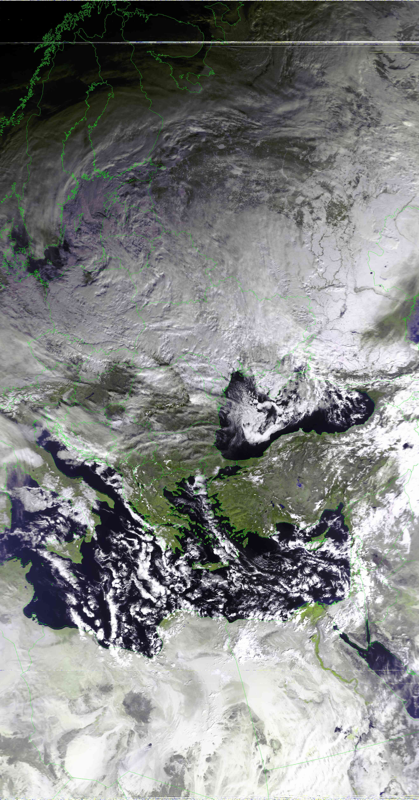
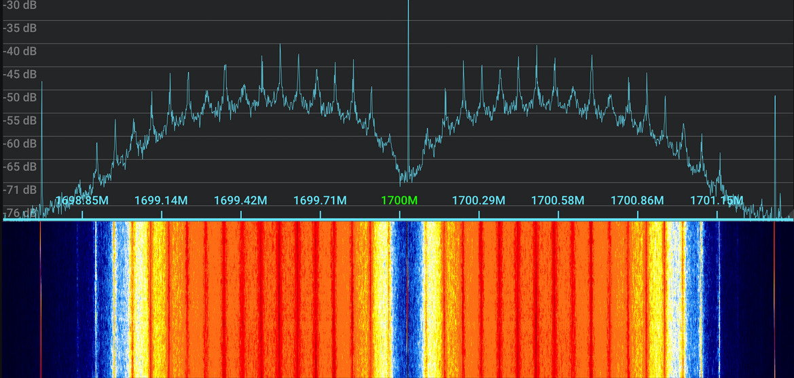
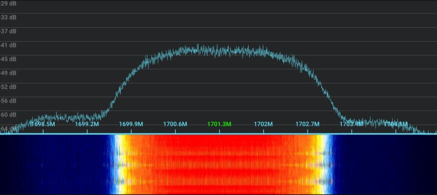
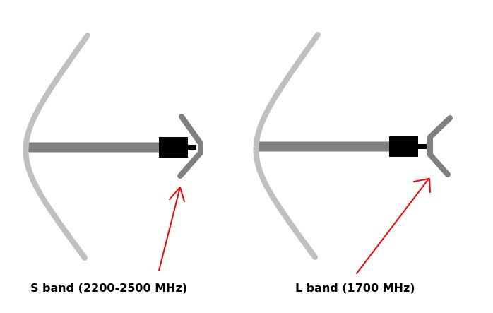
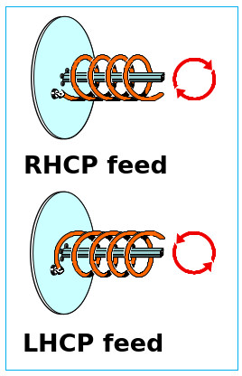
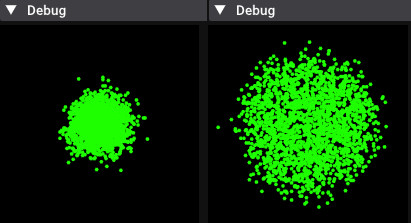
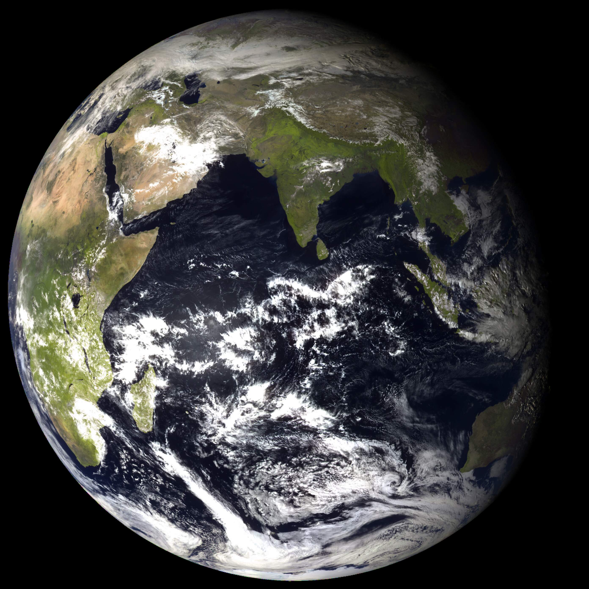
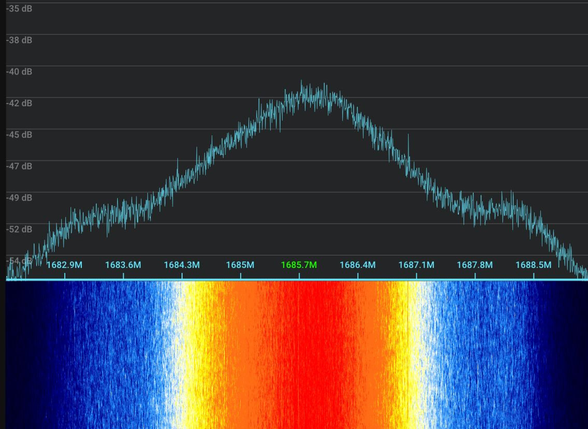
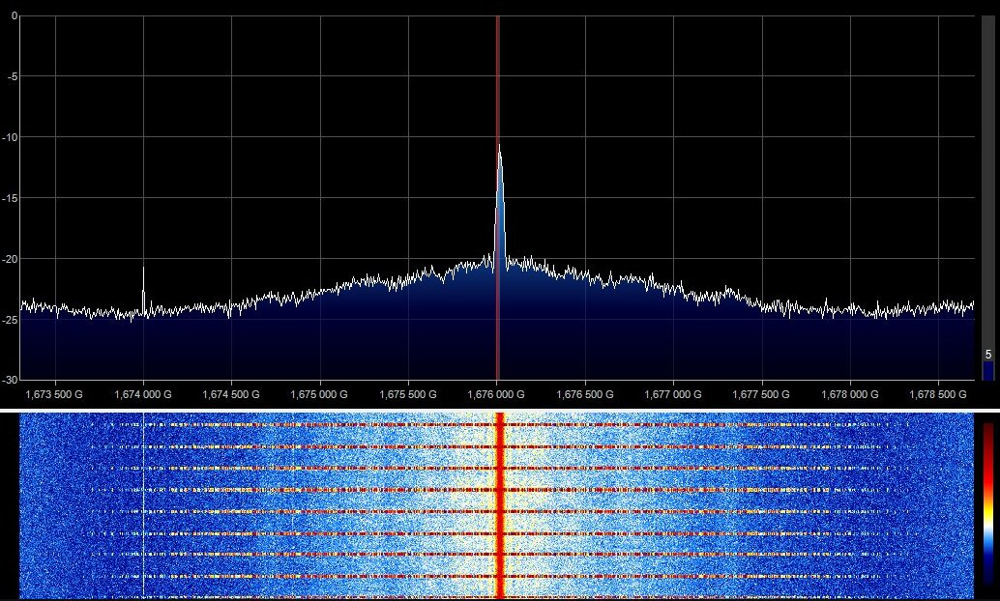
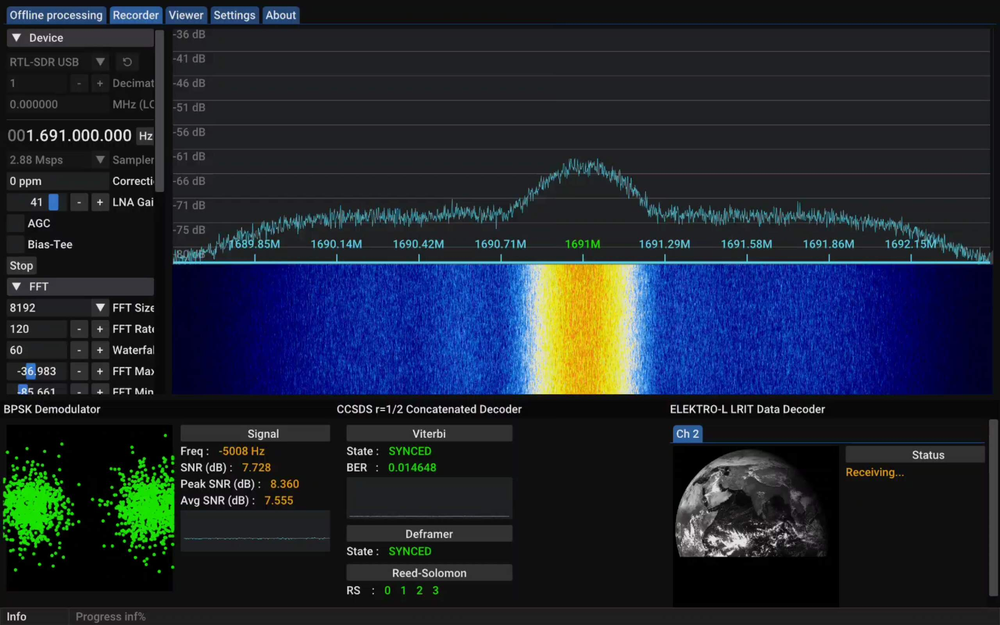

## Table of contents
{: .no_toc .text-delta }

1. TOC
{:toc}

[//]: # (NOTE: I have explicitly requested permission from lego11 to use his guides as a refernece, he said he's cool with it. I owe that man half the shit I know)

# Preamble

Before anything, I have to start with some credits:
- ***[Lego11's articles](https://a-centauri.com/articoli/)***
- ***The [Dereksgc](https://discord.gg/b375hYqUxh) Discord***
- ***The [SDR++](https://www.sdrpp.org/) Discord***

I learned almost everything you can read here from the places linked above, I can't express enough gratitude towards everyone who helped me start out with this niche hobby. If you are ever curious about this topic and wish to learn more, be sure to visit these, the people you can meet are incredible.

# Introduction

While you have certainly seen imagery gathered by satellites before, did you know you can receive it yourself straight off of them with a setup as simple as two wires in the shape of a V? The purpose of this guide is to show you how the broadcasts work, how you can receive them in practice in an easy to understand and approachable way.

## How can I receive data off of computers flying hundreds of kilometers above my head?

Satellites use the same method as your regular old FM station to transmit their data, **radio waves**! Of course you aren't able to just tune to a frequency on your car radio and start getting images, this is because it lacks the hardware & software needed to decode and process satellite signals.

To receive satellite signals *(among other things, an SDR has a wide range!)*, you can use a **Software Defined Radio** [SDR]. This is a device, that - unlike conventional radios - *uses **software** to perform radio-signal processing*. You usually plug these into a computer and use software like [SDR++](https://www.sdrpp.org/) to operate them.

> If you ever used a DVB-T tuner, it might have even had SDR capability - some RTL chipsets come with an SDR mode!

The actual reception process is also not as daunting than it might seem! In essence doing so is no different than listening to an FM station, it only happens with different hardware and at a different frequency... with the transmitter flying 800 km above your head. The most difficult part is gaining knowledge about this hobby, which is the reason I wrote this guide.

## Why should I do this?

There is no definitive reason for trying this niche hobby out - you can do it for **research** (The satellites send much more data than just imagery after all), to **kill boredom**, or just to **share the images online** - they are quite pretty after all!

## What is covered by this guide?

We will initially look at the **VHF satellite band (~137 MHz)**, which contains a few satellites broadcasting images at relatively low resolutions (4 km/px and compressed 1 km/px), followed by both low-earth-orbitting and geostationary satellites broadcasting in the **L satellite band (~1.7 GHz)** which requires more effort but offers significantly more interesting data such as full disc Earth imagery, with the prevailing resolution being uncompressed ~1 km/px.

These two bands aren't the only ones that satellites broadcast in, but are the easiest to receive imagery in. Other bands range from requiring a simple LNB to year long endavours that require a lot of dedication and individual research. *Looking at you, X band!*

# Glossary

Understanding the terminology used in satellite reception is essential, especially if you aren't familiar with radio. Below, you can find a list of new terms you are likely to encounter while doing this hobby:

### Hardware terms
- **SDR** - Software Defined Radio → A device used to translate radio waves into digital data
- **LNA** - Low Noise Amplifier → A tool used to amplify radio signals
- **Bias-t**/**Bias tee** → A device used to inject DC power into the RF line (To power devices such as LNAs). **DO NOT PLUG IT IN AIMING AT YOUR SDR, IT CAN KILL IT!**

---

- **SMA** → Type of connector used by most SDRs
- **Balun** → Converts a **Bal**anced signal to an **Un**balanced one and vice versa

### Abstract terms

- **Pass** → Refers to the time when you can see a satellite passing overhead, used with orbiting satellites
- **Elevation** → Height of a satellite above the horizon
- **Azimuth** → Compass heading
- **AOS** - Acquisition Of Signal → The moment when you start geting a signal from a satellite
- **LOS** - Line Of Sight / Loss Of Signal → Depending on the context this abbreviation is used in either describes your ability to see the satellite, or the moment when you stop getting a signal from a satellite

---

- **DB** - Direct Broadcast → A signal that is transmitted constantly, directly from the instruments (Doesn't require uplinking)
- **Rebroadcast** → A signal that is transmitted down to earth in a different band/time period, processed by the groundstation, then uplinked to the satellite to be rebroadcasted
- **Dump** → A signal that is transmitted to a specific groundstation, has a beginning and end

---

- **LEO** - Low Earth Orbit → Refers to objects orbitting the earth at an altitude of less than 2000 km

---

- ***RX*** → Shorthand for "Receive"
- ***TX*** → Shorthand for "Transmit"

###  Software terms
- **AGC** - Automatic Gain Control → Automatically sets the gain based on the signal strength
- **SNR** - Signal to Noise Ratio → The difference in dB between the noise floor and the signal peak, ergo how strong the signal is
- **FFT Spectrum** - Fast Fourier Transform Spectrum → The slice of the radio spectrum being sampled by your SDR
- **FFT Waterfall** - Fast Fourier Transform Waterfall → A visual representation of the spectrum throughout time, almost always found right below the FFT Spectrum
- **FEC** - Forward Error Correction → Code that tried to fix corrupted data, most common type is [Reed-Solomon](https://en.wikipedia.org/wiki/Reed%E2%80%93Solomon_error_correction)
- **Interference** → Commonly referred to as RFI (Radio Frequency Interference), is an umbrella term for unwanted signals produced by erroneous sources such as cheap power supplies, HDMI cables and devices such as laptops (USB RFI @ 480 MHz)
- **Overloading** → Occurs when your gain is set too high and/or you are near a very strong broadcast. Presents as your noise floor jumping/being unstable or spurs of interference throughout your spectrum.
- **TLE** - Two Line Element set → A format used to list the location of objects orbiting the earth
- **BER** - Bit Error Rate → How many bits were incorrect within one frame of data. Usually expressed in a decimal point (i.e. 0.01 = 1% of data is incorrect).
- **Signal constellation** → Without going into scientific detail, the Signal constellation is a visualisation of your signal's I and Q branches. The tighter it is, the less bad bits the signal has.

## Data transmission formats
Don't worry if you don't understand these yet, they will be explained in more detail later and are here just so you have an idea of what is meant if they are mentioned prior to their full explanation.

- **APT** - Automatic Picture Transmission → VHF Image and telemetry broadcast currently used on NOAA satellites
- **LRPT** - Low Rate Picture Transmission → VHF Image and telemetry broadcast currently used on Meteor-M satellites
- **HRPT** - High Rate Picture Transmission → L-band high quality image and telemetry broadcast format
- **xRIT** (**LRIT**/**HRIT**) - Low/High Rate Information Transmission → L-band information and telemetry broadcast format

# Mistakes and pitfalls
This is a list of mistakes I made that ended up in wasted time, avoid them for the sake of saving you a headache or two

- **Using old, outdated guides and software** → Radio is very niche, almost all guides you can find online are heavily outdated giving you bad advice and suggesting deprecated software, leading to confusion and subpar results. Please make sure that any sources you use are up to date.

- **Compass tracking with directional antennas** → Go by signal strength, NOT by elevation and azimuth. Use apps to find the general direction of the satellite, move your antenna around until you see the signal. Move slow and with purpose to track it and remain to be as strong as possible.

- **Doppler tracking when it is not needed** → Signals covered here such as APT and HRPT were designed to be thin enough to not need doppler tracking, **DON'T BOTHER DOING IT, IT IS NOT NEEDED.** 

- **Blindly maxxing the gain setting** → Upping the gain only makes the signal louder up to a certain point, after which it starts amplifying the noise floor much more than actual signals. This leads to them being drowned out. Turn it up only until you see, that the signal isn't getting any stronger.

- **Always turning on automatic gain control (AGC)** → AGC was designed for much wider broadcasts such as DVB-T (Terrestrial TV) than the signals described in this page. It *won't* recognize the signals and might end up cranking the gain up much higher than needed which may end up drowning the target signal out with noise. It has its uses (such as when your SDR is still far from overloading with max manual gain), because it can crank the gain higher than manual sliders, but don't default to it.

- **Not using actual connectors and cables** → While sticking a wire into your SMA port works in theory - an antenna is just anything conductive after all - it is very dangerous since it can damage your sma port, electrocute you if you have a bias-t, introduce major signal loss, or just end up not working at all.

- **Using a cheap LNA with higher frequencies (L-band and above)** → Cheap LNAs often have a very high gain which makes them prone to overload your SDR with junk outside of the target frequency. Because of this, higher bands exclusively use **filtered** LNAs (Low gain LNA > Filter > High gain LNA). The filter makes sure, that the LNA only amplifies the target signals and nothing else, meaning your SDR only gets the target signals.


# SDR specific information
## RTL-SDR
These apply to all SDRs using RTL chipsets (RTLSDR blog, Nooelec SMART...)

- The maximum stable sampling rate is **2.56 Msps!** Using anything higher can lead to sample drops if you don't have one of the few incredibly specific usb controllers with which the RTL chipset can pull 3.2 Msps without dropping samples. You can test if higher sampling rates such as 2.88 Msps work on your setup by running `rtl_test -s 2.88e6` and seeing if any data is lost after a few minutes.
> Please note, that on some devices even 2.56 Msps drops samples! Run `rtl_test -s 2.56e6` to test, or receive signals with error correction and see if the viterbi graph has spikes (indicative of sample drops).
- RTL-SDR Blog V4 needs specific drivers to work with most software, the installation steps are described on their [quick start page](https://www.rtl-sdr.com/rtl-sdr-quick-start-guide/)

## HackRF One
- ***DO NOT USE THE `Amp` (preamplifier) OPTION!!!*** The preamplifier is flawed, can get killed **very easily**. An exception to this is when you're using **Clifford Heath's [redesign](https://www.aliexpress.com/item/1005005351172184.html)**, which adds protections for it.
- The HackRF has a fairly outdated design which suffers from heavy phase noise, which results in you having to receive signals stronger than other SDRs to achieve the same quality. This is most apparent with signals that have low symbol rates.

## MiriSDR (MSI.SDR)
TODO (You can mod the DIP switch version)

# Preferred software
The best program for **decoding data** from satellites is arguably [SatDump](https://github.com/SatDump/SatDump/releases). It is an open source project that has everything you will need, and then some.

> Always download the latest nightly build of SatDump, make sure to update it frequently. It's in active development, has new additions on a daily basis.

There are other programs you can use but I won't focus on them for the sake of keeping this guide concise.

---
 To **track satellites** and figure out their future passes (Most are orbiting the Earth after all), you can use these:

Cross-Platform:
- [SatDump](https://github.com/SatDump/SatDump/releases) - Windows, Linux, MacOS, Android - SatDump has an inbuilt module you can use for tracking found in the `Recording` tab. **It can only track one satellite at a time, doesn't do long term predictions.**
- [N2YO](https://n2yo.com/) - Web - Does the job, however lacks the polish of other apps

PC:
- [Gpredict](https://oz9aec.dk/gpredict/) - Windows, Linux, MacOS - A relatively young tool, arguably the best choice for tracking on your computer
- [Orbitron](http://www.stoff.pl/) - Windows, Linux (wine) - Quite dated but functionally sound

Mobile:
- [Look4Sat](https://play.google.com/store/apps/details?id=com.rtbishop.look4sat&hl=en&gl=US) - Android - Provides everything essential in a simple UI.


There are a few apps for IOS but they have severe limitations, using any of the above instead is heavily encouraged.

> **Make sure you update your TLEs** every few days, not doing so might make the satellite locations be outdated or just outright incorrect.

I personally use Orbitron for long term and Look4Sat for short term predictions, the SatDump tracking module while live decoding in case I lose track of the satellite.

# Using SatDump

This guide will focus on using **SatDump** for all recording and decoding purposes. Before we get to actual satellite reception, we have to familiarize ourselves with the SatDump UI. If you already have experience with it, feel free to skip this heading.


## Preparation for the pass

### Configuration

Before anything, we need to configure a few things in the `Settings` tab. Make sure to do the following:

**General Satdump**
- Set your location (QTH Longitude, QTH latitude)
- Hit the `Update` button on the `Update TLEs` line
- (optional) Disable `Automatically process products`

**Output directories**
- Set your live processing directory
- (optional) Set your baseband recorder directory

Once these are set, hit the `Save` button on the bottom of your screen. You shouldn't have to reconfigure these again.

### Offline processing vs Recorder

When you launch SatDump, you initially face the `Offline processing` tab. This is where you can **decode <u>recordings</u>** in addition to semi-processed data (raw frames/binary etc.). We won't be using this tab very often, since we'll be using the **Live processing** feature instead. It is able to decode signals straight from your SDR, eliminating the need to make huge recordings prior to decoding signals. We can find it in the `Recorder` tab.

> This tab might seem overwhelming at first, but don't worry; we'll cover it one step at a time.

### Selecting source

 Expand the `Devices` dropdown, this is where you will manage your **source** - where you are getting signals from. SatDump supports several inputs such as baseband recordings and various servers, we will be using your SDR. You can select it as such:

1. Reload the source list
2. Click on the dropdown
3. Select your SDR
<br>
 

> If your SDR isn't showing up, make sure that it is being recognized by your computer and that the drviers are installed properly.

Once you have selected your SDR, you can select a sampling rate appropriate for the signal you are about to decode; this depends on the symbol rate of the target signal. Your sampling rate should be **at least** roughly twice the symbol rate of the signal. 1 Msps is perfectly adequate for VHF signals described here, while 2.4 Msps is enough for most L band signals. Please note that these two values aren't definitive, higher sampling rates don't hurt the signal as long as you don't begin to [drop samples](#viterbi-spikes).

> I.e. if a signal has 1 Msps, a sampling rate of **at least** 2 Msps is recommended

You can now press `Start`, you should see a blue waterfall appear on the right hand side of your screen (see image below). You can configure the gain slider(s) once you are receiving a signal.

### UI elements

Now that we have something to look at, we can break the UI down into a few different sections:


1. **FFT spectrum** - This shows the slice of the radio spectrum being sampled by your SDR. The higher a point is, the stronger that part of the spectrum is.
2. **FFT Waterfall** - This shows how the FFT spectrum has changed overtime using a color gradient. By default blue is the weakest and red is the strongest.
3. **Frequency range** - This gives you a scale of what frequencies you're looking at.
4. **Status bar** - Shows what SatDump is doing right now, clicking it gives you a full log.

### Adjusting FFT

If we don't adjust the FFT settings, we won't see much happening on it; the default FFT range is setup to two extremes: -150 dB to 150 dB. To make sure we can actually see signals on it, connect your SDR to your receiving setup (antenna) and do the following:

1. Open the `FFT` dropdown
2. Select a reasonable FFT size (resolution), 16384 should be more than enough for most use cases 
3. Move the `FFT Min` slider until the *Noise floor* (bottom of the sampled spectrum) is just above the bottom of the window
4. Move the `FFT Max` slider until you have enough of a range from the *Noise floor*, that you will be able to see the signal at its maximum strength with a decent margain on top. 
> I.e. if the noise floor is at -65 dB, you expect the signal to reach 20 dB, make the maximum -65 [Noise floor] + 20 [Maximum signal strength] + 5 [margain] = -40 dB
5. Set the `Avg num` to anywhere between 10-50, it smoothens the FFT out to make it more visually pleasing.


Your FFt should be configured properly now, here's an example of the same signal at 1691 MHz as seen above, but with a properly adjusted FFT:


## Setting up tracking (optional)

If you set your location properly and your TLEs are up to date, you can use SatDump's `Tracking` dropdown to see the following satellite pass. It allows you to have the satellite's location in a convenient spot, eliminating the need for a second program running next to SatDump. To use it, choose the `Satellites` option and select the target satellite from the dropdown. You will now see a summary of the next pass.

 <br>
*SatDump showing the next NOAA 15 pass*

## Using pipelines

Now that we can see what is going on in the spectrum, we can prepare and start a **pipeline**! Once a pass is incoming, open the `Processing` dropdown and select the one corresponding to your satellite pass, in this example I will choose `METEOR M2-x LRPT 72k` for Meteor M2-3 LRPT.

Once you configure it and hit start, a lot of things will pop up which will be different based on the satellite you are receiving. Let's break it all down:


On the bottom of your screen you can see the pipeline appear, it separates into two primary sections:
- The left side has information about **the signal itself** - How strong it is, where it is, its constellation 
- The right side has information about the **decoder** - If we are decoding a data, if error correction is working etc.

Now let's look at everything individually:

1. **Constellation** - Without going into much detail about radio theory, the constellation is a visualisation of the signal you are receiving. It is helpful when determining issues with your reception, is able to tell much more than just by looking at the signal on the spectrum. It should match the modulation found right above it, in this case OQPSK = 4 dots in each corner. The smaller the dots are, the stronger the signal is.
2. **SNR** - How strong the signal is expressed in dB. This is just a calculated value, can be wrong! The constellation and BER are the ultimate judges of signal strength.
3. **Viterbi** - Without going into much radio theory again, the viterbi algorithm shows whether SatDump knows where the error correction bits are. Is is useful when figuring out how strong a signal is (Lower BER = Cleaner signal), or if you are [dropping samples](#viterbi-spikes)
4. **Deframer** - The deframer shows, whether SatDump knows where individual frames of data start. If it doesn't know (NOSYNC), SatDump isn't decoding any data, because it has no idea what it is looking at.
5. **Reed-Solomon** - This describes the forward error correction bits, where: **Green** = "Bit is OK", **Orange** = "Bit had to be recovered", **Red** = "Bit was lost".

Other things might show up here depending on the satellite you are receiving, such as an image or frame counter. Please note that numbers 3/4/5 only show up with signals that have FEC.


---

This should cover everything you might encounter while decoding these satellites.


# VHF APT/LRPT reception guide (137MHz)
Now that we have gone over the terminology behind these satellites, we can finally move on to the actual reception process!

- Receiving VHF broadcasts is **incredibly easy** → all you need is some wire, an SDR, and some patience
- As of writing this article, there are **5** weather satellites currently broadcasting imagery in this band
- While easy to receive, they have a **relatively low quality** (4 km/px on APT and 1 km/px with JPEG compression on LRPT) and transmit only 2-3 channels while broadcasts in higher frequencies usually transmit 5+ raw, 1 km/px channels 

## Sample processed APT and LRPT images
> Note: The raw images don't have maps on them, they were added in post processing.


*NOAA 18 APT received on 02/01/2024 using a 5 element yagi-uda antenna. Processed using SatDump with the `HVC` RGB composite. Equalized, median blur applied. 65% quality lossy JPEG compression with 0.05 gaussian blur applied, click [here]({{site.baseurl}}/assets/images/Radio/APT-Sample-image.png) for the full resolution image.*


*Meteor M2-3 LRPT received on 02/01/2024 using a 5 element yagi-uda antenna. Processed using SatDump with the `221` RGB composite. Equalized. 65% quality lossy JPEG compression with 0.05 gaussian blur applied, click [here]({{site.baseurl}}/assets/images/Radio/LRPT-Sample-image.png) for the full resolution image.*

## Detailed satellite information

### NOAA

- These are the last **3** remaining members of the **POES** (Polar Orbiting Environmental Satellites) constellation, consisting of **NOAA 15, 18 and 19**. These were launched in 1998, 2005, and 2009 respectively.
- Have an *analogue* **[APT (Automatic picture transmission)](https://www.sigidwiki.com/wiki/Automatic_Picture_Transmission_(APT))** broadcast that transmits two channels at a 4km/px quality. Its analogue nature means, that crackling (noise) during the recording translates to grain in the output images.
- These satellites also broadcast an auxiliary [DSB (Direct Sounder Broadcast)](https://www.sigidwiki.com/wiki/NOAA_Direct_Sounder_Broadcast_(DSB)) signal which contains the HIRS and SEM instruments as well as telemetry. I won't be covering it in this guide, as it's primarily focused on imagery.

<br>

- During day these transmit one visible and one infrared channel, during night they switch to two infrared channels.

<br>

- New satellite launches are a part of the JPSS constellation, which only include an incomparably harder to receive X-band signal. No future satellite launches from NOAA are planned to include a VHF antenna.


*NOAA 19 APT, CC: SigIdWiki*

### METEOR-M

- As for their Russian counterpart, **2** satellites are currently broadcasting imagery in this band: **Meteor-M N°2-3** and **Meteor-M N°2-4** (Meteor M2-x or just M2-x for short), both a part of the **Meteor-M** constellation. They were launched very recently - in June of 2023 and February of 2024 respectively. 
- These satellites have a *digital* **[LRPT (Low rate picture transmission)](https://www.sigidwiki.com/wiki/Low_Rate_Picture_Transmission_(LRPT))** broadcast that includes 3 channels at a JPEG-compressed 1 km/px quality. It includes **FEC** to make sure the picture doesn't come out grainy as well as allowing you to decode the signal properly even if it's fairly weak.

> Reception note: M2-3 LRPT fades a lot when at lower elevations.


<br>

- These transmit any 3 channels the operators choose, as of the latest commit:

|Satellite|Channel numbers|Channel types|
|---|---|---|
|M2-3|1, 2, 4|2×Visible, 1x Infrared|
|M2-4|1, 2, 4|2×Visible, 1x Infrared|


*Meteor M2-4 LRPT. Spike on the left isn't a part of the signal.*


- This satellite series has been plagued with accidents, faults, and delays: Meteor M1 and M2 lost altitude control, M2-1 exploded on launch, M2-2 got hit by a micrometeor making it unable to broadcast LRPT, **M2-3's LRPT antenna didn't fully extend, leaving it in a tilted angle making the signal improperly polarized, experience random drops as well as making it generally weaker than it is suppoed to be**.
- As a long awaited change of luck, M2-4 has succesfully launched on leap day in 2024, is broadcasting LRPT at a full strength. Its JPEG compressor has had a few hiccups presenting as a lot of artefacting in its imagery, but it has always recovered after the satellite restarted it a few orbits later.

> Meteor M2-4 is still in testing, while the bitrate and frequency seem to have settled, more skew tests and testing patterns are still possible in the near future.

## Broadcast issue quick reference

- **NOAA 18** has had a configuration error present ever since management was transferred to Parsons tech, making it broadcast a visible channel on APT during the night instead of an infrared one. <u>This presents itself as half of the APT image being black during nighttime</u>.
- **Meteor-M N°2-3** has an incorrectly deployed VHF antenna, making the <u>LRPT signal weaker than intended and unexpectedly experience drops at certain elevations</u>.

> **NOAA 15** has had several major hiccups with its scan motor current spiking due to it grinding through debris. These spikes caused a loss of synchronization between the scan motor and the processor presenting as [major glitches](../../assets/images/Sat-reception-journey/First-good-APT-N15.png) *(NOAA 15 received on 13/10/2023 using a V-dipole)* appearing in place of actual imagery. A large enough spike could lead to a complete motor stall, from which recovery would be highly unlikely. **The satellite has since recovered and is currently broadcasting fine**. Its status can be checked on the [STAR ICVS monitoring page](https://www.star.nesdis.noaa.gov/icvs/status_N15_AVHRR.php) by selecting `Telemetry` and `Scan motor current`.
 

## Hardware needed to receive these satellites

You will need an SDR and an antenna, **no other special equipment is required for VHF**.

> NOTE: You also need the appropriate cables and adapters to connect antenna to your SDR, make sure to order these in advance. An example is a coaxial cable and an F female to SMA male adapter.

### SDR

Most SDRs should be able to natively sample this band without any issues, but you should ideally look for reputable brands to avoid poor results. A great starter stick is the $30 [RTLSDR Blog v3/4](https://www.rtl-sdr.com/buy-rtl-sdr-dvb-t-dongles/).

### Antenna

You have the choice between:
- **Omnidirectional antennas** - Don't need tracking to be performed (remain stationary throughout the pass)
- **Directional antennas** - These need tracking to be performed during the pass, **can only receive one satellite at a time**, generally have a higher gain (better signal strength)


Popular antenna types for receiving signals in this band include:

### 1. V dipole antenna
- Omnidirectional
- Very easy to make, very portable
- Fair results, has some nulls due to its inconsistent radiation pattern
- Arguably the best for beginners
- When using, point directly north/south & hold it horizontally about 50 cm from the ground (Personal tip: Play around with it and figure out when the signal is the strongest, stick with what works!)
  
To build it: 
1. Get a chock block (electrical terminal), a coaxial cable and two preferably copper, unshielded wires that are ~54.5 cm long (This is because the v dipole elements have to be a fourth the wavelength, which in this case is `299,792,458 ms⁻¹/137,500,000 hz = ~2.18 m; 2,18/4 = ~0.545 m = ~54.5 cm`. Why? [It's how a v dipole works.](https://upload.wikimedia.org/wikipedia/commons/d/d8/Dipole_antenna_standing_waves_animation_6_-_10fps.gif))
2. Stick the shielding of the coaxial cable in one hole and the copper core into the other (keep it as short as possible)
3. Put the two wires into the holes and spread them 120° apart making a V shape.
That's it. Really.

> Note: This antenna can be used for permanent fixtures, but should have a proper ground plane. A good example is a V shaped reflector about 1/4 wl below the dipole.

 <br>
*This image suggests a wire length of 53.4 cm, while that would work the actual length should be approximately 54.5cm. It also suggests using aluminum rods, while that'd work, copper is about twice as conductive (will lead to better results).*

### 2. Quadrifilar helical antenna (QFH)
- Omnidirectional
- Fairly difficult to build
- Very good results thanks to its circular polarization and consistent radiation pattern
- Best choice for permanent fixtures

 <br>
*[Source](https://okelectronic.wordpress.com/2014/08/20/rtl-sdr-second-attempt/)*

A good guide I have followed to make this antenna can be found [here](https://sdr-es.com/construccion-antena-qfh-137/), while being in spanish it offers great information about the dimensions and the installation. [Google translated page](https://sdr--es-com.translate.goog/construccion-antena-qfh-137/?_x_tr_sl=auto&_x_tr_tl=en&_x_tr_hl=en-US&_x_tr_pto=wapp)

***WARNING! This antenna has a circular polarization, meaning you <u>HAVE</u> to match it with the satellites', that being RHCP!!!*** (For APT & LRPT)

*Bottom to top, RHCP is twisted clockwise, while LHCP is twisted counter-clockwise. CC for image: muellermilch.de on Discord*

Using the incorrect circular polarization presents itself as the signal being weak, fading significantly throughout the pass.

### 3. Yagi-Uda antenna
- Directional
- Fairly easy to make
- Very good results thanks to its high gain
- Requires manual tracking
  
 <br>
*[Source](https://www.digikey.com.br/pt/blog/the-yagi-antenna)*

To make it:
1. Get something long and nonconductive, this wll be the base for the yagi and is called a "boom". Afterwards, figure out how many elements fit on it based on its length.
> More elements make the antenna: More directional (Harder to track), have a higher gain (Better signal strength), have a longer boom length (Bulkier)
2. Shove appropriate numbers into [this calculator](https://www.steeman.org/Antenna/Yagi-Antenna-Calculator) (For frequency choose 137.5 MHz)
3. Cut copper wires to length, place them onto the boom according to to the values from the calculator
4. For the driven element (dipole), cut it in half and put one side in a terminal with the shielding of a coaxial wire and the other with the core of the same wire\
**Make sure the cables don't touch or are short together in any way, this will make the antenna not work**
5. Coil the coaxial cable up a few times right after the feed point in order to convert the **unbalanced** signal to a **balanced** one (In essence creating a HF choke)


*The choked balun and dipole feed I use on my yagi*

### Other choices

This list isn't exhaustive, different antenna types such as (including but not limited to) [turnstiles](https://en.wikipedia.org/wiki/Turnstile_antenna) or [quads](https://en.wikipedia.org/wiki/Quad_antenna) can also be used.

*Turnstile on the left, [source](https://en.wikipedia.org/wiki/Turnstile_antenna). Quad on the right, [source](http://www.basicomm.com/50mhz-cubical-quad-antenna?ckattempt=1)*

## Frequency reference

As of the latest commit, the frequencies these satellites broadcast at are as follows:

|Satellite|Frequency|
|---|---|
|NOAA 15|137.62 MHz|
|NOAA 18|137.9125 MHz|
|NOAA 19|137.1 MHz|
|Meteor M2-3|137.9 MHz|
|Meteor M2-4|137.9 MHz|

## Actually receiving the satellites!
1. Get to a place with a good view of the sky - The more you can see, the longer you can receive the satellite for and the longer the resulting image will be
2. Open SatDump and navigate to the `Recorder` tab, select your SDR, set the sampling rate to an appropriate value (~1-2 Msps for this band) and hit `Start`
    - Rise the gain until your noise floor starts to rise more than the target signal, or until your SDR overloads, whichever comes first. Try not to move it around during the pass, it will lead to the image having sections with a different brightness with APT. Doing so has no effect on LRPT.

3. In the side panel, open the `Processing` menu and do the following:

    ### FOR NOAA APT
    - Select the `NOAA APT` pipeline
    - Enable `DC Blocking` and `SDR++ Noise Reduction`
    - Select the proper NOAA satellite
    - Open the frequency menu, select the correct satellite

    

    ### FOR METEOR-M LRPT
    - Select the appropriate pipeline:
        - `METEOR M2-x LRPT 72k` for Meteor M2-3 and Meteor M2-4
        - `METEOR M2-x LRPT 80k` for \<x\>
    - Enable `DC Blocking`
    - (Optional, preferred) Enable `Fill missing data`
    - Select the appropriate frequency:
        - `Primary` for 137.9 MHz
        - `Backup` for 137.1 MHz

    

4. When the satellite comes into view, press `Start` on the processing window

    > When using a directional antenna, move slowly and try keeping the signal as strong as possible using the SNR with LRPT and the FFT along with the sound (trying to avoid crackling) with APT. You might not get the hang of it on your first try, tracking is a skill you have to learn!

    If everything is right, you are now receiving a beeping APT signal or see four dots on the demodulator in case of an LRPT signal!
     <br>
    *SatDump mid LRPT decode. See the `SYNCED` viterbi and deframer.*

5. Once you see the signal has completely disappeared and isn't coming back, press `Stop` on the pipeline

6. SatDump will now begin autoprocessing the results, you can see the progress on the bottom (You can disable the autoprocessing in the settings if you want to tinker with the images yourself and don't want SatDump creating automatic images)

7. Once it finishes processing, head to the `Viewer` tab and select the pass you decoded on the top left

You are done! Feel free to play around with the image settings and enhancements, you can figure it out :)

> Make sure to check the [common issues header](#common-issues) if you experience any trouble with the decode/product processing.

## Alternative LRPT setup (SDR++)
As an alternative to directly recording in SatDump, SDR++ can be used to record an LRPT pass as well. This is especially useful when you aren't fully certain of the satellite's bitrate. To use SDR++ to record the LRPT pass, do as follows:

1. Open SDR++ and start the radio

2. Open the Module manager and configure as follows:
    

3. Move the demodulator over to the correct frequency

4. Receive the LRPT signal as usual, once the pass is over hit `Stop`

5. Open SatDump, move to the `Offline processing` tab and configure appropriately:
    

    > **Make sure to select `soft` as the input level!**

6. Hit `Start`

Your LRPT pass should decode properly. If it doesn't, try the other `M2-x LRPT` pipeline.

# L-band HRPT reception guide (1.7 GHz)
- L-band reception is **harder to receive** requiring some **specialized equipment** as well as a **dish** paired with some half decent tracking skills.
- Offers much more interesting things than VHF, such as being able to receive 5+ pure and uncompressed 1km/px channels as well as full disc Earth imagery with geostationary satellites broadcasting xRIT or another alternative.
- This heading describes LEO satellite reception, you can find Geostationary reception [here](#geostationary-reception)
- The are **9** LEO satellites currently broadcasting imagery in this band:
    - 3x NOAA POES
    - 2x Meteor-M
    - 2x MetOp
    - 1x AWS
    - 1x FengYun (Only broadcasts when in sight of China)

## Example processed HRPT image


*NOAA 19 received on 14/1/2024 using a 90 cm dish and a SawBird GOES+. Processed using SatDump with the `NOAA Natural Color` RGB composite. Median blur applied, equalized. 30% quality lossy JPEG compression with 0.05 gaussian blur applied, click [here]({{site.baseurl}}/assets/images/Sat-reception-journey/Best-HRPT-yet.png) for the full resolution image.*

## Detailed satellite information

### NOAA POES

- These are the same as VHF: **NOAA 15, 18 and 19**.
- Have a [POES HRPT](https://www.sigidwiki.com/wiki/NOAA_POES_High_Resolution_Picture_Transmission_(HRPT)) (High Rate Picture Transmission) broadcast which transmits 5 AVHRR channels at a 1.1 km/px resolution as well as some more data (Refer to the hyperlink)
- The broadcast features a very strong carrier wave making it very easy to track.

> Reception note: NOAA 15 only uses a damaged emergency antenna, which makes the signal lose a consistent polarization, be much weaker than intended, and experience severe fading throughout the pass. Reception is still possible, but requires a bigger dish, completely clear LOS with the satellite, and more precise tracking than other satellites described here.


 <br>
*NOAA 19 HRPT*

> Fun fact: Since 2021, **NOAA 2** (ITOS-D) - A 50 year old satellite! - has gone back to life transmitting a legacy [ITOS HRPT](https://www.sigidwiki.com/wiki/NOAA_ITOS_High_Resolution_Picture_Transmission_(HRPT)) broadcast. **It includes no actual imagery** since the VHRR sensor has died ages ago, however it still matches the modulation and spec - if decoded properly you can still see the familliar sync lines from APT broadcasts.

### METEOR-M

- 2 satellites from this constellation currently broadcast in this band: **Meteor M2-3** and **Meteor M2-4**
- Have a [**Meteor HRPT**](https://www.sigidwiki.com/wiki/METEOR-M_High_Resolution_Picture_Transmission_(HRPT)) broadcast containing 6 MSU-MR channels in addition to 30 MTVZA channels.
- This broadcast, much like POES HRPT, has a very strong carrier wave making it easy to track.

 <br>
*Meteor-M N°2-2 HRPT*


- Meteor-M N°2-2 has recently inexplicably stopped broadcasting imagery in the L and X bands, with the last known succesful reception being on the 24th of July 2024. The C band telemetry broadcast has been received since then, showing the satellite is still in orbit, but no other emissions have been detected. Roscosmos hasn't released a statement yet, but according to UsRadioGuy, the satellite is presumed to have failed: 
> *"HRPT was transmitting up until July of 2024, however that has since stopped. VNIIEM (the Russian State Corp that built the satellite) has since stopped supporting logistics for M2-2 HRPT and it is presumed that the system has failed.*" [source](https://usradioguy.com/meteor-satellite/#status)
    


### MetOp
- There are two functional satellites: **MetOp-B** and **MetOp-C** operated by EumetSat, launched in 2013 and 2019 respectively.
- Have a [MetOp AHRPT](https://www.sigidwiki.com/wiki/METOP_Advanced_High_Resolution_Picture_Transmission_(AHRPT)) (Advanced High Rate Picture Transmission) broadcast which - unlike NOAA POES and METEOR-M HRPT - includes Reed-Solomon FEC to make sure your picture doesn't come out with grain. The broadcast also contains several more instruments and much more data, including 5 AVHRR channels.
- The signal does not have a carrier wave or easily decernible bumps making it a bit harder to track, it presents as a jumpy signal on the FFT.

> Reception note: When receiving with an RTLSDR, you might run into some issues owing to its relatively high symbol rate. If you get a donut constellation, make sure to follow [this heading](#bad_constellation) to lower the pll bandwidth.

 <br>
*MetOp B AHRPT*

### Arctic Weather Satellite

- **Arctic Weather Satellite** (AWS for short) is a prototype satellite that launched very recently - 08/2024, broadcasts imagery at a 10-40 km/px quality, depending on the channel.
- Broadcasts a 24/7 DB signal, dumps full orbit imagery to Svalbard.
- Is a prototype to EPS-STERNA, which is scheduled to be a satellite constellation that fills the gap in Geostationary satellite data present at the poles. These satellites are expected to launch in 2029, have the same imaging instrument as AWS.

> Please note that this satellite has launched very recently and is still commisioning. The signal might be disabled for days at a time without prior notice, or contain erroneous data.

> TODO: FFT Screenshot

### FengYun 3

- The only satellite from this constellation still broadcasting in the L-band is **Fengyun 3C**. Due to a severe power supply failure **it only broadcasts when in sight of China** (When its footprint is anywhere within Chinese territory). 
- It broadcasts a FengYun AHRPT signal containing 10 VIRR channels in addition to some other instruments. The broadcast has Reed-Solomon FEC, but unlike any other satellite in the L-band **it broadcasts channels required for true color** - exactly what you would see with your eyes if you stood right next to the satellite.
- The signal has a relatively high symbol rate, can't be decoded with a standard RTLSDR dongle.

> Reception note: The signal might cut out a bit sooner or later than it gains/loses LOS with Chinese territory, it does not follow the rule to the tee.

 <br>
*FengYun 3C AHRPT*


## Hardware requirements

### SDR

- Any SDR able to sample this band (~1.7 GHz) will work, just make sure its sampling rate is adequate to receive the satellites of your choosing.

### LNA

- L-band radio waves are very weak and disspiate too quickly to be usable with just your SDR - an LNA connected directly to the feed is imperative.
- The only viable commercial option that doesn't cost a liver is the [Sawbird+ GOES](https://www.nooelec.com/store/sawbird-plus-goes-302.html) from Nooelec. It is a filtered LNA providing very good performance for L-band satellite reception.

> Do not waste your money on cheap wideband LNAs, **they will NOT work well enough to get satisfactory results.**

### Dish

- A prime focus, offset, or grid dish are all usable for L band reception, with some slight adjustments between them:
    - Prime focus dishes require less turns on the helix (compared to an offset) or a [patch feed](http://sat.cc.ua/page3.html) for better performance alltogether
    - Wifi grid dishes HAVE to have the reflector be flipped to be usable in the L band, you can also follow [UsRadioGuy's guide](https://usradioguy.com/optimizing-wifi-grid) to optimize the dish some more. <br>
     <br>
    *Credit: lego11*

- The bigger the dish, the harder it is to track, but the higher gain you have - the stronger the signals will be. 

An 80 cm offset is a great starter dish, given its lightness and wide availability - people give these away all the time after switching to terrestrial television. Check your local marketplaces, you ought to find something!

> NOTE: On offset dishes, you can hold the dish upside down (arm side up) to 'invert' the offset - you can point higher than the satellite instead of below it, this allows much easier reception at lower elevations.

### Feed

- The dish is only a half of the story though, you will need to DIY the feed yourself - it isn't difficult but requires a bit of effort.
- The preferred and most forgiving circularily polarized feed you can make is a **Helical antenna**, a simple wire spun into a helical shape placed on a (minimally) 13x13cm conductive plate.

## Building the feed

> Specific values from Lego's [HRPT guide](https://www.a-centauri.com/articoli/easy-hrpt-guide)


### Materials 
You will need the following materials:
- Male panel mount SMA port, preferably insulated - [Example](https://www.aliexpress.com/item/1005003803735398.html)
- Adequately sized screws and nuts for the SMA port
- A flat and conductive material that has **AT LEAST** a 13 cm diameter (i.e. a computer case side panel). A thin paint layer shouldn't greatly affect signal strength.
- About a metre of 2.5 mm copper wire
- If not using a 3d printed scaffold (linked later), a nonconductive material used as a support for the helix

Appropriate tools for this are a soldering station and multimeter

> - Copper wire with different widths can be used, but 2.5 mm is optimal.
> - The groundplane can be either circular or square (13x13 cm). Larger ones (i.e. 17x17 cm) can be used, might have a minor SNR benefit particularily on offset dishes where the larger ground plane doesn't cover the dish itself.

### Parts of a helical antenna

The helical antenna consists of two primary parts: 
- **Ground plane** - The conductive surface the helix is laid upon, acts as a secondary reflector (Where the primary one is the dish itself)
- **Helix** - The spun copper wire

 <br>
*R = Ground plane; C = Coaxial feed; S = Helix; B/E = Supports. [Source](https://en.wikipedia.org/wiki/Helical_antenna)*

### Winding the helix

The helix should have the following specifications:
- Turn spacing: 3 cm
- Spiral diameter: 5.5 cm
- Number of turns: 5 (3 on prime focus dishes)

You have two choices for winding the wire:
- You can wind it manually (Tip: 55 mm PVC pipes are really helpful if you choose this approach)
- 3d print a [premade stand](https://www.thingiverse.com/thing:4980180) and stick a wire through it. Also acts as a support for the wire. If you choose this approach, use the `1700L_5.5T_0.14S_4D_10-90M.stl` file

### Polarization warning!

> ***This antenna is circularily polarized, meaning you have to match it to the satellites' to be able to receive anything!***

In this case, the satellites transmit a RHCP signal, <u>but using a dish reflects it - you have to create a ***LHCP*** helix!</u>

 <br>
*Credit: lego11, [source](https://www.a-centauri.com/articoli/easy-hrpt-guide)*


### Building

1) Drill a hole exactly 2.75 cm from the center of the ground plane for the SMA port
2) Drill holes matching up with the flanges of the SMA port, use screws and nuts to secure it in place
3) Install the support for the helix in a way that:
    - Can hold the wire up without it swaying
    - Makes the bottom turn run more or less parallel to the ground plane
    - Has the bottom end of the wire touching the core of the SMA port

    A sample helix, using a a gritty zinc spray painted surface and hot glue as the support. Note how the bottom turn runs parallel to the ground plane.

    
4) Solder the helix to the SMA port
    - Soldering the wire properly is crucial, for best results heat the copper wire up until it melts solder by itself, then heat up the solder and the core of the SMA port to bind them together

    > TODO: Picture of the soldering


Congratulations, you now have a helical antenna! You should now check a few things using a multimeter in continuity mode:

1) There **SHOULD** be continuity between the top of the helix and the core of the SMA port
2) There should **NOT** be continuity between the helix and ground plane, or the frame of the SMA port

If either of these are wrong, verify that your helix is properly soldered only to the SMA core.

### Mounting to dish

Now comes the truly DIY part, mounting it to your dish. This wholly depends on your dish and its existing mounting solution, anything should be fine as long as you ensure two things:
1) That the groundplane isn't greatly covered from the helix side
2) The bottom of the helix is roughly in the focal point of the dish

> The focal point is exactly where the front part (mouth) of a TV LNB would be

Drilling small holes into the groundplane shouldn't greatly affect reception.

### Tips for improved SNR

These are minor things to check on existing setups, which can give you a dB or two of SNR. 

1) Use a male SMA connector to be able to connect your amplifier directly to the feed without any additional adapters
2) Use insulated SMA ports (The core sticks out with a bit of teflon instead of just being a simple pin)
3) Make sure the ground plane is STRAIGHT
4) Make sure the spacings are CORRECTLY SIZED using a caliper (if possible)


## Reception

TODO

## Correctly adjusting your gain {#correct-gain}

Setting your gain properly is **vital**, as an incorrect setting can severely hurt your reception capabilities either due to the signal being weaker than it can be, or by saturating your SDR which damages the signal's symbols. **Setting your gain beyond the SDR's saturation point only gives an illusion of a stronger signal, does NOT make it stronger, even if the SNR meter indicates otherwise!** You can see this by looking at the constellation while upping the gain, it deforms but does not grow clearer. Another way of seeing this is by looking at the BER of signals with FEC, it stays the same or even grows higher.

To ensure it's set correctly, use the "Magic eye" found in the `Debug` menu in the `Recording` tab and refer to the folllowing examples:

1) **A lot of dots are hitting the edge** → Gain too high

 <br>

- On the left is what you might see if the gain is set slightly too high, lower it by a few dB.
- On the right is a more extreme example, where the gain is set much higher than needed resulting in the SDR severely overloading. If you see anything like this, the signal you are trying to receive is being significantly hurt by too high gain. You need to lower it by quite a bit.

2) **There's only a small dot or circle in the middle** → Gain too low

 <br>
A small dot means that you should up the gain, if you are already maxxed out you might need to purchase an LNA.

3) **A circle is present, the majority of the dots aren't hitting the edges** → Gain just right

 <br>

- What you see on the left is ideal gain with no signals on the FFT
- What you see on the right is ideal gain with signals on the FFT


## Signal information

All signals mentioned here are RHCP except NOAA 15, which doesn't have a specific polarization due to a bent antenna.

|Signal|Minimum dish size|Symbol rate|FEC|Notes|
|---|---|---|---|---|
|NOAA POES HRPT|60|665.6 Ksym/s\*|No|
|Meteor HRPT|60|665.6 Ksym/s\*|No|
|MetOp AHRPT|60|2.33 Msym/s|Yes|Just barely receivable with an RTLSDR, might cause [issues](#bad_constellation)
|AWS DB|60|1.785 Msym/s|Yes|Dump Symbol rate TODO
|FengYun AHRPT|80|2.80 MSym/s|Yes|Not receivable by an RTLSDR, needs at least 3.4 Msps

\* Parallel modulated signals - Two 665.6 Ksym/s bumps. SatDump receives both, a sampling rate of at roughly 2.4 Msps is recommended.

## Frequency reference

|Satellite|Frequency|Notes|
|---|---|---|
|NOAA 15|1702.5 MHz|**Very weak**|
|NOAA 18|1707 MHz||
|NOAA 19|1698 MHz||
|Meteor M2-3, M2-4|1700 MHz||
|Metop B, C|1701.3 MHz||
|Arctic Weather Satellite|1707 MHz|DB+Dump|
|FengYun 3C|1701.4 MHz||

## Symbol and sampling rate relation

You can only receive these signals with an SDR that has a sampling rate at least roughly 1.2x greater than the signal's symbol rate. Not having enough overhead will make the signal weaker as well as cause issues such as a donut constellation on the demodulator (described [here](#bad_constellation)). Overhead is also **needed** because of **doppler shifting** and the **SDR's reference inaccuracy**. According to the [Nyquist-Shannon sampling theorem](https://en.wikipedia.org/wiki/Nyquist%E2%80%93Shannon_sampling_theorem), **the ideal sampling rate is twice the symbol rate** - anything less than that will result in lower and lower SNR and anything higher has basically no benefit.


# L-band geostationary satellite (LRIT/HRIT/etc.) reception guide {#geostationary-reception}
- Receiving these is extremely simple, the hardest part is arguably just getting a suitable dish and LOS
- Geostationary satellites are much weaker than orbitting satellites because of their very high altitudes, small dishes often don't cut it anymore. Refer to the signal table for more info.
- Don't require tracking, since the satellites don't move (It's on the tin - geo**stationary**)
- Provide full disc images of the earth and/or regional crops

<br>

- There are **13** geostationary satellites broadcasting imagery in this band:
    - 2x GOES in the US
    - 1x EWS-G in Europe and Asia (Retired GOES)
    - 2x Elektro-L in Europe, Asia and Oceania
    - 4x Fengyun in Asia and Oceania
    - 1x Geo-Kompsat in Asia and Oceania
    - 3x MSG in Europe

## Sample processed geostationary image


*Elektro-L N3 LRIT received on 11/2/2024 using a 125 cm dish and a SawBird GOES+. Decoded using SatDump. Pictured is the autogenerated `NC` (Natural Color) composite. 65% quality lossy JPEG compression with 0.05 gaussian blur applied, click [here]({{site.baseurl}}/assets/images/Sat-reception-journey/Best-Earth-full-disc.png) for the full resolution image.*

## Hardware requirements

The dish is the same as in LEO reception, but the polarization will differ in most cases; instead of familiar RHCP signals, geostationary satellites often have **linearily polarized** signals. For these, it's best to use a fairly forgiving but bulky [Cantenna](https://3g-aerial.biz/en/online-calculations/antenna-calculations/cantenna-online-calculator) or less forgiving but more compact [Loop feed](http://www.om6aa.eu/Loop_Feed_with_enhanced_performance.pdf)

TODO?

## Detailed satellite information

### GOES

- **GOES 16** and **GOES 18**, satellites from the `GOES-R` series, are the two currently operational satellites broadcasting three signals: 
    - **CDA Telemetry** - Contains telemetry (duh), can be used to check your setup is working properly.
    - **HRIT** - A strong and very easy to receive signal transmitting TODO, as well as rebroadcasted data from other satellites such as Meteosat and Himawari
    - **GRB** - A fairly weak rebroadcast sending full quality data (have to confirm), has a massive 7.8 Msym/s. Also broadcasts the satellites' SUVI (sun imaging) instrument. Transmits half the data over RHCP and the other half over LHCP.

- All of these include FEC, meaning you should be able to properly decode them even when the signal is quite weak. HRIT has notably good FEC, able to get clean imagery even out of just 1 dB!


> GOES 19 has recently launched, is in the process of replacing GOES 16. It is expected to begin broadcasting imagery soon.

> GOES 14, 17 are currently in on-orbit storage and are not broadcasting anything useful.


*GOES 18 CDA Telemetry on the left, HRIT on the right. CC: phantomsghost on Discord*


*A more zoomed out view showing all broadcasts at once. CC: UsRadioGuy*

### EWS-G

- **EWS-G2 (GOES 15)**, a retired GOES satellite part of the `GOES-N` series, was transferred to USSF and moved over the Indian ocean to replace EWS-G1 (GOES 13) and now broadcasts a few relatively weak signals:
    - **CDA Telemetry** - Contains telemetry (duh), can be used to check your setup is working properly.
    - **GVAR** - A relatively weak broadcast that contains all 5 imagery channels at a 1 km/px quality for the singular VIS channel and 4km/px for the other IR channels.
    - **SD** - Broadcasts raw instrument data, separates into two downlinks on the same frequency:
        - **Raw imager data**
        - **Raw sounder data**
- GVAR is very prone to corruption because of lacking FEC, which often causes lines to be misplaced in the resulting imagery. I have created a corrector to make the imagery more presentable even at low SNRs, you can view it [here](https://github.com/Cpt-Dingus/GVAR-line-corrector/).
- The sounder is disabled: The raw sounder downlink is empty, GVAR produces empty sounder images.

> Reception note: The satellite normally does regional crops, as they can be scanned faster than full disc images. It still transmits a full disc image every 3 hours.


*EWS-G2 (GOES 15) GVAR*


*GOES 13 SD: sounder SD is the thin spike in the middle, everything else is the imager SD. CC: dereksgc on Discord*

> TODO: GOES-N CDA FFT, gotta get a good picture of that sucker

### Elektro-L
- **Elektro-L N°3** and **Elektro-L N°4** (Elektro-L# for short) are the two satellites broadcasting imagery in the L-band. Due to a fairly recent power supply failure, Elektro-L2 only broadcasts a beamed X-band transmission to Moscow.
- They broadcast **Low Rate Information Transmission (LRIT)** as well as **High Rate Information Transmission (HRIT)** signals containing full disc images of the earth at a 4km/px quality. Both of these include Reed-Solomon FEC, meaning you can get clear imagery at just ~2.5 dB.
- LRIT broadcasts any number of channels, for Elektro-L3 it's 3 visible channels, one water vapour channel (degraded), as well as one infrared channel. L4 broadcasts channels too inconsistently to be specified here.

> Reception notes:
> - LRIT broadcasts pre-equalized channels, which often end up severely over-exposing the imagery. The reason for why imagery is broadcasted like this is unknown.
> - After a few minutes of LRIT from Elektro-L3, you will be able to notice a spiky signal appear at 1690.5 MHz, this is linearly polarized dead LRIT from FengYun 2H. It might interfere with Elektro LRIT reception, in which case you should point slightly farther from 2H.
> - Elektro-L4 has broadcast issues; the LRIT broadcast consistently cuts off after 15 minutes, even when in the middle of transmitting an image.
> - You can use GGAK as a 24/7 metric to see if you are capable of decoding xRIT: 10 dB on GGAK should equal to about 2.5 dB on LRIT (enough for a decode), 17 dB on GGAK shuold equal to about 3 dB on HRIT (enough for a decode).


*Elektro-L N°3 LRIT on the top, HRIT on the bottom*


*Elektro-L N°3 GGAK*


### FengYun

#### FengYun 2 series
- **FengYun 2H**, and **FengYun 2G** broadcast a **linearly polarized S-VISSR** signal containing 5 channels (1 visible, 4 infrared) at a fairly high quality - 1.25 km/px for the singular VIS channel and 5 km/px for the 4 IR channels.
- This signal is very prone to corruption because of lacking FEC, which often causes misplaced/missing lines. You can use [HRPTEgors S-VISSR corrector](https://github.com/Foxiks/fengyun2-svissr-corrector) instead of the defeault `FengYun 2 S-VISSR` pipeline to remedy this.
- FengYun 2H broadcasts dead (empty) LRIT every hour (except 5:30Z and every 6 hours onwards) on 1690.5 MHz, this leads to the second image being cut at about 57%.

> These satellites also broadcast an incredibly weak **CDAS** raw downlink, but it's almost completely undocumented owing to it's weak & wide nature.

 <br>
*FengYun 2H S-VISSR*

 <br>
*S-VISSR switching from a carrier to the image broadcast at XX:59*

#### FengYun 4 series
- **FengYun 4A** and **FengYun 4B** currently broadcast a **linearly polarized LRIT** ~~and **HRIT** signal~~. The LRIT signal only broadcasts at a very poor quality (Have to confirm, but less than 4 km/px)~~, HRIT only transmits a single unencrypted infrared channel~~.

> NOTE: As of the latest commit, FengYun 4A has recently started broadcasting its LRIT signal, but no products have been decoded so far. FengYun 4B is still commisioning, has only transmitted old FY 4A imagery so far.

> Both HRIT broadcasts are currently disabled.


 <br>
*FengYun 4A LRIT, CC: drew0781 on Discord*

 <br>
*FengYun 4A HRIT, CC: drew0781 on Discord*


### GEO-KOMPSAT
- **GEO-KOMPSAT-2A** currently broadcasts **LRIT** and **HRIT** at a 4 and 1 km/px quality respectively. The broadcasts are encrypted, but the decryption key has been shared by the operators, making amateur reception possible.
- LRIT is notorious for being extremely strong, not even requiring a dish to decode an image.

<br>

- LRIT transmits miscallenous data in addition to a 4 km/px IR channel every 10 minutes
- HRIT transmits 1x 1 km/px VIS, 3x 4 km/px IR, 1x 4 km/px water vapour every 10 minutes


*GEO-KOMPSAT-2A LRIT on top, HRIT on bottom. CC: drew0781 on Discord*


### Meteosat Second Generation (MSG)
- **Meteosat 9, 10, and 11** broadcast a notoriously weak **linearly polarized PGS raw data downlink** containing all of their channels - 2x VIS at a 1.6 km/px quality, and 9x IR at a 4.8 km/px quality.
- This is the second weakest geostationary L-band signal behind FengYun 2 CDAS, requiring a massive 3 metre dish paired with a custom LNA for a decode.
- The SEVIRI instrument has three operating modes:
    - HRV - High Resolution Visible - A crop of Europe and a crop of the bottom hemisphere is transmitted every 15 minutes, these move with sunlight as pictured below <br>
<br>
*HRV crops, [source](https://user.eumetsat.int/resources/user-guides/msg-high-rate-seviri-level-1-5-data-guide#ID-HRV-SEVIRI-scan-modes)*

    - RSS - Rapid Scan Service - The top third of the Earth is transmitted every 5 minutes
    - FES - Full Earth Scan - The whole earth is scanned every 15 mintues, only enabled during eclipse sason

> Reception note: The minimal dish size is speculative, but it has been received using a 3 metre dish and custom aplifier before.


> These satellites used to transmit a much stronger LRIT signal which contained five channels along with rebroadcasted GOES data, but the broadcast was [discontinued in 2018](https://web.archive.org/web/20170318043205/https://www.eumetsat.int/website/home/News/DAT_3247528.html).


*Meteosat 9 PGS, CC: that_zbychu on Discord. The thin spikes present aren't a part of the signal.*


## Signal information

The minimum dish size heavily depends on the satellites elevation! You might be able to get it with a smaller dish if the satellite is high up, or need a bigger dish if it's low in the sky (~ <15°)

> **Scroll to the side! Haven't figured the table overflow yet**

|Satellite series|Signal|Frequency|Symbol rate|Polarization|Minimum dish size|FEC|Transmits imagery...
|---|---|---|---|---|---|---|---|
|Elektro-L|LRIT|1691 MHz|294 KSym/s|RHCP|80 cm|Yes|Every 3 hours from midnight UTC at XX:42 ecluding 06:42
|Elektro-L|HRIT|1691 MHz|1.15 Msym/s|RHCP|125 cm|Yes|Every 3 hours from midnight UTC at XX:12 excluding 06:12
|Elektro-L|GGAK|1693 MHz|5 Ksym/s|RHCP|N/A|N/A|Constantly, can be used to verify your setup is functional
|GOES-R|CDA Telemetry|1693 MHz|40 Ksym/s|Linear|N/A|Yes|Constantly, can be used to verify your setup is functional
|GOES-R|HRIT|1694.1 MHz|927 KSym/s|Linear|80 cm|Yes|Constantly
|GOES-R|GRB|1681.6 MHz|8.67 Msym/s|Circular\*|180 cm|Yes|Constantly
|GOES-N|CDA Telemetry|1694 MHz|40 Ksym/s|Linear|N/A|Yes|Constantly, can be used to verify your setup is functional
|GOES-N|GVAR|1685.7 MHz|2.11 Msym/s|Linear|125 cm**|No|Full disc image at midnight UTC, every 3 hours onwards. Regional crops every TODO minutes rest of the time.
|GOES-N|Imager SD|1676 MHz|2.62 Msym/s|Linear|300 cm|No|Constantly
|GOES-N|Sounder SD|1676 MHz|40 Ksym/s|Linear|125 cm|No|Constantly
|Fengyun 2|S-VISSR|1687.5 MHz|660 Ksym/s|Linear|80 cm\*\*|No|XX:00 - XX:28, second timeslot variable\*\*\*
|FengYun 4|LRIT|1697 MHz|90 Ksym/s|Linear|TODO|Yes|Hourly
|FengYun 4|HRIT|1681 MHz|1 Msym/s|Linear|TODO|Yes|~~Every half an hour~~ Currently disabled
|GEO-KOMPSAT|LRIT|1692.14 MHz|128 Ksym/s|Linear|None\*\*\*\*|Yes|Constantly, image every 10 minutes
|GEO-KOMPSAT|HRIT|1695.4 MHz|3 Msym/s|Linear|175 cm|Yes|Constantly, image every 10 minutes
|Meteosat Second Generation|PGS|1686.83 MHz|3.75 Msym/s|Linear|300cm\*\*\*\*\*|Yes|Constantly, image every 15 minutes in HRV and FES modes and every 5 minutes in RSS mode|

\* Half the data sent over RHCP, the other half over LHCP <br>
\*\* Only with the respective corrector, the image will otherwise be severely cut up. <br>
\*\*\* **FengYun 2H:** 5:30-5:58 UTC and every 6 hours after, XX:30-XX:48 at all other times | **FengYun 2G:** 01:30-01:58 UTC and every 4 hours after <br>
\*\*\*\* LRIT is notoriously strong, just pointing the feed at the satellite is often enough to decode products. <br>
\*\*\*\*\* Only using a custom LNA such as a [G4DDK VLNA](http://www.g4ddk.com/VLNASept13.pdf)


## Symbol and sampling rate relation

You can only receive these signals with an SDR that has a sampling rate at least roughly 1.2x greater than the signal's symbol rate. Not having enough overhead will make the signal weaker as well as cause issues such as a donut constellation on the demodulator (described [here](#bad_constellation)). Overhead is also needed because of doppler shifting and the SDR's reference inaccuracy. According to the [Nyquist-Shannon sampling theorem](https://en.wikipedia.org/wiki/Nyquist%E2%80%93Shannon_sampling_theorem), the ideal sampling rate is twice the symbol rate -  anything less than that will result in lower and lower SNR and anything higher has basically no benefit.


## Actually receiving the satellites!

Don't forget to [set your gain correctly](#correct-gain)!

1. Aim your dish using whatever broadcast the satellite transmits constantly, or using a dish alignment app (Less accurate). Alternatively, locate the rough area of where the satellite should be in the sky, start the correct pipeline and when the broadcast starts quickly try to find where the signal is the strongest. You usually have a few seconds to find it, which is more than enough in most cases.

2. Open SatDump, move to the `Recording tab` following the same setup as for HRPT

3. Start the appropriate pipeline:

    |Signal|Pipeline|
    |---|---|
    |Elektro LRIT|Elektro-L LRIT|
    |Elektro HRIT|Elektro-L HRIT|
    |Elektro GGAK|Elektro L-band TLM|
    |GOES HRIT|GOES-R HRIT|
    |GOES GRB|GOES-R GRB|
    |GOES GVAR|GOES GVAR|
    |GOES Imager SD|GOES-N Sensor Data|
    |GOES Sounder SD| GOES-N Sounder SD
    |FengYun 2 S-VISSR|FengYun-2 S-VISSR|
    |FengYun 4 LRIT|FengYun-4[A/B] LRIT|
    |~~FengYun 4 HRIT~~|~~FengYun-4A HRIT -II/III~~|
    |GEO-KOMPSAT LRIT|GK-2A LRIT|
    |GEO-KOMPSAT HRIT|GK-2A HRIT|
    |MSG PGS|MSG Raw Data| 

4. The broadcast will show up as a bump that might occasionally jump up and down, you should be seeing a few decibels of signal, `SYNCED` and green Reed-Solomon numbers when applicable.

    
    *SatDump mid Elektro LRIT reception*

5. After the transmission stops or you are satisfied with the results, hit `Stop` on the pipeline

6. As of the latest commit, SatDump **PARTIALLY** supports processing of images received from geostationary satellites: The only two supported satellite series are <u>*GOES, Elektro-L*</u>, but **they will not automatically show up in the `Viewer` tab.** <u>For all satellites</u>, navigate to your live output directory, open the folder of the latest live recording. The images will be in the `IMAGES` folder, for <u>*GOES, Elektro-L*</u>, you can load the `products.cbor` file in SatDump's `Viewer` tab for image processing.

7. You are now done! Feel free to play around with the results using 3rd party tools or SatDump where applicable.

# Common issues {#common-issues}

## VHF

### There is a map but no clouds are present
You likely selected the MCIR/MSA RGB composites, which overlay a predefined map over your image. If your original image was just static (no actual signal was decoded), all you are left with is the predefined map.

### The image is solid black
If the image is from LRPT on an evening pass, you need to select an infrared channel (4/5/6) to see imagery - Channels 1/2/3 are all visible - during night they are solid black. If it's in 123 mode, you won't be able to see any imagery from this decode. Sorry!

### There is grain all over the resulting image
Some grain is expected on APT images, you can get rid of it by ticking `Median blur` in the `Viewer` tab. If it is present after, either:
- The noise reduction wasn't enabled when recording
- The signal was too weak (had crackling present while recording)

### I saw an LRPT signal but got no SNR andor NOSYNC on the viterbi
- If you received Meteor M2-4, the satellite might have switched the bitrate between this guide's latest commit and your RX. At the moment, it's best to:
    - Make a baseband recording, decode it after the pass
    - Record the pass using [SDR++](https://www.sdrpp.org/)'s meteor demodulator module then piping the generated .soft file through both LRPT pipelines (for 72k and 80k, in case it switched the bitrate again)
- SatDump recently had an update where the PLL bandwidth was upped to `0.002`, which has been causing issues with locking onto the signal. Follow the `Donut shaped constellation` section below, set the LRPT PLL bandwidths inside `Meteor-M.json` to `0.0012`.

## L-band

### Donut shaped constellation with NOSYNC on the viterbi {#bad_constellation}


*Both demodulators are showing a donut shape instead of the correct QPSK modulation (four dots in each corner).*

When decoding signals with symbol rates close to your sampling rate (Such as MetOp AHRPT on RTLSDRs), you might notice that, even while you're getting a strong signal, you still have `NOSYNC` indicated on the viterbi and have a donut shaped constellation on the demodulator. This happens, when the reference for the signal is way out of frequency making the pipeline and in term its demodulator not be able to lock onto it. 

To fix this, you have a few options:
- Make sure you are using your SDR's maximum stable sampling rate
- Shift the frequency around by a few kHz
- Lower the pipeline's pll bandwidth:
1. Open the SatDump folder (On android you need to download a debuggable APK, then run `adb run-as org.satdump.SatDump`)
2. Open `./Pipelines/<Pipeline>.json`
3. Locate the `ppl_bw` option and set it to \<TODO\>

> NOTE: I don't think this TODO will be done, it requires a bunch of math and deeper understanding of radio concepts, the most I can recommend is gradually decreasing it and using a baseband recording to trial and error with.

> In case of MetOp AHRPT you should adjust set the pll bandwidth to 0.002. 

For example with MetOp AHRPT:
```jsonc
{
    "metop_ahrpt": {
        ...
        "work": {
            "baseband": {},
            "soft": {
                "psk_demod": {
                    "constellation": "qpsk",
                    "symbolrate": 2333333,
                    "rrc_alpha": 0.5,
                    "pll_bw": 0.003 // For MetOp, set this to 0.002
                }
            },
        ...
```
4. Try receiving the signal as usual

If you continue to get a donut shaped constellation even after making the adjustments, you'll need an SDR capable of higher sampling rates.

### SPS is invalid error when starting pipelines


This error appears when your sampling rate is lower than the signals symbol rate. Set your sampling rate to be at least roughly 1.2x the symbol rate (to gain some overhead). If not possible, get an SDR capable of sampling at higher rates or don't receive this signal at all.

> Note that with orbitting satellites you NEED additional overhead due to doppler shifting. With geostationary satellites you can push close to the minimum thanks to the signal not experiencing doppler shifting.

### No/cut up image output with spikes on the vitterbi when decoding signals with FEC {#viterbi-spikes}


*You can see the spikes on the viterbi, on a video you'd see `NOSYNC` constantly popping up*

This predominantly happens when **you are dropping samples**, which happens either when your SDR is unable to sample the radio spectrum as quickly as you set it to, or when your computer is too slow to process all samples quickly enough. To fix this, you can try a few things: 
- Enable the `High power` power plan
- Set SatDump to the highest priority in your task manager (If possible)
- Disable battery optimization, close other apps/programs
- Lower the sampling rate

If you are still dropping samples after trying these, you might want to try another device, or an OS which isn't resource heavy such as Linux.


# Colors of received imagery

After receiving these satellites and checking the resulting images, you will notice, that they are all black and white even though the images you see online are colorful. The colored images are created by processing the raw channels into RGB composites - applying different channels to different colors. You will quickly find the term `False Color` being thrown around, but how can color be false? To understand why this is the case, we have to look at some color theory and instrument descriptions:

## How is color perceived?

Our eyes sense different colors by sensing different wavelengths that objects reflect using three types of cone cells:
- Short → 380 - 540 nm, corresponds to **Blue**
- Medium → 440 - 670 nm, corresponds to **Green**
- Long → 500 - 690 nm, corresponds to **Red**


Satellites work simmilar to our eyes with one exception: instead of having different cones for different wavelengths they have different **channels**. 

> So why are they black and white when we see color? Because we are looking at individual channels (Equivalent of only one type of cones at a time) instead of a mix of channels as perceived by our brains.

## Why is it called false color?

To learn what false color is, we first have to learn about true color. **True color** is the name given to images that represent the same colors as a human eye can see. We can't see electromagnatic waves that have a lower or higher wavelength.

Due to technological contraints and a focus on usability, earlier satellites' instruments usually didn't bother sampling all color bands, instead receiving other wavelengths that are more important for research such as different infrareds.

As an example, these are the channels present on the AVHRR/3 instrument flown on MetOp and NOAA POES satellites:

|Channel number|Wavelength|Description|
|---|---|---|
|1|580-680 nm|Visible|
|2|725-1000 nm|Near infrared|
|3A|1580-1640 nm|Near infrared|
|3B|3550-3930 nm|Middle infrared|
|4|10300-11300 nm|Thermal infrared|
|5|11500-12500 nm|Thermal infrared|

> Earlier satellites from NOAA used AVHRR/2 which lacked channel 3A and AVHRR/1, which lacked channels 3A and 5.

As you might see, we only have two channels covering the visible spectrum (Ch2 partly covers it), meaning we can't get the actual colors the sensor could have seen from the data it collects - **True color isn't possible on AVHRR/3.**

But how do we get colored composites if we can't see the actual RGB wavelengths? We can assign arbitrary wavelengths to the R, G, and B channels, this results in a **False color composite**. These are useful in cases, such as highlighting things that might not be visible in the true color spectrum. *They also look nicer.* 

Let's take the `221` RGB composite as an example, it assigns channel 2 (centered at 630 nm) to the red and green output channels, and channel 1 (centered at 862 nm) to the blue output channel. This does not represent the actual RGB color wavelengths, **hence it isn't true color**.


*A crop of NOAA 18 received on 02/03/2024 using a 125 cm dish and a SawBird GOES+. Processed using SatDump with the `221` RGB composite Median blur applied, equalized. 65% quality lossy JPEG compression with 0.05 gaussian blur applied.*

Of course there are much more complex composites such as the `NOAA Natrual Color Composite` which applies channels using the following formulas:

|Color|Formula|
|---|---|
|Red|`ch1 < 0.065 ? (ch4 - 0.7) * 2.66 : ch2 * 2.2 - 0.15`|
|Green|`ch1 < 0.065 ? (ch4 - 0.7) * 2.66 : ch2 * 2.2 - 0.15`|
|Blue|`ch1 < 0.065 ? (ch4 - 0.7) * 2.66 : ch1 * 2.2 - 0.15`|

You can play with the different composites and see what looks the best for your use case.


## Do any satellites broadcast true color?

Yes! New satellites often have channels that individually sample R, G, and B wavelengths! For example, here are the channels of the VIRR instrument flown on Fengyun 3 [A/B/C] satellites:

|Channel number|Wavelength|Description|
|---|---|---|
|<u><b>1</b></u>|<u><b>580-680 nm</b></u>|<u><b>Visible</b></u>|
|2|840-890 nm|Near infrared|
|3|3550-3930 nm|Middle infrared|
|4|10300-11300 nm|Thermal infrared|
|5|11500-12500 nm|Thermal infrared|
|6|1550-1640 nm|Short wave infrared|
|<u><b>7</b></u>|<u><b>430-480 nm</b></u>|<u><b>Visible</b></u>|
|8|480-530 nm|Visible|
|<u><b>9</b></u>|<u><b>530-580 nm</b></u>|<u><b>Visible</b></u>|
|10|1325-1395 nm|Near infrared|

Channels 1, 7, and 9 sample R, B, and G wavelengths respectively; this makes them viable for a **true color composite**! In this case, the composite is `197` - 1 to red, 9 to green, and 7 to blue.


*FengYun 3C received on 29/03/2024 using a 125 cm dish and a SawBird GOES+. Processed using SatDump with the `197` RGB composite. Median blur applied, equalized. 65% quality lossy JPEG compression with 0.05 gaussian blur applied.*

# Reception tips and fun facts

## Minimum SNR for a good decode
If the signal lacks FEC, you can expect grain when near the minimum SNR.

> Note: A good decode is defined as recognizable imagery.

|Signal|Minimum SNR|FEC|
|---|---|---|
|NOAA APT|20 dB|No|
|Meteor LRPT|2.5 dB|Yes|
|NOAA HRPT|0 dB\*|No|
|Meteor-M HRPT|0 dB\*|No|
|MetOp AHRPT|4 dB|Yes|
|FengYun AHRPT|7 dB|Yes|
|Elektro-L LRIT|2dB|Yes|
|Elektro-L HRIT|3dB|Yes|
|Goes GVAR|4 dB|No|
|GOES GRB|TODO|Yes|
|GOES HRIT|4 dB|Yes|
|FengYun 2 S-VISSR|3 dB\*\*|No|
|FengYun 4 LRIT|2 dB|Yes|
|FengYun 4 HRIT|TODO|Yes|
|GEO-KOMPSAT LRIT|4 dB|Yes|
|GEO-KOMPSAT HRIT|4 dB|Yes|


\* You read that right, you can get these even at 0 dB! As long as you see the signal and there are frames being decoded or the deframer is synced, you are getting an image! It will have a lot of grain, but that is manageable by using the `Median blur` option when viewing the resulting image <br>
\*\* Only with the respective correctors.


## Pass rating scale
This scale is not official or perfect, I just created it to be able to gauge how good each **HRPT** satellite pass was. Which metric to use is debatable, but I personally prefer how many kilometres of the ground track you received from the satellite. Most L band LEO satellites have a resolution of 1km/px, meaning you can use the resulting image height as a rough metric (The earth isn't a perfect sphere, the satellite's altitude changes).

For example: An NOAA AVHRR image received from HRPT has a 2,048 × 4,750 px resolution. This means, that the resulting image has approximately 4,750 km of the satellite's ground track.

|Kilometres tracked|Pass quality|
|---|---|
|<250|Very poor|
|250-1000|Poor|
|1000-2000|Okay|
|2000-3000|Good|
|3000-4000|Very good|
|4000-5000|Excellent|
|5000-5500|Almost perfect|
|>5500|Perfect|

The theoretical limit for this is about 6000 km.

## Why does the horizon appear as a straight line during skew tests?

If you received Meteor M2-4 in the few months following its launch, you might have captured one of its skew tests! While perforing these, the imager turns a perfect 90° to its side.


*Meteor M2-4 received on 21/04/2024 using a V-dipole. Processed using SatDump with the `221` RGB composite. Equalized. 65% quality lossy JPEG compression with 0.05 gaussian blur applied.*

You might be puzzled to see that the horizon appears as a perfectly straight line. Does this suggest that the Earth is flat? Not at all!

The key to understanding this phenomenon lies in how weather satellites transmit this data. LRPT and HRPT are **direct broadcasts**, meaning they send the image line-by-line rather than capturing and transmitting an entire, instantaneous picture. This process is akin to how a scanner works, scanning each line individually.

Thanks to the satellite itself always pointing straight down and the nature of the line by line broadcast, no curvature is present on the resulting image. Sorry flat earthers!


# Epilogue

While this guide covers pretty much everything you can do in the VHF and L bands when it comes to satellite imagery, there is still plenty to receive!

The next logical step after the L-band is the S-band, which requires some different strategies for reception (Such as modding an [MMDS](https://en.wikipedia.org/wiki/Multichannel_multipoint_distribution_service) downconverter). It contains full orbit NOAA POES imagery via GAC as well as sun imagery thanks to PROBA-2 and Hinode.

Alternatively, if you ~~are insane~~ have a lot of time and money on your hands, you can receive the X-band! It requires incomparably more dedication and **is not recommended for beginners**, but offers pretty much infinite possibilities - it's what the industry uses right now! With this band, the .5km/px quality is prevalent, but you can expect imagery with a quality as high as 60m/px with Meteor-M KMSS! (60m of course isn't the peak resolution in this band, some are MUCH better.)

## Further reading

- [Weather prediction from the data you receive](https://www.a-centauri.com/articoli/weather-predictions-from-satellite-data)
- [Lego11's definitive S-band guide](https://www.a-centauri.com/articoli/the-definitive-s-band-satellite-guide)
- [Lego11's X-band introduction](https://www.a-centauri.com/articoli/an-x-band-primer)

## Contacts

If you have any questions or remarks regarding this page, feel free to message me either on Twitter (@Meti172172), or on Discord (@cpt_dingus).

---

I hope you had fun reading this article, now go get some pretty pictures!
