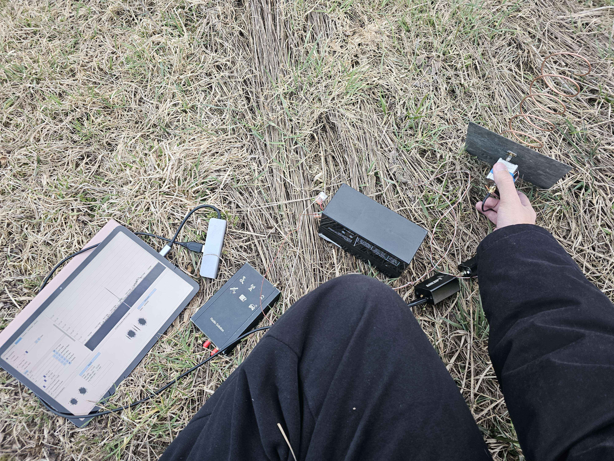
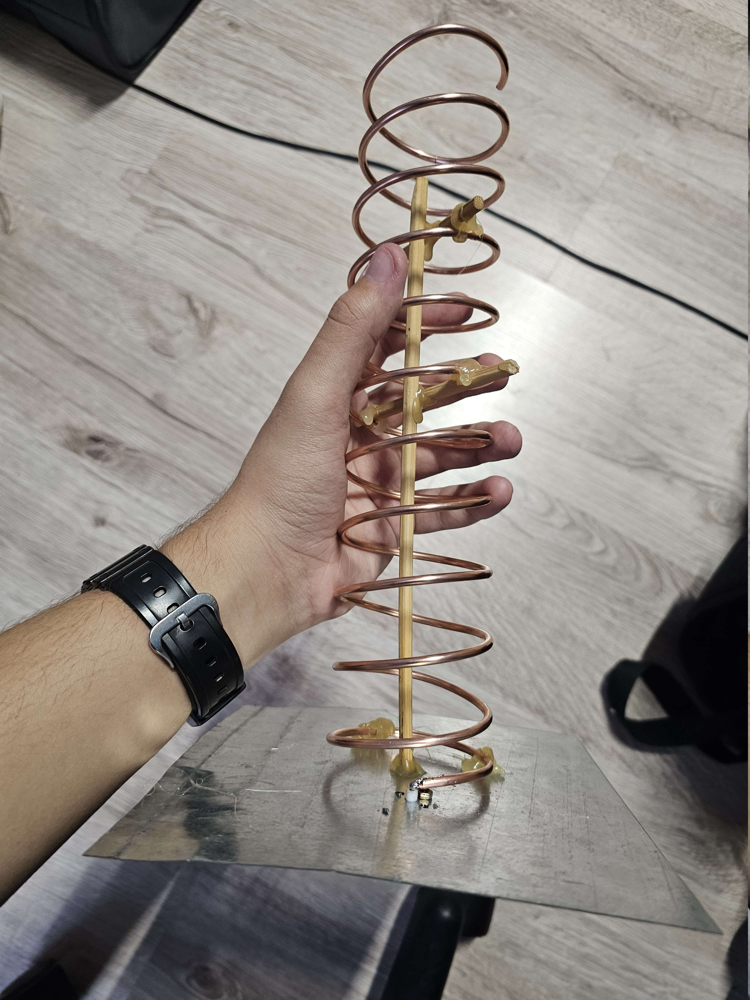
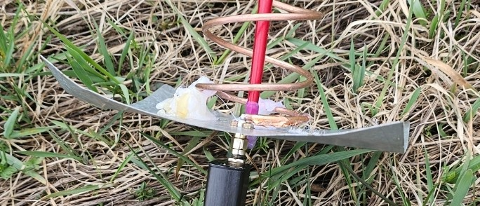
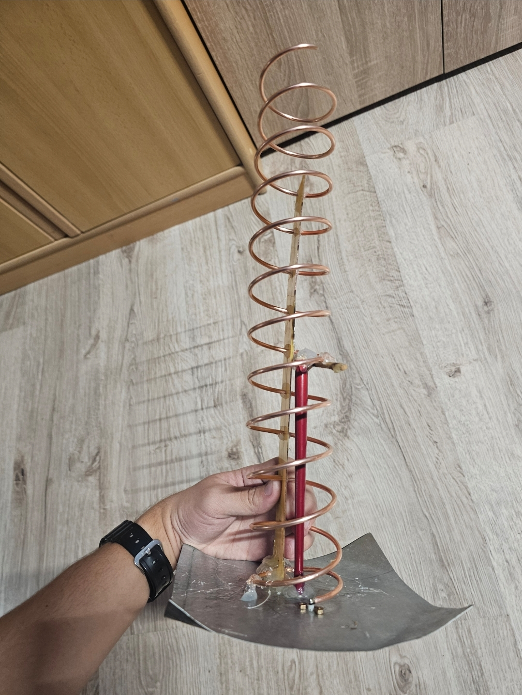
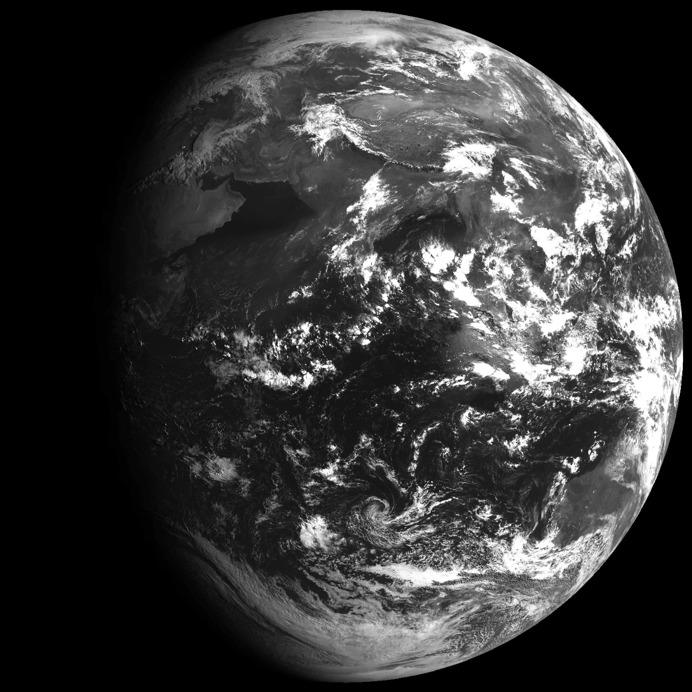
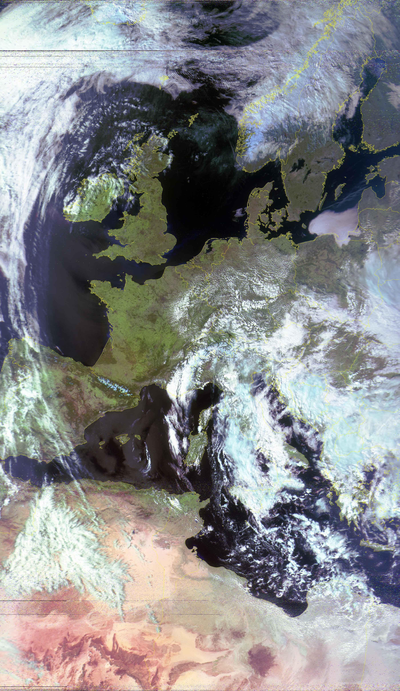
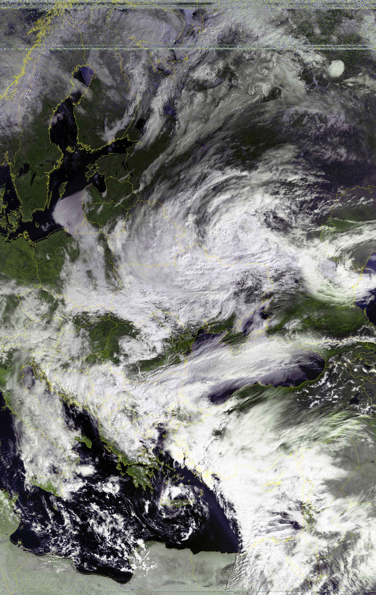

# Preamble
This page will describe how I made a helix to receive satellites without a dish, along with its results. If you're only here for those, you can skip to them [here](#more-results)

# The idea
Ever since I first started receiving L-band satellites, I dreamed of being able to do it on the fly. My backyard has a lot of trees during summer months that cover up to 10° both North and South, I have several spots with horizon-to-horizon coverage a few kilometers away, but cycling the distance isn't happening with a satellite dish. My ultimate goal with this project was to be able to receive Elektro-L3 LRIT from such spots, something claimed impossible by everybody I talked to about it.

In the beginning I looked at the helicone, an antenna type pioneered by <abbr title="@.skco on Discord">Slawek</abbr> that is arguably the most popular way to receive satellites with a portable setup as of writing this page. I was considering making one myself, but its relatively large size, a requirement for 3d printed parts, as well as a malleable mesh that can withstand repeated bending made me reconsider. That's when I thought of something quite stupid at a first glance: **using nothing but a helix and a ground plane.**

Using a helix for direct reception is possible by creating a **RHCP** helix instead of a LHCP one (since the polarization isn't mirrored by the dish), but it has a significantly smaller gain even compared to a helicone!

Not discouraged, I tried anyway - might as well, aye?

# Initial attempts

At first, I tried creating a helix with what I had on hand, a 16x16 cm ground plane and enough copper wire for 5.5 turns. This got me a fairly decent SNR on Elektro-L2 GGAK - 12 dB.

*Me pointing at Elektro-L2. I was using a G4DDK VLNA and Sawbird GOES+ as the second-stage amplifier at this time.*

Knowing I could greatly improve the efficiency by adding more turns (others got most success with ~8), I scrapped this one and created a new, 11 turn helix.

This helix already got me incredible results that surpassed all of my expectations. With the average SNR being at around 7 dB, the image came out with mostly no noise: 

*Meteor M2-3 received on 29/03/2025 with an 11 turn helix and Sawbird+ GOES. Processed using SatDump with the `AVHRR 543b IR false color` composite, equalized. 40% quality lossy JPEG compression applied, full resolution image can be viewed [here](https://static.cpt-dingus.cc/direct-rx-helix/msu_mr_2025-03-29_19-56-17Z_AVHRR%20543b%20IR%20False%20Color.png)*

After some more iterations, I ended up using an 8-turn helix, with which I figured out some important things...

# Major discoveries

Unlike reception with just a dish, receiving with a helix has significantly more variables. Some unexpected ones had a significantly higher impact than I expected:

1. **Height modulation**

    The height over the ground has a **MAJOR** effect on the received signal strength, to the point that the incorrect height can make the signal completely disappear. Holding the helix about 50 cm from the ground and modulating the height throughout the pass greatly improved the SNR.

2. **Rotation**

    Rotating the helix around has lead to about one more dB of SNR. This might just be imperfections in the build, but I felt it's worth mentioning here.

3. **Location**

    The location matters a LOT. I live in a city, always walk out to a local field for these passes. *This made every RX happen at a slightly different spot*. It took me a while to realize I can get Elektro L3 GGAK by moving just a few meters to the side, so that a cell tower has a few more trees to pass through before it hits the helix. This was enough to completely stabilize the noise floor and enable Elektro L3 reception, when it was completely drowned out by interference prior.

    This is primarily caused by the wider primary lobe and several unwanted side lobes which let in more unwanted signals and general interference.

4. **Bending the ground plane**

    Now this is where it gets interesting. At this point I was working with a 17x17 cm square ground plane, pointing my 8 turn helix at L3 GGAK. I got a peak of 8 dB, no better than my 5.5 turn iteration, this had me confused; how were 3 more turns adding *NO* SNR?! That's when I had an idea. A lot of projects like the helicone use round ground planes, while I was using a square. *What if I bent the edges up slightly*? Maybe it might help?

    And help it did. I managed to get 1.5 additional dB on L3 GGAK, making it peak at 9.5 dB, just shy of the threshold needed for LRIT.

  
*Pictured is my fourth, 8-turn iteration of the helix. See how the edges are bent upward.*

# Success at last

Seeing how close I was to an LRIT decode, I scrapped the helix one last time and created a new one with 11-turns. 

  
*My current, 11 turn direct reception helix.*

Combining all of my SNR discoveries, this helix got me a whopping 10.5 dB average on L3 GGAK, which ended up equaling to about 1.5 dB on LRIT. This was enough for a good decode and got me an image that was deemed impossible by many:

*Elektro-L3 channel 1 received on 03/04/2025 using an 11-turn helix, Sawbird+ GOES, AirSpy R2 from LRIT at 03:42Z. 60% quality lossy JPEG compression applied. Satellite elevation: 12°*

# More results

Having successfully gotten L3 LRIT without a dish at such a low elevation, my dream was complete. Here are some of my favorite LEO passes I've gathered up to that point:

  
*Meteor M2-3 received on 29/03/2025 with an 11 turn helix and Sawbird+ GOES. Processed using Satdump with the `Natural Color` composite, equalized. 40% quality lossy JPEG compression applied, full resolution image can be viewed [here](https://static.cpt-dingus.cc/direct-rx-helix/M2-4_01-04-2025_13-47.png)*

  
*Meteor M2-3 received on 29/03/2025 with an 11 turn helix and Sawbird+ GOES. Processed using Satdump with the `Natural Color` composite, equalized. 40% quality lossy JPEG compression applied, full resolution image can be viewed [here](https://static.cpt-dingus.cc/direct-rx-helix/N19_01-04-2025_08-21.png)*

I only had a few days to get these, there are more to come (: