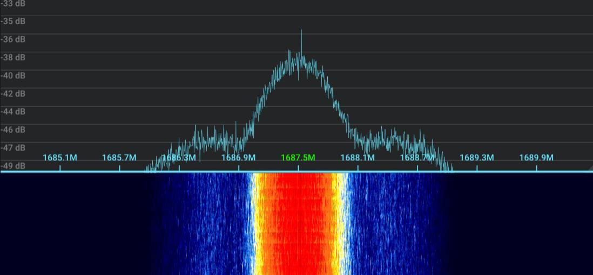
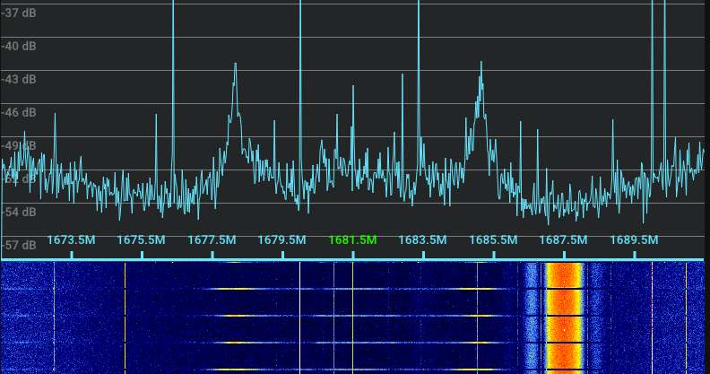
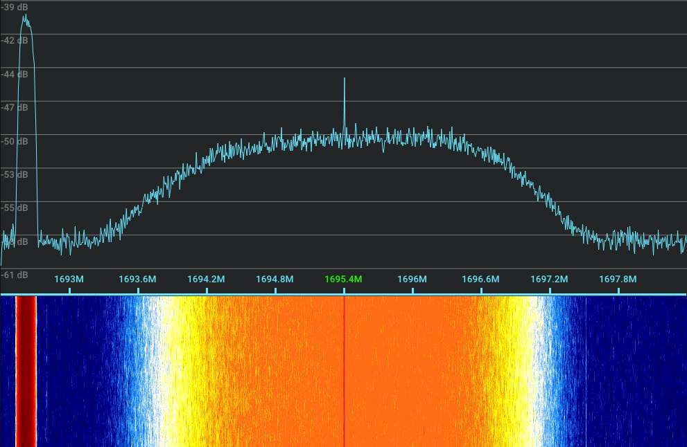

## Table of contents
{: .no_toc .text-delta }

1. TOC
{:toc}

# Preamble

If you're reading this, you have probably been intrigued by the lower resolution VHF imagery that you can (or even have) received yourself. Well, you're in for a ride! The L band is relatively easy to receive thanks to commercial solutions existing for the equipment, while it's been deprecated by most LEO satellites, it still offers a lot of interesting data; particularly geostationary satellites. This guide will cover both. You can expect resolutions of roughly 1 km/px in the majority of this band. This guide will definitively describe the reception of the **L satellite band (~1.7 GHz)** when it comes to weather satellites. 

**This guide assumes you have read the [VHF guide](Beginners guide to weather satellite reception) already, won't repeat some more basic concepts.**

There will be sample imagery next to every satellite series, you can view the raw tree along with credits [here](https://cpt-dingus.cc/static/sat-images). If an image doesn't have credit, I received it myself.
> This is still WIP! Dead links and incomplete lists are both possible while I set this up.

# Introduction

In relation to VHF:
- The L-band is **harder to receive** requiring some **specialized equipment** as well as a **dish** paired with some half decent craftsmanship skills.
- Offers **much** more interesting things including but not limited to uncompressed LEO satellite imagery, as well as full disk Earth scans.

## Example processed HRPT image


*NOAA 19 received on 14/1/2024 using a 90 cm dish and a SawBird GOES+. Processed using SatDump with the `NOAA Natural Color` RGB composite. Median blur applied, equalized. 30% quality lossy JPEG compression with 0.05 gaussian blur applied, click [here]({{site.baseurl}}/assets/images/Sat-reception-journey/Best-HRPT-yet.png) for the full resolution image.*


## Sample processed geostationary image


*Elektro-L N3 LRIT received on 11/2/2024 using a 125 cm dish and a SawBird GOES+. Decoded using SatDump. Pictured is the autogenerated `NC` (Natural Color) composite. 65% quality lossy JPEG compression with 0.05 gaussian blur applied, click [here]({{site.baseurl}}/assets/images/Sat-reception-journey/Best-Earth-full-disc.png) for the full resolution image.*

# SDR specific information

## RTL-SDR
These apply to all SDRs using RTL chipsets (RTLSDR blog, Nooelec SMART...)

- The maximum stable sampling rate is **2.56 Msps!** Using anything higher can lead to sample drops if you don't have one of the few incredibly specific USB controllers with which the RTL chipset can pull 3.2 Msps without dropping samples. You can test if higher sampling rates such as 2.88 Msps work on your setup by running `rtl_test -s 2.88e6` and seeing if any data is lost after a few minutes, or decoding a signal with FEC (Such as LRPT) near the edge of your spectrum and seeing if there are any spikes on the viterbi graph. *Android devices can usually handle 2.88 Msps without dropping samples.*
> Please note, that on some devices even 2.56 Msps drops samples! Run `rtl_test -s 2.56e6` to test, or receive signals with error correction and see if the viterbi graph has spikes (indicative of sample drops).
- RTL-SDR Blog V4 needs specific drivers to work with most software, the installation steps are described on their [quick start page](https://www.rtl-sdr.com/rtl-sdr-quick-start-guide/)
- Nooelec Smart SDR v5 also needs specific drivers to work with most software, the installation steps are described on their [quick start page](https://www.nooelec.com/store/qs/)

## HackRF One
- ***DO NOT USE THE `Amp` (preamplifier) OPTION!!!*** The preamplifier is flawed, can get killed **very easily**. An exception to this is when you're using **Clifford Heath's [redesign](https://www.aliexpress.com/item/1005005351172184.html)**, which adds several protections making the preamplifier safe to use.
- The HackRF has a fairly outdated design which suffers from heavy phase noise. This means, that you have to receive signals stronger than other SDRs to achieve the same quality.
- This SDR has a nasty DC spike in the middle. If dealing with thin signals, an offset of at least 50 kHz is recommended
- (Have to confirm, take with a grain of salt!) The HackRF has a frequency shift of 30 kHz. This is negligible in 99% of cases, but if dealing with signals that have very low symbol rates, you might have to tune 30 kHz above an already offset frequency to get a lock.
> Using an offset for thin signals is generally recommended because of the last two points, shifting +130 kHz should both problems.

## MiriSDR (MSI.SDR)
- The only version that doesn't have gaps in the L satellite band is a thin board with DIP switches. However, these DIP switches make the SDR quite deaf, requiring an additional amplifier just before the input to achieve decent results. This can be remedied by removing the DIP switches and directly soldering a wire between the RF input and the L frequency band. 


# Detailed satellite information

## Low-Earth-Orbiting satellites
- There are **9** LEO satellites currently broadcasting imagery in this band:
    - 3x NOAA POES
    - 2x Meteor-M
    - 2x MetOp
    - 1x AWS
    - 1x FengYun (Only broadcasts when in sight of China)


### NOAA POES

- These are the same as VHF: **NOAA 15, 18 and 19**.
- Have a [POES HRPT](https://www.sigidwiki.com/wiki/NOAA_POES_High_Resolution_Picture_Transmission_(HRPT)) (High Rate Picture Transmission) broadcast which transmits 5 AVHRR channels at a 1.1 km/px resolution as well as some more data (Refer to the hyperlink)
- The broadcast features a very strong carrier wave making it very easy to track
- Full resolution sample imagery:
    - [NOAA Natural color](https://cpt-dingus.cc/static/sat-images/L-band/LEO/NOAA%20POES/avhrr_3_2024-12-01_10-13-04Z_NOAA%20Natural%20Color.png)
    - [221](https://cpt-dingus.cc/static/sat-images/L-band/LEO/NOAA%20POES/avhrr_3_2024-12-01_10-13-04Z_AVHRR%20221%20False%20Color.png)
    - [4/221 merge](https://cpt-dingus.cc/static/sat-images/L-band/LEO/NOAA%20POES/avhrr_3_2024-12-01_10-13-04Z_4-221%20Merge.png)
    - [Enhanced Infrared](https://cpt-dingus.cc/static/sat-images/L-band/LEO/NOAA%20POES/avhrr_3_2024-12-01_10-13-04Z_Enhanced%20IR.png)
    - [NO](https://cpt-dingus.cc/static/sat-images/L-band/LEO/NOAA%20POES/avhrr_3_2024-12-01_10-13-04Z_NO%20enhancement.png)

> Reception note: NOAA 15 only uses a damaged emergency antenna, which makes the signal lose a consistent polarization, be much weaker than intended, and experience severe fading throughout the pass. Reception is still possible, but requires a bigger dish, completely clear LOS with the satellite, and more precise tracking than other satellites described here.


 <br>
*NOAA 19 HRPT*

> Fun fact: Since 2021, **NOAA 2** (ITOS-D) - A 50-year-old satellite! - has gone back to life transmitting a legacy [ITOS HRPT](https://www.sigidwiki.com/wiki/NOAA_ITOS_High_Resolution_Picture_Transmission_(HRPT)) broadcast. **It includes no actual imagery** since the VHRR sensor has died ages ago, however it still matches the modulation and spec - if decoded properly you can still see the familiar sync lines from APT broadcasts.

### METEOR-M

- 2 satellites from this constellation currently broadcast in this band: **Meteor M2-3** and **Meteor M2-4**
- Have a [**Meteor HRPT**](https://www.sigidwiki.com/wiki/METEOR-M_High_Resolution_Picture_Transmission_(HRPT)) broadcast containing 6 MSU-MR channels in addition to 30 MTVZA channels.
- This broadcast, much like POES HRPT, has a very strong carrier wave making it easy to track.
- Full resolution sample imagery:
    - [Natural color](https://cpt-dingus.cc/static/sat-images/L-band/LEO/Meteor-M/msu_mr_2024-11-09_13-23-58Z_AVHRR%20221%20False%20Color.png)
    - [221](https://cpt-dingus.cc/static/sat-images/L-band/LEO/Meteor-M/msu_mr_2024-11-09_13-23-58Z_AVHRR%20221%20False%20Color.png)
    - [Day microphysics](https://cpt-dingus.cc/static/sat-images/L-band/LEO/Meteor-M/msu_mr_2024-11-09_13-23-58Z_Day%20Microphysics.png)

 <br>
*Meteor-M N°2-2 HRPT*


- Meteor-M N°2-2 has recently inexplicably stopped broadcasting imagery in the L and X bands, with the last known successful reception being on the 24th of July 2024. The C band telemetry broadcast has been received since then, showing the satellite is still in orbit, but no other emissions have been detected. Roscosmos hasn't released a statement yet, Lego11 has suggested this might be because the satellite is undergoing in-flight testing, but this has not been confirmed. UsRadioGuy presumes the satellite to have failed: 
> *"HRPT was transmitting up until July 2024, however that has since stopped. VNIIEM (the Russian State Corp that built the satellite) has since stopped supporting logistics for M2-2 HRPT, it is presumed that the system has failed.*" [source](https://usradioguy.com/meteor-satellite/#status)
    


### MetOp
- There are two functional satellites: **MetOp-B** and **MetOp-C** operated by EumetSat, launched in 2013 and 2019 respectively.
- Have a [MetOp AHRPT](https://www.sigidwiki.com/wiki/METOP_Advanced_High_Resolution_Picture_Transmission_(AHRPT)) (Advanced High Rate Picture Transmission) broadcast which - unlike NOAA POES and METEOR-M HRPT - includes Reed-Solomon FEC to make sure your picture doesn't come out with grain. The broadcast also contains several more instruments and much more data, including 5 AVHRR channels at a 1.1 km/px quality as well as one IASI Imaging channel at 0.8 km/px.
- The signal does not have a carrier wave or easily discernible bumps making it a bit harder to track, it presents as a jumpy signal on the FFT.

> !WARNING! - As of 03/2025, MetOp B has been found to have a deteriorating modulator causing a significant hit to the expected AHRPT SNR. According to receptions by Lego11 and Aang23, there is an approximately 7 dB loss compared to the nominal status. This issue is visible when decoding at higher SNRs, the modulator starts to form an X shape instead of the correct OQPSK modulation.


- Full resolution sample imagery:
    - [NOAA Natural color](https://cpt-dingus.cc/static/sat-images/L-band/LEO/Metop/avhrr_3_2024-10-13_09-09-23Z_NOAA%20Natural%20Color.png)
    - [221](https://cpt-dingus.cc/static/sat-images/L-band/LEO/Metop/avhrr_3_2024-10-13_09-09-23Z_AVHRR%20221%20False%20Color.png)
    - [4/221 merge](https://cpt-dingus.cc/static/sat-images/L-band/LEO/Metop/avhrr_3_2024-10-13_09-09-23Z_4-221%20Merge.png)
    - [Day microphysics](https://cpt-dingus.cc/static/sat-images/L-band/LEO/Metop/avhrr_3_2024-10-13_09-09-23Z_Day%20Microphysics%20(Metop).png)
    


> Reception note: When receiving with an RTLSDR, you might run into some issues owing to its relatively high symbol rate. If you get a donut shaped constellation while decoding this signal, make sure to follow [this heading](#bad_constellation) to lower the PLL bandwidth.

 <br>
*MetOp B AHRPT*

### Arctic Weather Satellite

- **Arctic Weather Satellite** (AWS for short) is a prototype satellite that launched very recently - 08/2024, broadcasts imagery at a 10-40 km/px quality, depending on the channel.
- Broadcasts a 24/7 DB signal, dumps full orbit imagery to Svalbard.
- Is a prototype to EPS-STERNA, which is scheduled to be a satellite constellation that fills the gap in Geostationary satellite data present at the poles. These satellites are expected to launch in 2029, have the same imaging instrument as AWS.

> Reception note: The satellite antenna seems to have an inconsistent radiation pattern causing the signal to significantly fluctuate when heading away from you.

- Please note that this satellite has launched very recently and is still commissioning. The signal might be disabled for days at a time without prior notice, or contain erroneous data.
- As of the latest commit, the satellite dumps to Svalbard on seemingly every pass, the direct broadcast is currently only filler.

- Full resolution sample imagery:
    - [AMSU False color](https://cpt-dingus.cc/static/sat-images/L-band/LEO/AWS/sterna_2024-11-16_18-18-55Z_AMSU%20False%20Color.png)
    - [Microwave airmass](https://cpt-dingus.cc/static/sat-images/L-band/LEO/AWS/sterna_2024-11-16_18-18-55Z_Sterna%20Microwave%20Airmass.png)


 <br>
*AWS PFM while in Direct Broadcast mode*

 <br>
*AWS PFM while dumping*

### FengYun 3

- The only satellite from this constellation still broadcasting in the L-band is **FengYun 3C**. Due to a severe power supply failure **it only broadcasts when in sight of China** (When its footprint is anywhere within Chinese territory). 
- It broadcasts a FengYun AHRPT signal containing 10 VIRR channels in addition to some other instruments. The broadcast has Reed-Solomon FEC, but unlike any other satellite in the L-band **it broadcasts channels required for true color** - exactly what you would see with your eyes if you stood right next to the satellite.
- The signal has a relatively high symbol rate, can't be decoded with a standard RTLSDR dongle.

> Reception note: The signal might cut out a bit sooner or later than it gains/loses LOS with Chinese territory, it does not follow the rule to the tee.


- Full resolution sample imagery:
    - [197 (True color)](https://cpt-dingus.cc/static/sat-images/L-band/LEO/FengYun%203C/virr_2024-08-06_13-12-16Z_197.png)
    - [221](https://cpt-dingus.cc/static/sat-images/L-band/LEO/FengYun%203C/virr_2024-08-06_13-12-16Z_221.png)

 <br>
*FengYun 3C AHRPT*


### Frequency reference

|Satellite|Frequency|Notes|
|---|---|---|
|NOAA 15|1702.5 MHz|**Very weak**|
|NOAA 18|1707 MHz||
|NOAA 19|1698 MHz||
|Meteor M2-3, M2-4|1700 MHz||
|MetOp B|1701.3 MHz|Lower SNR than MetOp C|
|MetOp C|1701.3 MHz||
|Arctic Weather Satellite|1707 MHz||
|FengYun 3C|1701.4 MHz||


## Geostationary satellites
- Receiving these is arguably even easier than LEO satellites, since the only limiting factors are line of sight and dish size
- Don't require tracking, since the satellites don't move (It's on the tin - geo**stationary**)\*
- Broadcast full disc images of the earth and/or regional crops

\* Some older satellites might have an increased inclination, where they slowly move in an 8 shape throughout a day. They still maintain a consistent longitude though.
<br>

- There are **13** geostationary satellites broadcasting imagery in this band:
    - 2x GOES in the US
    - 1x EWS-G in Europe and Asia (Retired GOES)
    - 2x Elektro-L in Europe, Asia and Oceania
    - 4x FengYun in Asia and Oceania
    - 1x Geo-Kompsat in Asia and Oceania
    - 3x MSG in Europe


### GOES

- **GOES 16** and **GOES 18**, satellites from the `GOES-R` series, are the two currently operational satellites broadcasting three signals: 
    - **CDA Telemetry** - Contains telemetry (duh), can be used to check your setup is working properly.
    - **HRIT** - A strong and very easy to receive signal transmitting imagery at 2 km/px, as well as rebroadcasted data from other satellites such as Meteosat and Himawari
    - **GRB** - A fairly weak rebroadcast sending full quality data from the majority of instruments, has a massive 7.8 Msym/s. Transmits half the data over RHCP and the other half over LHCP.

- All of these include FEC, meaning you should be able to properly decode them even when the signal is quite weak. HRIT has notably good FEC, able to get clean imagery even out of just 1 dB!

- HRIT transmits:
    - Full disk Earth: 1x VIS + 6x IR at 2 km/px every 30 minutes
    - Mesoscale crops: 1x VIS + 2x IR at 2 km/px every 15 minutes
    - The other operational GOES 1x IR at 4 km/px every hour
    - Himawari: 1x VIS, 1x IR, 1x WV at 4 km/px every hour
    - Meteosat: 1x IR at 15 km/px every hour\*
    - Miscellaneous EMWIN data (Crops, weather charts, L2 products...)

\* I've only seen this in GOES-East HRIT. Additionally, the imagery is in `EMWIN`, not `IMAGES`.

- GRB specifically transmits:
    - LHCP:
        - ABI channels 2,7,8,10,14,15,16\*
    - RHCP:
        - ABI channels 1,3,4,5,6,9,11,12,13
        - Goes lightning mapper
        - SUVI imagery
        - SEM (Solar flux, magnetometer)


\* All channels except 10 and 16 are also transmitted via HRIT - getting the LHCP broadcast is pretty much pointless.

- Full resolution sample imagery:
    - HRIT:
        - Full disk:
            - [ABI False Color](https://cpt-dingus.cc/static/sat-images/L-band/Geostationary/GOES/GOES-18/HRIT/Full%20Disk/2025-01-08_21-00-20/abi_ABI%20False%20Color.png)
            - [Day cloud convection](https://cpt-dingus.cc/static/sat-images/L-band/Geostationary/GOES/GOES-18/HRIT/Full%20Disk/2025-01-08_21-00-20/abi_Day%20Cloud%20Convection.png)
        - Mesoscale: 
            - TODO
        - Other data:
            - [Retransmitted other GOES](https://cpt-dingus.cc/static/sat-images/L-band/Geostationary/GOES/GOES-18/HRIT/other-data/GOES-16/Full%20Disk/2025-01-08_21-00-20/G16_13_20250108T210020Z.png) (GOES 16 retransmitted from GOES 18 HRIT)
            - [Himawari](https://cpt-dingus.cc/static/sat-images/L-band/Geostationary/GOES/GOES-18/HRIT/other-data/Himawari/2025-01-08_21-51-00/) (click on a file to view it)
            - MSG (TODO)

    - GRB:
        - Have no data available as of now. If you have any, please contact me using the information at the bottom of this page.


 <br>
*GOES 18 CDA Telemetry on the left, HRIT in the middle. CC: phantomsghost on Discord*

 <br>
*GOES 18 GRB, spike on the left is DCP and spike on the right is CDA telemetry.*

> GOES 19 has launched fairly recently, is currently commissioning with no active L band imagery broadcasts. It is expected to replace GOES 16 in early-to-mid 2025.
> GOES 14, 17 are currently in on-orbit storage and are not broadcasting anything useful.


### EWS-G

- **EWS-G2 (GOES 15)**, a retired GOES satellite part of the `GOES-N` series, was transferred to USSF and moved over the Indian Ocean to replace EWS-G1 (GOES 13) and now broadcasts a few relatively weak signals:
    - **CDA Telemetry** - Contains telemetry (duh), can be used to check your setup is working properly.
    - **GVAR** - A relatively weak broadcast that contains all 5 imagery channels at a 1 km/px quality for the singular VIS channel and 4 km/px for the other IR channels.
    - **SD** - Broadcasts raw instrument data, separates into two downlinks on the same frequency:
        - **Raw imager data**
        - **Raw sounder data**
- GVAR is very prone to corruption because of lacking FEC, which often causes lines to be misplaced in the resulting imagery. I have created a corrector to make the imagery more presentable even at low SNRs, you can view it [here](https://github.com/Cpt-Dingus/GVAR-line-corrector/).
- The sounder is disabled: The raw sounder downlink is empty, GVAR produces empty sounder images.

> Reception note: The satellite normally does regional crops, as they can be scanned faster than full disc images at just 15 minutes. It still transmits a full disc image every 3 hours.

- Full resolution sample imagery:
    - [False Color](https://cpt-dingus.cc/static/sat-images/L-band/Geostationary/EWS-G/EWS-G2/GVAR/2025-02-16_13-01/G15_FC_20250216T130335Z.png)

 <br>
*EWS-G2 (GOES 15) GVAR*

 <br>
*GOES 13 SD: sounder SD is the thin spike in the middle, everything else is the imager SD. CC: dereksgc on Discord*

 <br>
*EWS-G2 (GOES 15) CDA*


### Elektro-L
- **Elektro-L N°3** and **Elektro-L N°4** (Elektro-L# for short) are the two satellites from the Elektro-L series broadcasting imagery in the L-band. Due to a fairly recent power supply failure, Elektro-L2 only broadcasts a beamed X-band transmission to Moscow.
- They broadcast **Low Rate Information Transmission (LRIT)** as well as **High Rate Information Transmission (HRIT)** signals containing full disc images of the earth at a 4 km/px quality. Both of these include Reed-Solomon FEC, meaning you can get clear imagery at just ~2.5 dB.
- LRIT broadcasts any number of channels, for Elektro-L3 it's 3 visible channels, one water vapor channel (degraded), as well as one infrared channel. L4 broadcasts channels too inconsistently to be specified here.

> Reception notes:
> - **LRIT**:
>   - LRIT broadcasts pre-equalized channels, which often end up severely over-exposing the imagery. The reason why imagery is broadcasted like this is unknown.
>   - After a few minutes of LRIT from Elektro-L3, you will be able to notice a spiky signal appear at 1690.5 MHz, this is linearly polarized dead LRIT from the neighboring satellite FengYun 2H. It might interfere with Elektro LRIT reception, in which case you should point slightly farther from 2H.
>   - Elektro-L4 has broadcast issues; the LRIT broadcast consistently cuts off after 15 minutes, even when in the middle of transmitting an image.
> - **GGAK**:
>   - You can use GGAK as a 24/7 metric to see if you are capable of decoding xRIT: 10 dB on GGAK should equal to about 2.5 dB on LRIT (enough for a decode), 17 dB on GGAK should equal to about 3 dB on HRIT (enough for a decode).
>   - GGAK gets significantly weaker while an xRIT transmission is in progress.
>   - Elektro-L2 also transmits GGAK, but the strength is different from its contemporaries. It used to be a tad weaker, now it appears to be significantly stronger.
>   - GGAK has a very low symbol rate, you might have difficulties getting the pipeline to lock. If you have trouble doing so:
>       1. Set frequency offset to -50 KHz, shift to 1691.05 MHz
>       2. Start the pipeline
>       3. If you don't sync, look at the `Frequency` value, it will likely be pinned at +3 KHz or -3 KHz. Shift 3 KHz lower or higher respectively, it should lock thereafter.

- Full resolution sample imagery:
    - [HRIT Natural color](https://cpt-dingus.cc/static/sat-images/L-band/Geostationary/Elektro/Elektro-L3/HRIT/2024-11-09_09-00-00/msu_gs_Natural%20Color.png)
    - [LRIT Natural color](https://cpt-dingus.cc/static/sat-images/L-band/Geostationary/Elektro/Elektro-L3/LRIT/2024-10-13_09-30-00/msu_gs_Natural%20Color.png)


*Elektro-L N°3 LRIT on the top, HRIT on the bottom*


*Elektro-L N°3 GGAK*


### FengYun

#### FengYun 2 series
- **FengYun 2H**, and **FengYun 2G** broadcast a **linearly polarized S-VISSR** signal containing 5 channels (1 visible, 4 infrared) at a fairly high quality - 1.25 km/px for the singular VIS channel and 5 km/px for the 4 IR channels.
- This signal is very prone to corruption because of lacking FEC, which often causes misplaced/missing lines. You can use [HRPTEgors S-VISSR corrector](https://github.com/Foxiks/fengyun2-svissr-corrector) instead of the default `FengYun 2 S-VISSR` pipeline to remedy this.
- FengYun 2H broadcasts dead (empty) LRIT every hour (except 5:30Z and every 6 hours onwards) on 1690.5 MHz, this leads to the second image being cut at about 57%.

> These satellites also broadcast an incredibly weak **CDAS** raw downlink, but it's almost completely undocumented owing to its weak & wide nature. It is present just left S-VISSR, the satellite uses the same transmitter as S-VISSR to transmit it albeit at a significantly higher symbol rate to instantly transmit the whole scan line in real time. This is the reason why S-VISSR is so jumpy.

- Full resolution sample imagery:
    - [False color crop](https://cpt-dingus.cc/static/sat-images/L-band/Geostationary/FY-2/FengYun-2H/2025-02-16_12-44/FY-2x_FC_20250216T124452Z.png)
    - [False color FD](https://cpt-dingus.cc/static/sat-images/L-band/Geostationary/FY-2/FengYun-2H/2025-02-16_13-25/FY-2x_FC_20250216T132604Z.png)
    - [False color FD](https://cpt-dingus.cc/static/sat-images/L-band/Geostationary/FY-2/FengYun-2H/2025-02-16_10-25/FY-2x_FC_20250216T102523Z.jpg) (More illumination, but JPG)

 <br>
*Fengyun 2H S-VISSR*

 <br>
*FengYun 2H S-VISSR on the right, short horizontal blips are CDAS. See how the blips line up with the gaps in S-VISSR.*

#### FengYun 4 series
***! WARNING ! - I can't confirm the status of either of these, if you have any information about it please let me know using the contacts at the bottom of this page. The satellites seem to intermittently cease broadcasts, rarely transmit any imagery.***

> Latest updates:
>   - 10/1/2025: No visible broadcast from FengYun 4B
>   - 01/2/2025: No visible broadcast from FengYun 4A

- **FengYun 4A** and **FengYun 4B** currently broadcast a **linearly polarized LRIT** and **HRIT** signals. The LRIT signal only broadcasts at a very poor quality (Have to confirm, but less than 4 km/px), HRIT only transmits a single unencrypted infrared channel.
- This satellite series has been shrouded in mystery, with both satellites having transmitted xRIT in the past albeit without any live imagery. These broadcasts have intermittently stopped without any acknowledgement from NSMC (Satellite operators).


- Full resolution sample imagery:
    - [LRIT](https://cpt-dingus.cc/static/sat-images/L-band/Geostationary/FY-4/FengYun-4A/LRIT/2023-08-04_11-14_plugger_lockett/) - Credit to plugger_lockett, click on a file to view it
    - [HRIT](https://cpt-dingus.cc/static/sat-images/L-band/Geostationary/FY-4/FengYun-4A/HRIT/2023-08-22_06-14_plugger_lockett/FY4A_12_20230822T061400Z.png) - Credit to plugger_lockett

 <br>
*FengYun 4A LRIT, CC: drew0781 on Discord*

 <br>
*FengYun 4A HRIT, CC: drew0781 on Discord*

### GEO-KOMPSAT
- **GEO-KOMPSAT-2A** currently broadcasts **LRIT** and **HRIT** at a 4 and 1 km/px peak quality respectively. The broadcasts are encrypted, but the decryption key has been shared by the operators, making amateur reception possible.
- LRIT is notorious for being extremely strong, not even requiring a dish to decode an image.

<br>

- LRIT transmits miscellaneous data in addition to a 4 km/px IR channel every 10 minutes
- HRIT transmits 1x 1 km/px VIS, 3x 4 km/px IR, 1x 4 km/px water vapor every 10 minutes


- Full resolution sample imagery:
    - [HRIT](https://cpt-dingus.cc/static/sat-images/L-band/Geostationary/GK-2A/HRIT/2025-01-08_04-26-36/) (Click on a file to view it, VI006 is the visible channel)
    - [LRIT Clean longwave IR](https://cpt-dingus.cc/static/sat-images/L-band/Geostationary/GK-2A/LRIT/2024-12-28_08-50-06/ami_Clean%20Longwave%20IR%20Window%20Band.png)


 <br>
*GEO-KOMPSAT-2A LRIT on the left, HRIT in the middle*


### Meteosat Second Generation (MSG)
- **Meteosat 9, 10, and 11** broadcast a notoriously weak **linearly polarized PGS raw data downlink** containing all of their channels - 2x VIS at a 1.6 km/px quality, and 9x IR at a 4.8 km/px quality.
- This is the second weakest geostationary L-band signal behind FengYun 2 CDAS, requiring approximately a massive **4-metre dish** to decode. 
> Few people have access to such dish sizes in Europe, I personally only know of 3 people ever receiving it, all with custom amplifiers. The 4-metre estimate stems from @Digielektro using a 3-metre dish and a custom amplifier for a decode.
- The SEVIRI instrument has three operating modes:
    - HRV - High Resolution Visible - A crop of Europe and a crop of the bottom hemisphere is transmitted every 15 minutes, these move with sunlight as pictured below <br>
<br>
*HRV crops, [source](https://user.eumetsat.int/resources/user-guides/msg-high-rate-seviri-level-1-5-data-guide#ID-HRV-SEVIRI-scan-modes)*

    - RSS - Rapid Scan Service - The top third of the Earth is transmitted every 5 minutes
    - FES - Full Earth Scan - The whole earth is scanned every 15 minutes, only enabled during eclipse season

- Full resolution sample imagery (credit to FelixTRG):
    - [321](https://cpt-dingus.cc/static/sat-images/L-band/Geostationary/MSG/Meteosat-10/seviri_rgb_321.png)
    - [221](https://cpt-dingus.cc/static/sat-images/L-band/Geostationary/MSG/Meteosat-10/seviri_rgb_221.png)
    - [Day Microphysics](https://cpt-dingus.cc/static/sat-images/L-band/Geostationary/MSG/Meteosat-10/seviri_rgb_Day_Microphysics.png) - Misaligned channels, 'blur' effect
    - [Water Vapor](https://cpt-dingus.cc/static/sat-images/L-band/Geostationary/MSG/Meteosat-10/seviri_rgb_7.35_%c2%b5m_Water_Vapor.png)

> Reception note: The minimal dish size is speculative due to insufficient data, I do not know of anybody receiving it with just a SawBird. The 4-metre dish size given is a rough estimate.

> These satellites used to transmit a much stronger LRIT signal which contained five channels along with rebroadcasted GOES data, but the broadcast was [discontinued in 2018](https://web.archive.org/web/20170318043205/https://www.eumetsat.int/website/home/News/DAT_3247528.html).


*Meteosat 9 PGS, CC: that_zbychu on Discord. The thin spikes present aren't a part of the signal.*


## Signal information

### Low-earth-orbiting

All signals mentioned here are RHCP except NOAA 15, which doesn't have a specific polarization due to a bent antenna.

|Signal|Minimum dish size|Symbol rate|FEC|Notes|
|---|---|---|---|---|
|NOAA POES HRPT|60|665.6 Ksym/s\*|No|
|Meteor HRPT|60|665.6 Ksym/s\*|No|
|MetOp AHRPT|60|2.33 Msym/s|Yes|Just barely receivable with an RTLSDR, might cause [issues](#bad_constellation)
|AWS PFM|60|1.785 Msym/s|Yes|Fades when facing away
|FengYun AHRPT|80|2.80 MSym/s|Yes|Not receivable by an RTLSDR, needs at least 3.4 Msps

\* Parallel modulated signals - Two 665.6 Ksym/s bumps. SatDump receives both, a sampling rate of at roughly 2.4 Msps is recommended.

### Geostationary
- The minimum dish size heavily depends on the satellite's elevation! You might be able to get it with a smaller dish if the satellite is high up, or need a bigger dish if it's low in the sky (~ <15°)
- The minimum dish size stated is when considering an optimal feed setup and a SawBird GOES.

> **The table continues to the right! Jekyll is just stupid with overflow**

|Satellite series|Signal|Frequency|Symbol rate|Polarization|Minimum dish size|FEC|Transmits...
|---|---|---|---|---|---|---|---|
|Elektro-L|LRIT|1691 MHz|294 KSym/s|RHCP|80 cm|Yes|Every 3 hours from midnight UTC at XX:42 excluding 06:42
|Elektro-L|HRIT|1691 MHz|1.15 Msym/s|RHCP|125 cm|Yes|Every 3 hours from midnight UTC at XX:12 excluding 06:12
|Elektro-L|GGAK|1693 MHz|5 Ksym/s|RHCP|N/A|N/A|Constantly, can be used to verify your setup is functional
|GOES-R|CDA Telemetry|1693 MHz|40 Ksym/s|Linear|N/A|Yes|Constantly, can be used to verify your setup is functional
|GOES-R|HRIT|1694.1 MHz|927 KSym/s|Linear|80 cm|Yes|Constantly, image every 15 minutes
|GOES-R|GRB|1681.6 MHz|8.67 Msym/s|Circular\*|180 cm|Yes|Constantly
|EWS-G|CDA Telemetry|1694 MHz|40 Ksym/s|Linear|N/A|Yes|Constantly, can be used to verify your setup is functional
|EWS-G|GVAR|1685.7 MHz|2.11 Msym/s|Linear|125 cm**|No|Full disc image at midnight UTC, every 3 hours onwards. Regional crops every 15 minutes rest of the time.
|EWS-G|Imager SD|1676 MHz|2.62 Msym/s|Linear|300 cm|No|Constantly
|EWS-G|Sounder SD|1676 MHz|40 Ksym/s|Linear|125 cm|No|Constantly
|Fengyun 2|S-VISSR|1687.5 MHz|660 Ksym/s|Linear|80 cm\*\*|No|XX:00 - XX:28, second timeslot variable\*\*\*
|FengYun 4|LRIT|1697 MHz|90 Ksym/s|Linear|TODO|Yes|Hourly
|FengYun 4|HRIT|1681 MHz|1 Msym/s|Linear|TODO|Yes|Every half an hour
|GEO-KOMPSAT|LRIT|1692.14 MHz|128 Ksym/s|Linear|None\*\*\*\*|Yes|Constantly, image every 10 minutes
|GEO-KOMPSAT|HRIT|1695.4 MHz|3 Msym/s|Linear|175 cm|Yes|Constantly, image every 10 minutes
|Meteosat Second Generation|PGS|1686.83 MHz|3.75 Msym/s|Linear|300 cm\*\*\*\*\*|Yes|Constantly, image every 15 minutes in HRV and FES modes and every 5 minutes in RSS mode|

\* Half the data sent over RHCP, the other half over LHCP <br>
\*\* Only with the respective corrector, the image will otherwise be severely cut up. <br>
\*\*\* **FengYun 2H:** 5:30-5:58 UTC and every 6 hours after, XX:30-XX:48 at all other times | **FengYun 2G:** 01:30-01:58 UTC and every 4 hours after <br>
\*\*\*\* LRIT is notoriously strong, just pointing the feed at the satellite is often enough to decode products. <br>
\*\*\*\*\* Only tested using a custom LNA such as a [G4DDK VLNA](http://www.g4ddk.com/VLNASept13.pdf).


## Symbol and sampling rate relation

You can only receive these signals with an SDR that has a sampling rate at least roughly 1.2x greater than the signal's symbol rate. Not having enough overhead will make the signal weaker as well as cause issues such as a donut constellation on the demodulator (described [here](#bad_constellation)). Overhead is also needed because of doppler shifting and the SDR's reference inaccuracy. According to the [Nyquist-Shannon sampling theorem](https://en.wikipedia.org/wiki/Nyquist%E2%80%93Shannon_sampling_theorem), the ideal sampling rate is twice the symbol rate -  anything less than that will result in lower and lower SNR and anything higher has basically no benefit.


# Hardware requirements


## SDR

- Any SDR able to sample this band (~1.7 GHz) will work, just make sure its sampling rate is adequate to receive the satellites of your choosing.

## LNA

- L-band radio waves are very weak and dissipate too quickly to be usable with just your SDR - an LNA connected directly to the feed is imperative.
- The only viable commercial option that doesn't cost a liver is the [Sawbird+ GOES](https://www.nooelec.com/store/sawbird-plus-goes-302.html) from Nooelec. It is a filtered LNA providing very good performance for L-band satellite reception.

> Do not waste your money on cheap wideband LNAs, **they will NOT work well enough to get satisfactory results.**

## Dish

- A prime focus, offset, or grid dish are all usable for L band reception, with some minor notes:
    - Prime focus dishes require fewer turns on the helix (compared to an offset) or a [patch feed](http://sat.cc.ua/page3.html) for better performance altogether
    - You can hold the dish upside down (arm side up) to 'invert' the offset - you can point higher than the satellite instead of below it, this allows much easier reception at lower elevations.
    - Wi-Fi grid dishes HAVE to have the reflector be flipped to be usable in the L band, you can also follow [UsRadioGuy's guide](https://usradioguy.com/optimizing-wifi-grid) to optimize the dish some more. <br>
     <br>
    *Credit: lego11*

- The bigger the dish, the harder it is to track with, but the higher gain you have - the stronger the signals will be. 

An 80 cm offset is a great starter dish, given its lightness and wide availability - people give these away all the time after switching to terrestrial television. Check your local marketplaces, you ought to find something!


## Feed

- The dish is only a half of the story though, you will need to DIY the feed yourself - it isn't difficult but requires a bit of effort.
- Different feeds are used for different satellites due to different polarizations, all weather satellites in this band are either **Circular** or **Linear**. They separate as follows:
    - LEO satellites exclusively use the RHCP polarization
    - The majority of geostationary satellites use a linear polarization, with one series using RHCP.
    - GOES GRB is an outlier in geostationary satellite signals, uses both RHCP and LHCP. The LHCP broadcast is pretty much useless to receive, won't be mentioned in further polarization warnings.

> Warning: Using a dish reflects circular polarizations, meaning you need to create a **LHCP** feed to receive RHCP signals!

<br>

Popular options for feeds are as follows:
- Circular
    - [Helical antenna](https://en.wikipedia.org/wiki/Helical_antenna): Very forgiving which makes it recommended for beginners, best for offset dishes.
    - [Patch feed](http://sat.cc.ua/page3.html): Recommended for prime focus dishes.

- Linear
    - [Cantenna](https://www.changpuak.ch/electronics/cantenna.php): A very easy to make antenna with decent results on both offset and prime focus dishes. This band requires a roughly 11-13 cm diameter, refer to the linked calculator for more info.
    - [Loop feed](http://www.om6aa.eu/Loop_Feed_with_enhanced_performance.pdf): A fairly unforgiving but very simple feed, you can maximize performance when using a prime focus dish by using [this calculator](https://projects.radioastro.pl/loop_feed_calculator/#/LoopFeed) and trying to get your dish's F/D.
    - [VE4MA](http://www.w1ghz.org/antbook/conf/high_efficiency_prime_feeds.pdf): A very solid performing feed, best for prime focus dishes.

- This guide will have instructions on building a helical feed, loop, and a cantenna.


## Building a helical feed

> Helix dimensions are from Lego's [HRPT guide](https://www.a-centauri.com/articoli/easy-hrpt-guide)

### Materials 

You will need the following materials:
- A flat and conductive material that has **AT LEAST** a 13 cm diameter (i.e. a computer case side panel). A thin paint layer shouldn't greatly affect signal strength.
- About a meter of 2.5 mm copper wire. Different widths are fine, but 2.5 mm is optimal.

- Male panel mount SMA port, preferably insulated - [Example](https://www.aliexpress.com/item/1005003803735398.html)
- Adequately sized screws and nuts for the SMA port's mounting holes

- If not using a 3d printed scaffold (linked later), a non-conductive material used as a support for the helix

Appropriate tools for creating this antenna are a soldering station and multimeter.

> - The groundplane can be either circular or square (13x13 cm). Larger ones (i.e. 17x17 cm) can be used, might have a minor SNR benefit particularly on offset dishes where the larger ground plane doesn't cover the dish itself.

### Parts of a helical antenna

The helical antenna consists of two primary parts: 
- **Ground plane** - The conductive surface the helix is laid upon, acts as a secondary reflector (Where the primary one is the dish itself)
- **Helix** - The wound copper wire

 <br>
*R = Ground plane; C = Coaxial feed; S = Helix; B/E = Supports. [Source](https://en.wikipedia.org/wiki/Helical_antenna)*

### Winding the helix

The helix should have these dimensions:
- Turn spacing: 3 cm

- Spiral diameter: 5.5 cm

- Number of turns: 5.5 (3.5 on prime focus dishes)

You have two choices for winding the wire:
- You can wind it manually (Tip: 55 mm PVC pipes are really useful for keeping a consistent diameter)
- 3d print a [premade stand](https://www.thingiverse.com/thing:4980180) and stick a wire through it. Also acts as a support for the wire. If you choose this approach, use the `1700L_5.5T_0.14S_4D_10-90M.stl` file

#### Polarization warning!

> ***This antenna is circularly polarized, meaning you have to match it to the satellites' to be able to receive anything!***

In this case, the satellites transmit a RHCP signal, <u>but using a dish reflects it - you have to create a <b>LHCP</b> helix!</u>

 <br>
*Credit: lego11, [source](https://www.a-centauri.com/articoli/easy-hrpt-guide)*


### Putting it all together

1. Drill a hole exactly 2.75 cm from the center of the ground plane for the SMA port
2. Drill holes matching up with the mounting holes of your SMA port, use screws and nuts to secure it in place
3. Install a non-conductive support for the helix in a way that:
    - Can hold the wire up without it swaying
    - Makes the bottom turn run more or less parallel to the ground plane
    - Has the bottom end of the wire touching the core of the SMA port

4. Solder the helix to the SMA port
    - Soldering the wire properly is critical, given that the wire is made out of copper you need to heat the end until it melts solder by itself
    - After tin is melting while holding it to the end of the wire and not your soldering iron, move on to heating the SMA core, it should be very easy to solder to.
    - Once you applied tin to both the end of the wire and the SMA port, you should be able to heat both at once to get them to bind together

    > TODO: Picture of the soldering

 <br>
A sample helix, using a gritty zinc spray-painted surface and hot glue as the support. Note how the bottom turn runs mostly parallel to the ground plane.


Congratulations, you now have a helical antenna! 


### Things to check

It's wise to check the following using a multimeter:

1. There **SHOULD** be continuity between the top of the helix and the core of the SMA port
2. There **SHOULDN'T** be continuity between the helix and ground plane, or the frame of the SMA port

If either of these are wrong, verify that your helix is soldered properly and isn't touching the ground plane or the frame of the SMA port.


### Tips for improved SNR

These are minor things to check on existing setups, which can give you a dB or two of SNR in total.

1. Use a male SMA connector to be able to connect your amplifier directly to the feed without any additional adapters
2. Use insulated SMA ports (The core sticks out with a bit of teflon instead of just being a simple pin)
3. Make sure the ground plane is STRAIGHT
4. Make sure the spacings are CORRECTLY SIZED using a caliper (if possible)

## Building a cantenna

### Materials

- A can that is at **least** ~15 cm tall and has an **11-13 cm diameter** (12 cm is optimal)

- Male panel mount SMA port - [Example](https://www.aliexpress.com/item/1005003803735398.html)
- Adequately sized screws and nuts for the SMA port's mounting holes
- A thin piece of copper wire

### Building
TODO

## Building a loop feed
> Calculated values are from FelixTRG

TODO


## Mounting to dish
This wholly depends on your dish and its existing mounting solution, is completely up to you to DIY. Anything should be fine as long as you ensure two things:
1. The helix front of the feed isn't covered by anything
2. The feed is in the focal point correctly:
    - Helix: The focal point should be in the center of the ground plane
    - Loop: The focal point should be in the center of the ground plane
    - Cantenna: The focal point should be in the mouth of the can

> The focal point is exactly where the front part (mouth) of a TV LNB would be

Drilling small holes into the groundplane shouldn't greatly affect reception. Personal tip: zip ties are your best friends.
# Actually receiving the satellites!

## Correctly adjusting your gain {#correct-gain}

Setting your gain properly is **vital**, as an incorrect setting can severely hurt your reception capabilities either due to the signal being weaker than it can be, or by saturating your SDR which damages the signal's quality. **Setting your gain beyond the SDR's saturation point only gives an illusion of a stronger signal, does NOT make it stronger, even if the SNR meter indicates otherwise!** You can see this by looking at the constellation while upping the gain pas this point, it deforms but does not grow clearer. Another way of seeing this is by looking at the BER of signals with FEC, it stays the same or even grows higher.

To ensure it's set correctly, use the `Debug` menu in SatDump's `Recording` tab and refer to the following examples:

1) **A lot of dots are hitting the edge** → Gain too high

 <br>

- On the left is what you might see if the gain is set slightly too high, lower it by a few dB.
- On the right is a more extreme example, where the gain is set much higher than needed resulting in the SDR severely overloading. If you see anything like this, the signal you are trying to receive is being significantly hurt by too high gain. You need to lower it by quite a bit.

2) **There's only a small dot or circle in the middle** → Gain too low

 <br>
A small dot means that you should up the gain, if you're already maxed you can leave it as is.

3) **A circle is present, the majority of the dots aren't hitting the edges** → Gain just right

 <br>

- What you see on the left is ideal gain with no signals on the FFT
- What you see on the right is ideal gain with signals on the FFT


## LEO reception

TODO

## Geostationary reception

> ! WARNING ! - The majority of geostationary satellites broadcast linearly polarized signals, which require you to match their **skew** (rotation of your feed) - you can do this using online [calculators](https://satellite.ihmelapsi.net/) or just receiving the signal and rotating the dish until it's the strongest. You do **not** have to do this with Elektro-L and GOES GRB, as they are circularly polarized!

1. Aim your dish using whatever broadcast the satellite transmits constantly, or using a dish alignment app (Less accurate). Alternatively, locate the rough area of where the satellite should be in the sky, start the correct pipeline and when the broadcast starts quickly try to find where the signal is the strongest. You usually have a few seconds to find it, which is more than enough in most cases.

2. Open SatDump, move to the `Recording tab` following the same setup as for HRPT

3. Start the appropriate pipeline:

    |Signal|Pipeline|
    |---|---|
    |Elektro LRIT|Elektro-L LRIT|
    |Elektro HRIT|Elektro-L HRIT|
    |Elektro GGAK|Elektro-L GGAK\*|
    |GOES HRIT|GOES-R HRIT|
    |GOES GRB|GOES-R GRB|
    |GOES GVAR|GOES GVAR|
    |GOES Imager SD|GOES-N Sensor Data|
    |GOES Sounder SD| GOES-N Sounder SD
    |FengYun 2 S-VISSR|FengYun-2 S-VISSR|
    |FengYun 4 LRIT|FengYun-4[A/B] LRIT|
    |FengYun 4 HRIT|FengYun-4A HRIT -II/III|
    |GEO-KOMPSAT LRIT|GK-2A LRIT|
    |GEO-KOMPSAT HRIT|GK-2A HRIT|
    |MSG PGS|MSG Raw Data| 

\* In older SatDump versions known as Elektro-L L-band TLM

4. The broadcast will show up as a bump that might occasionally jump up and down, you should be seeing a few decibels of signal, `SYNCED` and green Reed-Solomon numbers when applicable.

    
    *SatDump mid Elektro LRIT reception*

5. After the transmission stops, or you are satisfied with the results, hit `Stop` on the pipeline

6. As of the latest commit, SatDump **PARTIALLY** supports processing of images received from geostationary satellites: The only supported satellite series relevant to this band are <u><b>GOES, Elektro-L, and GEO-KOMPSAT</b></u>. Please note that **they will not automatically show up in the `Viewer` tab.** 
    - <u>For all satellites</u>, navigate to your live output directory, open the folder of the latest live recording. The images will be in the `IMAGES` folder. 
    - If you received something from the above 3 series, you should also have a `products.cbor` file present here that you can load into SatDump's `Viewer` tab.

7. You are now done! You can now play around with the results using 3rd party tools or SatDump where applicable.


# Common issues

## Donut shaped constellation with NOSYNC on the viterbi {#bad_constellation}


*Both demodulators are showing a donut shape instead of the correct QPSK modulation (four dots in each corner).*

When decoding signals with symbol rates close to your sampling rate (Such as MetOp AHRPT on RTLSDRs), you might notice that, even while you're getting a strong signal, you still have `NOSYNC` indicated on the viterbi and have a donut shaped constellation on the demodulator. This happens, when the reference for the signal is way out of frequency making the pipeline and in term its demodulator not be able to lock onto it. 

To fix this, you have a few options:
- Make sure you are using your SDR's maximum stable sampling rate
- Shift the frequency around
- Lower the pipeline's PLL bandwidth:
1. Open the SatDump folder (On android you need to download a debuggable APK, then run `adb run-as org.satdump.SatDump`)
2. Open `./Pipelines/<Pipeline>.json`
3. Locate the `ppl_bw` option and try incrementally lowering it.

> In case of MetOp AHRPT reception with RTLSDRs you should adjust set the PLL bandwidth to 0.002. 

For example with MetOp AHRPT:
```jsonc
{
    "metop_ahrpt": {
        ...
        "work": {
            "baseband": {},
            "soft": {
                "psk_demod": {
                    "constellation": "qpsk",
                    "symbolrate": 2333333,
                    "rrc_alpha": 0.5,
                    "pll_bw": 0.003 // Adjust this value
                }
            },
        ...
```
4. Try receiving the signal as usual

If you continue to get a donut shaped constellation even after making the adjustments, you'll need an SDR capable of higher sampling rates.


## No/cut up image output with spikes on the viterbi when decoding signals with FEC {#viterbi-spikes}


*You can see the spikes on the viterbi, on a video you'd see `NOSYNC` constantly popping up*

This predominantly happens when **you are dropping samples**, which happens either when your SDR is unable to sample the radio spectrum as quickly as you set it to, or when your computer is too slow to process all samples quickly enough. To fix this, you can try a few things: 
- Enable the `High power` power plan
- Set SatDump to the highest priority in your task manager (If possible)
- Disable battery optimization, close other apps/programs
- Lower the sampling rate

If you are still dropping samples after trying these, you might want to try another device, or an OS which isn't resource heavy such as Linux.


## SPS is invalid error when starting pipelines


This error appears when your sampling rate is lower than the signals symbol rate. Set your sampling rate to be at least roughly 1.2x the symbol rate (to gain some overhead). If not possible, get an SDR capable of sampling at higher rates or don't receive this signal at all.

> Note that with orbiting satellites you NEED additional overhead due to doppler shifting. With geostationary satellites you can push close to the minimum thanks to the signal not experiencing doppler shifting.


# Miscellaneous stuff

## Pass rating scale
This scale is not official or perfect, I just created it to be able to gauge how good each **xRPT** satellite pass was. Which metric to use is debatable, but I personally prefer how many kilometres of the ground track you received from the satellite. <u> Given most LEO satellites have a spatial resolution of approximately 1 kilometre in this band, you can use the vertical length of raw images to get the amount of kilometres you tracked</u>

For example: `/path/to/product/MSU-MR/msu-mr_1.png`, has a 2,048 × **4,750 px** resolution. This means, that the resulting image has approximately 4,750 km of the satellite's ground track.

|Kilometres tracked|Pass quality|
|---|---|
|<250|Very poor|
|250-1000|Poor|
|1000-2000|Okay|
|2000-3000|Good|
|3000-4000|Very good|
|4000-5000|Excellent|
|5000-5500|Almost perfect|
|>5500|Perfect|

The theoretical limit for this is about 6000 km, which has been received by some by using atmospheric phenomena to receive the satellite even just below the horizon.


## Minimum SNR for a good decode
If the signal lacks FEC, you can expect grain when near the minimum SNR.

> Note: A good decode is defined as recognizable imagery.

|Signal|Minimum SNR|FEC|
|---|---|---|
|NOAA HRPT|0 dB\*|No|
|Meteor-M HRPT|0 dB\*|No|
|MetOp AHRPT|4 dB|Yes|
|FengYun AHRPT|7 dB|Yes|
|Elektro-L LRIT|2dB|Yes|
|Elektro-L HRIT|3dB|Yes|
|Goes GVAR|4 dB\*\*|No|
|GOES GRB|TODO|Yes|
|GOES HRIT|4 dB|Yes|
|FengYun 2 S-VISSR|3 dB\*\*|No|
|FengYun 4 LRIT|2 dB|Yes|
|FengYun 4 HRIT|TODO|Yes|
|GEO-KOMPSAT LRIT|4 dB|Yes|
|GEO-KOMPSAT HRIT|4 dB|Yes|


\* You read that right, you can get these even at 0 dB! As long as you see the signal and there are frames being decoded or the deframer is synced, you are getting an image! It will have a lot of grain, but that is manageable by using the `Median blur` option when viewing the resulting image <br>
\*\* Only with the respective correctors.


# Epilogue
- Sitting just above L-band is the **S-band** which has some interesting things to receive as well! It requires some different strategies for reception due to amplifiers being difficult to come by, with the most popular method being modding an [MMDS](https://en.wikipedia.org/wiki/Multichannel_multipoint_distribution_service) downconverter to be possible to screw it onto a helix. This band contains full orbit NOAA POES imagery via GAC as well as sun imagery thanks to PROBA-2 and Hinode.

- Another interesting and not very hard to receive band to look at is the **C-band** which offers several rebroadcasts that contain combined data from various satellites. The most notable ones are GeoNetCast, EuMetCast Africa (Receivable in Europe as well), and HimawariCast.
> Please note that I call this band 'easy' because C-band LNBs paired with appropriately sized dishes are commercially available and very easily sourcable in **English-speaking countries**. Places where C-band TV wasn't developed will have a significantly harder time receiving this band.


- If you're in for easy reception, the road ends here for the time being. ***BUT*** if you:
    - Have a lot of fundamental radio knowledge,
    - Have a lot of time and money available,
    - Are not afraid to fall flat on your face several times,
    - ~~Are insane~~,

    you might be interested in the **X-band**! It requires incomparably more dedication and effort to receive, but offers pretty much infinite possibilities - it's what the industry uses right now! With this band, the .5 km/px quality is prevalent, but you can expect imagery with a quality as high as 60 m/px with Meteor-M KMSS! (just an example, other satellites can reach significantly higher resolutions).


## Further reading

- [Lego11's definitive S-band guide](https://www.a-centauri.com/articoli/the-definitive-s-band-satellite-guide)
- [Lego11's X-band introduction](https://www.a-centauri.com/articoli/an-x-band-primer)

## Contacts

If you have any questions or remarks regarding this page, feel free to message me either on Twitter (@Meti172172), or on Discord (@cpt_dingus).

---

I hope you had fun reading this article, now go get some pretty pictures!
