# Preamble
This file will describe the journey I took while falling down the radio rabbit hole - the highs and lows and everything inbetween. Why you would want to read this? I got no bloody idea. I guess it might be fun seeing, what the modern satellite reception experience is like. At the very least, this page will act as an archive of what I have done.

# Initial exposure
I got introduced to radio as a concept beyond AM/FM broadcasts you listen to on car rides with an incredibly interesting [presentation](https://www.youtube.com/watch?v=gMwciWchH3Q) regarding Software Defined Radio on YouTube back in 06/2023. My interest was immediately piqued, SDR looked like a fun thing to delve into! Pulling data straight off of tin cans weighing several tons that have been flying several hundred kilometers above me since long before I was born was something I couldn't wrap my head around. 

However, I didn't give it much thought beyond an acknowledgement at that time - while the video was informative, it didn't show where to begin in this hobby, and resources for learning anything further about it are incredibly limited, given its niche nature. It took me several months to find relevant guides and people knowledgeable in this field that were willing to help.

# Early interest
While just idling on Discord back in 09/2023, I saw someone post a picture of a raw APT image, a black and white image pulled from a satellite that was covered in the aforementioned presentation. After a bit of contemplation I messaged them, `somerandomdragon`, with the usual questions - How, What, and How much does it cost to set up?

Being able to talk to an actual person was a huge deal, they helped me with the simplest concepts - what an SDR is, what the received images are and how it is possible to receive them in practice etc. This led me to buy a Nooelec Smart SDR V5, the SDR I used for the better part of 6 months. I bought it for dirt cheap from a second hand market, but I believe the person selling it runs a shop or something of that matter - it was packaged professionally. Looking back I am extremely surprised I managed to even find an SDR being sold near me, much less a reputable brand!

The SDR has proven to be reliable and - as will be explained later - maybe even rare.

# Rough beginnings
At first, I went by the definition of what an antenna is - "Anything conductive", and stuck a wire right into the SMA port with the second end wrapped around the core of my flat's old, hardwired DVB-T antenna's coaxial cable. The janky setup introduced too many losses to be useful at any level. Please learn from me and don't stick wires into fragile SMA ports. ~~If you miss your wife that much, get a girlfriend dude.~~

Thinking the signals were there but just too weak, I bought a wideband LNA and actual conenctors (Thank god for the latter) in hopes of being able to use the DVB-T antenna for satellite reception, not knowing the its balun had rusted to hell making the antenna nothing more than scrap.

By now it's been a few weeks with a bunch of money down the drain providing nothing but static in results. This is primarily because I followed old guides and simply had inadequate equipment. This continued for a bit, it was't a fun time.

# First images
After a lot more research and failed attempts I finally decided to make a proper antenna made for this, a V-dipole antenna - the type of antenna I should have been using since the beginning. But - as it goes - instead of using it the proper way (holding it by the terminal) like a normal person, it was nailed to a two meter long wooden board and hanging from my balcony. It was just as dangerous as it sounds.

This finally got me my first APT image:

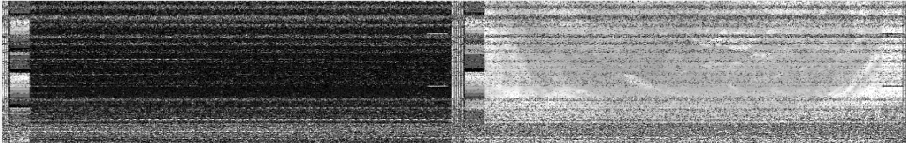
*NOAA 18 received on 12/10/2023 using a V-dipole nailed to a wooden board sticking outside of my balcony. Decoded using WxToImg. 60% quality lossy JPEG compression applied.*

The result is about what you'd expect for a first reception.

The setup I had should have worked in theory, but had two major issues:
1) There is a cell tower just a few hundred meters away overloading my SDR to hell and back
2) I could only see the satellites for a very short amount of time while they were directly overhead

After some pondering Socrates style, I realized I could use some materials from our decrepit shed at my cottage as a stand for a very tall V-dipole fixture which would have GREAT LOS with the sky. Some zipties and gluing stuff together later, this beauty was ready for action:

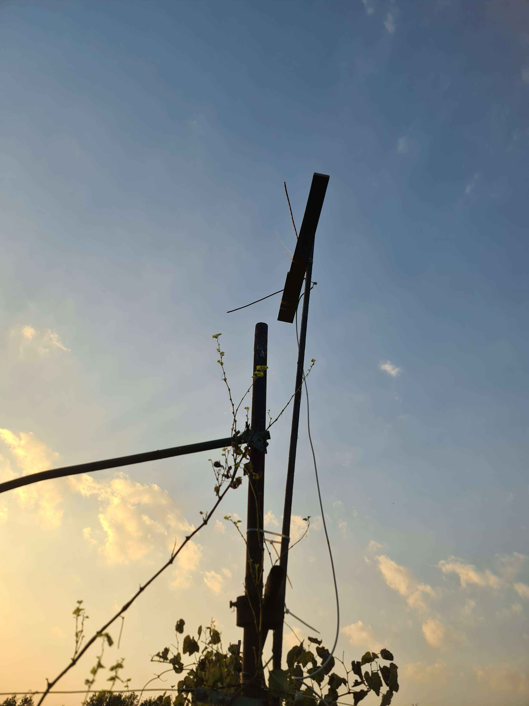
*The original V-dipole fixture I had at my cottage.*

As janky as it looks, it worked very well and allowed me to get some great APT images:

*NOAA 15 received on 13/10/2023 using a V-dipole. Decoded using SatDump. (Alignment algorithm couldn't handle the scan motor issues, is the reason the middle of the image is cut up.) 40% quality lossy JPEG compression applied, click [here]({site.baseurl}}/assets/images/Sat-reception-journey/First-good-APT-N15.png) for the full resolution image.*

What at first looks like a black and white image containing barely any decernible imagery remains one of the best APT transmissions I have gotten when considering the length and cleanliness. How a V-Dipole managed to get no nulls is beyond me. 

> NOAA 15 was having some *major* scan motor issues at that time, causing the glitching present instead of actual imagery. The satellite has since completely recovered and remains to be the oldest satellite still broadcasting APT.

I managed to get a few other satellites just after, most notably NOAA 19:

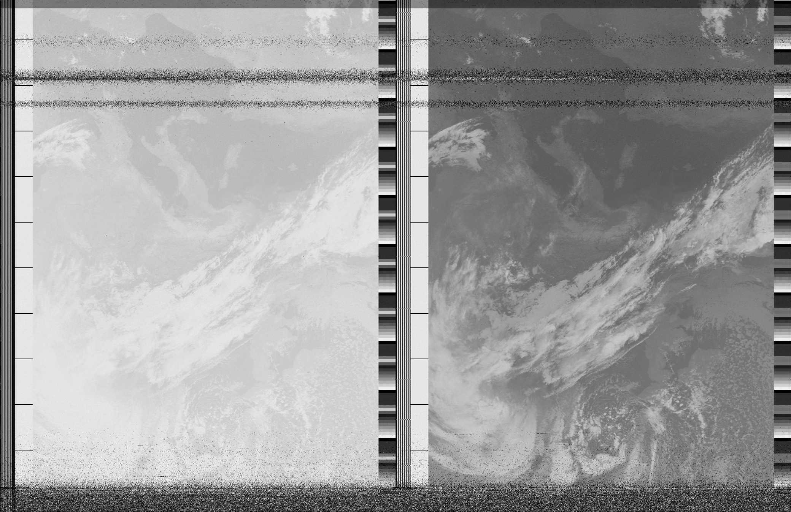
*NOAA 19 received on 13/10/2023 using a V-Dipole. Decoded using SatDump. 50% quality lossy JPEG compression applied.*

After all this time and effort, I finally had imagery that wasn't an eyesore. It's at about this time, that I had joined the SDR++ and SigIdWiki Discord servers. They told me how god awful and outdated my software setup was, which I am still incredibly grateful for - I was following a guide from 2007 until that point. After downloading SatDump and SDR++, everything became *incomparably more streamlined* with the results showing a bunch of improvements.

During this initial weekend, I spent the late nights sitting in a lawn chair with a headlamp looking like an absolute maniac trying to pull images from tin cans that are screaming out what they are seeing 24/7. Try explaining THAT to your parents!

# First portable images
After the weekend ended, I took the fixture down as it was basically a big lightning rod with a pretty cable run along it, went back home. After some thinking and debating with others, I made my first potable V-dipole, two copper wires wired up properly using a terminal... but nailed to a wooden board *\<facepalms\>*.

The results were filled with static and absolutely useless even with heavy median blur.

After removing the dipole from the bloody wooden board and finally just holding it by the electrical terminal, I got some not great but not terrible images.

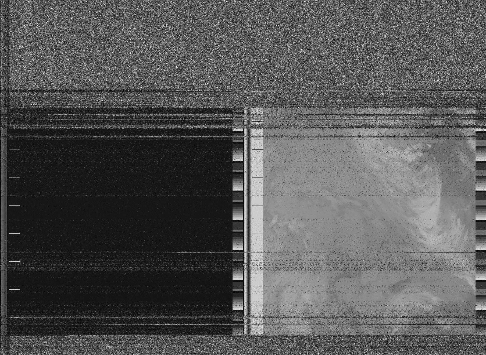
*NOAA 18 received on 25/10/2023 using a V-Dipole. Processed using SatDump. Left side is black due to NOAA 18's config error. 50% quality lossy JPEG compression applied.*

I also tried buying an FM filter which would allow me to use an LNA at home without my SDR overloading, **RIGHT** before the first pass began, I could see that the noise floor raised significantly when I put pressure on the SMA port, after inspecting it more closely, I realized, that it had basically no solder on the SMA port with the core pin hanging in the air. After returning home and adding some solder to get a good contact, I went out again - no matter, I was still goint to get some great passe- 

The whole SMA port snapped right off. *I didn't put a lot of pressure put on it!* It was just incredibly fragile and broke off when screwing my LNA onto it. I tried to solder the port back on and succeeded! But, after going out for the last set of the days passes, I found, that **no** signals were present on the FFT until I put pressure on the whole board - as if there was still a bad connection somewhere, but where?!

Upon closer inspection, the central inductors - the parts that actually filter the signal - were snapped. **All 3 of them!** This turned the filter into nothing more than a fancy paperweight. I *tried* to repair these, but it was a lost cause. I ended up salvaging the SMA ports and just throwing it out.

# What's next?
Having received APT and knowing that LRPT was out of reach due to Meteor-M N°2-3 being a bloody cripple (Its VHF antenna hasn't deployed properly, making the signal much weaker than intended), I felt like I have conquered VHF. I didn't do much for the next two months, but *boy* did December get busy.

# Growing ambitions
The next logical step after VHF was doing HRPT in the L-band - broadcasts that were much harder to receive but contained high resolution images broadcasted by a lot more satellites. Doing this would have me commit much more time and effort to this hobby, as well as purchase a lot more equipment, but I went by the one and only slogan: ***Fuck it, we ball***

I had initially hoped, that the generic wideband LNA was going to be good enough to get at least get SOMETHING, given that I had an above average sized dish (90cm) (Barely above average, that being 80 cm. Not like I knew that at that time). This, as everyone was warning me on every step of the way, turned out to be false and a complete waste of time.

# First L-band attempts
My first setup was absolute jank galore: Awful helix, piss poor soldering job, glue drizzled all over the reflector, awful tracking skills, all with the LNA and SDR sticking out the rear with the whole setup hanging on a tiny SMA port (This came back to bite me in me arse later down the road). I think you can imagine what I got

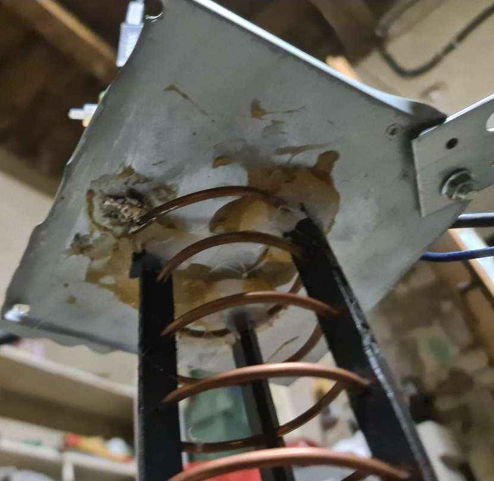

It felt like the signal was just out of reach - I could even see the carrier wave! (Spoiler: It wasn't. It was actually far, FAR out of reach.)

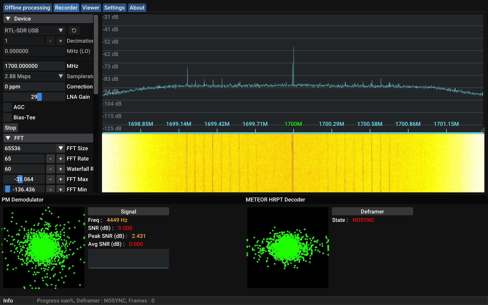
*Pictured is SatDump, on the awfully set up FFT you can see the barely visible carrier and spikes of the BPSK HRPT broadcast I was attempting to get.*

I initially believed it was a helix issue, which it partially was - I put glue all over it completely disregarding, that **the reflector should remain as clear as possible to be as effective as possible**. After heating up a knife and melting some of the hot glue off, redoing the solder job, and mounting the SMA port to the reflector properly using an SMA nut (Thanks for the suggestion, Ryzerth), the signal grew strong enough to even get a few frames!

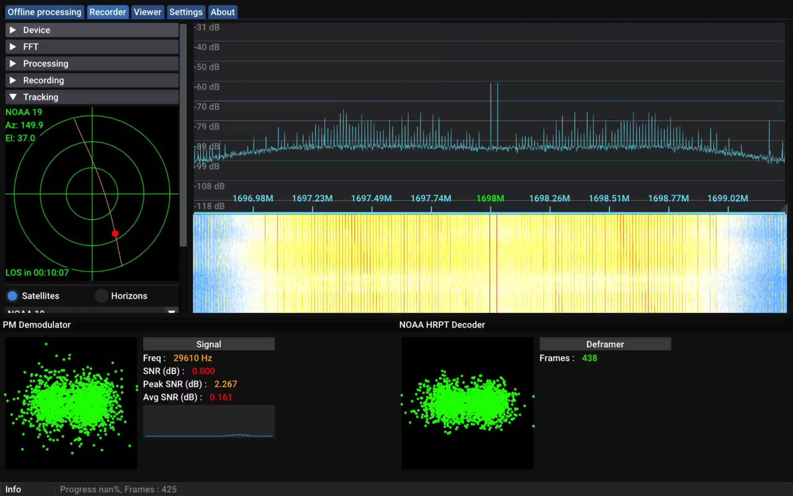
*See the peak SNR now showing a number other than 0, same with the frames*

This got me my first official HRPT image: Drumroll please...

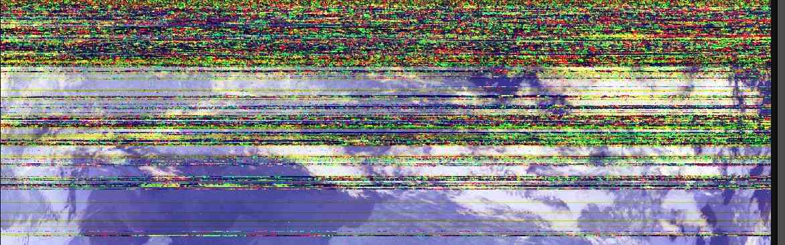
*NOAA 19 HRPT received on 31/12/2023 using a 90cm dish and a generic wideband LNA. Decoded using SatDump with the `543b` RGB composite. Median blur and equalization applied. 30% quality lossy JPEG compression applied.*

A terrible image, **but an image none the less!** It is fairly short, because it was the only attempt I had at using this setup, and it was cut short because it started raining cats and dogs all of a sudden. I couldn't retry later because of issues I will describe in a bit. 

**At this point I gave up on trying to get this generic trash to work, finally ordered a SawBird GOES+ off of Amazon.**

# VHF part two: The electric boogaloo
Instead of waiting for the LNA to arrive, I decided to fill in the time with some good ole VHF! I tried to put the tall V-dipole fixture back up, but I quickly realized that something was wrong. My neighbors had plugged in some goofy chinese power supply that was spewing RFI all over the bloody spectrum! It crippled my morning reception capabilities because of my SDR overloading. Ouch! 

While setting the fixture back up, I also **significantly** misread the coaxial cables attenuation - upping the loss by a factor of 10. What I thought was a 2 dB (36%) loss of signal was actually just a measly 0.2 dB (4.5%) loss. Why am I mentioning it? I tried cutting the coax as short as possible to keep the incorrect loss as low as possible. I originally didn't save on coaxial cable - I have several hundred meters in a cabinet that my father used back in the day. 

My original setup comfortably reached a **table I set everything down on**, this time I cut it to be **hanging in the air** while saving about a metre (.05 dB). What could go wrong, right?

# LNA meltdown
Right before the first pass began, after wiring everything up and sitting down, I heard a loud *crack* followed by the noise floor dropping significantly with all signals disappearing. I found this unusual but didn't think much of it - this has happened before, I always just had to tighten the connectors. When trying to tighten the SMA port on my LNA, I immediately noticed it was completely loose. Has ANOTHER port snapped off?!

Knowing the pass was ruined, I just went inside to try to diagnose and potentially repair the LNA, this wasn't my first time having issues with SMA ports after all.

After opening it up and inspecting it, I found the entire sma trace to be sticking out! I had no idea what to do about it, just left it in the corner of my room collecting dust for the time being.

As for the V-dipole fixture, all I was getting was very poor & static filled images without the LNA. I tore the setup down, laying down in defeat.

# Revisiting old ideas
I wasn't going to spend the whole winter break just farting around though, I thought back to an old attempt of mine: A Yagi-Uda antenna. I made one back in October using the same wooden board I used for the first V-dipole, but got no results with it and used it a total of two times so I didn't bother mentioning it here. 

Unlike then, this time I could make it with **much more precision** and **space to move around**, unlike my apartment's balcony (The thing is about two metres long and a metre wide, good luck manouvering that in a small apartment balcony!)

I then created this beauty:

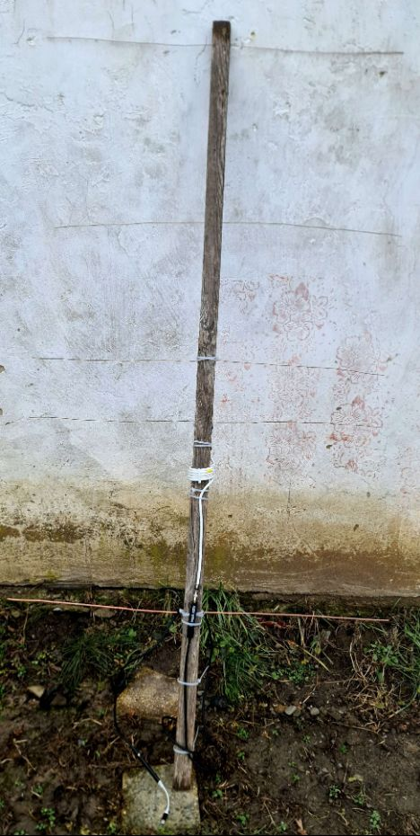

What it doesn't make up in looks it makes up for tenfold in performance - I managed to get the **best** APT and LRPT to date, the antenna providing some stunning results:

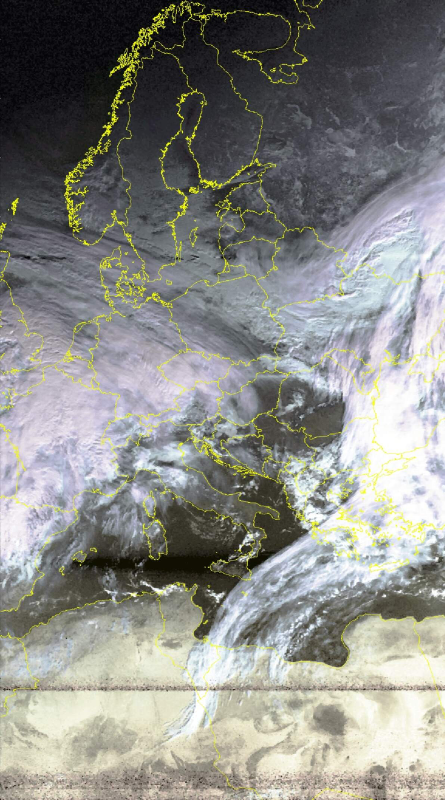
*APT image received using a 5 element yagi on 02-01-2024 from NOAA 18, processed using Satdump with the `HVC` RGB composite. Equalized.*

*LRPT image received using a 5 element yagi on 02-01-2024 from Meteor M2-3, processed using Satdump with the `221` RGB composite. Equalized.*

# LNA repair attempt
After a lot of thinking I realized, that the trace before the SMA port was still intact, there was another thing I could connect the SMA port to - a transistor right before the solder pad! Soldering a wire between it and the SMA port's core should work perfectly fine! I didn't fully trust myself with this at that time, so I left it to my father.

My father called me over after a solid 30 minutes of swearing coming from my room with a working LNA! Something I didn't notice at that time though: he accidentally bumped an innocent little diode off. *I'm sure this diode is not important at all and that the LNA will work reliably and well until the end of times!* ~~(Foreshadowing is a narrative device in which a storyteller gives an advance hint of what is to come later in the story.)~~

After going outside, the LNA worked for a total of five minutes before breaking off again, at this point I was THIS close to giving up and chucking the whole thing - but I had to at least give the soldering a shot myself first! By some miracle, I actually managed to solder the SMA port back on properly, even having it allign with the case perfectly! However at the same time, the SawBird had arrived and I shifted my attention to it and my L-band setup, stowing the working (for now) LNA for later use.

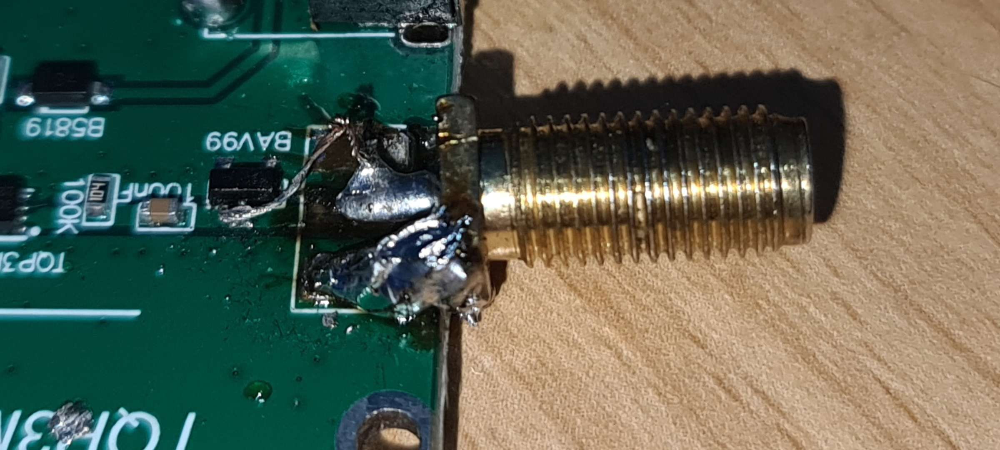
*The somehow fully functional setup. The picture has a lot of leftover flux on it that I didn't remove yet.*

The LNA's story doesn't end on a happy note though. The diode that my father accidentally broke off? Yeah, that turned out to be the ESD protection. After using it in late february at home for some weak FM reception, the LNA suddenly stopped working. After checking it with a multimeter, I found the LNA chip to have failed and be shorted to ground. This was likely caused by ESD discharge from the long coax run I was using. Damn.

# L-Band second attempt
After the SawBird arrived, it was time for action. Whipping my old setup out with the remade helix, I connected a short SMA wire to the helix and my new SawBird to it, something that at the time seemed sensible to - as I learned the hard way - not strain the LNA's SMA port too much by having it hang in the air. 

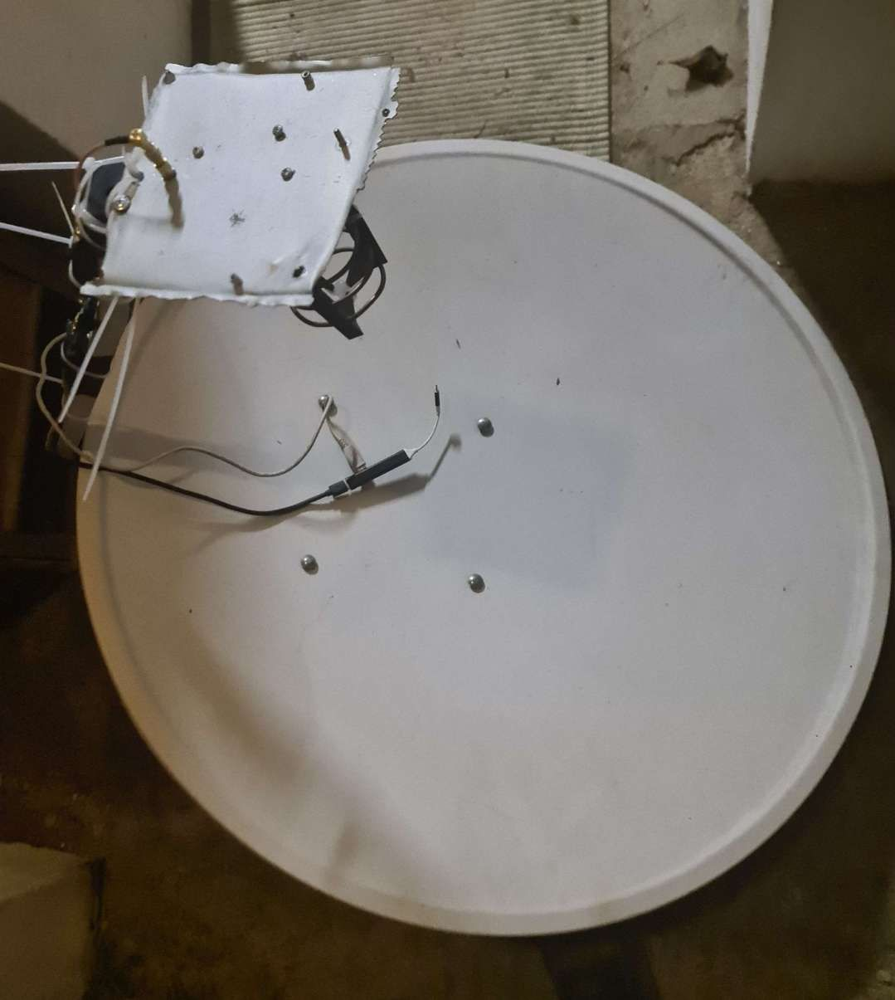

I thought I was about to get the stunning images that HRPT promised, but as it turned out...

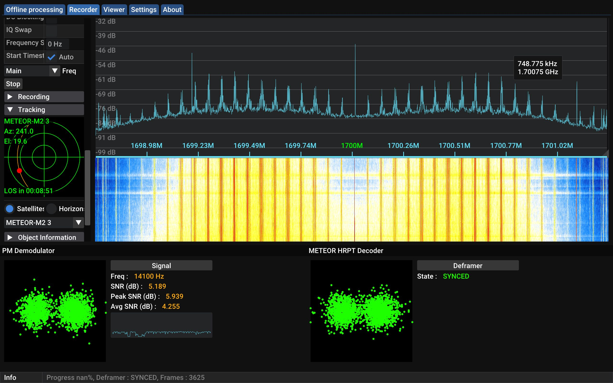
*You can see that I was actually getting a few dBs this time, MUCH better than before! The signal was still far too weak for a good decode though.*

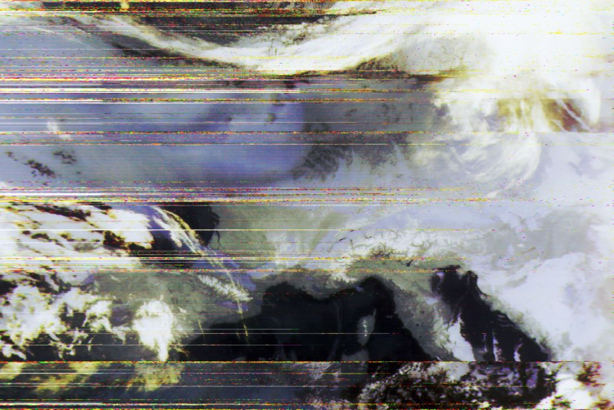
*Meteor M2-3 received on 12/1/2024 using a 90cm dish, a SawBird GOES+. Processed using SatDump with the `654` RGB composite. 80% quality lossy JPEG compression applied.*

Absolutely terrible. I was supposed to be getting gorgeous high res images, not this cut up junk! What was I doing wrong?! Pass after pass I got the same disappointing results, just as I was losing hope thinking this was as good as it gets I did the bold thing of **removing the cable and connecting the LNA directly to the helix.**

The first pass after, lo and behold:

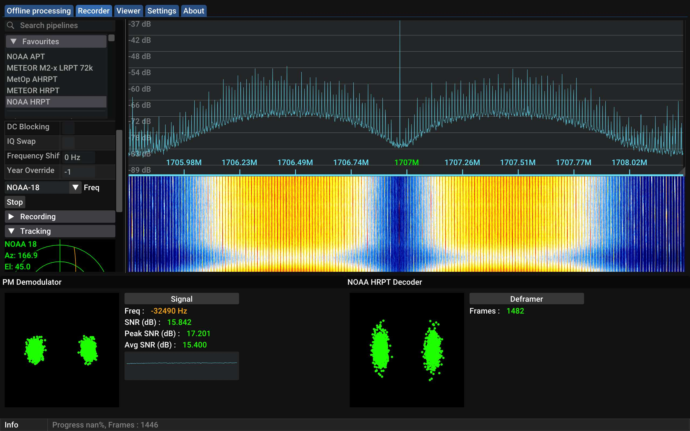
*16 dB! This is more than enough for a gorgeous image and decode, an incomparable improvement!*

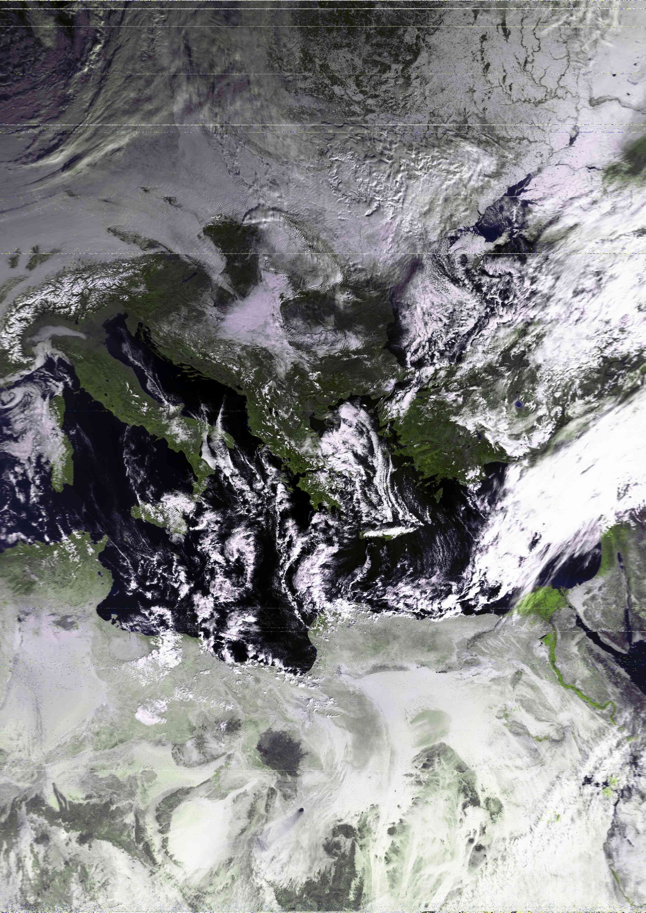
*NOAA 18 recieved on 13/1/2024 using a 90 cm dish and a SawBird GOES+. Processed using SatDump with the `NOAA Natural Color` RGB composite. Equalized. 30% quality lossy JPEG compression applied.*

Gorgeous image after gorgeous image, this is where my HRPT journey truly started.

# Golden age of HRPT

*NOAA 19 received on 14/1/2024 using a 90 cm dish and a SawBird GOES+. Processed using SatDump with the `NOAA Natural Color` RGB composite. Median blur applied, equalized. 30% quality lossy JPEG compression with 0.05 gaussian blur applied. My best HRPT image at that time.*

The last thing I intended to try was receiving geostationary satellites, this turned out to be fairly difficult on the 90 cm dish, as the signals are very weak and the only geostationary satellites relevant to me are at very low elevations. The only real satllite I could have tried was Elektro-L3, which I did:

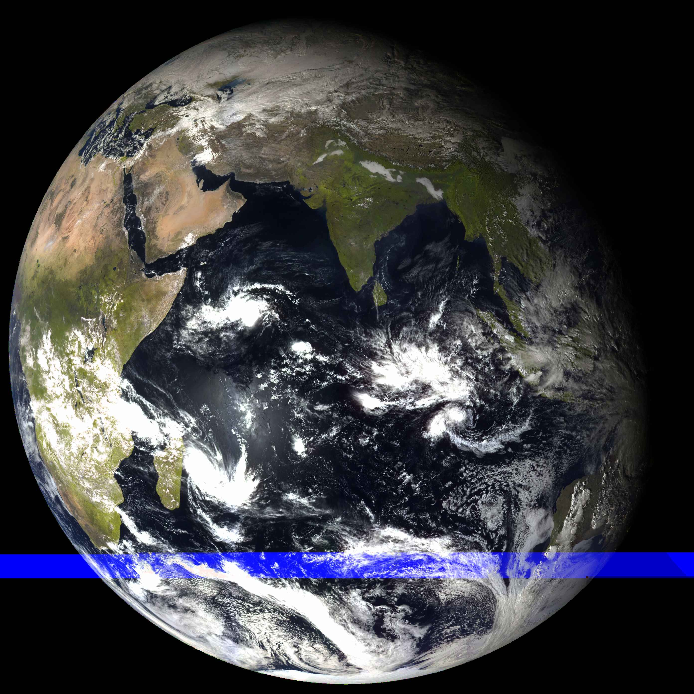
*Elektro-L N3 LRIT received on 14/1/2024 using a 90 cm dish and a SawBird GOES+. Decoded using SatDump. Pictured is the autogenerated `NC` (Natural Color) composite. 30% quality lossy JPEG compression applied.*

Besides the blue line caused by me moving just by the slightest bit (The decode required a LOT of precision, it is hard holding a 90cm dish in your hands with gusts of wind), this is still by far the coolest thing I have done to date.

# 125 cm dish
After having my fair share of fun, I decided it was time to move on from the 90 cm dish - while it was great for HRPT, it just doesn't cut it for higher bands and some other geostationary satellites. After looking at second hand markets for weeks I found **2** people selling dishes larger than 100 cm - One guy selling one for ~80€, and the other selling it for 5€ with a kjghillion grammar errors in the title. I think you can guess which one I messaged.

After receiving the dish (Which was a whole endeavour on its own), remaking my helix once again and mounting my hrpt setup to it, I managed to get a much stronger Elektro-L LRIT broadcast (8 dB compared to just 3 dB prior), HRPT went up to 24 dB from 17 dB. It is definitely needed for what's to come (:

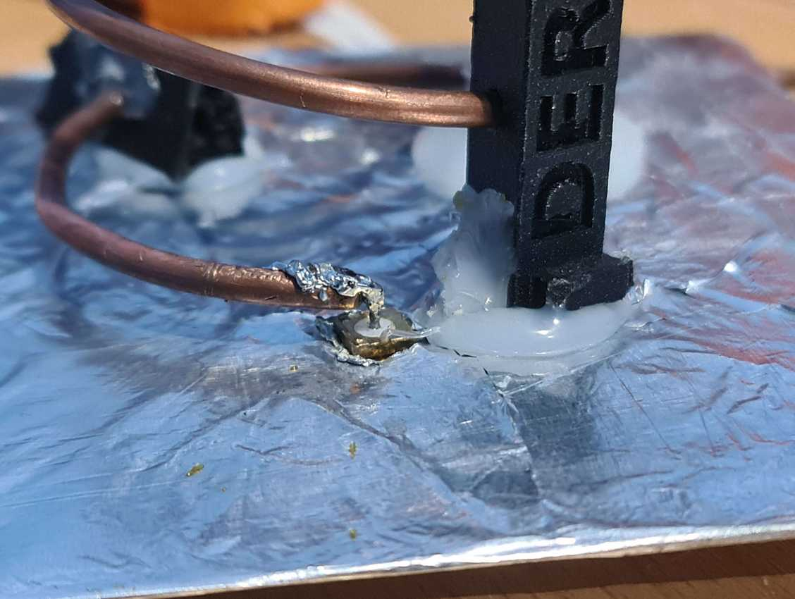  
*A picture of the new helical feed, with a much higher production quality. Soldering job still had room for improvement.*

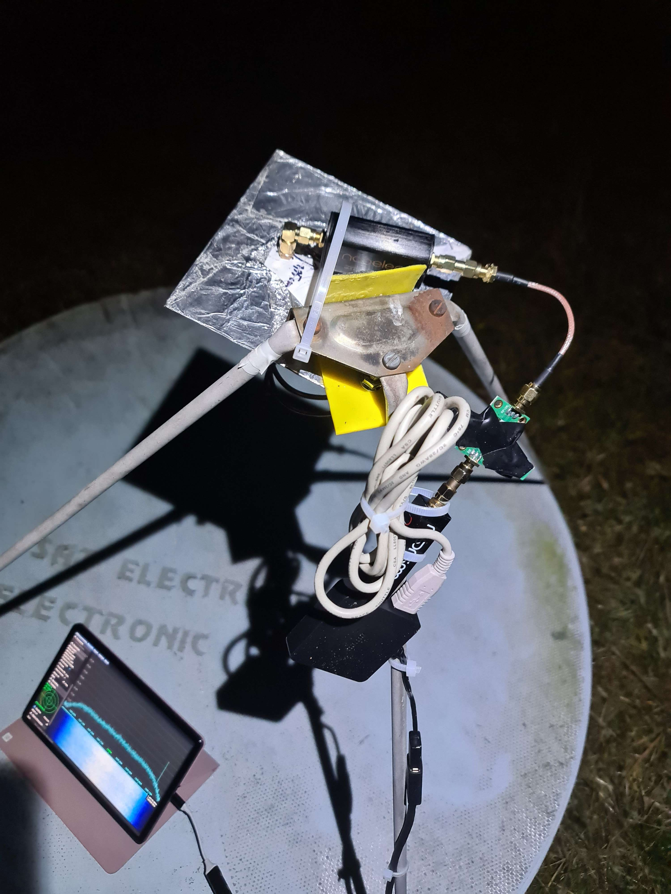
*My HRPT setup at that time*

As for the results:

*Elektro-L N3 LRIT received on 11/2/2024 using a 125 cm dish and a SawBird GOES+. Decoded using SatDump. Pictured is the autogenerated `NC` (Natural Color) composite. 65% quality lossy JPEG compression with 0.05 gaussian blur applied, click [here]({{site.baseurl}}/assets/images/Sat-reception-journey/Best-Earth-full-disc.png) for the full resolution image.*

> Fun fact: This was taken in the middle of a rainstorm with a plastic bag over the SDR and an umbrella over my head. It was just as clunky as you expect.

# S-band dreams
Having basically conquered L-band, the next viable thing I could try was the S-band - 2.2 GHz. Requiring the purchase of an MMDS with a suitable frequency range and modifying it to be usable for satellite reception, it was by no means going to be an easy task.

In an stroke of false luck, after looking around for a while, I managed to find a person selling an MMDS with a suitable range -> 2.1 - 2.3 GHz. I instantly jumped on the offer, not knowing, that this MMDS in the range of LTE/GSM all the while being a chinese clone. This would come to bite me in my arse later down the road.

# More money down the rabbit hole
After playing around with L & S bands and even having pipe dreams of doing X-band some day, it has become apparent that the Nesdr V5 doesn't cut it anymore. Don't get me wrong, it is a GREAT SDR, but only having 2.88 Msps has bit me in my arse one too many times. It was time for an upgrade.

> 2.88 Msps somehow worked on my tablet and remained completely stable, was the mode I used the most often.

Looking at my options, they were extremely limited - good SDRs at the 100€ price bracket with high sampling rates were very sparse. The only SDRs I found able to pull more than the measly 2.88 Msps of the RTL2832U chipset were:
- The AirSpy Mini clocking in at 6 Msps, still not enough for most advanced applications (X-band requiring >15 Msps)
- The MiriSDR, a surprisinmgly capable and cheap SDR (Even though it is quite deaf, requiring an additional LNA) from Aliexpress clocking in at 10 Msps. Close, but still not enough.
- The one and only... HackRf clone. 

If you don't know much about it, you might call me a moron for WILLINGLY buying a clone, but the SDR is actually nothing short of incredible! I got a version redesigned by *Clifford Heath* an engineer who made it much more resilient to accidents as well as making the frontend amplifier actually usable. Not only was it arguably better than the original, it was also priced at a **third (!)** of the original while having the aforementioned protections.

But the main selling point of the hackrf? Not only is it fully capable of doing satellite stuff, it can even pull a relatively monstrous **20 Msps!** This is far more than enough for almost any application I can try in the future, excluding some insane 30 Msps satellites. Future-proofing FTW!

# S-band preparations
todo

# Special thanks
I have to give huge props to the following people and communities who have helped me get where I am right now. I sincerely thank everyone listed here from the bottom of my heart for being patient with me and my dumb questions.

- ***@somerandomdragon*** For introducing me to radio as a concept
- ***@ryzerth*** For helping with a lot of the software setup issues
- ***@lego11*** For helping with pretty much all of L-band as well as providing incredible [articles](https://www.a-centauri.com/articoli/) that I got info from all throughout
- ***@simplydooge*** For helping with various issues that have happened since I began this journey
- ***@ledflighter*** For helping with hardware setups
- ***@felixtheradioguy*** For helping with antenna technicalities as well as providing aid with geostationary sats
- ***The [SigIdWiki](https://www.sigidwiki.com/) Discord*** For helping with a lot of electrical issues I have stumbled upon 
- ***The [SDR++](https://www.sdrpp.org/) Discord*** For helping me throughout this exciting journey with basically everything
- ***The [SatDump](https://www.satdump.org/) Matrix*** For helping with a bunch of more technical questions
- Many others helping out with small things along the way

You have all been incredible, are the reason me and many others are able to call this hobby fun. Thank you for everything.

o7
