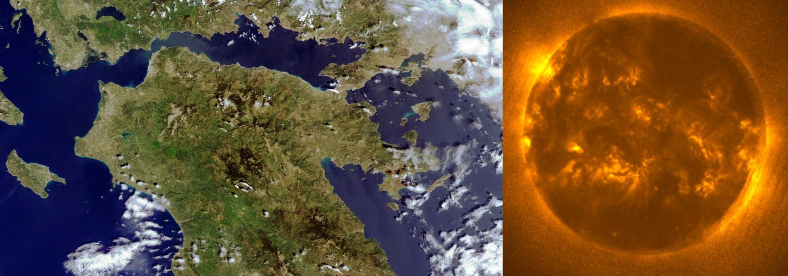

# Preamble

The goal of this page is to show what X-band satellites are receivable in this band in a presentable way, 'demystifying' the broadcasts. I will also include information about every individual transmission that is required to receive it.

Every satellite will have full resolution sample imagery provided from my [archive](https://sat-archive.cpt-dingus.cc). **This is NOT an X-band reception guide**, the scope of such a guide is way out of my depth at the moment. I have personally NOT received these and likely will not do so for a while given the high initial cost.

# Introduction

X-band reception is a very advanced endeavor, given the severe lack of documentation online, high cost of entry, as well as the dedication required - You **will** fall flat on your face a lot! I might describe this process some day when I get enough disposable income to try it out myself, but for the time being, I will try to write out what I know fairly well already - **the satellites' broadcasts**.

The minimum dish size is inapplicable to this band because of the significant variance between setups, the low margins introduced with X can make two nearly identical setups perform worlds apart because of minimal differences. Upon a suggestion from lego11, a minimum SNR for a good decode will be included instead. See below for a definition.

## Formatting

Each satellite will start with a compressed preview image to roughly show what you can get, followed by a brief description of the series in question in the `Description` heading.

Following the description is the `Signal table(s)` heading which contains information about the transmission(s) in question in the following format:

<u>Name of transmission</u> - Potential notes

| Satellite                 | Frequency | Symbol rate | Polarization | FEC                    | Minimum SNR                                                                                              | Beamed                                               | Location                                                                |
| ------------------------- | --------- | ----------- | ------------ | ---------------------- | -------------------------------------------------------------------------------------------------------- | ---------------------------------------------------- | ----------------------------------------------------------------------- |
| Transmitting satellite(s) | S/E       | S/E         | S/E          | Whether signal has FEC | Minimal dB needed for green RS on FEC, or enough SNR for recognizable imagery with median blur if no FEC | Whether signal is transmitted at a specific location | If beamed, location of beam. Otherwise, area where the signal is active |

> S/E = Self explanatory

What follows after is some sample images in the `Sample imagery` heading (duh), processed or otherwise. I expect to fill this in near the end of August due to me not being home right now.

# List of satellites that you can receive with SatDump

There are 21+ satellites you can receive in this band, more specifically:

- 4x FengYun 3
- 3x NOAA JPSS
- 2x Meteor-M
- 2x NASA EOS
- 3x Elektro-L\*
- 2x Arktika-M\*
- 1x GEO-KOMPSAT
- 2x MetOp
- 2x GOES-R\* (TODO)

\* Beamed - only receivable near the ground station heading (depends on how tight it is)

This list is not exhaustive, I apologize if I missed anything.

# Satellite descriptions

## FengYun-3

***Left:*** *A crop of FengYun-3F received on 28/4/2025 at 09:07 UTC by Konrad Unger. Processed with the `True color` composite. Click [here](https://sat-archive.cpt-dingus.cc/X-band/FengYun-3/AHRPT/FengYun-3F/2025-04-28_09-07_fengyun-3f-ahrpt_UngerKonrad/Fengyun-3F_true-color_ungerkonrad.png) for the full resolution image.* ***Right:*** *FengYun-3E XEUVI received by Konrad Unger on 25/4/2025 at 14:47 UTC. Processed with SatDump, colorized using a script by lego11 found [here](https://www.a-centauri.com/articoli/satellite-tools) (Xeuvize)*

### Description

- **Fengyun** **3D**, **3E**, **3F**, and **3G** transmit their mission data in the X-band, most notably their **AHRPT** direct broadcast
- These satellites also dump their mission data in a transmission called **DPT** (Delayed Picture Transmission)
- 3D, 3E, 3F all transmit full dumps to Kiruna, partial dumps to China (to get a lower delay for the South China Sea and Oceania). China also acts like a backup if Kiruna is undergoing maintenance.
- 3G only dumps to China due to its orbit
- The instruments vary between the satellites, notably:
    - FengYun 3E has a XEUVI for sun imaging
    - FengYun 3G is in an Inclined Equatorial orbit, carries RM (Rainfall measurement) instrumentation as its payload unlike the rest of the Fengyun 3 series. It is very fast and flies very low, making it receivable with a smaller dish than the rest albeit with much more difficult tracking. It also has an unusually small symbol rate at just 6 Msym/s.

### Signal tables

<u>AHRPT</u>

| Satellite  | Frequency | Symbol rate | Polarization | FEC | Minimum SNR | Beamed | Location |
| ---------- | --------- | ----------- | ------------ | --- | ----------- | ------ | -------- |
| FengYun 3D | 7820 MHz  | 30 Msym/s   | RHCP         | Yes | 7 dB        | No     | Global   |
| FengYun 3E | 7860 MHz  | 38.4 Msym/s | RHCP         | Yes | 7 dB        | No     | Global   |
| FengYun 3F | 7790 MHz  | 38.4 Msym/s | LHCP         | Yes | 7 dB        | No     | Global   |
| FengYun 3G | 7790 MHz  | 6 Msym/s    | RHCP         | Yes | 7 dB        | No     | Global   |

<u>DPT (Dump)</u>

| Satellite  | Frequency  | Symbol rate | Polarization | FEC | Minimum SNR | Beamed | Location      |
| ---------- | ---------- | ----------- | ------------ | --- | ----------- | ------ | ------------- |
| FengYun 3D | 8250 MHz   | 150 Msym/s  | RHCP         | Yes | 7 dB        | No     | Kiruna, China |
| FengYun 3E | 8212.5 MHz | 225 Msym/s  | ???          | Yes | 7 dB        | No     | Kiruna, China |
| FengYun 3F | 8212.5 MHz | 225 Msym/s  | ???          | Yes | 7 dB        | No     | Kiruna, China |
| FengYun 3G | ???        | 225 Msym/s  | ???          | Yes | 11 dB       | No     | China         |

### Sample imagery

- **FengYun 3D** by Konrad Unger at 14:17z on 12/7/2025
  - MERSI-2
    - [AVHRR 221](https://sat-archive.cpt-dingus.cc/X-band/FengYun-3/AHRPT/FengYun-3D/2025-07-12_14-17_fengyun-3d-ahrpt_UngerKonrad/mersi2_AVHRR_221_False_Color.png)
    - [Day land cloud-fire RGB](https://sat-archive.cpt-dingus.cc/X-band/FengYun-3/AHRPT/FengYun-3D/2025-07-12_14-17_fengyun-3d-ahrpt_UngerKonrad/mersi2_Day_Land_Cloud-Fire_RGB.png)
    - [Day Microphysics](https://sat-archive.cpt-dingus.cc/X-band/FengYun-3/AHRPT/FengYun-3D/2025-07-12_14-17_fengyun-3d-ahrpt_UngerKonrad/mersi2_Day_Microphysics.png)
    - [True Color](https://sat-archive.cpt-dingus.cc/X-band/FengYun-3/AHRPT/FengYun-3D/2025-07-12_14-17_fengyun-3d-ahrpt_UngerKonrad/mersi2_True_Color.png)
  - MWRI/1
    - [MWRI 123](https://sat-archive.cpt-dingus.cc/X-band/FengYun-3/AHRPT/FengYun-3D/2025-07-12_14-17_fengyun-3d-ahrpt_UngerKonrad/mwri_MWRI_123.png)
  - MWHS/2 - same as FY 3E

- **FengYun 3E** by Konrad Unger at 16:41z on 12/7/2025
  - MERSI-LL
    - [10.8um Thermal IR (highest res)](https://sat-archive.cpt-dingus.cc/X-band/FengYun-3/AHRPT/FengYun-3E/2025-07-12_16-41_fengyun-3e-ahrpt_UngerKonrad/mersill_10.8um_Thermal_IR_%28Uncalibrated%29.png)
    - [Automatic Visible FC](https://sat-archive.cpt-dingus.cc/X-band/FengYun-3/AHRPT/FengYun-3E/2025-07-12_16-41_fengyun-3e-ahrpt_UngerKonrad/mersill_Automatic_Visible_False_Color_%28uncal%29.png)
    - [AVHRR 221](https://sat-archive.cpt-dingus.cc/X-band/FengYun-3/AHRPT/FengYun-3E/2025-07-12_16-41_fengyun-3e-ahrpt_UngerKonrad/mersill_AVHRR_221_False_Color.png)
    - [MERSI-LL Airmass](https://sat-archive.cpt-dingus.cc/X-band/FengYun-3/AHRPT/FengYun-3E/2025-07-12_16-41_fengyun-3e-ahrpt_UngerKonrad/mersill_MERSI-LL_Airmass.png)
  - MWHS/2
    - [MHS 421](https://sat-archive.cpt-dingus.cc/X-band/FengYun-3/AHRPT/FengYun-3E/2025-07-12_16-41_fengyun-3e-ahrpt_UngerKonrad/mwhs2_MHS_421.png)
    - [MWHS FC](https://sat-archive.cpt-dingus.cc/X-band/FengYun-3/AHRPT/FengYun-3E/2025-07-12_16-41_fengyun-3e-ahrpt_UngerKonrad/mwhs2_MWHS_False_Color.png)
  - MWTS/3
    - [AMSU FC](https://sat-archive.cpt-dingus.cc/X-band/FengYun-3/AHRPT/FengYun-3E/2025-07-12_16-41_fengyun-3e-ahrpt_UngerKonrad/mwts3_AMSU_False_Color.png)
  - XEUVI (processed with xeuvize)
    - [Colorized GIF](https://sat-archive.cpt-dingus.cc/X-band/FengYun-3/AHRPT/FengYun-3E/2025-07-12_16-41_fengyun-3e-ahrpt_UngerKonrad/XEUVI/XEUVI.gif)

- **FengYun 3F** by Konrad Unger at 10:47z on 28/4/2025
  - MERSI-3
    - [10.8um Thermal IR](https://sat-archive.cpt-dingus.cc/X-band/FengYun-3/AHRPT/FengYun-3F/2025-04-28_10-47_fengyun-3f-ahrpt_UngerKonrad/mersi3_10.8um_Thermal_IR_%28Uncalibrated%29.png)
    - [AVHRR 221](https://sat-archive.cpt-dingus.cc/X-band/FengYun-3/AHRPT/FengYun-3F/2025-04-28_10-47_fengyun-3f-ahrpt_UngerKonrad/mersi3_AVHRR_221_False_Color.png)
    - [Day Microphysics](https://sat-archive.cpt-dingus.cc/X-band/FengYun-3/AHRPT/FengYun-3F/2025-04-28_10-47_fengyun-3f-ahrpt_UngerKonrad/mersi3_Day_Microphysics.png)
    - [MERSI FC](https://sat-archive.cpt-dingus.cc/X-band/FengYun-3/AHRPT/FengYun-3F/2025-04-28_10-47_fengyun-3f-ahrpt_UngerKonrad/mersi3_MERSI_False_Color.png)
    - [True Color](https://sat-archive.cpt-dingus.cc/X-band/FengYun-3/AHRPT/FengYun-3F/2025-04-28_10-47_fengyun-3f-ahrpt_UngerKonrad/mersi3_True_Color.png)
  - MWHS/2 and MWTS/3 same as FY-3E
  - MWRI/2 not implemented in SatDump, TODO

- **FengYun 3G** by Lego11 at 16:55z on 27/2/2025
  - MERSI-RM
    - [AVHRR 221](https://sat-archive.cpt-dingus.cc/X-band/FengYun-3/AHRPT/FengYun-3G/2025-02-27_16-55_fengyun-3g-ahrpt_lego11/mersirm_AVHRR_221_False_Color.png)
    - [AVHRR 3a21](https://sat-archive.cpt-dingus.cc/X-band/FengYun-3/AHRPT/FengYun-3G/2025-02-27_16-55_fengyun-3g-ahrpt_lego11/mersirm_AVHRR_3a21_False_Color.png)
    - [Day Microphysics](https://sat-archive.cpt-dingus.cc/X-band/FengYun-3/AHRPT/FengYun-3G/2025-02-27_16-55_fengyun-3g-ahrpt_lego11/mersirm_Day_Microphysics.png)
    - [MERSI-RM 321](https://sat-archive.cpt-dingus.cc/X-band/FengYun-3/AHRPT/FengYun-3G/2025-02-27_16-55_fengyun-3g-ahrpt_lego11/mersirm_MERSI-RM_321.png)
    - [Natural Color](https://sat-archive.cpt-dingus.cc/X-band/FengYun-3/AHRPT/FengYun-3G/2025-02-27_16-55_fengyun-3g-ahrpt_lego11/mersirm_Natural_Color.png)
  - MWRI-RM - not implemented yet, TODO

## NOAA JPSS

***Left:*** *NOAA 20 received on 24/4/2025 at 12:56 UTC by Konrad Unger. Processed with SatDump using the `True color` composite. Cropped. Click [here](https://sat-archive.cpt-dingus.cc/X-band/NOAA-JPSS/NOAA-20/2025-04-24_12-56_jpss-hrd_UngerKonrad/viirs_True_Color.png) for the full resolution image.* ***Right:*** *NOAA 20 VIIRS DNB channel crop, received on 1/1/2025 at 1:05 UTC by lego11. Processed with SatDump using the `DNB Night` composite. Cropped. Click [here](https://sat-archive.cpt-dingus.cc/X-band/NOAA-JPSS/NOAA-21/2025-01-01_01-05_jpss-2_lego11/viirs_DNB_Night.png) for the full resolution image*

### Description

- Being the current-gen constellation from NOAA+NASA, all JPSS (Joint Polar Satellite System) satellites transmit in the X-band -> **Suomi NPP**, **NOAA 20**, and **NOAA 21**
- NOAA 20 has suffered many issues, notably a failed detector in the VIIRS (imaging) instrument causing scan lines to appear in certain composites
- The Suomi NPP satellite also has occasional issues with its clock, causing imagery to process with erroneous dates
- All satellites have a null in their antennas' radiation pattern:
    - Suomi NPP has a strong null when it's west from your position at certain elevations
    - NOAA 20 has a strong null when it's east from your position at certain elevations
    - NOAA 21's null is still present but not as significant, improved FEC helps mitigate it further

### Signal table

<u>DB</u>

| Satellite | Frequency | Symbol rate | Polarization | FEC | Minimum SNR | Beamed | Location |
| --------- | --------- | ----------- | ------------ | --- | ----------- | ------ | -------- |
| Suomi NPP | 7812 MHz  | 15 Msym/s   | RHCP         | Yes | 6 dB        | No     | Global   |
| NOAA 20   | 7812 MHz  | 15 Msym/s   | RHCP         | Yes | 6 dB        | No     | Global   |
| NOAA 21   | 7812 MHz  | 25 Msym/s   | RHCP         | Yes | 4 dB        | No     | Global   |

### Sample imagery

VIIRS and ATMS are identical between all of JPSS. OMPS is not implemented in SatDump.

- NOAA 21 by lego11 at 12:51z on 17/8/2025
    - VIIRS
      - [AVHRR 221](https://sat-archive.cpt-dingus.cc/X-band/NOAA-JPSS/NOAA-21/2025-08-17_12-51_jpss-2_lego11/viirs_AVHRR_221_False_Color.png)
      - [AVHRR 3a21](https://sat-archive.cpt-dingus.cc/X-band/NOAA-JPSS/NOAA-21/2025-08-17_12-51_jpss-2_lego11/viirs_AVHRR_3a21_False_Color.png)
      - [Bathymetric](https://sat-archive.cpt-dingus.cc/X-band/NOAA-JPSS/NOAA-21/2025-08-17_12-51_jpss-2_lego11/viirs_Bathymetric.png)
      - [Day Land-cloud fire RGB](https://sat-archive.cpt-dingus.cc/X-band/NOAA-JPSS/NOAA-21/2025-08-17_12-51_jpss-2_lego11/viirs_Day_Land-Cloud_Fire_RGB.png)
      - [Fire temperature RGB](https://sat-archive.cpt-dingus.cc/X-band/NOAA-JPSS/NOAA-21/2025-08-17_12-51_jpss-2_lego11/viirs_Day_Land-Cloud_Fire_RGB.png)
      - [Panchromatic](https://sat-archive.cpt-dingus.cc/X-band/NOAA-JPSS/NOAA-21/2025-08-17_12-51_jpss-2_lego11/viirs_Panchromatic.png)
      - [True color](https://sat-archive.cpt-dingus.cc/X-band/NOAA-JPSS/NOAA-21/2025-08-17_12-51_jpss-2_lego11/viirs_True_Color.png)
      - [VIIRS I321-I221 mix](https://sat-archive.cpt-dingus.cc/X-band/NOAA-JPSS/NOAA-21/2025-08-17_12-51_jpss-2_lego11/viirs_VIIRS_I321-I221_Mix.png)
      - [VIIRS DNB Night](https://sat-archive.cpt-dingus.cc/X-band/NOAA-JPSS/NOAA-21/2025-01-01_01-05_jpss-2_lego11/viirs_DNB_Night.png) - Different pass, still by lego11 but at 01:05z on 1/1/2025 
    - ATMS
      - [ATMS FC](https://sat-archive.cpt-dingus.cc/X-band/NOAA-JPSS/NOAA-21/2025-08-17_12-51_jpss-2_lego11/atms_ATMS_False_Color.png)
      - [MHS 421](https://sat-archive.cpt-dingus.cc/X-band/NOAA-JPSS/NOAA-21/2025-08-17_12-51_jpss-2_lego11/atms_MHS_421.png)
      - [Microwave Airmass](https://sat-archive.cpt-dingus.cc/X-band/NOAA-JPSS/NOAA-21/2025-08-17_12-51_jpss-2_lego11/atms_Microwave_Airmass.png)
- NOAA 20 by Konrad Unger at 12:37z on 25/4/2025
  - VIIRS (Identical to NOAA 21)
    - [AVHRR 221](https://sat-archive.cpt-dingus.cc/X-band/NOAA-JPSS/NOAA-20/2025-04-25_12-37_jpss-hrd_UngerKonrad/viirs_AVHRR_221_False_Color.png)
    - [AVHRR 3a21](https://sat-archive.cpt-dingus.cc/X-band/NOAA-JPSS/NOAA-20/2025-04-25_12-37_jpss-hrd_UngerKonrad/viirs_AVHRR_3a21_False_Color.png)
    - [Day Microphysics](https://sat-archive.cpt-dingus.cc/X-band/NOAA-JPSS/NOAA-20/2025-04-25_12-37_jpss-hrd_UngerKonrad/viirs_Day_Microphysics.png)
    - [Panchromatic](https://sat-archive.cpt-dingus.cc/X-band/NOAA-JPSS/NOAA-20/2025-04-25_12-37_jpss-hrd_UngerKonrad/viirs_Panchromatic.png)
    - [True Color](https://sat-archive.cpt-dingus.cc/X-band/NOAA-JPSS/NOAA-20/2025-04-25_12-37_jpss-hrd_UngerKonrad/viirs_True_Color.png)
  - ATMS - Identical to NOAA 21

- Suomi NPP - Identical to NOAA 21

## Meteor-M

*Meteor-M N°2-4 KMSS DB crop from the first MSU-100, received on 19/3/2025 at 10:51 UTC by Konrad Unger. Processed with SatDump using the `Natural color` composite. 60% quality lossy JPEG compression and median blur applied, click [here](https://sat-archive.cpt-dingus.cc/X-band/Meteor-M/KMSS/Meteor-M2-4/2025-03-19_10-51_meteor-kmss-db_UngerKonrad/kmss_msu100_Natural_color.png) for the full resolution image*

### Description

- **Meteor-M N°2-3** and **Meteor-M N°2-4** both transmit in the X band, dump to Russian ground stations using a NON-beamed transmission (the antenna is an open waveguide)
- Transmissions are separated into "Narrow" ones that have a ~15 MHz bandwidth and "Wide" ones which have a ~61 MHz bandwidth
- Meteor M2-3 has a **failed <u>wide</u> X-band transmitter**, making it only do <u>narrow transmissions</u>. This means it ONLY transmits MTVZA dumps and IKFS dumps (?)
- Meteor M2-4 transmits KMSS DB in and around Russia as well as over most of Europe, possibly the Caribbean and Brazil as well (unconfirmed)
- These satellites transmit a diverse amount of transmissions, as is seen in the tables below

### Signal Tables

<u>MTVZA Dump (Narrow BPSK)</u>

| Satellite         | Frequency | Symbol rate  | Polarization | FEC | Minimum SNR | Beamed | Location                       |
| ----------------- | --------- | ------------ | ------------ | --- | ----------- | ------ | ------------------------------ |
| Meteor M2-3, M2-4 | 8128 MHz  | 15.36 Msym/s | RHCP         | No  | 2.5 dB      | No     | Moscow, Novosibirsk, Khabrovsk |

<u>IKFS Dump (Narrow QPSK)</u> - Unconfirmed, not received yet

| Satellite         | Frequency | Symbol rate  | Polarization | FEC | Minimum SNR | Beamed | Location      |
| ----------------- | --------- | ------------ | ------------ | --- | ----------- | ------ | ------------- |
| Meteor M2-3, M2-4 | ???       | 15.36 Msym/s | ???          | No  | 3.5 dB      | No     | Khabrovsk ??? |

<u>KMSS DB (Wide BPSK)</u>

| Satellite   | Frequency        | Symbol rate  | Polarization | FEC | Minimum SNR | Beamed | Location                          |
| ----------- | ---------------- | ------------ | ------------ | --- | ----------- | ------ | --------------------------------- |
| Meteor M2-4 | 8128, 8320\* MHz | 61.44 Msym/s | RHCP         | No  | 2.5 dB      | No     | Europe, Russia & its surroundings |

\* 8320 MHz is rare

<u>KMSS Dump / MSU-MR Dump / Severjanin-M + MeteoSAR Dump (Wide QPSK)</u>

| Satellite   | Frequency | Symbol rate  | Polarization | FEC | Minimum SNR | Beamed | Location                       |
| ----------- | --------- | ------------ | ------------ | --- | ----------- | ------ | ------------------------------ |
| Meteor M2-4 | 8320 MHz  | 61.44 Msym/s | RHCP         | No  | 3.5 dB      | No     | Moscow, Novosibirsk, Khabrovsk |

### Sample imagery

- TODO

## NASA EOS

*Terra MODIS crop, received on 25/11/2023 at 09:35 UTC by Andrew Lorett LLC. Processed with SatDump using the `True color` composite. Click [here](https://sat-archive.cpt-dingus.cc/X-band/NASA-EOS/Terra/2023-11-25_09-35_terra-db_Andrew-Lorett-LLC/modis_True_Color.png) for the full resolution image*

### Description

- **Aqua** and **Aura** are the only satellites from the NASA EOS (Earth Observation Satellites) constellation that still transmit DB, **Terra** still transmits dumps but the DB signal has been disabled in 09/2024 due to a power supply issue.
- All satellites from this constellation have a null in their antenna's radiation pattern above a ~60° elevation
- Aura only transmits the OMI instrument which is very low rate
- The dumps from these satellites are not implemented into SatDump (Encrypted?)

### Signal table

<u>DB</u>

| Satellite | Frequency | Symbol rate | Polarization | FEC | Minimum SNR | Beamed | Location |
| --------- | --------- | ----------- | ------------ | --- | ----------- | ------ | -------- |
| Aqua      | 8160 MHz  | 7.5 MHz     | RHCP         | Yes | 11 dB       | No     | Global   |
| Aura      | 8160 MHz  | 7.5 MHz     | RHCP         | Yes | 11 dB       | No     | Global   |

### Sample imagery

TODO

## Elektro-L

*Elektro-L2 Channel 1 received on 11/4/2025 at 12:29 UTC by lego11. 60% quality lossy JPEG compression applied, image resized to 25%. Click [here](https://sat-archive.cpt-dingus.cc/X-band/Elektro-L/Elektro-L2/2025-04-11_12-29_elektro-rdas_lego11/MSU-GS/MSU-GS-1.png) for the full resolution image*

### Description

- **Elektro-L N°2**, **N°3**, and **N°4** all transmit a <u>beamed</u> **RDAS** signal containing all raw channels every 15 minutes (L2 every 30 minutes due to power issues)
- Elektro-L2 suffered from a severe power amplifier failure making xRIT in the L-band unusable, weakening all transmissions for a while. <u> The satellite has seemingly recovered the transmission strength.</u>
- L2 and L3 both beam the transmission to Moscow, L4 beams it to Vladivostok. The beam is not very tight, L2 is receivable from Europe mostly fine.
- When not actively transmitting an image, a very strong carrier is present (transmitted up until about a minute before the next transmission)

### Signal table

<u>RDAS</u>

| Satellite  | Frequency | Symbol rate  | Polarization | FEC | Minimum SNR | Beamed | Location    |
| ---------- | --------- | ------------ | ------------ | --- | ----------- | ------ | ----------- |
| Elektro L2 | 7500 MHz  | 30.72 Msym/s | LHCP         | No  | 5 dB        | Yes    | Moscow      |
| Elektro L3 | 7500 MHz  | 30.72 Msym/s | RHCP         | No  | 5 dB        | Yes    | Moscow      |
| Elektro L4 | 7500 MHz  | 30.72 Msym/s | RHCP         | No  | 5 dB        | Yes    | Vladivostok |

### Sample imagery

- [Elektro-L2 Raw channel 1](https://sat-archive.cpt-dingus.cc/X-band/Elektro-L/Elektro-L2/2025-04-11_13-59_elektro-rdas_lego11/MSU-GS/MSU-GS-1.png) - Credit to Lego11
- [Elektro-L3 Raw channel 1](https://sat-archive.cpt-dingus.cc/X-band/Elektro-L/Elektro-L3/2025-01-04_08-29_elektro-rdas_Andrew-Lorett-LLC/MSU-GS/MSU-GS-1.png) - Credit to Andrew Lorett LLC

## Arktika-M

*Arktika-M2 Channel 1 received on 31/12/2024 at 13:29 UTC by Andrew Lorett LLC. 60% quality lossy JPEG compression applied, image resized to 25% and cropped. Click [here](https://sat-archive.cpt-dingus.cc/X-band/Arktika-M/Arktika-M2/2024-12-31_13-29_elektro-rdas_Andrew-Lorett-LLC/MSU-GS/MSU-GS-1.png) for the full resolution image*

### Description
- **Arktika-M N°1** and **Arktika-M N°2** both transmit beamed **RDAS** during their apogee to Moscow and Vladivostok (depending on which apogee the satellite is currently in - one is above the atlantic, the other is above the Bering Strait)
- The broadcast is identical to that of Elektro-L satellites, because Arktikas are the same bus; just shot into a molnyia orbit.
- The transmission is much weaker than that of Elektros' because of the significantly higher apogee of the molnyia orbit.

### Signal table

<u>RDAS</u>

| Satellite      | Frequency | Symbol rate  | Polarization | FEC | Minimum SNR | Beamed | Location            |
| -------------- | --------- | ------------ | ------------ | --- | ----------- | ------ | ------------------- |
| Arktika-M1, M2 | 7865 MHz  | 30.72 Msym/s | RHCP         | No  | 5 dB        | Yes    | Moscow, Vladivostok |

### Sample imagery

- [Arktika-M N°2 raw channel 1](https://sat-archive.cpt-dingus.cc/X-band/Arktika-M/Arktika-M2/2025-04-20_07-45_arktika-rdas_digitelektro/MSU-GS/MSU-GS-1.png) - Credit to digitelektro

## GEO-KOMPSAT

> Imagery is not available from this satellite at all yet, because I am still yet to come home to upload the processed stuff. I ain't uploading a solid 20-somet it'shing gigabytes over a 500 kB/s upload link dawg

*x, received on x at x UTC by x. x, click [here]() for the full resolution image*

### Description

- **GEO-KOMPSAT2A** downlinks all of its 16 raw channels using an **UHRIT** transmission in real time
- This transmission is not beamed, should be receivable throughout the satellite's footprint
- The satellite also has an auxiliary raw sensor downlink that hasn't been received or decoded yet

### Signal tables

<u>UHRIT</u>

| Satellite      | Frequency | Symbol rate | Polarization | FEC | Minimum SNR | Beamed | Location |
| -------------- | --------- | ----------- | ------------ | --- | ----------- | ------ | -------- |
| GEO-KOMPSAT 2A | 8070 MHz  | LHCP        | 15.63 Msym/s | Yes | 10 dB       | No     | Global   |

<u>Raw sensor downlink</u> - Not received or supported

| Satellite      | Frequency    | Symbol rate | Polarization | FEC | Minimum SNR | Beamed | Location |
| -------------- | ------------ | ----------- | ------------ | --- | ----------- | ------ | -------- |
| GEO-KOMPSAT 2A | 8300 MHz MHz | RHCP        | 65 Msym/s    | Yes | ???         | ???    | ???      |

### Sample imagery
- TODO

## MetOp

*Metop-B AVHRR/3 from a dump, received on 10/5/2025 at 15:12 UTC by Andrew Lorett LLC. Processed with SatDump using the `4/221 merge` composite, projected. Click [here](https://sat-archive.cpt-dingus.cc/X-band/MetOp/MetOp-B/2025-05-10_15-12_metop-x-dump_Andrew-Lorett-LLC/avhrr_3_4-221_Merge.png) for the full resolution image dump (not a projection since my computer can't do 1 km/px projections)*

### Description

- Both MetOp-B and MetOp-C dump their whole orbit to Svalbard on every pass, this dump includes all instruments just like in the [L-band] AHRPT transmission - in essence the transmission is just faster AHRPT
- Future satellites will be a part of the MetOp-SG constellation which will also transmit in the X-band, albeit at a significantly higher symbol rate

### Signal table

<u>Dump</u>

| Satellite        | Frequency | Symbol rate | Polarization | FEC | Minimum SNR | Beamed | Location |
| ---------------- | --------- | ----------- | ------------ | --- | ----------- | ------ | -------- |
| MetOp-B, MetOp-C | 7800 MHz  | 35 Msym/s   | RHCP         | No  | 5 dB        | No     | Svalbard |

### Sample imagery

# Epilogue

I hope you found this page helpful in describing what you can receive in the X-band. If you are interested in knowing how to receive these signals, I recommend you check [lego11's X-band primer](https://www.a-centauri.com/articoli/an-x-band-primer) out. Please note that it's not a tutorial for beginners, given how difficult this band is to receive!

