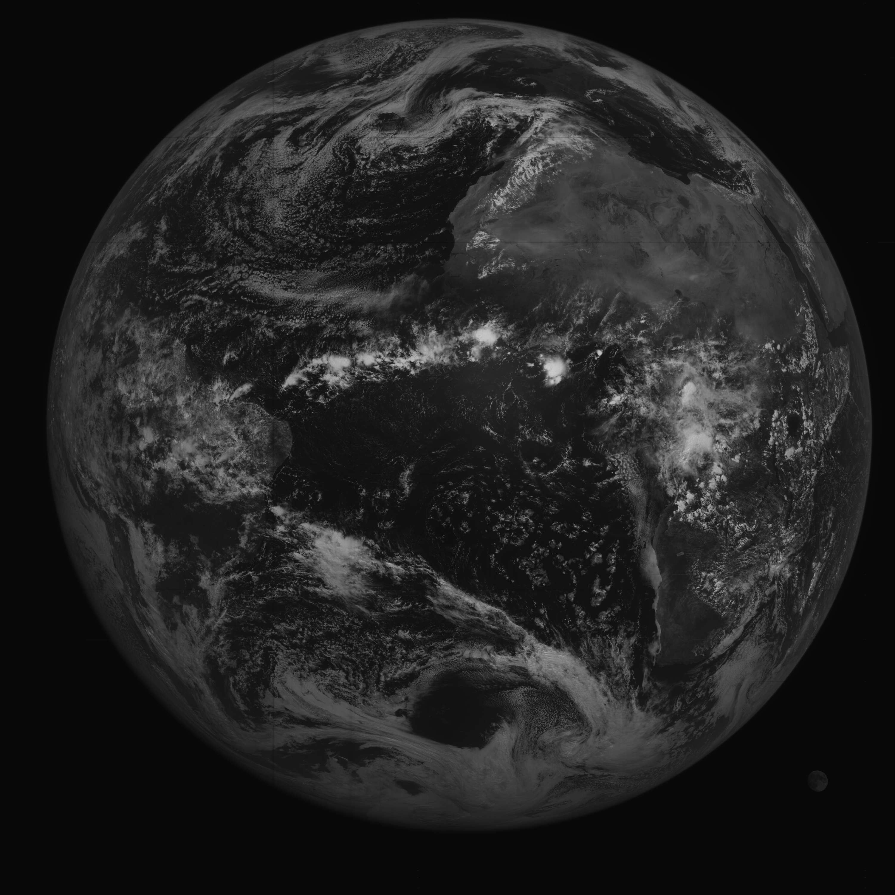
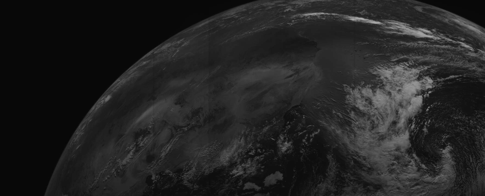
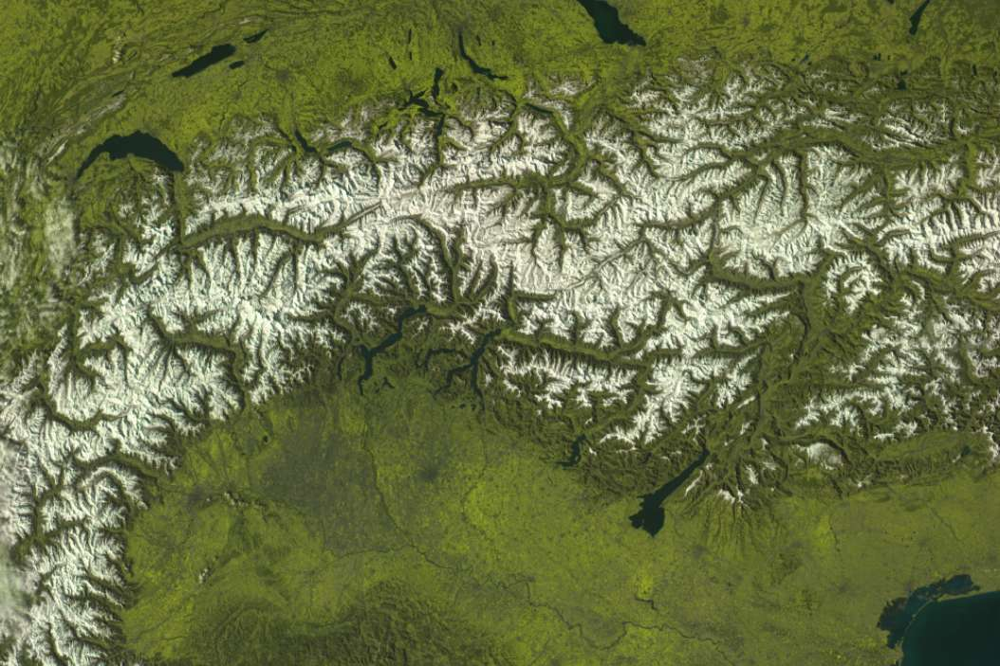

# Preamble

The goal of this page is to show what X-band satellites are receivable in this band in a presentable way, 'demystifying' the broadcasts. I will also include information about the symbol rate of the individual transmissions.

Every satellite will have full resolution sample imagery provided from my [archive](https://sat-archive.cpt-dingus.cc). **This is NOT an X-band reception guide**, the scope of such a guide is way out of my depth at the moment. I have personally NOT received these and likely will not do so for a while given the high initial cost.

# Introduction

X-band reception is a very advanced endeavor, given the severe lack of documentation online, high cost of entry, as well as the dedication required - You **will** fall flat on your face a lot! I might describe this process some day when I get enough disposable income to try it out myself, but for the time being, I will try to write out what I know fairly well already - **the satellites' broadcasts**.

The minimum dish size does not apply here because of the significant variance between setups, the low margins introduced with X can make two identical setups perform worlds apart because of minimal adjustments. Upon a suggestion from lego11, a minimum SNR for a good decode will be included instead of a minimal dish size. See below for a definition.

## Formatting

Each satellite will start with a compressed preview image to show what you can get, followed by a brief description of the series in question in the `Description` heading.

Next up is the `Signal table(s)` heading which contains information about the signal:

|Satellite|Frequency|Symbol rate|Polarization|FEC|Minimum SNR|Beamed|Location
|---|---|---|---|---|---|---|---|
|Satellite with the following parameters|S/E|S/E|S/E|Whether signal has FEC|Minimal dB needed for green RS on FEC, or enough SNR for recognizable imagery with median blur if no FEC|Whether signal is transmitted at a specific location|If beamed, location of beam. Otherwise, area where the signal is active

> S/E = Self explanatory

What follows after is some sample images in the `Sample imagery` heading (duh), processed or otherwise. All imagery is pulled from my [data archive](https://sat-archive.cpt-dingus.cc/).

# List of satellites that you can receive with SatDump

There are a 19+ satellites you can receive in this band, more specifically:

- 3x Elektro-L\*
- 2x Arktika-M\*
- 2x Meteor-M
- 4x FengYun 3
- 3x NOAA JPSS
- 2x NASA EOS
- 2x MetOp
- 2x GOES-R\*
- 1x GEO-KOMPSAT

\* Beamed - only receivable near the ground station heading (depends on how tight it is)

This list is not exhaustive, I apologize if I missed anything.

# Satellite descriptions

## Elektro-L

*Elektro-L2 Channel 1 received on 11/4/2025 at 12:29 UTC by lego11. 60% quality lossy JPEG compression applied, image resized to 25%. Click [here](https://sat-archive.cpt-dingus.cc/X-band/Elektro-L/Elektro-L2/2025-04-11_12-29_elektro-rdas_lego11/MSU-GS/MSU-GS-1.png) for the full resolution image*

### Description

- Elektro-L2, L3, and L3 all transmit a <u>beamed</u> **RDAS** signal containing all raw channels every 15 minutes (L2 every 30 minutes)
- Elektro-L2 suffered from a severe power amplifier failure making xRIT in the L-band unusable, weakening all transmissions for a while. The satellite has seemingly recovered the transmission strength.
- L2 and L3 both beam the transmission to Moscow, L4 beams it to Vladivostok

### Signal tables

RDAS

|Satellite|Frequency|Symbol rate|Polarization|FEC|Minimum SNR|Beamed|Location
|---|---|---|---|---|---|---|---|
|Elektro L2|7500 MHz|30.72 Msym/s|LHCP|No|5 dB|Yes|Moscow
|Elektro L3|7500 MHz|30.72 Msym/s|RHCP|No|5 dB|Yes|Moscow
|Elektro L4|7500 MHz|30.72 Msym/s|RHCP|No|5 dB|Yes|Vladivostok

### Sample imagery

- [Elektro-L2 Raw channel 1](https://sat-archive.cpt-dingus.cc/X-band/Elektro-L/Elektro-L2/2025-04-11_13-59_elektro-rdas_lego11/MSU-GS/MSU-GS-1.png) - Credit to Lego11
- [Elektro-L3 Raw channel 1](https://sat-archive.cpt-dingus.cc/X-band/Elektro-L/Elektro-L3/2025-01-04_08-29_elektro-rdas_Andrew-Lorett-LLC/MSU-GS/MSU-GS-1.png) - Credit to Andrew Lorett LLC

## Arktika-M

*Arktika-M2 Channel 1 received on 31/12/2024 at 13:29 UTC by Andrew Lorett LLC. 60% quality lossy JPEG compression applied, image resized to 25% and cropped. Click [here](https://sat-archive.cpt-dingus.cc/X-band/Arktika-M/Arktika-M2/2024-12-31_13-29_elektro-rdas_Andrew-Lorett-LLC/MSU-GS/MSU-GS-1.png) for the full resolution image*

### Description
- Arktika-M1 and Arktika-M2 both transmit beamed RDAS to Moscow and Vladivostok during their apogee.
- The broadcast is identical to that of Elektro-L, because Arktikas are the same bus; just shot into a molnyia orbit.
- The transmission is much weaker than that of Elektros' because of the significantly higher apogee of the molnyia orbit.

### Signal tables

RDAS

|Satellite|Frequency|Symbol rate|Polarization|FEC|Minimum SNR|Beamed|Location
|---|---|---|---|---|---|---|---|
|Arktika-M1, M2|7865 MHz|30.72 Msym/s|RHCP|No|5 dB|Yes|Moscow, Vladivostok

### Sample imagery

- [Arktika-M N°2 raw channel 1](https://sat-archive.cpt-dingus.cc/X-band/Arktika-M/Arktika-M2/2025-04-20_07-45_arktika-rdas_digitelektro/MSU-GS/MSU-GS-1.png) - Credit to digitelektro

## Meteor-M

*Meteor M2-2 KMSS DB crop of Channel 1 from the first MSU-100, received on 20/3/2024 at 14:26 UTC by Andrew Lorett LLC. 60% quality lossy JPEG compression applied, click [here](https://sat-archive.cpt-dingus.cc/X-band/Meteor-M/KMSS/Meteor-M2-2/2024-03-20_14-26_meteor-kmss-db_Andrew-Lorett-LLC/KMSS_MSU100_1/MSU100-1.png) for the full resolution image*

### Description

- **Meteor-M N°2-3** and **Meteor-M N°2-4** both transmit in the X bands, however Meteor M2-3 has a failed wide X-band transmitter, making it only do **narrow transmissions**.
- As said above, transmissions are separated into "Narrow" ones at ~15 MHz and "Wide" ones at ~61 MHz
- Meteor M2-4 transmits KMSS DB in and around Russia as well as over most of Europe, dumps to Russian groundstations (notably Moscow)
- These satellites transmit a diverse amount of transmissions, as is seen below in the table. The transmissions are usually RHCP, but can also be LHCP.

### Signal Tables

MTVZA Dump (Narrow BPSK)

|Satellite|Frequency|Symbol rate|Polarization|FEC|Minimum SNR|Beamed|Location
|---|---|---|---|---|---|---|---|
|Meteor M2-3, M2-4|8128 MHz|15.36 Msym/s|RHCP|No|2.5 dB|No|Moscow, other ground stations in Russia

IKFS Dump (Narrow QPSK) - Unconfirmed, not received yet

|Satellite|Frequency|Symbol rate|Polarization|FEC|Minimum SNR|Beamed|Location
|---|---|---|---|---|---|---|---|
|Meteor M2-3, M2-4|???|15.36 Msym/s|???|No|3.5 dB|No|Khabrovsk ???

KMSS DB (Wide BPSK)

|Satellite|Frequency|Symbol rate|Polarization|FEC|Minimum SNR|Beamed|Location
|---|---|---|---|---|---|---|---|
|Meteor M2-4|8128, 8320\* MHz|61.44 Msym/s|RHCP|No|2.5 dB|No|Europe, Russia & its surroundings

\* 8320 MHz is rare

KMSS Dump / MSU-MR Dump / Severjanin-M + MeteoSAR Dump (Wide QPSK)

|Satellite|Frequency|Symbol rate|Polarization|FEC|Minimum SNR|Beamed|Location
|---|---|---|---|---|---|---|---|
|Meteor M2-4|8320 MHz|61.44 Msym/s|RHCP|No|3.5 dB|No|Moscow, other ground stations in Russia

### Sample imagery

TODO

## FengYun-3

*A crop of FengYun-3F received on 28/4/2025 at 09:07 UTC by Konrad Unger. Processed with the `True color` composite. 60% lossy JPEG compression applied. Click [here](https://sat-archive.cpt-dingus.cc/X-band/FengYun-3/AHRPT/FengYun-3F/2025-04-28_09-07_fengyun-3f-ahrpt_UngerKonrad/Fengyun-3F_true-color_ungerkonrad.png) for the full resolution image*

### Description

- Fengyun 3D-3G all transmit several signals in the X-band, most notably unencrypted **AHRPT** (DB).
- The instruments between these vary, notably:
    - FengYun 3E has a XEUVI for sun imaging
    - FengYun 3G is in a Drifting orbit, carries RM (Rainfall measurement) instrumentation as its payload unlike the rest of the Fengyun 3 series. It is very fast and flies very low, making it receivable with a smaller dish than the rest. It also has an unusually small symbol rate at just 6 Msym/s.

### Signal tables

AHRPT

|Satellite|Frequency|Symbol rate|Polarization|FEC|Minimum SNR|Beamed|Location
|---|---|---|---|---|---|---|---|
|FengYun 3D|7820 MHz|30 Msym/s|RHCP|Yes|7 dB|No|Global
|FengYun 3E|7860 MHz|38.4 Msym/s|RHCP|Yes|7 dB|No|Global
|FengYun 3F|7790 MHz|38.4 Msym/s|LHCP|Yes|7 dB|No|Global
|FengYun 3G|7790 MHz|6 Msym/s|RHCP|Yes|7 dB|No|Global

DPT (Dump)

|Satellite|Frequency|Symbol rate|Polarization|FEC|Minimum SNR|Beamed|Location
|---|---|---|---|---|---|---|---|
|FengYun 3D|8250 MHz|150 Msym/s|???|Yes|7 dB|???|China
|FengYun 3E|8212.5 MHz|225 Msym/s|???|Yes|7 dB|???|China
|FengYun 3F|8212.5 MHz|225 Msym/s|???|Yes|7 dB|???|China
|FengYun 3G|???|225 Msym/s|???|Yes|11 dB|???|China

### Sample imagery
 
- [FengYun 3F True color](https://sat-archive.cpt-dingus.cc/X-band/Meteor-M/KMSS/Meteor-M2-2/2024-03-20_14-26_meteor-kmss-db_Andrew-Lorett-LLC/KMSS_MSU100_1/MSU100-1.png) - Credit to Konrad Unger

- TODO

# NOAA JPSS

*, received on  at  UTC by . , click [here](https://sat-archive.cpt-dingus.cc/X-band/Meteor-M/KMSS/Meteor-M2-2/2024-03-20_14-26_meteor-kmss-db_Andrew-Lorett-LLC/KMSS_MSU100_1/MSU100-1.png) for the full resolution image*

### Description

- Being an improved NOAA POES, all JPSS satellites transmit in the X-band -> Suomi NPP, NOAA 20, and NOAA 21
- NOAA 20 has suffered many issues, notably a failed detector in the VIIRS instrument causing scan lines to appear in certain composites.
- All satellites have a null in their antennas' radiation pattern:
    - Suomi NPP has a strong null when it's west from your position at certain elevations
    - NOAA 20 has a strong null when it's east from your position at certain elevations
    - NOAA 21's null is still present but not as significant, improved FEC helps mitigate it further

### Signal tables

DB:

|Satellite|Frequency|Symbol rate|Polarization|FEC|Minimum SNR|Beamed|Location
|---|---|---|---|---|---|---|---|
|Suomi NPP|7812 MHz|15 Msym/s|RHCP|Yes|6 dB|No|Global
|NOAA 20|7812 MHz|15 Msym/s|RHCP|Yes|6 dB|No|Global
|NOAA 21|7812 MHz|25 Msym/s|RHCP|Yes|4 dB|No|Global

### Sample imagery

## NASA EOS

*, received on  at  UTC by . , click [here](https://sat-archive.cpt-dingus.cc/X-band/Meteor-M/KMSS/Meteor-M2-2/2024-03-20_14-26_meteor-kmss-db_Andrew-Lorett-LLC/KMSS_MSU100_1/MSU100-1.png) for the full resolution image*

### Description

- Nasa Earth Observating Satellites is a constellation of 3 satellites, only two of which still transmit DB today: Aqua, and Aura
- The third satellite, Terra still transmits dumps but the DB has been disabled in 09/2024.
- Aura only transmits the OMI instrument which is very low rate
- The dumps are not decodable by SatDump, are encrypted (?)

### Signal tables

|Satellite|Frequency|Symbol rate|Polarization|FEC|Minimum SNR|Beamed|Location
|---|---|---|---|---|---|---|---|
|Aqua|8160 MHz|7.5 MHz|RHCP|Yes|11 dB|No|Global
|Aura|8160 MHz|7.5 MHz|RHCP|Yes|11 dB|No|Global

### Sample imagery

## MetOp

*, received on  at  UTC by . , click [here](https://sat-archive.cpt-dingus.cc/X-band/Meteor-M/KMSS/Meteor-M2-2/2024-03-20_14-26_meteor-kmss-db_Andrew-Lorett-LLC/KMSS_MSU100_1/MSU100-1.png) for the full resolution image*

### Description

- Both current MetOp satellites dump their whole orbit to Svalbard
- The dump includes all instruments

### Signal tables

|Satellite|Frequency|Symbol rate|Polarization|FEC|Minimum SNR|Beamed|Location
|---|---|---|---|---|---|---|---|
|MetOp-B|7800 MHz|š35 Msym/s|RHCP|No|??|??|Svalbard
|MetOp-C|7800 MHz|5 Msym/s|RHCP|No|??|??|Svalbard

### Sample imagery

# bbb
---
---
---
---
---
---

*, received on  at  UTC by . , click [here](https://sat-archive.cpt-dingus.cc/X-band/Meteor-M/KMSS/Meteor-M2-2/2024-03-20_14-26_meteor-kmss-db_Andrew-Lorett-LLC/KMSS_MSU100_1/MSU100-1.png) for the full resolution image*

### Description

### Signal tables

|Satellite|Frequency|Symbol rate|Polarization|FEC|Minimum SNR|Beamed|Location
|---|---|---|---|---|---|---|---|

### Sample imagery
