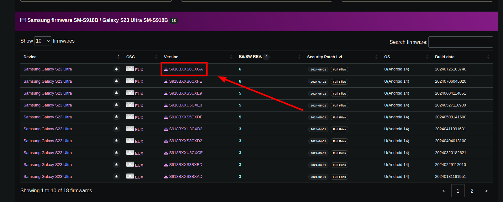
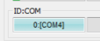
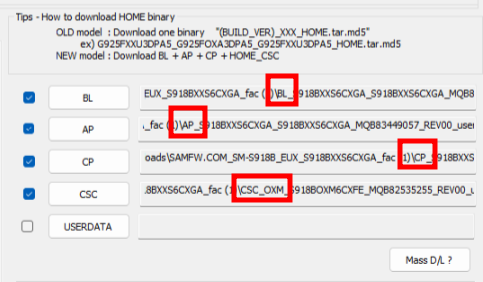

# Preamble

This article will guide you on how to reflash your Samsung phone's stock firmware if you are facing issues that require a full wipe of the OS. When done properly, it should be perfectly safe, especially since this guide is instructed under your phone's protected state, which will NOT flash any unknown or incorrect binaries. However please keep in mind, *this guide describes some sensitive processes, which - if done incorrectly - CAN cause permanent damage to your device. 

> ***I HOLD NO LIABLITY FOR ANY DAMAGE YOU MIGHT DO TO YOUR DEVICE.***

# Uses

Reflashing the firmware can fix issues that stem from corrupted OS files which wouldn't normally get replaced/fixed using a factory reset. Another use is when you have an issue with updating your device, including but not limited to the settings app stating: `Your current software version isn't supported. Visit a service centre.` and refusing to download any new updates.

# Dangers

Make sure to download the correct binaries, select every file correctly, **FOLLOW THIS GUIDE TO THE TEE.** Deviating or making mistakes can vary from a simple error message to you owning a fancy paperweight. ***Don't mess around with random switches if you don't know what you are doing. Really.*** 

- Flashing an incorrect binary or messing around with random settings within Odin **CAN** brick your device.
- Flashing an unofficial binary **WILL** trip the Knox e-fuse within your phone breaking all Knox functionality and will also void its warranty. Only download official binaries to avoid this from happening.

# Making the process safe

- As a safety precaution, if your phone has an Exynos chipset, it is advised to enable the **OEM lock** prior to following this guide. If you have a Snapdragon chipset, it's already permanently enabled. **If the OEM lock is enabled, you don't have to worry about bricking your device or tripping your phone's knox and warranty.** The lock makes you only able to flash official binaries, if you choose an invalid binary your phone will simply refuse it.

# Prerequisites

## Know your CSC code and model number

Samsung devices use CSC (Country Specific Codes) to differentiate firmware between different regions. It's best you flash the same one as the one currently on your device for safety. An exhaustive list can be found [here](](https://technastic.com/samsung-csc-codes-list/). 
> **Warning: Some CSC codes are marked as `Multi-CSC`, these are NOT specific and represent several other CSC codes! If the CSC code you found in the first method is in the `Multi-CSC` section in the list linked above, try one of the other two methods.**

Each phone also has a model number which defines the specific hardware variant you have, such as international versus USA specific hardware. You HAVE to match it to that of your phone's, otherwise it will refuse to flash the binary.

You can find these code in a few ways:

1. **Dialing `*#1234#` and looking at the CSC field**

    The first five letters are your model number, the following 3 letters are your CSC code. For example:

    - `G988BOXMKHXEA`
        - `G988B` is the phone model
        - `OXM` is the CSC code

2. **Using device information in your settings app**

    - Model number:
        - Navigate to Settings > Device information > Look at hte `Model name` field

    - CSC: 
        - Navigate to Settings > Device information > Software information > `Service provider software version`

    The CSC code will be listed in the bottom line, for example:
    >  `ORX/ORX,ORX/EUX/ORX`

    This means the phones uses the ORX CSC code, which equates to Slovakia. EUX is also mentioned, is the generic European CSC. 

3. **Using the [Phone Info](https://www.apkmirror.com/apk/vndnguyen/phone-info-%E2%98%85samsung%E2%98%85/) app**

    This app is still on the playstore, but doesn't offer Samsung specific information anymore. The link includes the app with the additional information.

    - Model number
        - This can be found in the `General` tab, is in the `Model` field.

    - CSC:
        - This can be found in the `CSC Code` tab, is in the `Active CSC code` field.

## Remove the device from your Google account

You **MUST** log out of all google accounts on the device in order to disable the FRP (Factory Reset Protection) lock. This feature exists so that stolen phones *can't be reflashed while still connected to a Google account*.

## Download Odin

Odin is a tool made for flashing Samsung devices, is what you will use to flash the new firmware onto your phone. You can download it [here](https://odindownload.com/).

# Getting the firmware binaries

To not trip (permanently disable) knox and void your warranty, you **MUST** install the official binary. Several websites disseminate these such as [Samfw](https://samfw.com/) and [Sammobile](https://www.sammobile.com/), I will focus on Samfw given its faster download speeds via Google Drive.

1. Enter your model number and click the entry that pops up
2. Choose your CSC code
3. Download the latest available version by clicking the `Version` field.

4. Once downloaded, extract the .zip archive. It will have 5 big files inside as well as a info text file.
5. Open Odin
6. Reboot your phone into Download (Odin) mode by plugging it into your computer, rebooting, holding both volume up and volume down until your screen turns on with a warning. Hit volume up to continue.
7. Verify your phone shows up by seeing if it pops up in the first `ID:COM` window. If it doesn't, you need to install Samsung drivers found [here](https://developer.samsung.com/android-usb-driver).  

8. Select everything but `USERDATA` accordingly from the archive you downloaded (`AP_..` to AP, `BL_..` to BL, `CP_..` to CP, `CSC_..` to CSC) and tick the box next to each one of these. 

    > You could also use the `HOME_CSC` file in the CSC field, it won't erase user data but we want a full reflash, so use the standard `CSC_..` file.

    

9. In the `config` tab, enable `Auto Reboot` and `F. Reset Time`. <u> ***TICK NOTHING ELSE!!!*** </u>
10. If all files are loaded and your phone is showing up properly, you can hit `Start`.
11. Wait for Odin to finish.

One of two results can happen now:

- **A green `PASS` lights up**: Congratulations, you have succesfully flashed your device! You can unplug it once it restarts, set it up as usual. If you had an issue with updating, you can verify it's fixed now.
- **A red `FAIL` lights up**: Something went wrong with the flash. Make sure you selected the correct files, have the correct model number downloaded.
