# Preamble

This page is intended to serve as a place where I collate all of my knowledge about space weather to hopefully help you be able to understand how space weather works and how we can track it all the way to the Northern lights manifesting even at lower latitudes.

> Please note that I am not an expert on these topics, take anything in this article with a grain of salt!

A huge thanks also has to be given to the [SpaceWeatherLive](https://www.spaceweatherlive.com/) community - the vast amount of my knowledge comes from reading stuff on that forum. It is also an incredible website which delves into great detail about every aspect of Space weather in general, I highly advise you check them out!

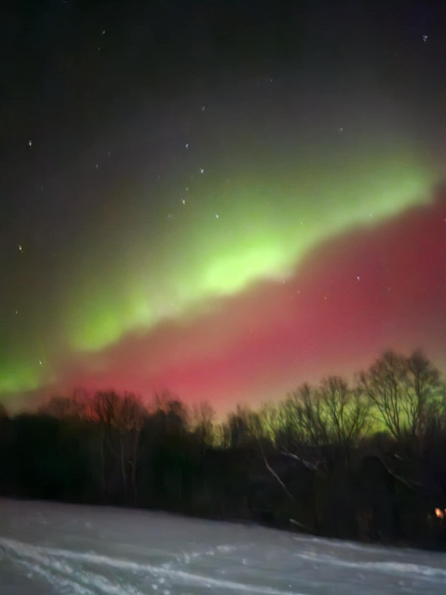
*A rough picture of the Northern lights I captured in Slovakia after tracking a CME hit the Earth on 19-01-2026*

# Solar activity

The place where most of the space weather we experience originates is the one and only **Sun**

Its surface is just a big soup of plasma which is in perpetual movement. It looks something like this:

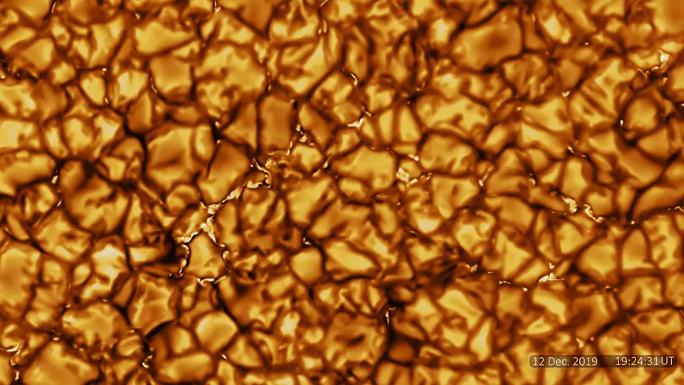  
*Inouye Solar telescope video, [source](https://nso.edu/telescopes/dkist/first-light-cropped-field-movie/)*

The constant movement generates magnetic fields which can sometimes become quite strong in a concentrated area. When this happens, the area is called an **Active Region** (AR), since the fields can become strong enough to cause events described below. If it grows to be strong enough, it can even cause the local area of the sun to be slightly colder and therefore darker than the rest - such areas are called **Sun spots**.

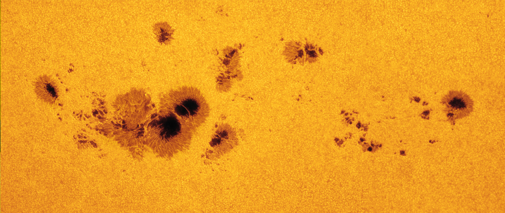  
*An active region containing several sun spots. [Source](https://en.wikipedia.org/wiki/Sunspot)*

An interaction between two parts of a spot, or rarely even between two spots, is called a **Flare** - it happens when magnetic fields interact and rapidly change their polarities. When such interactions happen, they tend to happen quite violently while displacing a lot of plasma. If there happens to be a lot of plasma above the spot where the flare occurred, it might get violently ejected from the surface - think of it like lighting a dynamite under a bucket. An event like this is called a **Coronal mass ejection** (CME) because *Coronal mass* (Plasma) gets *Ejected* from the sun surface. Shocking, I know.

---

It should also be noted that the sun experiences cycles called **solar cycles** - these are periods of increased activity periodically repeat roughly every 11 years. The current solar cycle, SC25, peaked in 2024/2025. You can find more information about them [here](https://en.wikipedia.org/wiki/Solar_cycle), see their tracking [here](https://www.spaceweatherlive.com/en/solar-activity/solar-cycle.html).

## Resources to track stuff at this step

This is arguably the most important thing to keep track of, as it is where all the fun stuff originates. Arguably the most important thing to keep track of is a map of the magnetic fields - this is called a **Magnetogram**. A lot of places feature one, but arguably the best one available to us amateurs when it comes to resolution (both temporal and spatial) is the one on the Solar Dynamics Observatory (SDO). 

You can access a live, full resolution picture [here](https://jsoc1.stanford.edu/data/hmi/images/latest/HMI_latest_color_Mag_4096x4096.jpg)

Note that the above link is to the so-called *Color magnetogram* which is a colored version of the Magnetogram using a Red-Blue coloring to make is easier to differentiate between the two polarities on the surface. You can access the other products [here](https://jsoc1.stanford.edu/hmi_latest)

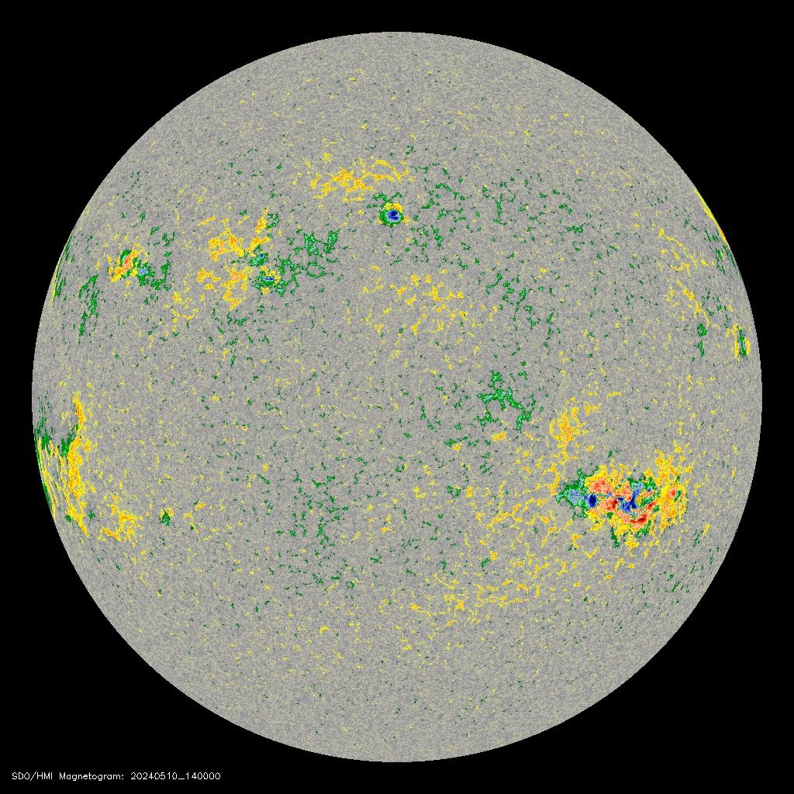  
*Colored SDO HMI magnetogram from 10-05-2024 showing the monstrous AR13664 on the right-hand side of the image. See how it is a mix of several spots of different polarities. [Source](http://jsoc.stanford.edu/cgi-bin/hmiimage.pl?Year=2024&Month=05&Day=10&Hour=14&Minute=00&Kind=_M_color_&resolution=1k)*

### Sun spot detection

Another important instrument is the **Intensitygram** - This shows the magnetic intensity of the whole disk. In layman's terms, it shows where sun spots are by noting the increased activity.

These are usually on the front page of space weather prediction sites, as you can roughly tell the size (and therefore coolness) of sun spots. The bigger it is, the more complex it [usually] is, and the more active it usually gets when it comes to Flares and CMEs.

The latest full resolution intensitygram from SDO can be accessed [here](https://jsoc1.stanford.edu/data/hmi/images/latest/HMI_latest_colInt_4096x4096.jpg)

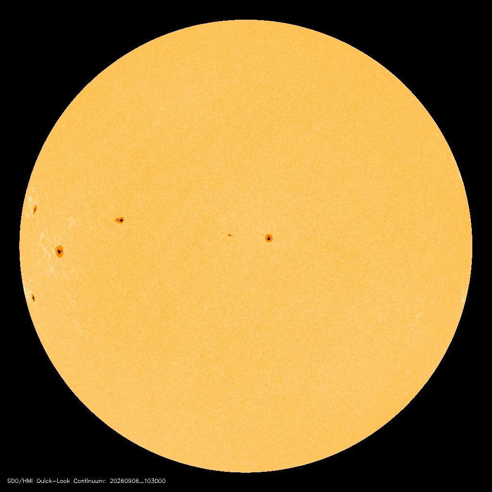  
*Latest SDO color intensitygram as of writing this article, showing a couple of sun spots. [Source](https://jsoc1.stanford.edu/data/hmi/images/latest)*

#### Sun spot specifications

This is a small side explanation to clear up how exactly you specify sun spots. Sun spots have 3 primary identifiers:

1. The number (AR12345, since we passed 10000 we often just shorten to 2345 when referring to them colloquially)
2. The size (the primary unit is Millionths of Hemisphere, see [here](https://www.spaceweatherlive.com/en/help/how-do-you-determine-the-size-of-a-sunspot-region.html) for more info)
3. The class

The class magnitude is the most useful part, while it looks daunting it is not difficult to understand. In layman's terms, it just describes features of a sun spot:
- **Alpha** = There is only one polarity
- **Beta** = There are two polarities
- **Gamma** = The two polarities are distributed unevenly and in a complex way
- **Delta** = The two polarities are both close together

A Beta-Gamma-Delta magnitude is the most complex, whereas an Alpha magnitude is the simplest.

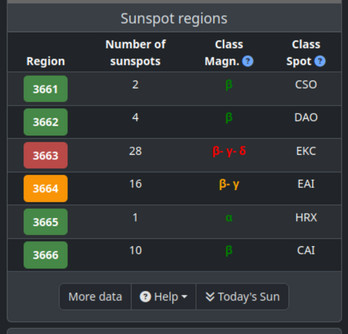  
*SpaceWeatherLive dashboard showing the current active time slots at 04-05-2024. See how AR13663 has the most complex, Beta-Gamma-Delta magnitude, AR13664 has the less complex Beta-Gamma magnitude, and others have Beta or Alpha magnitudes. [Wayback machine snapshot](https://web.archive.org/web/20240504102615/https://www.spaceweatherlive.com/)*

You can find more information about the classes [here](https://www.spaceweatherlive.com/en/help/the-magnetic-classification-of-sunspots.html)

> The spot classification (Class spot) column is a bit more complex, as describes the complete shape and distribution of the sun spot. You don't really need to know about it, but can check it out [here](https://www.spaceweatherlive.com/en/help/the-classification-of-sunspots-after-malde.html) if curious.

#### Development

You can also check the development of a sun spot by using a so-called **Vector magnetogram**. This is essentially a map which shows movement vectors of how the magnetic field of a sun spot has been moving. An example of this is SHARP which you can access [here](https://defn.nict.go.jp/sharp/index_sharp.html).

> Please note that SHARP uses HARP numbers for active regions, instead of NOAA numbers which is what this guide includes. See the image on the bottom of the SHARP page and check the top right corner, it includes both NOAA and HARP numbers there.

#### Far side detection

Sun spots might also form on the other side of the sun, which we can't really see. However, instruments exist which measure magnetic field strength on the whole sun surface, an example of which is present in the GONG suite accessible [here](https://gong2.nso.edu/products/mainView/table.php?configFile=configs/mainView.cfg).

> Please note that it sometimes glitches and shows the rear side as being full of sun spots - this is just a processing glitch caused by GDS outages.

### Flares

Now that we know where to find the activity spots, we need to see when the actual flares happen. We do this by measuring the X-ray flux (fancy term for 'how much light in a specific wavelength comes in') on a satellite, usually GOES because of their wide availability. You can track this on several websites:

- [SpaceWeatherLive](https://www.spaceweatherlive.com/en/solar-activity/solar-flares.html)
- [NOAA SWPC](https://www.spaceweather.gov/products/goes-proton-flux) 
- [Solar demon](https://www.sidc.be/solardemon/flares.php)

> Whereas both SWPC and SpaceWeatherLive go off of NOAA flare detection, Solar demon runs its own algorithm trying to detect the said flares automatically.

#### Flare scale

Since the power of a flare can vary significantly, we needed to develop a scale to properly gauge it even if it grows exponentially in strength. Therefore, we use a **logarithmic scale** for it consisting of 5 letters, A - B - C - M - X. Each letter rolls over into the next after reaching 10 (A8, A9, B1, B2...)

> A **B1** flare is 10x as strong as an **A1** flare, a **C1** flare is 10x as strong as a **B1** flare and 100x as strong as an **A1** flare.

The most powerful flares, **X**, do not roll over after reaching X10 because of their rarity - they just keep going with an X number. Only 12 have ever been recorded, you can see them [here](https://www.spaceweatherlive.com/en/solar-activity/top-50-solar-flares.html)

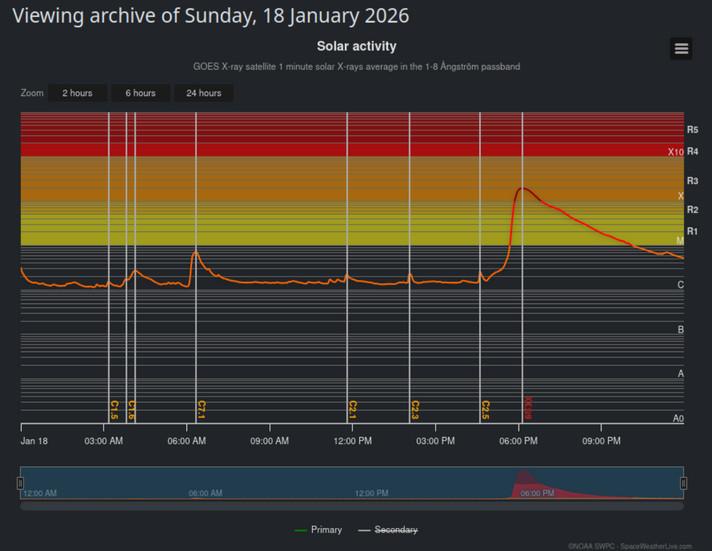
*A chart showing the strength of incoming X-ray flux from the GOES satellites on 18-01-2026. See how there are several peaks denoted by a vertical line - these are flares that occurred, the strongest being an eruptive X1.95 flare around 6 PM. Notice how it gradually decreased over the period of several hours instead of quickly falling back down to background levels. This is a telling sign of an eruptive flare. Also note the scale R scale being used besides the now familiar ABCMX scale. [Source](https://www.spaceweatherlive.com/en/archive/2026/01/18/xray.html)*

#### Flare types

Flares are divided into two distinct types:
- **Impulsive** which don't cause any CME
- **Eruptive** which cause CMEs

You can usually roughly tell these apart by their length - Impulsive are often short (< 30 minutes) whereas Eruptive flares are often > 1 hour. The most defining aspect is the shape of the X-ray flux over time - impulsive flares are often a spike whereas eruptive flares usually gradually decrease over time.

#### Magnetic cages

Sometimes, magnetic fields can grow strong enough to create a so-called **magnetic cage** - this is when magnetic fields form above a sun spot, physically preventing any CMEs from erupting even after significantly strong flares. More information can be found in [this article](https://www.nasa.gov/missions/sdo/nasas-sdo-reveals-how-magnetic-cage-on-the-sun-stopped-solar-eruption/)

The cage can sometimes be overpowered by a strong enough flare, however it takes a tremendous amount of power to break through it. If a cage forms, a sun spot is generally likely to fizzle out before it produces any CMEs.

### Coronal mass ejections

The thing that you should arguably be the most interested in, CMEs, are detected in a couple of ways:

#### 1 - Visible lifting

There is a countless amount of satellites pointed at the sun with the purpose of imaging it at specific wavelengths.

> The wavelengths the sun is imaged at are usually measured in Å, which is a unit indicating 10⁻¹⁰ m (i.e. 0.1 nm).

When an eruption happens, you can sometimes see the filament actually lifting off after a flare occurs. My favorite resource for this is [Lmsal's SolarSoft](https://www.lmsal.com/solarsoft/latest_events/) which shows the latest significant events in an easily browsable view (Cruiser). *The website is an absolute mess at first, but I adore its design*

An example of such an event is visible below:
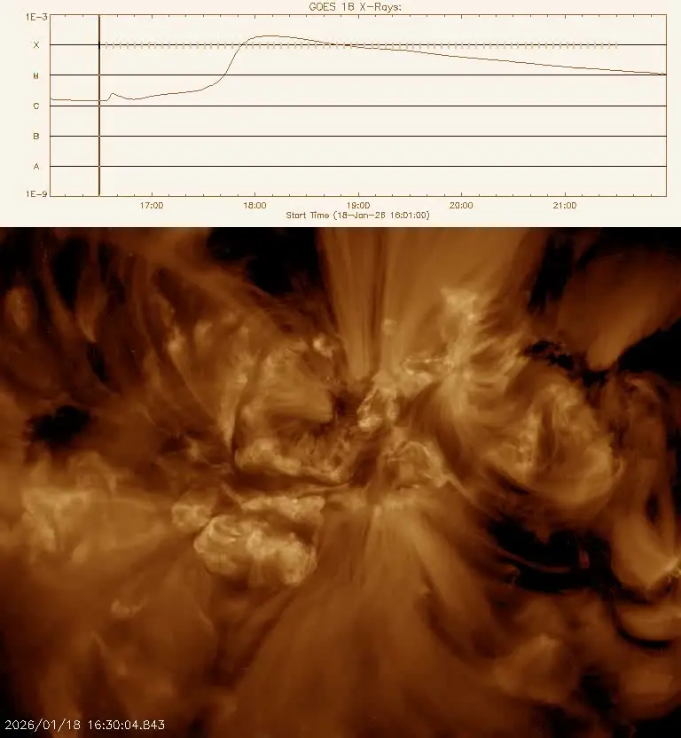 
*GOES-16 SUVI 193 Å animation showing an eruptive flare on 18-01-2026. Notice how you can see the right-hand side lift off the surface [Source](https://www.lmsal.com/solarsoft/ssw/last_events-2026/last_events_20260202_1201/index.html#Eruptive_X1.9_AR_4341_S14E22_EUVCME_Post_Eruption_Slinky_Arcade_Apex_Aimed_at_Viewer)*

> Fun fact: Notice that after the flare happens, a beautiful tunnel-like structure develops on the surface. This structure is called a **post-erruption arcade**, colloquially referred to as **arcade rings**. See more info [here](https://en.wikipedia.org/wiki/Solar_flare#Post-eruption_loops_and_arcades)

#### 2 - Coronal dimming

After an ejection happens, the corona gets dimmer because there is less material on the surface. There are tools detected to automatically detect such events, such as [Solar Demon](https://www.sidc.be/solardemon/dimmings.php)

#### 3 - CACTus

CACTus is a tool which automatically detects CMEs from the latest available coronagraph imagery. You can access it [here](https://www.spaceweatherlive.com/en/solar-activity/latest-cmes.html)

It tells you the angle where it launched, the approximate speed, and the **Halo** - the last being arguably the most important.

The **halo** tells you how much of the sun is covered from Earth's point of view. If you see the ejection spread out evenly into every side, you get what's called a **full halo** - this means the majority of the CME material is headed straight for Earth. Otherwise, you might see the material spread to one half of the sun - this is a **partial halo**, which means that the material will likely clip Earth but will not result in a full impact. In the case of **no halo**, the material is likely to completely miss Earth as it was launched in the wrong direction.

> Coronagraphs will be explained in a later heading. Also note that a full halo can also mean a far side eruption, in which case the material is headed precisely away from Earth (:

#### 4 - Coronagraph imagery

This is the primary, definitive way to tell if a CME is headed towards Earth. They will be described in the next major heading.

#### 5 - CCMC Donki

NOAA publishes its detections publically, makes them searchable in a catalog [here](https://kauai.ccmc.gsfc.nasa.gov/DONKI/search/). If you hit 'Search', look for any 'CME' entries. You will likely find a lot of them, however most of these are quite slow and won't have a significant (if any) impact on Earth.

CMEs above roughly 600 km/s usually start having an impact on Earth. You can also ***roughly*** use the mere presence of a 'SH' measurement type as a way to gauge potential impact. A 'SH' type is called a **shock** front, which is a rough and often inaccurate measurement performed on flares which are incredibly quick and voluminous in order to get forecasts as quickly as possible. Please note that the 'LE' (**leading edge**) measurements are often much more reliable and definitive.

In any case, once enough time passes, you should see model runs of `WSA-ENLIL` pop up on a given CME. This is a model that predicts how a CME propagates through space.

  
*A sample WSA-ENLIL run the big October 2024 solar storm. You can see a lot of high density material passing through Earth. The left side shows a top-down view of the earth-sun plane. The middle view is a vertical slice of the space between the Earth and sun. The right view is a map of the sun's full 360° surroundings at a 1 AU distance (right where Earth is). [Source](https://kauai.ccmc.gsfc.nasa.gov/DONKI/view/WSA-ENLIL/33884/1)*

# Getting to Earth

Okay, the sun farted some material our way. Now what?

The first step is likely figuring out where it goes - I mentioned it in the above heading with CACTus, but how exactly is it done?

## Coronagraphs

The sun's immediate surroundings are called the **corona**, it is incredibly dim compared to the blinding sun surface, making it incredibly difficult to get pictures of. We can take them by occulting (covering) the sun with a small disk, then taking a picture. Since the sun is covered, we can adjust the exposure to image the corona. A device which does this is called a **coronagraph**.

There are only four primary coronagraphs in function today:

- ***SOHO LASCO***
  - SOHO (Solar and Heliospheric Observatory) is a satellite placed at **L1** which is a point between Earth and the Sun where gravitational phenomena allow them to remain stationary for the most part.
  - This satellite is incredibly old (and was almost lost in 1998 after it nearly froze itself!), but has been the primary source of corona data (until recent years) with its LASCO instrument.
  - This instrument has three zoom levels - C1, C2, and C3. C1 (closest to the sun surface) was lost during the 1998 incident, C2 and C3 remain operational to this day albeit at a significant delay (> several hours) because of the satellite's slow downlinks.
- ***Stereo-A SECCHI***
  - This is also a fairly old satellite in a heliocentric orbit (around the sun) which is currently getting further from Earth. It includes a sensing suite called SECCHI which features a coronagraph.
  - This satellite is especially helpful since it images the sun at an angle different from Earth, giving us a side view of what might be coming towards Earth.
  - It was launched with its sister satellite, Stereo-B, which was lost in a routine test in 2014.
- ***GOES-19 CCOR-1***
  - Launched in 2024, this satellite carries a new generation coronagraph which allowed us to get data at a significantly reduced delay (just ~15 minutes) for the first time.
  - GOES-19 is in a geostationary orbit around the Earth, which means that the Earth sometimes obstructs the sun or gets into view with reflections. The sun only passes behind the Earth during **eclipse season** (equinoxes). Earth reflections entering the sensor have been called **Earthshine** by NOAA.
- ***Solar-1 CCOR-2***
  - Launched in late 2025 and brought into operation in 2026, this satellite is placed at L1 and provides us data without [planned] interruptions unlike GOES-19.
  - Some lens got moved during launch, which gives it a couple of artifacts. These have been averaged out for the most part, however.

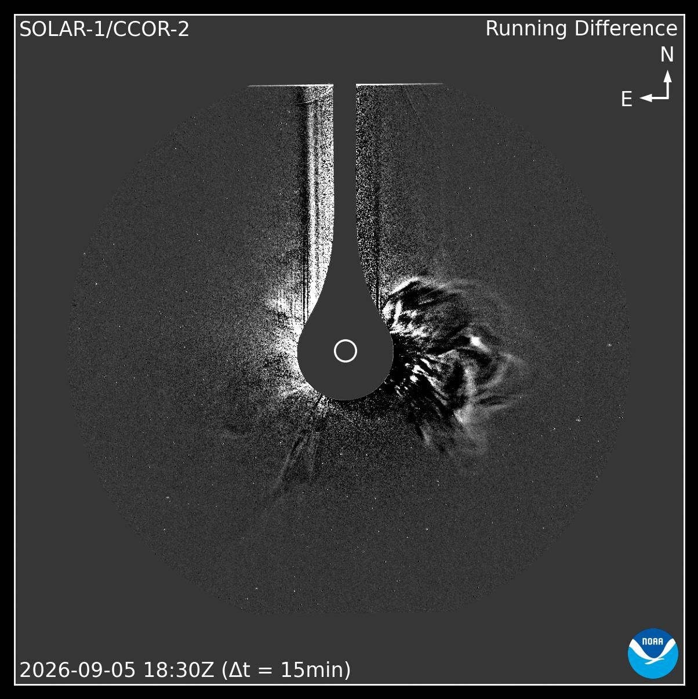  
*A differential image from the SOLAR-1 coronagraph showing a CME released on the right-hand side of the sun. The sun is portrayed as the small white dot in the middle of the image. The line going up the image is the arm holding the occulting disk in place.*

## Tracking the CME to Earth

Okay, now that we know that a CME is headed towards Earth, how do we determine when it reaches us?

First, we can look at the WSA-ENLIL runs to get a rough estimate of when it arrives at the modelled speed. They usually take around 2 days to arrive from the sun, with the exceptionally fast ones only taking as little as 1 day.

We can do better than that though. The sun has a constant stream of particles flowing towards the Earth called the **Solar wind**. A CME presents itself as the solar wind rapidly increasing in strength and density, which we can measure. Since it travels slower than the speed of light, we can measure it somewhere between the Earth and Sun like at the L1 point, then transmit that information back to Earth. This gives us a forecast of what conditions will be when they reach Earth in roughly 30 minutes (from L1).

Other satellites exist, but only L1 is guaranteed to have satellites positioned at them. I.e. you can see Stereo-A's position on the WSA-ENLIL run, when CMEs reach it, you can see values change on the live SEM data from its PLASTIC instrument [here](https://www.spaceweather.gov/products/solar-terrestrial-relations-observatory-stereo). The SEM data is explained below:

### Solar wind

Satellites measure a lot of properties of the local solar wind, such as:

- The speed and density of the solar wind
- The strength (Bt) of the Earth's interplanetary magnetic field (IMF)
- The Z element (Bz) of the Earth's IMF
- A couple other things such as the Bx and By elements, Angle and temperature of solar wind.

The **speed and density** is important to tell us how much the wind will dissipate before it reaches the Earth - the faster it is, the better the odds of a geomagnetic storm developing.

The IMF is a measure of the strength of the magnetic field in 3 directions:
- Bx (Earth-sun)
- By (East and West of the Sun)
- Bz (North and South of the Sun)
- Also Bt which is a sum of all of these

> The unit used is nT, where 0-10 is 'Weak', 10-20 is 'Moderate', 30+ is strong

  
*A visual guide of the IMF values. [Source](https://www.spaceweatherlive.com/en/help/the-interplanetary-magnetic-field-imf.html)*

For aurora creation, we primarily care about the North-South deflection (Bz), this will be described later. For more information visit the incredible summary from SWL [here](https://www.spaceweatherlive.com/en/help/the-interplanetary-magnetic-field-imf.html)

### Proton storms

Proton storms are usually paired with CMEs, as they both originate from the same event - Flares. They are tracked using several counters which divide them into energy tiers (i.e. low energy protons and high energy protons).

Elevated amounts of protons causes the 'S' level of the GSR scale to go up. A major proton storm can cause GPS issues, satellite glitches, increased radiation for people in space/airplanes. The protons also manifest as a huge amount of static present on coronagraphs:

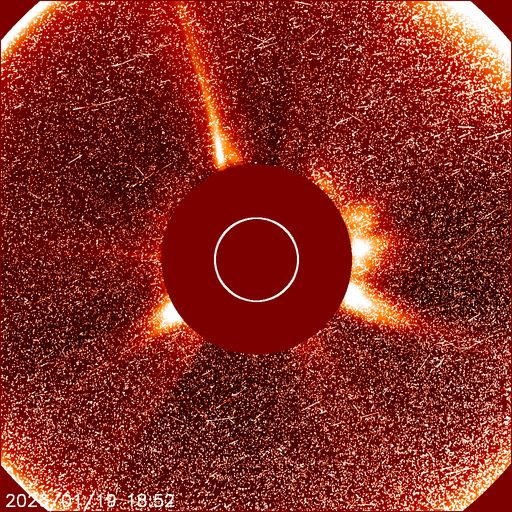  
*LASCO C2 during a major (S4) proton storm on 2026-01-19*

# Earth impact

The CME has reached L1 point, we know its features. Now which of these should I be looking at if I want to see the sky light up?

## Initial IMF impact

The Bz component of the IMF is directly what causes the Northern lights to happen. If a CME's material is pointed South at a higher strength, it interacts with Earth's magnetic field by ionizing certain molecules near the poles - this is what Northern lights are! If the Bz element is pointed North, it passes through without reacting.

When a CME impacts the IMF, it is divided into two distinct sections:

### 1 - The sheath of the CME

The first part of a CME is the Sheath, which is turbulent and unpredictable. This is noted by the IMF fluctuating significantly within a few minutes of time - i.e. the Bz might flip, Bt might drop off a cliff.

### 2 - The flux rope

This is the bulk of a CME, is marked by a more settled flow of particles which can last several hours, gradually drops off.
You can tell when Earth enters the Flux rope by the [EPAM](https://services.swpc.noaa.gov/images/ace-epam-24-hour.gif) experiencing a sharp drop of low energy particles.

> The EPAM is an instrument on the ACE satellite which measures the flow of particles at specific energy levels. Naturally, it is available on the SWL website as well.

As an example:

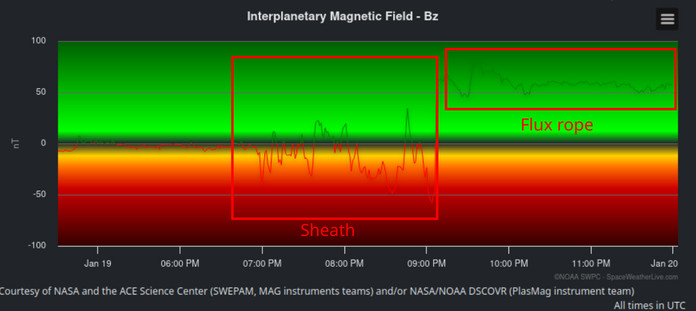  
*An example from SpaceWeatherLive's archive from 19-01-2026 showing a very clear transition from the CME sheath to a flux rope. Notice how the IMF is very turbulent at first, then settles as the CME reaches the flux rope. [Source](https://www.spaceweatherlive.com/en/archive/2026/01/19/aurora.html)*

## Geomagnetic storm

If the IMF is deflected far enough south (~ >10 nT), a **geomagnetic storm** can develop on the Earth surface. It is measured in a Kp level which ranges from 1 to 9. The G (of the GSR) scale complements it by doing G1 for Kp=5, G2 for Kp=6, G3 for Kp=7, G4 for Kp=8, G5 for Kp=9.

Kp values also feature intermediate levels with - and + -> i.e. Kp0, Kp0+, Kp1-, Kp1, Kp1+ etc.

> Some notations feature the prime level between + and - as o -> Kp1-, Kp1o, Kp1+...

You can predict the aurora visibility using 3 primary sources:

### 1 - The IMF Bz component

The more the Bz deflects South, the stronger the Northern lights are. As an example, a Bz of -46 nT had them visible in Slovakia!

### 2 - OVATION model runs

OVATION is a model hosted by the NOAA SWPC which includes a 30-minute forecast of the possibility of the Northern lights being visible at a given location. You can access it [here](https://www.spaceweather.gov/products/aurora-30-minute-forecast)

### 3 - Hemispheric power

Hemispheric power is a measure of how much power is stored within Earth's magnetic field - the more there is, the stronger and more vibrant the aurora appears. Naturally, SWL features it along with odds that an Aurora is visible at your location [here](https://www.spaceweatherlive.com/en/auroral-activity/auroral-oval.html)

# Dump of the useful links

- [SpaceWeatherLive](https://www.spaceweatherlive.com/) - The mother lode of all Space weather related data
- [NOAA SWPC Site](https://www.spaceweather.gov/) - Another mother lode of all Space Weather related data
- [JSOC SDO](https://jsoc1.stanford.edu/hmi_latest) - HMI, HARP, Intensity gram
- [Lmsal SolarSoft](https://www.lmsal.com/solarsoft/latest_events/) - The Latest significant events as well as a bunch of useful charts
- [Solar demon](https://www.sidc.be/solardemon/dimmings.php) (Dimming) - Near real-time dimming detection
- [Solar Demon](https://www.sidc.be/solardemon/flares.php?min_seq=1&min_flux_est=0.000000001&days=14&science=0) (Flares) - Near real-time flare detection
- [SHARP](defn.nict.go.jp/sharp/index_sharp.html) - Vector magnetogram
- [GONG](https://gong2.nso.edu/products/mainView/table.php?configFile=configs/mainView.cfg) - Alternative magnetogram, intensitygram, as well as far side sun spot detection
- [CCMC DONKI Lookup](https://kauai.ccmc.gsfc.nasa.gov/DONKI/search/) - Catalog of NOAA observations and model runs

A couple of the current (Live) conditions can be accessed here for your convenience:

Current solar conditions

  
*Latest SDO Color intensitygram*

 
*Latest CCOR-2 image from Solar-1*

  
*Forecasted solar conditions*

 
*Current HF and solar info*

 
*Current EPAM data*

  
*Current OVATION run for the Northern Hemisphere)*

# Epilogue

Hopefully this article helped you get a bit more familiar with the world of Space weather. Next time a geomagnetic storm happens, you have no excuse of not having known about it!
